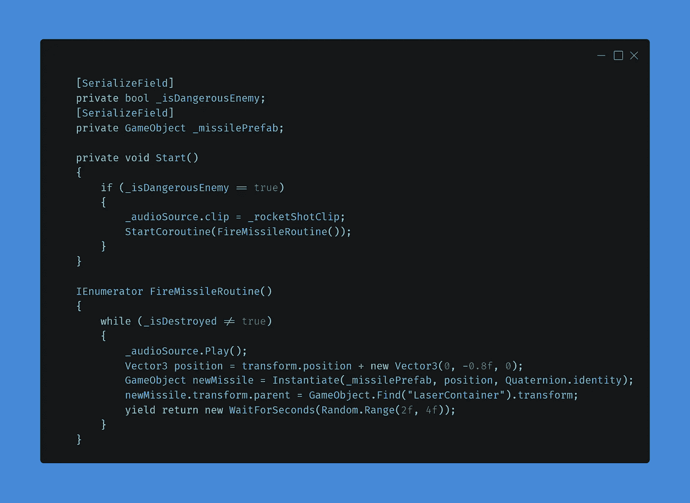
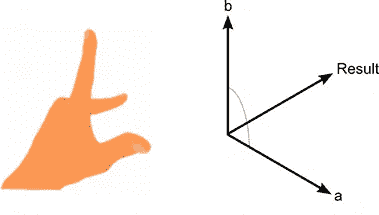
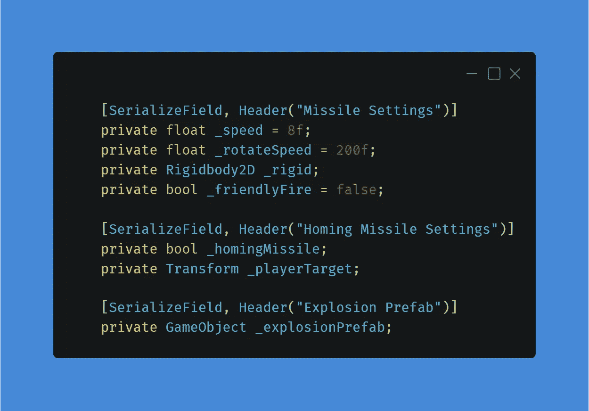
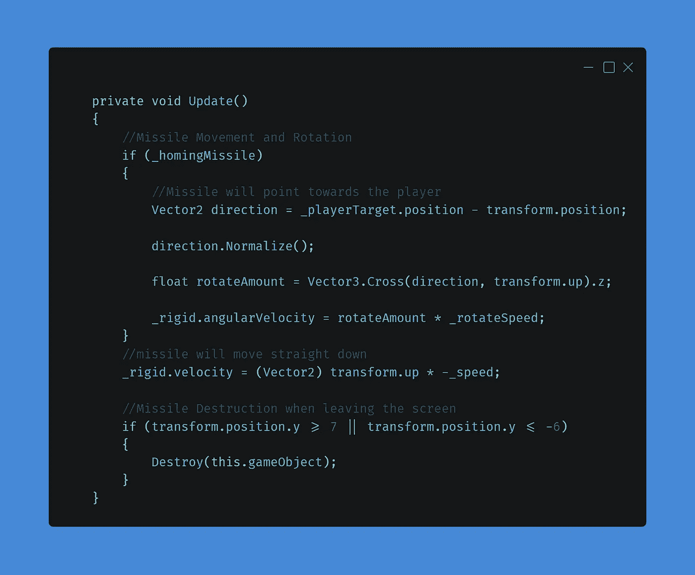
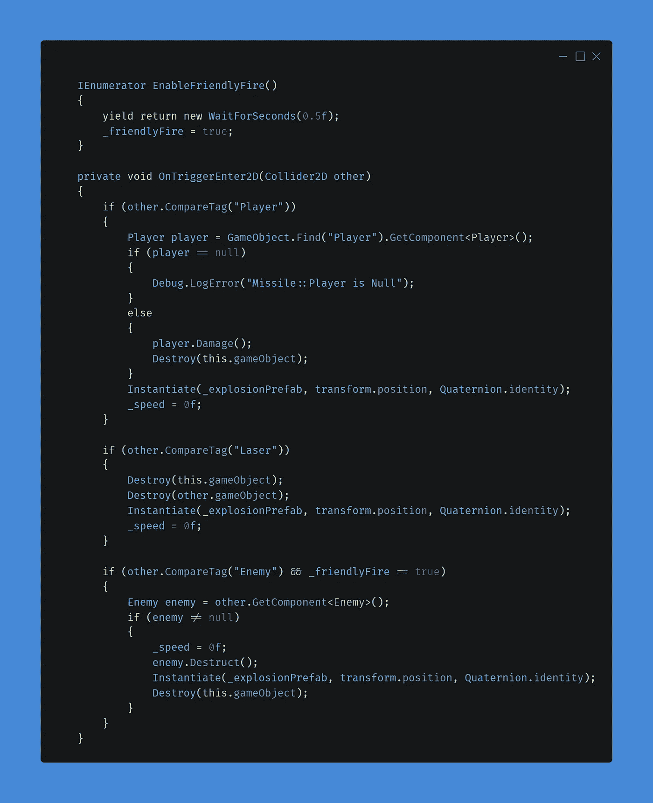
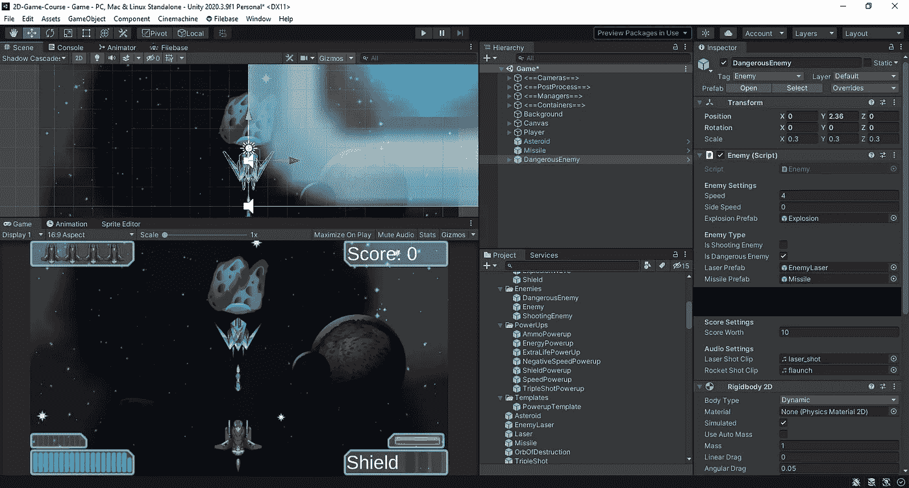
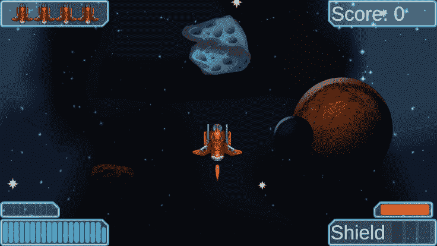

# 第二阶段:新的敌人类型

> 原文：<https://medium.com/nerd-for-tech/phase-2-new-enemy-type-47a371282fe8?source=collection_archive---------27----------------------->

是时候让另一个敌人加入我们的游戏了，这个敌人有很多曲线球。

> 创造可以射击和伤害玩家的敌人类型。用独特的投射物创造敌人类型(即。激光束、热追踪等)
> 独特的运动行为(之字形、波浪形等)

在之前的挑战中，我必须创造一个新的动作，但我创造了一个不可预测和随机的动作，因此我决定专注于挑战的前两点。

创造一个新的敌人是挑战中最容易的部分，我决定从那里开始，朝着创造一种新的武器类型的方向努力。我拿了一个现存的敌人预设，把它拖到我的层级中，然后打开预设，这样我就可以在以后重新预设它之前进行修改。我把敌人改名为“DangerousEnemy”，把精灵和动画换成了新的敌舰。在我继续创造新的敌人之前，是时候创造新的武器了。

接下来，我打开了敌人脚本，为新的敌人类型和他们将要发射的武器添加逻辑。

我创建了两个新变量，一个将携带名为“_missilePrefab”的导弹游戏对象，另一个是一个 bool，用于将敌人类型设置为“_dangerousEnemy”。目前，我们有一个协程，如果 bool“_ shooting enmy”为真，它将发射周期性激光。我们可以复制这种行为，并创建另一个协程，当 bool“_ dangerousEnemy”为真时，它会发射激光。

# 新的敌人武器

我认为敌人的新武器是导弹。但有 50%的可能性，导弹可能是一种寻的导弹，导弹会飞向玩家造成伤害并爆炸。

让导弹本身发挥作用并不难，但导弹归航部分背后的数学问题相当具有挑战性。我研究了改变导弹 z 位置的各种方法，有一种叫做[叉积](https://docs.unity3d.com/ScriptReference/Vector3.Cross.html)的东西。

两个矢量的叉积产生第三个矢量，它垂直于两个输入矢量。结果的幅度等于两个输入的幅度相乘，然后再乘以两个输入之间角度的正弦值。

致谢:Unity Technologies

但是在我们深入研究寻的导弹的数学之前，让我们先来创建基本的逻辑。

# 制造导弹

为了创建导弹，我将一个精灵从我的资源中拖到层次中，并将其重命名为“导弹”。然后我创建并添加了一个刚体 2d 和一个 PolgonCollider2D。然后，我创建了一个名为“导弹”的新脚本，并将其附加到导弹游戏对象上。

在脚本中，我为速度和旋转速度创建了浮点变量。然后我创建了一个变量来访问刚体。我还创建了 bool 变量来检查导弹是否已经发射，并设置它是否是一枚寻的导弹。我还为目标创建了一个变量——这是为了告诉导弹瞄准谁，也是我们叉积的一个重要部分。最后，我为爆炸预设添加了一个变量，以便在导弹爆炸时实例化。

在我们的 void Start 函数()中，我们需要得到一个对刚体的引用，以及玩家的变换。然后我创建了一个随机变量。介于 0 和 2 之间的范围返回一个介于 0 和 1 之间的值。如果该值为 1，那么该导弹将是一种寻的导弹。在 void Update()函数中，导弹的运动和自动寻的魔法就发生在这里。首先，我们检查它是否是一枚寻的导弹，以在玩家身上运行导弹寻的逻辑，然后，我们让导弹向下移动，如果导弹离开屏幕，导弹将被摧毁。

如果我们的导弹是寻的导弹，那么我们需要将导弹指向玩家。首先，我们创建一个名为“方向”的 Vector2 变量，我们得到目标的位置和导弹的位置。然后我们取方向，[归一化](https://docs.unity3d.com/ScriptReference/Vector2.Normalize.html)它。接下来，我们创建一个名为“rotateAmount”的浮点变量，它等于 Vector3。使用我们的方向进行交叉，并在 z 轴上向上变换。最后，我们用“旋转量”乘以“旋转速度”来修改刚体的[角速度](https://docs.unity3d.com/ScriptReference/Rigidbody-angularVelocity.html)。

这可能看起来令人困惑或难以理解，对我来说，当我不得不实现功能时，我不得不将所有东西重做几次，以了解发生了什么。

# 快到了

我们的导弹需要做的最后一部分是，我们需要检查各种碰撞，这就是我们要使用“_ friendly fire”bool 的地方。有几种方法可以检查碰撞，但是因为我们正在构建一个 2D 游戏，所以我们允许物体互相“夹住”。正因为如此，我们使用了一种叫做“OnTriggerEnter2D”的东西，我们将检查激光是否与我们的玩家、它的激光或敌人发生了碰撞。现在，当敌人第一次发射导弹时，它确实会短暂地与敌人相撞，但是直到导弹离开敌舰，我们才会检查那次碰撞。

你可能想知道为什么我要检查导弹是否与敌船相撞，或者更确切地说，为什么导弹会摧毁击中它的船。嗯，我想在游戏中加入一点乐趣，因为玩家有能力在短时间内飞得更快，我想如果玩家选择这样做，它可以欺骗导弹飞向敌人。或者，玩家可以试着从空中发射导弹。

# 包扎

不，说真的，我们快完成了。一旦脚本被保存，是时候回到 unity 并设置好一切了。

在导弹上，附加我们将在导弹被摧毁时实例化的爆炸预设。一旦完成，我们将拖动导弹到预设文件夹。接下来，你将选择你的危险敌人，把导弹拖到导弹槽，检查“危险敌人”栏，并预设新的敌人。现在，在这一点上，有一些重要的事情需要注意。我们有三个不同的敌人。但是所有三个敌人使用相同的脚本，因此所有三个敌人都需要分配导弹预设，否则你会得到空错误。这将是开始为单个敌舰创建脚本的好时机，但要继承敌人的脚本，但那是另一篇文章了。

# 结论

我希望你能够理解这篇文章中所解释的内容。对我来说，自己理解每一件事有点难，但并不像看起来那么难。熟能生巧。

