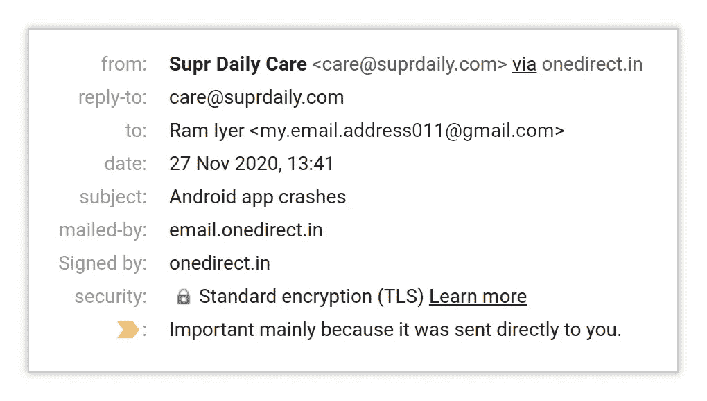

# 躲避网络钓鱼攻击

> 原文：<https://medium.com/nerd-for-tech/phishing-attacks-abb8cd1110f2?source=collection_archive---------2----------------------->

## 防范最常见电子邮件诈骗的实用指南

我已经在 Microsoft Exchange 工作了五年多。处理电子邮件诈骗如网络钓鱼是工作的一部分。如果这个术语听起来像希腊语或拉丁语，不用担心。我会用非技术术语解释一切技术。

那些发明和发展电子邮件作为交流方式的人，是在牢记“好人”——那些知道不要偷听他人谈话、尊重他人隐私、总体上讲有教养的人。电子邮件在 90 年代变得对更广阔的世界可用。

坏人很快就出现了。

为了更好的用户体验和隐私，[在我的博客](https://blog.ramiyer.me/dodging-phishing-attacks/)上阅读这个故事。

# 等等，什么是网络钓鱼

网络钓鱼顾名思义就是“钓鱼”获取信息。信息，如您的社交网络帐户、电子邮件帐户、银行帐户等的凭据。有些人正等着得到这些数据点，这样他们就可以利用它们来获利。

在大多数情况下，这涉及到钱。在银行账户这种情况下，他们可以直接动用你的钱。在其他情况下，攻击者可以访问你的社交媒体账户，更改密码(这样你就不能再访问它了)，然后勒索你。另一种方式是引诱你，让你给他们寄钱。即使 200 名受害者每人给骗子 10 美元，她/他也能赚 2000 美元。

# 谁会被钓鱼

信不信由你，不仅网络钓鱼诈骗无处不在，就连那些精通互联网运作的人也成了它的受害者。

我参加的一个群聊中有一条消息说[尼迪·拉兹丹的哈佛工作邀请是一次复杂的网络钓鱼攻击](https://www.ndtv.com/blog/how-i-fell-for-a-phishing-attack-my-story-by-nidhi-razdan-2353395)。其中一名成员评论道，“什么样的资深记者会上当？”杂志上的一篇评论文章甚至称[为“易受骗的”](https://www.outlookindia.com/website/story/opinion-nidhi-razdan-phishing-and-three-hard-lessons/370865)。

> 但是这些骗局之所以成功，是因为它们看起来如此真实。
> ——尼迪·拉兹丹(NDTV 前执行编辑)

现实世界是不同的。任何人都可能成为这种骗局的受害者——无论多么博学或见多识广。我不太了解拉兹丹，也不看她的节目。我无法判断她是一个多好或多坏的记者，但是在邮件交换工作足够长的时间后，我可以告诉你，她成为这个骗局的受害者并不会让她变得愚蠢。

现在，让我们来看看骗子们钓鱼的不同方式，并看看我们如何保护自己不成为受害者。

# 如何识别网络钓鱼

网络钓鱼是一种社会工程攻击，这意味着攻击者利用他/她的人际交往技巧从您那里获取信息。它可能是一封电子邮件，要么带有可疑的网页链接，让您输入信息，要么是一封普通的电子邮件，要求您提供信息。在某些情况下，攻击者与你互动(就像 Razdan 声称发生在她身上的事情)。随着时间的推移，网络钓鱼攻击变得越来越复杂，诈骗者结合各种技术来增加成功的机会。虽然在某些情况下，你的直觉是你唯一的“BS 探测器”，但在其他情况下，你所要做的就是观察。我将在本文中讨论后者。

# 名字里就有

听起来可能很琐碎，但当我们看到电子邮件时，我们不看电子邮件地址本身，而是看名字。为什么？因为我们对待“发件人”的电子邮件就像对待我们的电话一样:如果我们把来电者的号码保存在我们的手机上，就会显示姓名而不是号码。我们从来没有费心去重新核实这个数字，因为我们认为这是理所当然的——我们应该这样做，因为我们保存了它。

当我们将同样的逻辑应用于电子邮件时，问题就出现了。

电子邮件的行为略有不同。电子邮件有一个我们称之为“标题”的东西，它是电子邮件客户端(比如你桌面上的 Outlook 或 Thunderbird)和电子邮件服务(比如 Gmail)理解的技术信息。标题类似于信封。就像一个信封如何包含包裹的来源和目的地，以及包裹经过的路线(注意过信封上的黑色邮票吗？)电子邮件在从一个服务器跳到另一个服务器时也会记录这些信息。

出于好的或坏的原因，头允许发送者包括他们的名字。这样，任何人都可以在发送电子邮件时输入其电子邮件地址的任何显示名称。

如今，包括 Gmail 在内的大多数电子邮件提供商都会在邮件详情中显示电子邮件地址。你所要做的就是点击“从-到”区域中的“显示细节”或类似的东西(这因提供商而异——网络上的 Gmail 在`me`旁边有一个向下的小三角形)。如果你使用微软 Outlook 这样的电子邮件客户端，你会在名字旁边看到电子邮件地址和其他详细信息。

Gmail 的详细信息示例

在使用电子邮件之前，请务必检查这一点。

一些骗子还使用看起来像合法域名的域名(电子邮件地址中`@`后面的部分)，例如，用`grnail.com`代替`gmail.com`，或用`paypa1.in`代替`paypal.in`。有些使用像`microsoft‌.com.123-lsd.com`这样的子域名——这封邮件不是来自微软，而是来自某个`123-lsd.com`。这些服务使用的无衬线字体很难区分 l 和 I，骗子利用了这一点。有的甚至用了更多类似`pay.pal.com`的技术，技术上是`pal.com`的子域，可能和 PayPal 没什么关系。其他人可能使用连字符或下划线来分隔域名中的单词，如`pay_pal.com`。可能性是无限的。

# 链接可能并不像它们看起来那样

在邮件中使用链接时要小心。在台式机或笔记本电脑上，你有稍微好一点的保护，因为你可以选择悬停在一个链接上(尽管手机也有自己的好处)。请记住三点:

1.  一个看起来像裸链接的链接，可能不是一个。你可以在任何文本下嵌入任何链接，电子邮件上看似[https://blog.ramiyer.me/](https://blog.ramiyer.me/)的内容实际上可能会把你引向[http://you-have-been-scammed.com。](http://you-have-been-scammed.com.)
2.  超文本链接没有那么危险(大多数人不认为裸体链接是一个智力游戏)。将鼠标悬停在这些链接上，查看浏览器窗口的左下角(有时是右下角)。它会告诉你链接指向哪里。这适用于大多数现代浏览器，包括 Chrome 和 Firefox。
3.  记住上面看到的域名招数。

让我们练习一下。将鼠标悬停在[https://blog.ramiyer.me/](https://en.wikipedia.org/)和[这段文字](https://en.wikipedia.org/)上，查看浏览器的左下方，看看这些文字指向哪里。如果你在 iPhone 上阅读这篇文章，你可能会忍不住长按链接，但是*不要这么做*；它将在预览中加载整个页面，包括跟踪器或其他恶意内容。

此外，以下是几个欺骗性链接的例子:

*   `https://account‌.outlook‌.com‌.libna‌.ml`
*   `https://amazon‌.in‌.forgotpassword‌.com`

请注意它们看起来与`amazon.in`和`account‌.outlook‌.com`多么相似。

# 远程内容

远程内容是指电子邮件中的图像、网页字体、样式和其他非文本元素的一个时髦词汇。电子邮件中嵌入的图像和其他内容会调用图像存储(远程服务器)。这个远程服务器可以跟踪它收到的电话数量和来自哪里，并且可以知道你是否打开了电子邮件。

你会问，有什么大不了的？骗子(和垃圾邮件发送者)经常批量发送电子邮件，不知道其中哪些会到达真实邮箱。他们可以使用这些远程呼叫来知道哪些电子邮件地址是真实的，他们可以更好地瞄准他们的下一封电子邮件。

检查电子邮件的来源后，禁用远程内容的自动下载，并在需要时手动下载。你可以在 Gmail 的[图片中更改这一点，如果你使用的是 Outlook Web，](https://support.google.com/mail/answer/145919)[你可能就没那么幸运了](https://support.microsoft.com/en-us/office/external-image-protection-in-outlook-com-43c0c17e-8fd1-41c6-93fe-ffe54638e82b)。如果您想要更好的保护，请使用 Protonmail。

# “通过”的部分

在上面的截图中，电子邮件来自于*Supr Daily*via one direct . in。这可能是合法的，在大多数情况下，如果您的电子邮件提供商检测到任何违规行为，他们会提醒您。大多数知名的电子邮件提供商可以读取发送电子邮件的域名的 SPF 记录，并决定这个“via”是否合法。对普通人来说，进入 SPF 记录会使这变得太技术性。

无论如何，小心处理任何敏感的电子邮件。

# “您的帐户受到威胁”

一些钓鱼邮件声称您的帐户受到威胁，并要求您保护您的帐户。不要点击这类邮件中的链接。

网站和服务有时会发生数据泄露事件。这些服务确实会向您发送电子邮件，告知您出现了数据泄露，并要求您更改密码。没有一个知名网站会以纯文本的形式存储你的密码，但是他们会告诉你更改密码以避免可能的帐户泄露。在这种情况下，请到网站自己更改密码；养成不使用电子邮件中给出的链接的习惯。

你*发的“忘记密码”邮件是个例外。即使在这种情况下，也要注意链接会把你带到哪里。*

你也可以使用一项服务，如 [Firefox Monitor](https://monitor.firefox.com/) 来了解你的电子邮件是否出现了已知的漏洞。

其次，没有一个知名网站会要求你降低账户的安全性，比如在他们的服务上禁用两步认证。如果你看到一封电子邮件，要求你降低网站的防护等级，不要答应。

攻击者使用的另一种常见技术是告诉您您的邮箱已满，要求您清理邮箱以继续使用电子邮件。不要点击这些链接。通过手动输入您的电子邮件提供商的网址登录到您的邮箱，并检查配额。你可以在你的邮箱设置下找到这个。Gmail 会在您的收件箱页面底部显示此信息。

最近，微软和谷歌等公司使用的登录页面过于简单，导致攻击者更频繁地发起这种攻击。骗子创建欺骗页面，要求您输入用户名和密码，收集详细信息，并在单击“提交”时将您重定向到合法的谷歌或微软帮助文章。让 [*拥有某种*保护](https://www.wired.com/story/chrome-yubikey-phishing-webusb/)来抵御此类攻击的最简单方法是使用[设备，如](https://amzn.to/3ivASil) Yubikey。但这并不适合所有人(至少在印度不是，因为这些设备并不便宜，但如果你买得起，就去买吧)。

# 注意紧迫性

大多数网络钓鱼攻击表现出一种紧迫感:“在接下来的 16 小时内做这件事”。当风险很高时，你不会停下来思考或研究；相反，你会一头扎进去。我见过员工成为受害者，他们认为这是来自首席执行官的电子邮件，要求为这个季节购买礼品卡，或者供应商说他们的账户已经改变，他们没有收到最后一笔付款，要求团队将钱“通过 EOD”转移到新账户，以避免法律问题。

顺便说一句，有一次采购部的一名高管联系我们，说她发现电子邮件中使用的语气有点不寻常，并要求我们检查电子邮件的真实性(确实是一种网络钓鱼企图，使用域名欺骗)。她凭直觉发现了这一点。我们甚至向供应商发送了技术建议，以防止将来出现这种情况。

# 语言

这也是常见的症状。我们在 Exchange 管理圈子中看到的说法是，这些攻击者大多数不是英语母语者(我也不是，但是—)，他们使用翻译来撰写电子邮件。其他不使用翻译的人不擅长写作。这通常会导致糟糕的句子结构或不寻常的短语。

例如，我的一个客户的一位顾客指出，没有美国人会使用“我们尊敬的顾客”这一短语，而亚洲人(亚洲人，而不是种族)会使用，这意味着她收到的表面上发自美国的电子邮件来自亚洲的某个地方。直觉和全球互动的另一个例子。(此案并非域名欺诈，我们也无能为力。但她是对的；这封邮件发自印度。)

# 不要打开附件

有时，捆绑在电子邮件中的攻击可能包含附件；类似`Invoice-2301993f003.PDF.exe`的东西。注意这是 EXE 文件，不是 PDF。在其他情况下，附件可能确实是 PDF 或 HTML 文件，但其中包含恶意代码。曾经有过[恶意代码甚至被捆绑进 JPEG 文件](https://www.wired.com/2004/09/malicious-code-hides-in-jpegs/)的例子。根据经验，不要打开未经请求的电子邮件中的附件。

不请自来没有要求没有要求

# 政府电子邮件

一些钓鱼邮件似乎来自政府机构，要求提供税务信息，或提供报税链接。但这类邮件要么来自公共电子邮件服务(Gmail、Outlook、雅虎)，要么来自非政府领域。因此，来自印度中央或邦政府机构的合法电子邮件使用`gov.in`或`nic.in`地址。也就是说，我们的一些政府办公室有时会在不知不觉中使用公共电子邮件地址。小心这类邮件。要知道任何政府通知(除了晚上 8 点的演讲)都会给你足够的时间去执行，比如报税。在印度，没有一个政府组织是按照分钟或小时的通知来工作的。

# 挂锁不是一个可靠的射击

我知道，这很糟糕。HTTPS(或 HTTP，secure)使用证书实现安全连接，提示浏览器显示挂锁图标。但挂锁图标本身仅仅意味着，“这个页面对发送到服务器的内容进行加密。”这样的证书是免费的，每个人(包括骗子)都可以拿到这些。这些并不验证拥有该域名或网站的*个人*或*组织*。然而，像网上银行这样的网站所使用的证书是另一类证书；它们很贵，发行者会核实他们发行这些债券的组织。

简而言之，不要让挂锁愚弄你。挂锁不是域名合法性的证明。

# 退订是骗人的

电子邮件中带有一个“退订”链接。在某些情况下，这些链接会直接取消您的订阅，而其他链接会将您带到要求您输入电子邮件地址的页面，然后单击取消订阅按钮。

但是，如果您收到一封来自某个您不记得注册过的实体的电子邮件，请不要点击退订，因为这样做会向发件人确认您的电子邮件地址存在，他们会向您发送更多的电子邮件。

而是点击“举报垃圾邮件”按钮(不要选择退订)。这将在两个方面有所帮助:首先，提供商(如 Gmail)将从您的收件箱中删除垃圾邮件，其次，系统中的算法将学习更好地识别此类垃圾邮件。

# 电子邮件中的敏感信息

请记住，电子邮件和物理邮件一样安全；这不是最安全的交流方式。合法机构不会让你通过电子邮件向他们发送银行账号、税务信息、用户名、密码或其他敏感数据等详细信息——他们会制作一个安全表格来收集这些信息。(Razdan 说，网络钓鱼攻击的实施者寻求她的个人信息。她没有说清楚收集的方式。)

永远不要通过电子邮件分享个人信息。也不要填写谷歌表格——没有哪个知名组织会使用谷歌表格收集敏感信息。在任何情况下，想想你与谁分享个人信息。并且要经常观察浏览器的地址栏。不要填写没有挂锁的表格。如果该栏显示挂锁，请验证该域的真实性。

不要让标识愚弄你。

# 如果你是受害者，该怎么办

不要惊慌。什么信息都没了，都没了。你现在能做的就是控制损失。以下是一些你可以采取的简单步骤:

# 密码

如果您共享密码，请转到相应的密码重置页面重置密码。同样，不要使用您在未经请求的电子邮件中收到的密码重置链接。生成一个新的“重置密码”链接，并使用它来重置您的密码。

从不—从不跨站点使用相同的密码。如果你在不同网站上使用的密码被泄露，你所有的账户都会面临风险。

没有人能记住 387 个复杂的密码。使用密码管理器来存储您的密码，并使用长而复杂的密码和多因素身份验证来锁定密码。您只需要记住一个密码。 [Bitwarden](https://bitwarden.com/) 是一个开源的密码管理器，[由独立审计员](https://bitwarden.com/help/article/is-bitwarden-audited/)审计。你可以免费使用它。如果你想支持这个项目，购买 10 美元/年的订阅，或者向这个项目捐款。

# 保持透明

如果您的工作帐户受到威胁，请通知您的 IT 部门。没有一个好雇主会惩罚受害者。向您的 IT 部门报告违规行为将有助于他们为保护组织数据的后续措施做好准备。

对你收到的和发送的要诚实。

# 冻结金融工具

如果您泄露了财务信息，或者您在您的任何帐户上看到不寻常的财务活动，请立即联系客户服务并解释情况。有了信誉良好的信用卡，客户对欺诈交易没有任何责任。通知客户服务部会让他们采取必要的措施来保护您的财务利益。