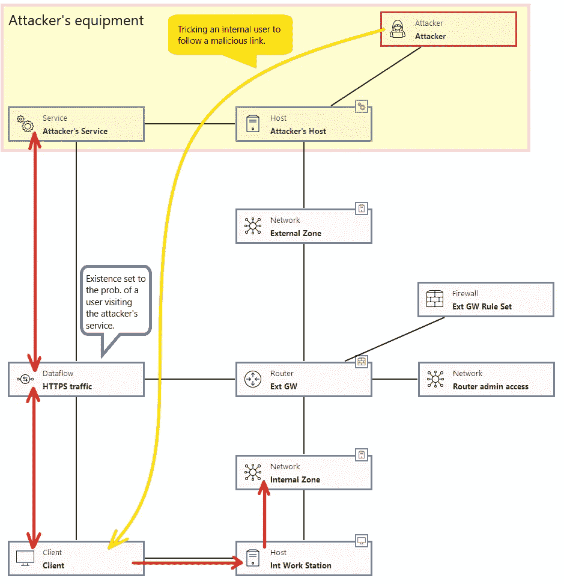
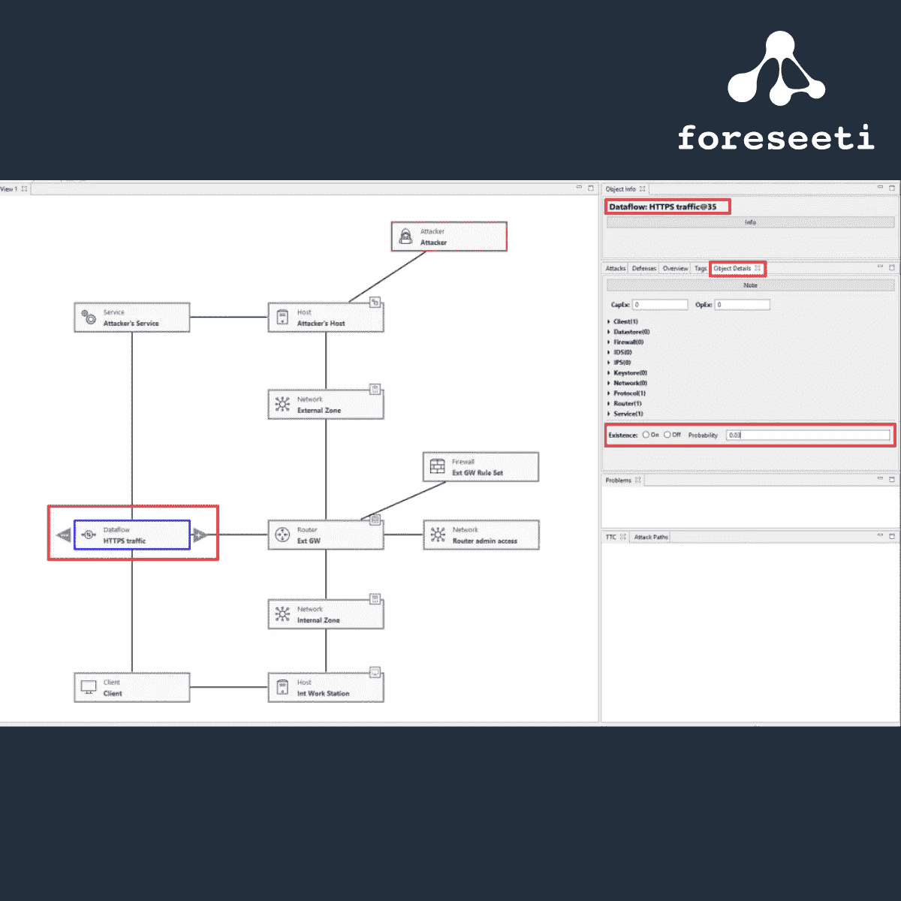

# 攻击媒介概念—网络钓鱼—通过威胁建模进行安全分析

> 原文：<https://medium.com/nerd-for-tech/phishing-security-analysis-with-threat-modeling-f03869f7d849?source=collection_archive---------10----------------------->

# 网络钓鱼-描述

在上一节中，我们看到了一个来自互联网的攻击，通过一个带有未知规则集的防火墙。当观察网络钓鱼攻击场景时，它也来自外部/外来网络区域，但是利用了这样一个事实，即攻击者已经设法欺骗内部用户来启动从因特网网关内部的工作站到由攻击者拥有和管理的恶意主机和服务的数据流。

# 模型

网络钓鱼有时是一个宽泛的定义，但在我们的案例中，我们认为内部用户被诱骗连接到攻击者拥有的恶意服务。这是如何发生的，用户是否意识到了这一点，这是我们在研究衰减时要解决的问题。

该模型包括互联网网关、带有内部工作站的内部网络区域、带有恶意主机的外部网络区域以及由攻击者拥有和运行的服务。

使用 foreseeti 的威胁建模工具 [securiCAD](https://foreseeti.com/securicad/) 创建

# 攻击向量衰减

有了上面的设置，我们可以分析攻击对我们的模型的影响，考虑网络钓鱼企图(到恶意服务的数据流)已经成功/已经建立的情况。

如果我们希望更详细地描述这一点，我们可能需要对这种类型的攻击的可能性进行估计。我们想要使用的数字可能是来自客户员工的纯估计值，也可能是基于之前相关的统计数据。此类统计可以是查看到达最终用户的传入钓鱼电子邮件数量的日志审查(“您的网飞帐户已被暂时禁用，请单击此处解锁。”)或者在某些情况下，使用公司 IT 人员发送的网络钓鱼电子邮件进行调查/演练，以了解他们得到的回复率。如果有这么重要的数据，就有可能确定这种攻击的概率。

通过在画布上选择数据流，然后在 [securiCAD](https://foreseeti.com/securicad/) 左下角的 ObjectView 区域中查看，可以设置“存在”来设置数据流的概率。

使用 foreseeti 的威胁建模工具 [securiCAD](https://foreseeti.com/securicad/) 创建

在上面的示例中，我们(根据与客户/系统所有者一起发现的数据/估计)将这种类型的攻击出现的概率设置为 3%。

# 结论

在上面的场景中，我们有与互联网攻击场景相同的网络设置。然而，不同之处在于，以前攻击者利用防火墙不完善的“已知规则集”防御来寻找有用的入口点，而现在攻击是通过已经允许通过防火墙的数据流(数据流和路由器之间的水平连接)进入的。这种攻击的本质是从工作站向外部的恶意服务发起数据流，也称为客户端攻击。

如果我们让网络钓鱼流量的数据流一直存在并允许通过网关防火墙和路由器，我们就可以分析网络钓鱼攻击真正发生时的影响。如果我们还想考虑我们估计的它实际发生的概率，我们就用这个辩护的“存在”参数。