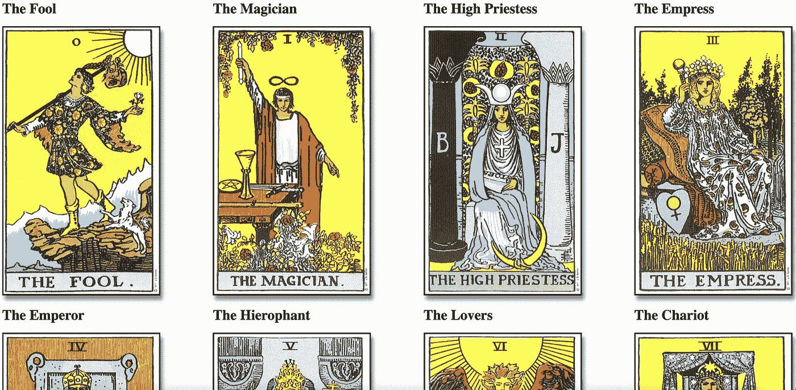

# 规划我的下一个 React 应用程序:塔罗牌

> 原文：<https://medium.com/nerd-for-tech/planning-my-next-react-app-tarot-deck-7fbecd8183e0?source=collection_archive---------11----------------------->

我最近一直在做我的作品集网站，诚然这是一个我早就应该完成的任务，但我觉得我需要一个更强大的项目来包含。我已经考虑创建一个塔罗牌应用程序有一段时间了，所以遵循这个想法将会很好地完善我的网站。

我把这个博客作为一个练习，让自己保持清醒，记录我对这个项目的早期想法。我很早就开始实际创作了，所以我的大部分讨论都将是严格意义上的头脑风暴。

对于不熟悉塔罗牌的人来说，它们类似于普通的扑克牌。然而，他们的目的不同，据一些人说，塔罗牌是用来自省的，也是算命的一种手段。我个人觉得这 78 张卡片图像和它们伴随的故事很有趣。我相信阅读类型的多样性和充分洗牌的必要性非常适合相对简单的 React 应用程序。

我做的第一件事是搜索塔罗牌 API。没有太多的选择，我开始想我必须自己创造。这将大大扩展这个项目的范围。实际上，如果我要为这个过程创建自己的 API，我会使用 Rails 并指定我想要获取的信息种类。

经过一番搜索，我发现[这个网站](https://www.kaggle.com/lsind18/tarot-json)有我要找的东西:每张卡片的详细信息，以及它的图片。

我本来打算以传统的 RESTful 格式使用 API，发出 get 请求，并从 fetch 中呈现图像。然而，这不是一个选项。该信息可供下载。我将所有数据保存在一个 json 文件中，并为每张卡创建了一个单独的 jpeg 图像。

图像部分比我想象的要复杂一些。对于 webpack 来说，呈现本地文件并不那么简单，所以我找到了一个解决方法，将所有图像文件放在 public 文件夹中，而不是像我最初打算的那样放在 assets 文件夹中。然后，我可以从公共环境中调用它们，并插入 json 数据中包含的图像文件名。

根据 [React 文档](https://create-react-app.dev/docs/using-the-public-folder/)，这不是处理图像使用的最佳方式。理想情况下，您导入图像并将其保存到一个变量中，然后将该变量称为源。不过，我不想对 78 张图片这样做。

因此，不必像从“导入 AceOfCups”那样单独导入每张卡../../assets/c01.jpeg”并调用 src={AceOfCups}，我有了一个更动态的解决方案。

对于图像源，我可以使用已经映射的信息来提供其余的卡片数据。反过来，它看起来像这样:

src = { process . env . public _ URL+` $ { card . img } ` }

在进入一些更复杂的逻辑之前，比如洗牌和卡片布局，我想首先确保我可以检索和显示图像和数据。

为此，我制作了一个 AllCards 页面组件和一个 Single Card 组件。这些卡片仍然是有序的，但我让图像正常显示，这意味着我已经完成了最初的目标。我做了一些基本的设计，让卡片更有立体感。

给图像添加了边框和阴影，使它们更加立体。

关于未来的风格决策，我有一些想法。我知道我需要某种过渡来表示洗牌，以及翻牌。我希望用户能够从各种布局中进行选择。

一旦他们选择了一种布局，卡片将面朝下放置。点击后，卡片将会正面朝上。我需要创建一个弹出并显示卡的详细信息的模式，或者创建一个在一个地方包含所有卡的所有信息的侧栏。也许两者都好！

当我扩展应用程序时，我将添加创建和验证用户的功能，这将允许保存和评论阅读。