# 在 Unity 中播放音效

> 原文：<https://medium.com/nerd-for-tech/playing-sound-effects-in-unity-a0e4987a4b45?source=collection_archive---------1----------------------->

在 Unity 中播放一个声音相对容易。您只需要一个音频源组件来播放音频剪辑，一个音频监听器组件来收听音频。本质上，音频源是播放声音的扬声器，音频收听者是游戏中听到声音的耳朵。在给出每个组件的简要概述后，我将展示如何使用它们为以前的文章中的太空射手创建声音效果。

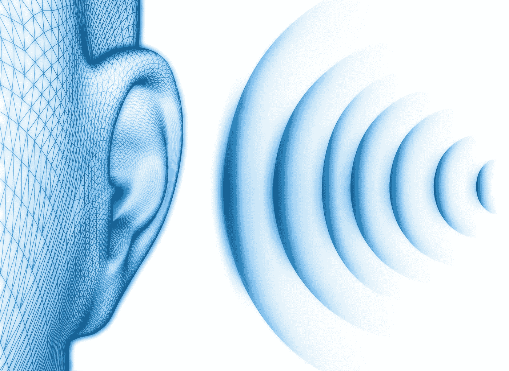

# 组件

在我们把它们放到游戏中之前，这里有一个简单的概述。

## 音频收听者

音频监听器组件已经应用于主摄像机，并且已经在默认创建的任何摄像机上。音频侦听器组件没有任何您可以更改的设置。通常，音频监听器在主摄像头上，但根据游戏的不同，在播放器上可能会更好。

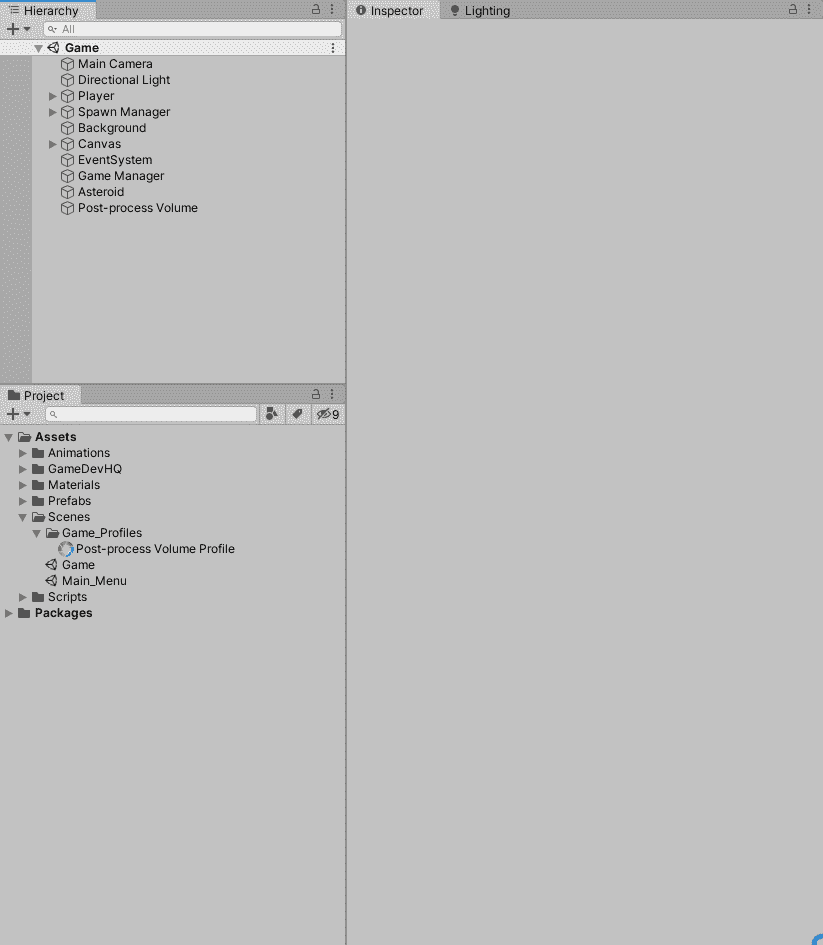

Unity 一次只能处理场景中一个活动的音频监听器，当在播放模式下有多个活动的时候会给你一个警告。

## 音频源

一个音频源组件必须被添加到游戏对象中。音频源组件有许多设置；对于他们做什么，大多数都是不言自明的。我将列出一些我们将需要这篇文章。有关每个属性的完整描述，请参见 [Unity 文档](https://docs.unity3d.com/2017.4/Documentation/Manual/class-AudioSource.html)。

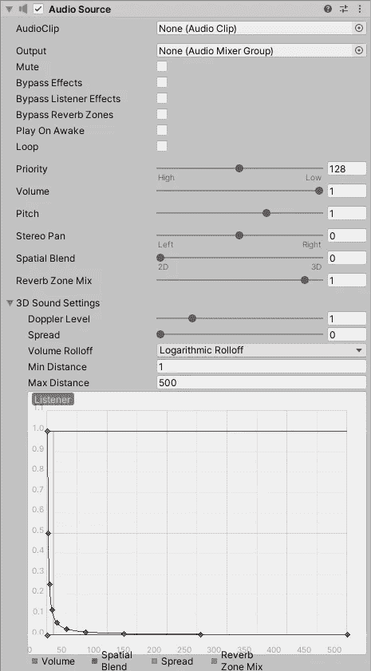

> **音频剪辑:**引用将要播放的声音剪辑文件。
> 
> **在清醒时播放:**如果启用，场景开始时声音就会开始播放。如果禁用，您需要使用脚本中的 Play()命令来启动它。
> 
> **循环:**启用此选项，使音频剪辑在到达结尾时循环播放。
> 
> **优先级:**确定该音频源在场景中共存的所有音频源中的优先级。(优先级:0 =最重要。256 =最不重要。默认值= 128。).对音乐曲目使用 0 以避免它偶尔被换出。
> 
> **音量:**距离音频收听者一个世界单位(一米)的声音有多大。

# 如何使用组件

我们将添加背景音乐、激光发射声音、爆炸声音和开机声音来演示如何使用这些组件。

## 背景音乐

最容易创建的是循环背景音乐。所需要是一个带有设置为循环的音频源组件的 GameObject 和一个您想要播放的音频剪辑。

创建一个名为“音频管理器”的空游戏对象，以保持层次结构有序，以便稍后添加更多的声音效果，将位置清零。添加一个音频源组件，启用循环，并将您想要播放的音频剪辑拖到音频剪辑栏中。现在在播放模式下，music_background 音频剪辑将开始播放，并在完成后循环播放。

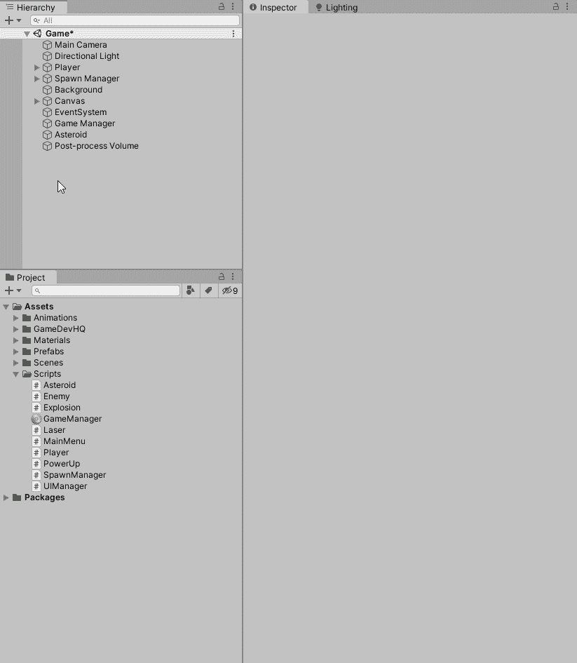

> **注意:**如果您想为 Assets 文件夹中的一个音频剪辑创建一个音频源，您只需将该剪辑拖到场景视图中，就会自动为其创建一个带有音频源组件的游戏对象。如果没有新的音频源，将剪辑拖到现有的游戏对象上会附加一个新的音频源。如果对象已经有一个音频源，那么新拖移的剪辑将替换源当前使用的剪辑。

## 激光射击

在播放器脚本中，添加一个名为“_laserClip”的私有变量，类型为 AudioClip，值为空；这是将要播放的声音效果的参考。然后用空值创建一个名为“_source”的 AudioSource 类型的私有变量；这是对播放器上被告知播放激光声音的音频源组件的引用。

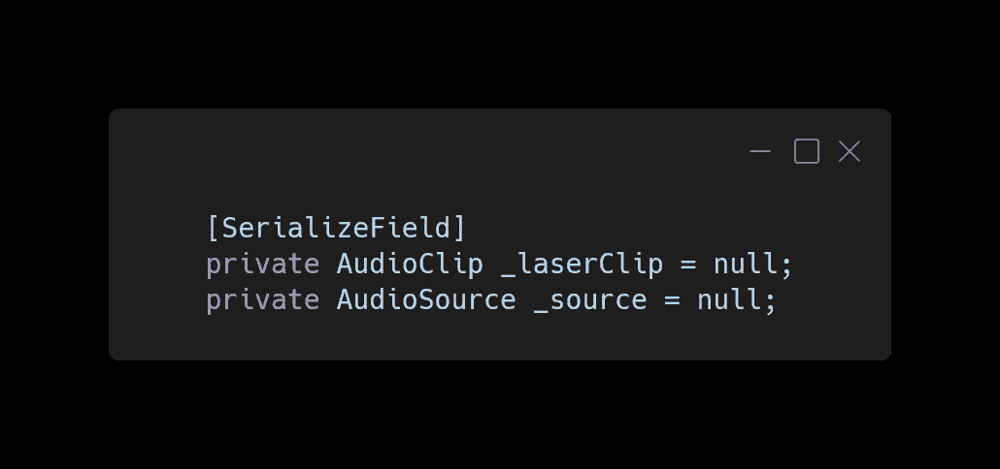

在 Start 中，从播放器中检索音频源组件并将其分配给 _source，然后将 check _source 设置为空，如果不为空，则将 _source 的剪辑更改为 _ laserClip 这将通过代码将音频剪辑 in _laserClip 设置为音频源。

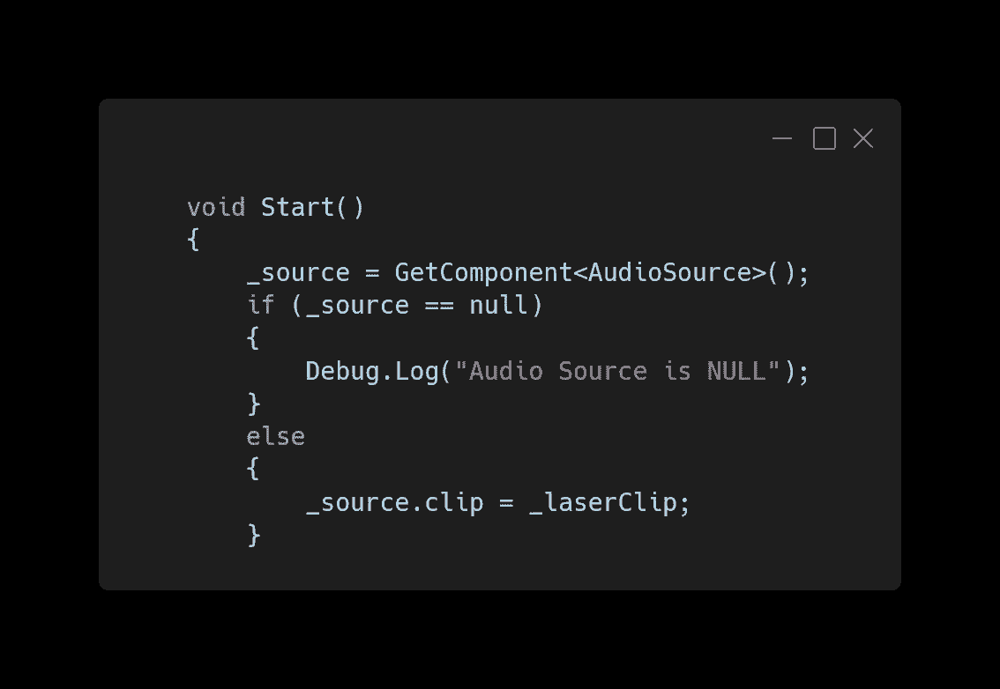

将音频源组件添加到玩家游戏对象，禁用唤醒时播放，并将激光镜头的音频剪辑拖到玩家脚本激光剪辑字段中。现在玩家每次发射激光都会播放激光音效。

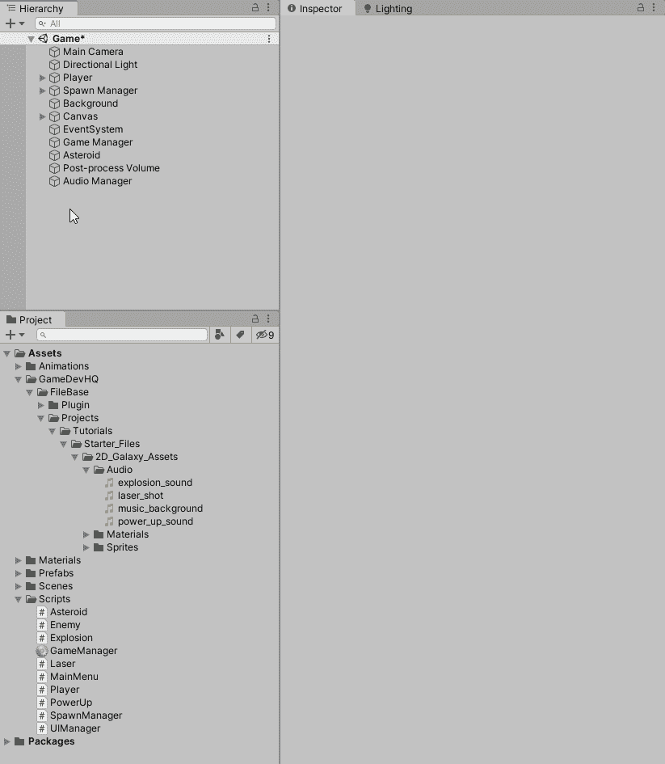

如果进入播放模式，可以看到播放器脚本将激光剪辑字段的音频剪辑指定给音频源的音频剪辑字段。现在，当你发射激光时，让声音效果播放。

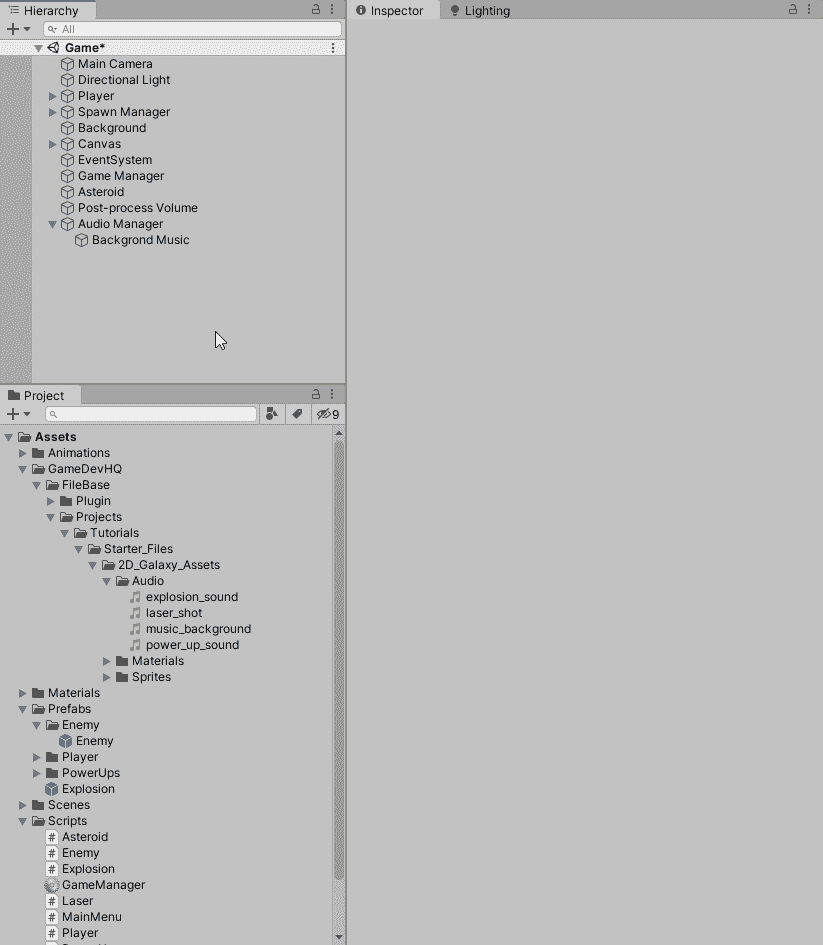

回到播放器脚本，在 FireLaser 方法中，添加 _source。play()；这将告诉音频源播放其 AudioClip 变量中的声音。现在每当玩家发射激光时，激光射击的声音就会响起。

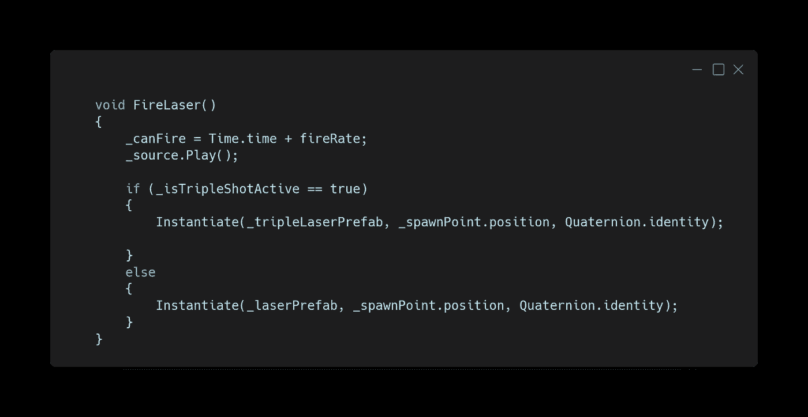

在进入爆炸音效之前，让我们把播放器的音频源做得更模块化一点。

在播放器脚本中，删除 _source.clip 发生更改的 else 语句。

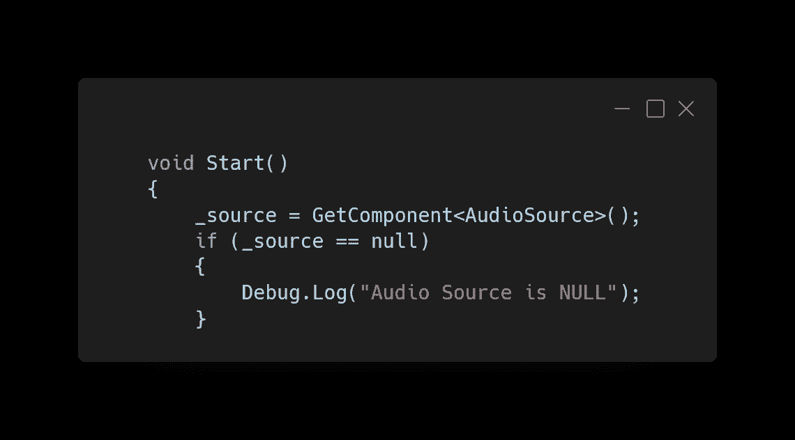

然后新建一个名为“PlayClip”的公共方法，传入一个名为“Clip”的 AudioClip 类型的变量；这将允许您播放传入的任何声音。在方法内部，告诉 _source 使用 playon shot(clip)播放传入的声音。这将使用音频源的设置播放一次传入的剪辑，但与播放功能不同，播放功能不会取消播放功能或播放功能已经在播放的剪辑。

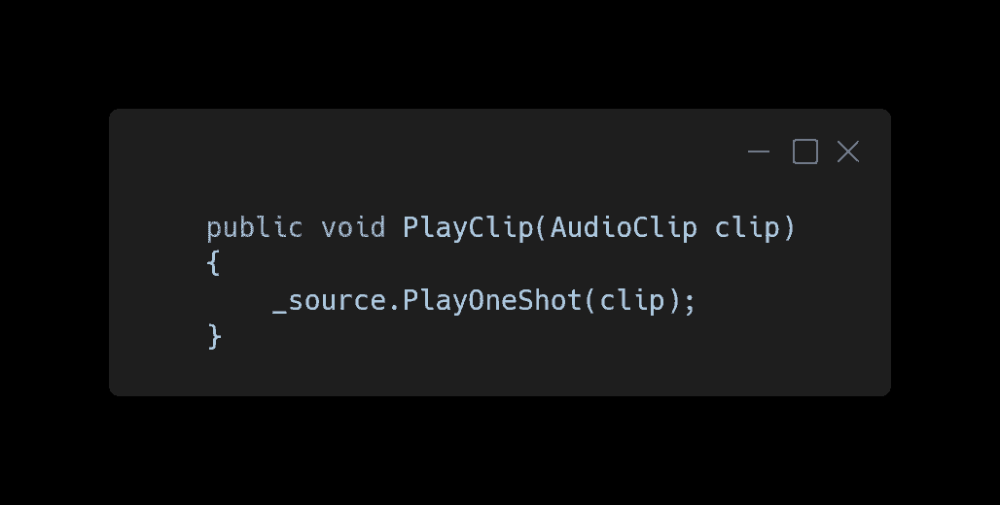

最后，更改 _source。用 PlayClip(_laserClip)播放()出来；这将调用 PlayClip 方法和 play _laserClip 的 PlayOneTime 函数。

## 爆炸

现在增加小行星和敌人被摧毁时的爆炸声音。

首先，我们来补充一下小行星爆炸。添加爆炸声音非常简单，因为当小行星被摧毁时，我们已经实例化了一个爆炸预设。我们可以只添加一个音频源组件到爆炸预置，拖动爆炸的音频剪辑，并让它在 Awake 上播放。有了它，小行星在被摧毁时会有声音效果。现在，敌人爆炸的时间到了。

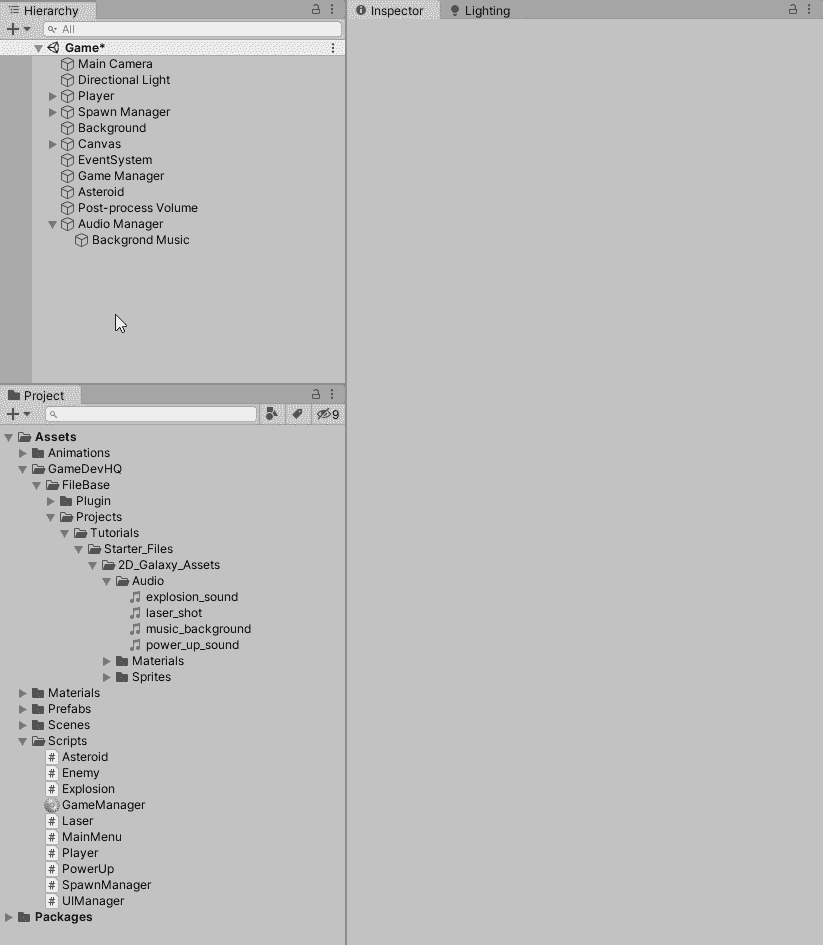

接下来在敌方脚本中，添加一个名为“_explosionClip”的私有 AudioClip，值为空；来控制爆炸的声音。现在，用空值创建一个名为“_source”的私有 AudioSource 包含对敌人预设上的音频源组件的引用。然后用 false 值创建一个名为“_isDead”的私有 bool 我们将使用它来确保玩家不能触发爆炸声音超过一次。

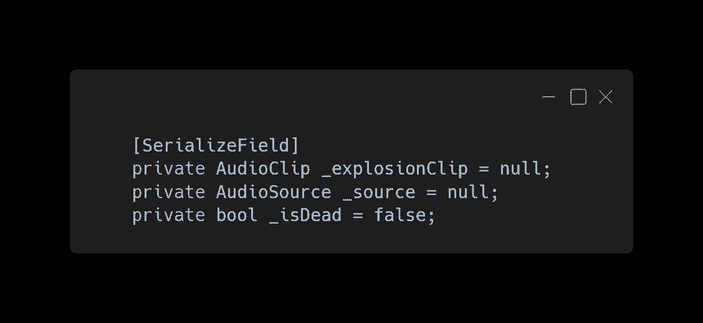

在 Start 中，从敌人那里检索音频源组件并将其分配给 _source，然后将 check _source 设置为空，如果不为空，则将 _source 的剪辑更改为 _ explosionClip 这会将音频剪辑更改为爆炸声音效果。

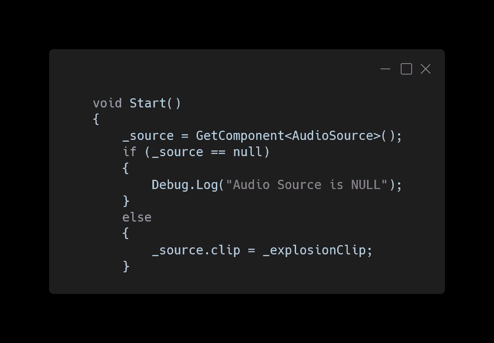

在 OnTriggerEnter2D 中，在检查标签的 if 语句内，添加一个 if 语句，检查 if _isDead 是否为 false，如果是，让 _source 播放音频剪辑并将 _isDead 设置为 true，这样如果再次碰撞，它就不会再次播放。

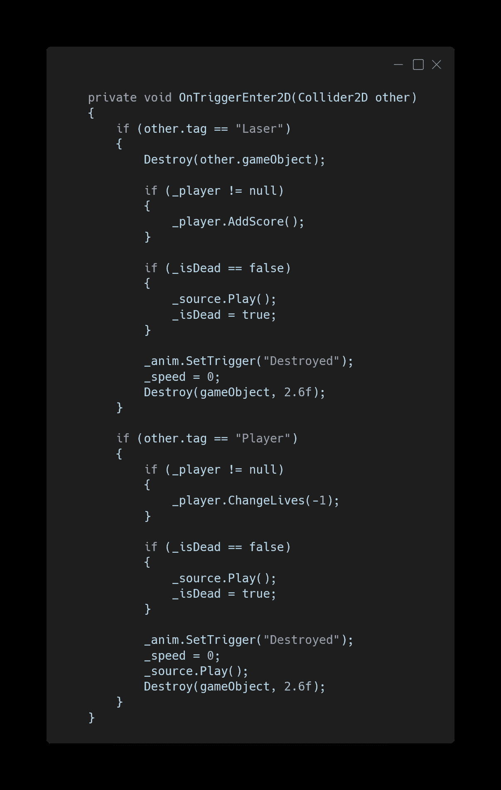

将音频源组件添加到敌人预设中，禁用“唤醒时播放”，并将爆炸的音频剪辑拖到敌人脚本的爆炸剪辑字段中。现在，一旦敌人死于激光或玩家碰撞，它将播放爆炸声音效果。

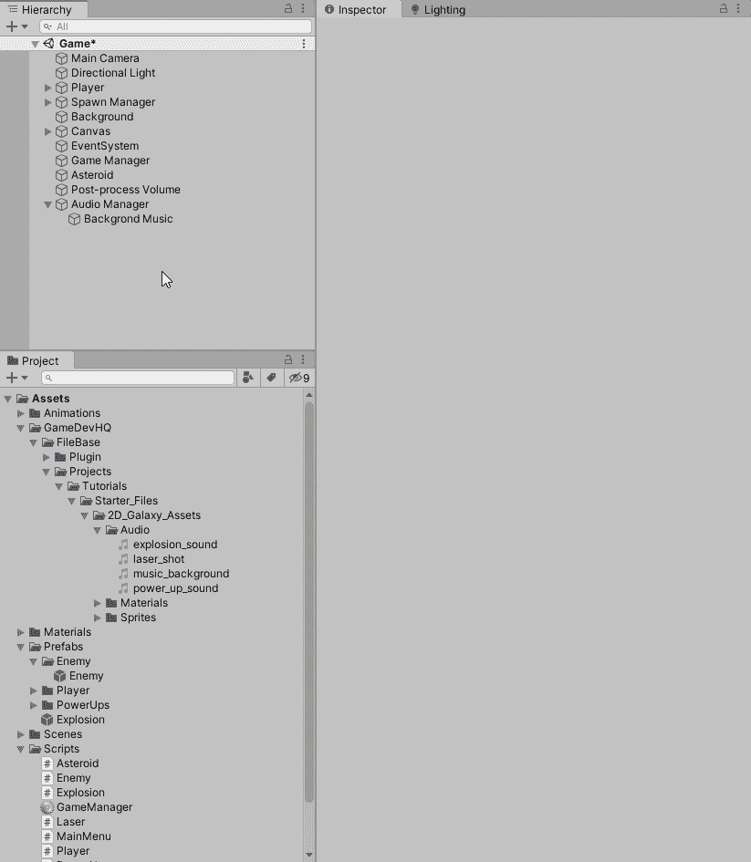

## 通电

通电产生了一个有趣的问题，因为它在与玩家接触时被破坏，并且没有实例化任何东西。有多种方法可以解决这个问题；我会展示两个。

在 PowerUp 脚本中，添加一个名为“_powerUpClip”的私有 AudioClip，其值为 null 只有一个音频剪辑，因为通电会立即被破坏，所以没有理由有音频源。

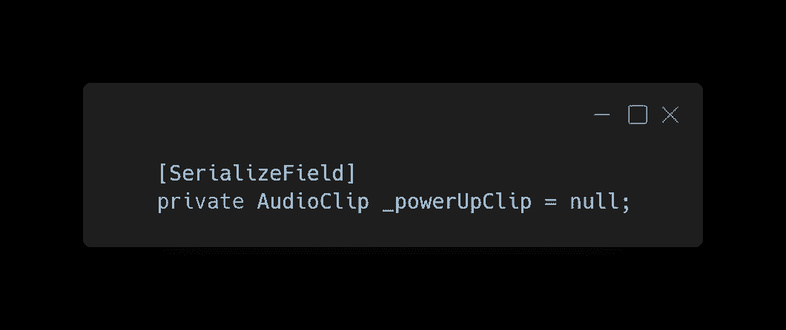

处理这个问题的第一种方法是创建一个新的游戏对象，上面有一个音频源来播放剪辑，然后在剪辑完成时销毁自己。幸运的是，Unity 已经在 AudioSource 类中提供了一个名为 PlayClipAtPoint 的函数，它接收一个要播放的音频剪辑和一个用于创建游戏对象的位置的 Vector3。剪辑完成后，它会自我销毁。

在 OnTriggerEnter2D 中，在破坏通电之前，添加 AudioScource。PlayClipAtPoint( _powerUpClip，transform . position)；这将调用 AudioSource 类中的 PlayClipAtPoint 函数，并将 _powerUpClip 传递给它，以便在 PowerUp 的位置播放。

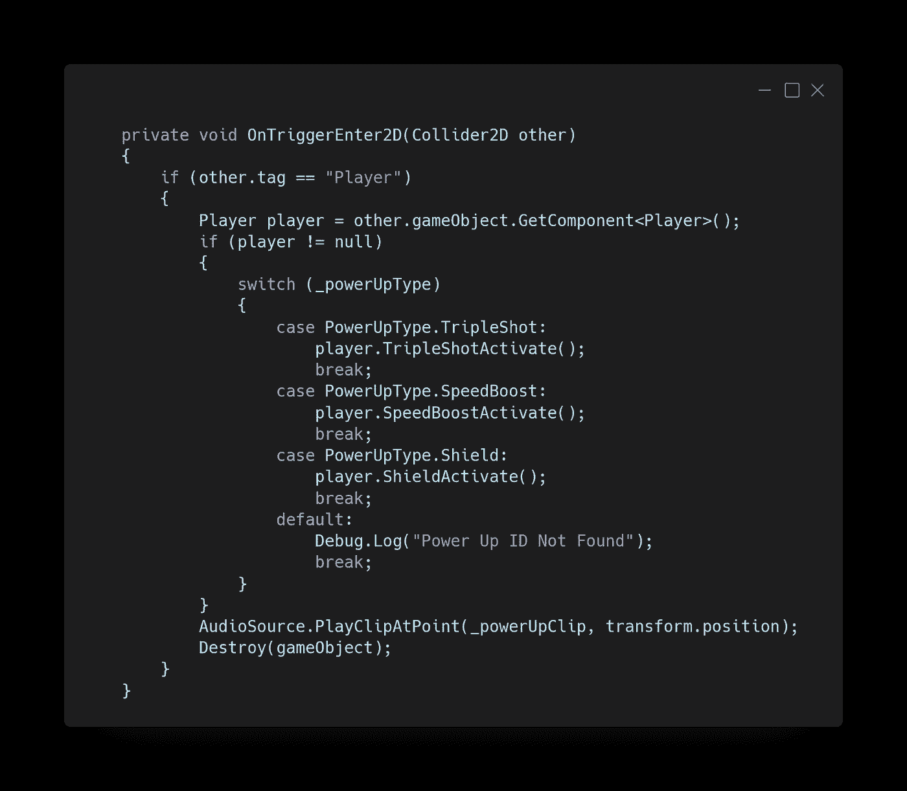

一次选择所有加电预设，然后将加电声音的音频剪辑拖入加电脚本加电剪辑字段，这将一次应用于所有预设，因为它们都有相同的脚本和变量字段。

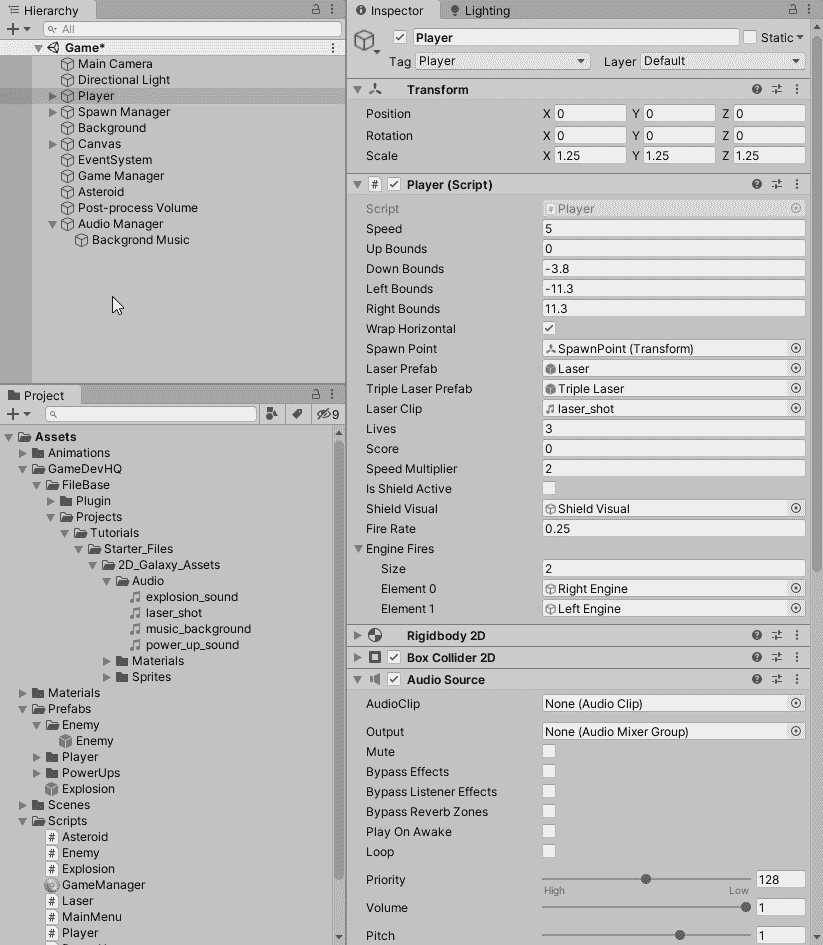

现在，它非常有效。GameObject 创建方法的唯一问题是，如果在短时间内调用大量对象，它会使层次结构变得混乱。

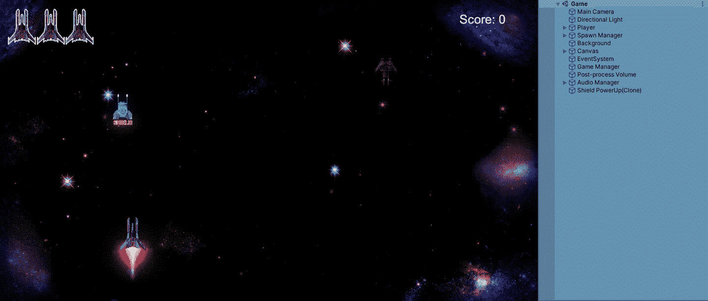

处理这个问题的第二种方法是使用播放器脚本的 PlayClip 方法。因为我们已经为 PowerUp 激活获取了一个对 Player 的引用，所以使用 PlayClip 并传入 _powerUpClip 来播放它会很容易。

在 OnTriggerEnter2D 中，在播放器 null check 内部，调用播放器上的 PlayClip 方法，并传递 in _powerUpClip。这将发送 _powerUpClip，以便通过 PlayClip 方法在播放器的音频源上使用 PlayOneShot 播放。如上所述，PlayOneShot 功能不会取消正在播放的剪辑，因此开机声音不会中断激光声音，反之亦然。

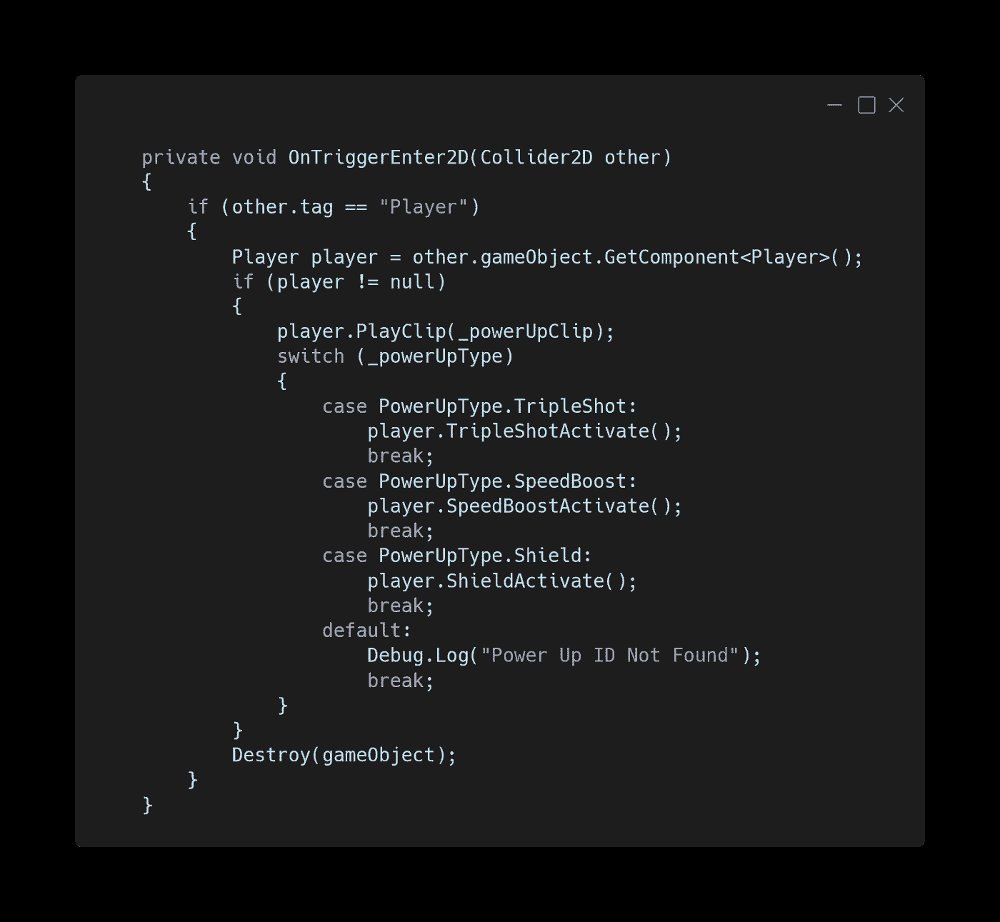

有了它，游戏现在有了声音，因此感觉更具互动性。在下面的文章中，我们将研究如何将游戏构建成一个独立的应用程序。