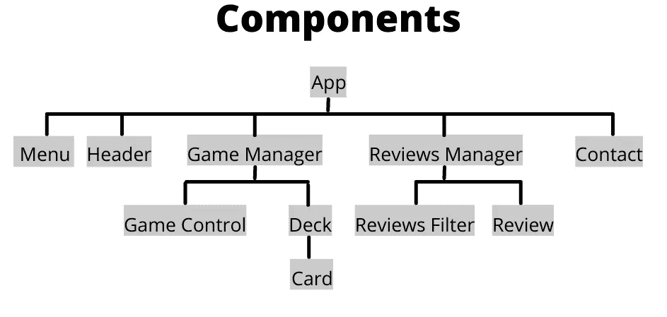
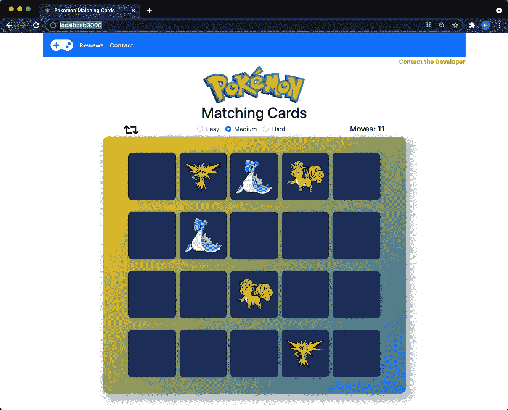
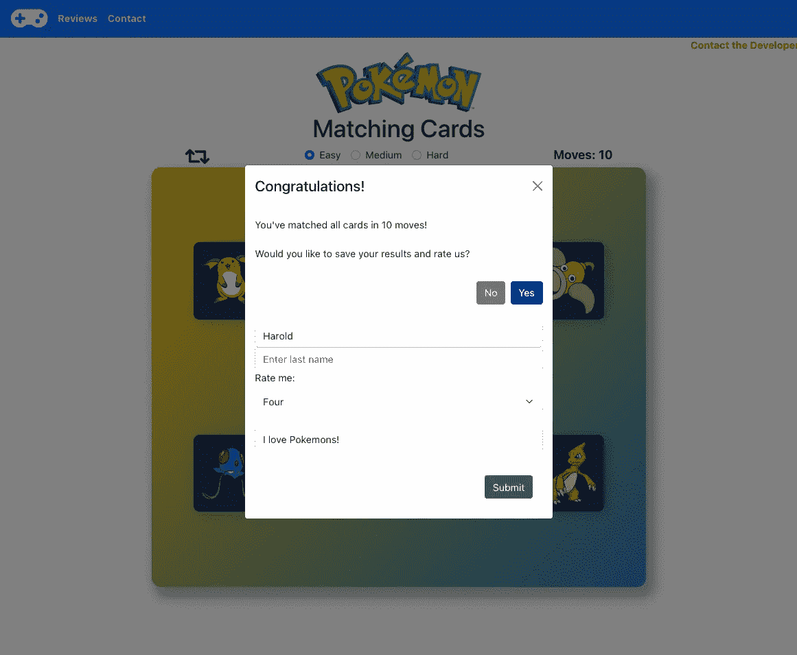
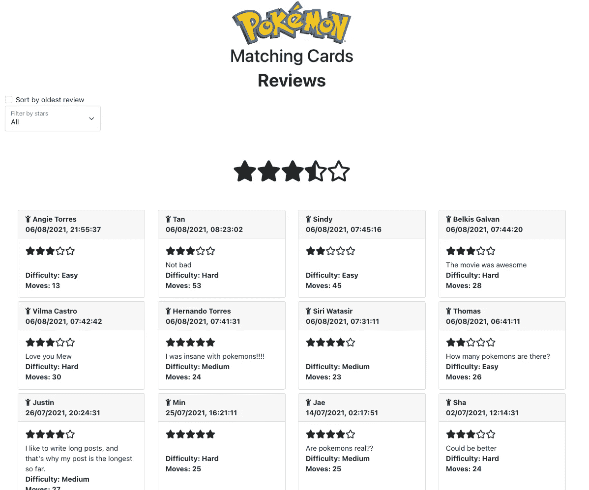
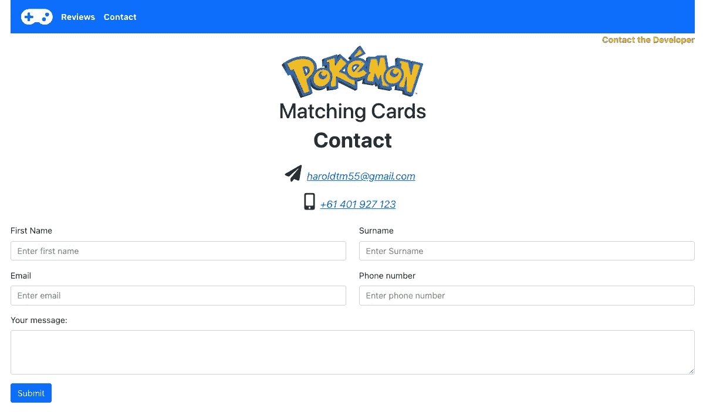

# 神奇宝贝匹配卡:我的 ReactJS 应用程序项目

> 原文：<https://medium.com/nerd-for-tech/pok%C3%A9mon-matching-cards-my-reactjs-app-project-8f69bee496a2?source=collection_archive---------9----------------------->

我将分享我在 Xi[学院](https://academyxi.com/online-courses/software-engineering/transform-part-time/)进行软件开发研究的*反应*学习过程中的感想，包括我的最终项目*神奇宝贝匹配卡。*

*App:*[*https://codehunt 101 . github . io/pokemon-matching-cards-project-phase-2*](https://codehunt101.github.io/pokemon-matching-cards-project-phase-2)

*源代码:*[*https://github . com/codehunt 101/pokemon-matching-cards-project-phase-2*](https://github.com/CodeHunt101/pokemon-matching-cards-project-phase-2)

Thimo Pedersen 在 [Unsplash](https://unsplash.com?utm_source=medium&utm_medium=referral) 拍摄的照片

# 这期间我学到了什么？

完成我的普通 JavaScript 项目后，是时候继续前进了。在这个新的学习阶段，我完全专注于当今最流行的用于构建用户界面的开源 JavaScript 库 ***ReactJS*** *。从*节点包管理器*和 *React 的介绍开始。*紧接着，它更深入地挖掘了 React 必须知道的每一个概念，比如 C *组件、JSX、道具、状态、事件处理程序、受控(和非受控)表单、*组件*生命周期、和*异步 React。*此外*、* I *、*简要了解了诸如 *Babel* 、 *Webpack* 和 T *he* *虚拟 DOM 等幕后反应。*最后但同样重要的是，我学习了*客户端路由*，并通过完成十二个 React 编码挑战巩固了我的知识。这一个特别有趣和具有挑战性:https://github.com/MinesJA/westworld-command-center-react。

一开始，从使用普通 JavaScript 到 React 的转变对我来说就像是一个难题，因为我不得不从直接操作 *DOM* 到现在使用 props 和 state 来定义组件的行为。我倾向于直接使用*普通 JavaScript* 来修改 *DOM* ，而不是利用 *React* 特性。然而，很快，我克服了这堵墙，并开始看到我面前的神奇的 React 声明方法。我试图快速转向编码挑战，因为我确信这是掌握我所学的所有理论概念的主要方法，我再正确不过了。

# 我的项目:一款名为神奇宝贝匹配卡的游戏应用

我所做项目的要求如下:

1.  该应用程序必须有一个 HTML 页面来呈现 react 应用程序。
2.  它必须以一种保持代码组织良好的方式使用多个组件。
3.  它必须通过使用 *react-router npm 包来包含客户端路由。*
4.  合并 API 数据。
5.  该应用程序必须使用 JSON 服务器作为模拟后端来保存一些数据。
6.  该应用程序将有一些最小的样式。

# 结构和功能

我的组件结构

我的应用程序包括从总共 151 张卡片中随机抽取的神奇宝贝卡片样本。它们可以是 10、20 或 30，取决于所选择的难度。这些被拿走的卡片中，每一张都必须有一张相同神奇宝贝的匹配卡片，并且所有的卡片都隐藏着神奇宝贝的形象。用户选择一张卡片来显示图像，然后选择另一张卡片。如果选择的两张卡片是匹配的一对(包含相同的图像)，两张卡片将继续显示匹配的神奇宝贝图像。否则，两张卡都会隐藏两张图像，然后重试，直到遇到更多匹配的图像对。

应用程序的主页面

为了获取神奇宝贝图像，我使用了一个名为 [*PokeApi*](https://pokeapi.co/) 的免费第三方 API。由于这个原因，我不需要在本地存储外部图像。

在游戏过程中，用户将有机会在任何时候重启它或改变难度(当然，它也会重启游戏)。用户还可以实时看到他们到目前为止走了多少步。当玩家最终找到所有匹配的配对时，会显示一条显示总移动数的弹出消息，用户将有机会查看游戏并给出从零到五星的评级。这些信息通过 POST 请求存储在一个模拟的 JSON 服务器中。

在所有卡片匹配后填写评估

除了游戏，这款应用还有两条额外的路线:

在第一个附加路线中，用户可以看到来自已经完成游戏的用户的所有评论。这些按时间顺序排列，首先显示最近的评论；然而，用户可以通过首先显示最早的评论来修改时间顺序。此外，用户可以根据星级筛选评论。每个评论显示用户的姓名、评论发布的日期、等级、选择的难度级别以及匹配所有配对所需的移动次数。显示的另一个特征是平均评级，这是不言自明的。

评论路线

第二个额外的途径是联系方式。在那里，用户可以填写一个表单，要求输入名字、姓氏和电话号码(这些是可选字段)以及电子邮件和相关消息(必填字段)。一旦信息被提交，就会通过 POST 请求存储在模拟的 JSON 服务器中。

联系路线

# 式样

在造型方面，我使用了[*React Bootstrap*](https://react-bootstrap.github.io/)*和 *CSS 的组合。*如果你不了解 React Bootstrap，简而言之，这是最古老、最知名的 UI 基础 React 库之一。它与 React 配合得很好，也与组件配合得很好。我的应用程序布局及其大部分组件样式依赖于 React Bootstrap，尤其是那些包含表单、菜单和评论的组件。我主要使用 CSS 来显示隐藏和打开的神奇宝贝卡片，打开神奇宝贝图片时的卡片组和动画。值得一提的是，我使用了一些来自[*Font Awesome*](https://fontawesome.com/)*的图标，例如星星、游戏控制(主页)、电子邮件和电话联系人以及重启功能。**

# ****挑战****

**在开发我的应用程序的过程中，我面临了许多挑战，但我认为最重要的是:**

1.  ****游戏逻辑:**我不得不考虑一些场景让游戏功能化。在我看来，一些最相关的问题是当卡片匹配或不匹配时如何识别和做什么，以及每次卡片不匹配时用户有多少时间来记住显示图像的位置。**
2.  **避免 bug:在某些情况下，潜在的 bug 可能会发生。值得一提的一些错误是:如果用户在已经点击了同一张卡之后点击了该卡，如何识别尽管它是相同的神奇宝贝，但它是无效的移动，因为该卡已经打开。如果用户试图在短时间内选择两张以上的卡片，就会发生另一个错误。换句话说，当用户选择了第二张卡并等待它们再次隐藏(如果它们不匹配)时，如何防止其他卡选择(禁用或防止点击监听器)。在我的开发过程中，这是最具挑战性的部分。**
3.  ****异步 JavaScript/React:**在我学习 JavaScript 和 React 的过程中，我觉得最难掌握的概念是异步编程。在某些时候，当获取口袋妖怪图像时，我不得不处理待定的承诺。在其他情况下，当状态改变时，我不得不应用 *useEffect 来避免“落后一步”。我仍然有很长的路要走，但由于这个项目，我对异步编程有了更好的理解。***

**总而言之，我对我的*反应*旅程非常满意。在经历了长时间的编码和无数的挑战后，我为这一成就感到自豪，它增强了我的 JavaScript 和 React 技能。我想展示这个项目，当然，我愿意寻找改进。**

**这里是我项目的资源库:[https://github . com/codehunt 101/pokemon-matching-cards-project-phase-2](https://github.com/CodeHunt101/pokemon-matching-cards-project-phase-2)**

**而这里是部署的版本:[https://codehunt 101 . github . io/pokemon-matching-cards-project-phase-2](https://codehunt101.github.io/pokemon-matching-cards-project-phase-2)**