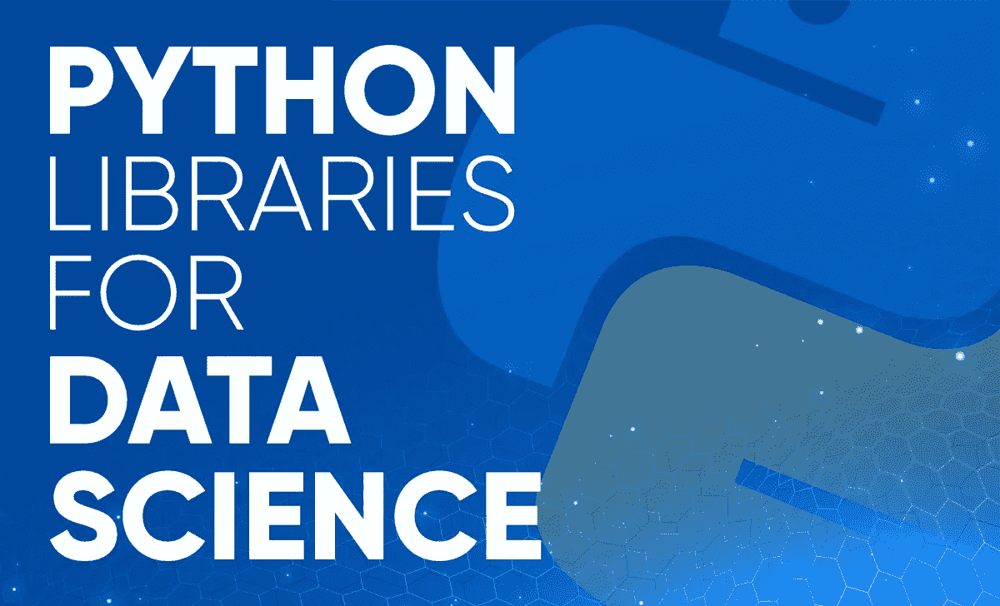

# 2021 年流行的数据科学 Python 库

> 原文：<https://medium.com/nerd-for-tech/popular-python-libraries-for-data-science-in-2021-1864fd38dc14?source=collection_archive---------17----------------------->

*随着数据科学作为一个学术和专业领域越来越受欢迎，大量的库(包括开源库和 Python 内置库)应运而生，以适应数据科学中的各种功能。本文探索了一些用于数据科学中不同过程的流行库。*

来源:<[https://www . geeks forgeeks . org/top-10-python-libraries-for-data-science-in-2020/](https://www.geeksforgeeks.org/top-10-python-libraries-for-data-science-in-2020/)>

**简介**:

数据科学是人工智能(AI)的一个子集，指的是“[统计学、科学方法和数据分析的重叠领域——所有这些都用于从数据中提取意义和见解](https://www.oracle.com/in/data-science/what-is-data-science/#difference)”。它是一个广泛的领域，包含子领域，如数据可视化、数据建模、机器学习、数据挖掘、统计分析和数据分析，以及随着时间的推移而出现的更多子领域。Python 库是一个函数集合，它消除了从头开始编码的需要。这些库中的预组合代码在数据科学及其子领域中起着关键作用。

让我们看看一些加速数据科学进程的开源 Python 库:

**数据挖掘**:

1.  漂亮的汤:这是一个 Python 库，用于从 HTML 和 XML 文件中提取数据。它为解析过的页面创建一个解析树，可以用来从 HTML 中提取数据。美丽的汤是一个伟大的网页抓取框架。该库使得从网页上抓取数据变得容易。它位于 HTML 或 XML 解析器之上，提供搜索、迭代和修改解析树的功能。从定位内容，区分链接和标题，剥离标签以从 HTML 标签中提取信息，Beautiful Soup 有助于各种功能，使网页抓取变得简单。
2.  Scrapy:它是 Python 中最流行的开源网页抓取和网页抓取框架。它从 HTML 和 XML 中提取结构化数据，这些数据可用于数据挖掘、信息处理和历史存档。Scrapy 内置了对数据选择和提取的支持，并提供了使用正则表达式进行提取的辅助方法。提要导出可以以多种格式生成，如 JSON、CSV 和 XML，并存储在多个后端，如 S3、FTP 和本地文件系统。Scrapy 是一个成熟的解决方案，允许用户轻松地进行网络抓取。

**数据处理/数据清理**:

1.  Pandas: Pandas 是一个开源库，是 Python 编程语言最受欢迎的数据分析工具之一。Pandas 包使得处理关系数据变得简单而直观。Pandas 支持两种主要的数据结构，即 Series(一维)和 DataFrame(二维)。它能够方便地处理缺失数据、大小可变性、显式数据对齐、分组功能、数据结构转换、切片、索引、子集化和许多其他数据操作功能，以帮助预处理。计算速度和在专业和学术领域的广泛应用使 Pandas 成为广泛用于数据分析的 Python 库之一。
2.  NumPy:数字 Python 的缩写，NumPy 是 Python 中科学计算的基础包。这个 Python 库支持多维数组(nd array)对象及其派生对象，如掩码数组和矩阵。数组对象上的例程包括数学、逻辑、形状操作、排序、选择、输入/输出、变换、线性代数、随机生成等操作。NumPy 数组的功效在存储和数据操作方面取代了 Python 内置的 list 对象。NumPy 的“矢量化”编码特性通过消除显式编码和索引来提高计算速度。在多维数组上操作的高级数学函数的结合使 NumPy 成为数据操作的优秀工具。

**数据可视化**:

1.  matplotlib:Python 中的一个综合库，用于从数据集创建静态、动画和交互式可视化。数据可视化是数据科学和机器学习中不可或缺的过程，用于识别数据趋势和模式，从而得出有意义的推论。Matplotlib 是一个用于图形绘制的 Python 库，它提供了面向对象的 API，用于将绘图集成到应用程序中。Matplotlib.pyplot()是 Matplotlib 模块的基于状态的接口，提供了与 MATLAB 相同的接口。使用 Pyplot 可以绘制许多图表，即直方图、折线图、等高线图、条形图、饼图、散点图等。通过向列表提供 x 和 y 坐标，可以使用 Line2D 实例绘制直线。通过使用 read_image()函数，也可以使用 Matplotlib 来查看图像。通过 matplotlib.pyplot()实例的 ion()和 iof()函数，可以进一步使绘图具有交互性。使用 Matplotlib 生成独特的数据可视化，说明数据的关系或分布，并有助于推断有意义的统计结论。
2.  Seaborn:这是一个基于 Matplotlib 的 Python 数据可视化库，提供了更好的美观、更简单的界面和合理的默认值。Seaborn 为交互式绘图提供了一个高级界面，并提供了有吸引力的信息统计图形。在将模型和算法应用于数据集之前，从数据可视化中获得的信息对于选择性数据处理技术是必不可少的。绘图功能是在具有完整数据集的数据框和数组上执行的。Seaborn 库中一个有趣的插件是 set_theme()函数，它允许用户控制图形美学。实际上，不同的数据可视化技术被用来回答不同的问题，而 Seaborn 允许在不同的可视化表示之间进行切换。Seaborn 为基本绘图及其变化提供了图形绘图选项。例如，使用 Seaborn 可以绘制直方图及其各种技术，如群体图和带状图。Seaborn 的高级界面和可定制性相结合，允许用户快速直观地探索数据并做出统计推断。
3.  Plotly:这是一个开源的图形库，用于制作交互式的、出版物质量的图形中的数据可视化。。Plotly 支持 40 多种不同的图表类型，涵盖了各种用例，如金融、地理、统计、科学和三维。基于 web 的数据可视化构建在 Plotly JavaScript 库之上，可以以交互和美观的方式创建。与其他数据可视化工具不同的是，通过支持在线和离线模式下的图形，图形可以在 web 浏览器中呈现，也可以保存为本地副本。除了支持散点图、线图、箱线图和等高线图等基本图表之外，Plotly 还支持特定用例的绘图。例如，像时间序列图和 OHLC 图表这样的财务图表很容易使用 Plotly 制作。通过增加的交互性和增强的功能组件，Plotly 可以成为 Seaborn 和 Matplotlib 的一个很好的替代品。

**数据建模**:

1.  Scikit-Learn:这是一个开源的机器学习库，支持有监督和无监督的机器学习。Scikit-Learn 提供了许多用于数据拟合、数据处理、模型选择、模型评估等的工具。与 NumPy 和 Pandas 的数据加载、操作和汇总特性不同，Scikit-Learn 侧重于数据建模特性。它为分类、回归、聚类和降维提供了高效的机器学习工具。在众多算法中，支持的算法包括支持向量机、随机森林、贝叶斯方法和 k-邻居。此外，Scikit-Learn 还支持 NumPy 和 SciPy 等科学库。一个有趣的特性是能够使用各种方法估计不同监督模型的准确性。凭借其即用型算法和模型，Scikit-Learn 是构建机器学习模型的有效工具。
2.  TensorFlow:它是一个用于机器学习的端到端开源平台，拥有一个工具和库的生态系统，允许构建和部署高级机器学习应用程序。TensorFlow 本质上实现了深度学习——机器学习的一个子领域。谷歌创建了这个开源库，目的是设计、构建和训练深度学习模型。神经网络在多维数组或“张量”上执行这些操作。TensorFlow 核心程序可以分为两个部分——计算图和会话。在指示程序修改变量以改进预测之前，需要设置变量、占位符和模型。TensorFlow 跟踪这些计算，并自动计算每个变量的梯度。计算图以节点的形式充当一系列张量流操作，而会话通过实际评估运行的节点来充当评估器。张量流流行的主要特征包括它的计算图形概念、自动微分和适应性。其独特的高效解决问题的方式使得程序员可以使用 TensorFlow 进行深度学习。
3.  PyTorch:它是一个首屈一指的开源优化张量库，用于使用 GPU 和 CPU 进行深度学习。PyTorch 中完整的机器学习工作流程包括处理数据、创建模型、优化模型参数和保存训练好的模型。PyTorch 库是作为动态而非静态的计算图构建的，可以在基于图的模型上进行有效的计算和自动微分。像 TensorFlow 这样的静态计算图将声明性表达的计算发送到 GPU，带有类似黑盒的控件。相反，动态 PyTorch 允许全面深入每个级别的计算，以查看它们在幕后的工作。处理数据的两个基本工具包括 torch.utils.data.DataLoader 和 torch.utils.data.Dataset。当 Dataset 存储带有标签的样本时，DataLoader 用 iterable 包装 Dataset。此外，PyTorch 还有一个自动签名包，可为张量上的所有操作提供自动区分。也有证据表明，PyTorch 上的模型训练比 TensorFlow 更快，这使得它成为深度学习实验和模型的一个有吸引力的选择。

**结论**:

总之，Python 中的许多开源和内置库可以用于数据科学和机器学习过程。虽然本文可能没有涵盖所有的框架，但它简要概述了一些用于基本数据科学过程的流行库，如数据挖掘、数据清理、数据处理、数据可视化和数据建模。