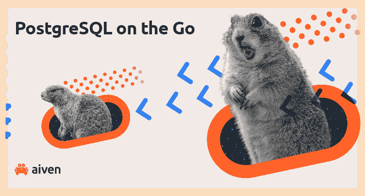

# Postgres 图书馆尝试使用 Go

> 原文：<https://medium.com/nerd-for-tech/postgres-libraries-to-try-with-go-8f80191edbff?source=collection_archive---------15----------------------->



我为这篇文章选择的库是 [pgx](https://github.com/jackc/pgx) ，这是一个很好的 PostgreSQL 专用库，可以替代`database/sql`和 [Squirrel](https://github.com/Masterminds/squirrel) ，因为我喜欢这个名字(它也有一些很酷的特性)。

# 从数据库开始

手边已经有一个 PostgreSQL 数据库是有意义的，最好是其中有一些数据。如果你还没有帐号，那么[注册](https://console.aiven.io/signup)并启动 PostgreSQL 服务。如果你已经有一些数据可以使用，那太好了！我正在使用开普勒太空任务的一些公开数据，你可以[跟随最近的博客文章](https://aiven.io/blog/discover-exoplanets-with-postgresql)来自己设置。

在 Aiven 控制台中，复制 Postgres 的连接字符串——或者如果您使用不同的数据库，复制`postgres://....`连接字符串。

# 从 Go 连接到 PostgreSQL

Go 在其`database/sql`库中有内置的数据库支持，但它非常通用，因为它必须能够处理如此多不同的数据库平台。对于专门连接到 PostgreSQL 的应用程序，使用专门的库是有意义的。

对于这个例子，我选择了`jackc/pgx`，它是 PostgreSQL 特有的，除了提高性能之外，在理解 PostgreSQL 数据类型方面有一些很好的特性。整体模式与其他使用`database/sql`的应用程序没有根本的不同，这让它感觉很熟悉。

将之前复制的连接字符串设置为`DATABASE_URL`环境变量。然后用`go mod init pgfun`初始化你的 go 应用；`pgx`使用 go 模块。

当您设置好一切后，尝试下面的代码示例连接到一个数据库并运行一个查询(我的数据库中有系外行星数据):

```
package mainimport (
 "context"
 "fmt"
 "os""github.com/jackc/pgx/v4/pgxpool"
)func main() {
 dbpool, dberr := pgxpool.Connect(context.Background(), os.Getenv("DATABASE_URL"))
 if dberr != nil {
  panic("Unable to connect to database")
 }
 defer dbpool.Close()sql := "SELECT kepler_name, koi_score " +
        "FROM cumulative " +
        "WHERE kepler_name IS NOT NULL AND koi_pdisposition = 'CANDIDATE' " +
        "ORDER BY koi_score LIMIT 5"
 rows, sqlerr := dbpool.Query(context.Background(), sql)
 if sqlerr != nil {
  panic(fmt.Sprintf("QueryRow failed: %v", sqlerr))
 }for rows.Next() {
  var planet_name string
  var score float64
  rows.Scan(&planet_name, &score)
  fmt.Printf("%s\t%.2f\n", planet_name, score)
 }
}
```

在`main()`函数中，首先代码使用`pgx`的[连接池](https://help.aiven.io/en/articles/964730-postgresql-connection-pooling)特性连接到数据库。作为一般规则，我认为 PostgreSQL 的连接池是明智之举，这就是为什么在这里使用它。

然后是一个简单的 SQL 语句，显示开普勒任务指定为“候选”状态的系外行星，以及他们对它是一颗真实行星的信心。该语句有一个行限制(数据集有大约 2k 行，没有该限制)，因此在最后一节中，您只能看到五个最低置信度得分的行星，该节遍历行并将数据作为变量读入。

我喜欢这里的名字——如果你感兴趣，你甚至可以在[系外行星目录](https://exoplanets.nasa.gov/discovery/exoplanet-catalog/)中查找这些行星。我花了太多时间浏览，科学是王牌！

概括一下，我们有一个 PostgreSQL 连接字符串、一个 Go 数据库和一个硬编码的 SQL 查询。下一步是什么？

# 松鼠的流体界面

虽然`pgx`库是特定于 PostgreSQL 的对`database/sql`的替代，但它也有一个兼容的接口。如果你想切换现有的应用程序，这是很理想的，但这也意味着其他设计用来很好地处理`database/sql`的工具也可以和`pgx`一起工作。这对我是个好消息，因为我想找到比我的硬编码 SQL 字符串更优雅的东西。

松鼠！

不，我没有分心，这是一个 SQL 库。虽然，这是一个有点闪亮的玩具。它是一个用于构建 SQL 查询的流畅接口，SQL 非常适合以这种方式考虑。

在这个接口中重新构建我们现有的 SQL 查询会产生如下结果:

```
planets := psql.Select("kepler_name", "koi_score").
  From("cumulative").
  Where(sq.NotEq{"kepler_name": nil}).
  Where(sq.Eq{"koi_pdisposition": "CANDIDATE"}).
  OrderBy("koi_score").
  Limit(5)
```

它更易于管理，我可以想象在一个真实的应用程序中构建它要比将 SQL 字符串连接在一起容易得多。仍然可以通过调用`planets.ToSql()`来检查它作为字符串构建的 SQL，这是一个不错的方法。

将`pgx`切换到“假装`database/sql`”模式需要一点重构。我还需要一勺秘方酱来让 Squirrel 很好地使用 PostgreSQL，所以下面是完整的 runnable 示例。与前面的例子一样，它期望数据库连接字符串在`DATABASE_URL`中:

```
package mainimport (
 "database/sql"
 "fmt"
 "os"sq "github.com/Masterminds/squirrel"
 _ "github.com/jackc/pgx/v4/stdlib"
)func main() {
 db, err := sql.Open("pgx", os.Getenv("DATABASE_URL"))
 if err != nil {
  panic("Unable to connect to database")
 }
 defer db.Close()// a little magic to tell squirrel it's postgres
 psql := sq.StatementBuilder.PlaceholderFormat(sq.Dollar)planets := psql.Select("kepler_name", "koi_score").
  From("cumulative").
  Where(sq.NotEq{"kepler_name": nil}).
  Where(sq.Eq{"koi_pdisposition": "CANDIDATE"}).
  OrderBy("koi_score").
  Limit(5)rows, sqlerr := planets.RunWith(db).Query()
 if sqlerr != nil {
  panic(fmt.Sprintf("QueryRow failed: %v", sqlerr))
 }for rows.Next() {
  var planet_name string
  var score float64
  rows.Scan(&planet_name, &score)
  fmt.Printf("%s\t%.2f\n", planet_name, score)
 }
}
```

注意，这次的`pgx`导入是不同的，以获得 Squirrel 在其`RunWith()`方法中期望的`database/sql`兼容库。连接步骤也有一些变化，所以不要试图修改前面的例子；这个不一样。

`psql`变量保存一个重新配置的松鼠，这是必需的，因为 PostgreSQL 处理占位符的方式略有不同。跳过这一步会导致代码告诉您在`LIMIT`子句附近有一个语法错误。希望现在我已经把它写下来了，我亲爱的读者可以避免这个问题，下次我可能还会记得！

# Go 和 PostgreSQL 的乐趣

这是一个轻量级的介绍，向您展示了几个我最喜欢的用于 Go 和 PostgreSQL 应用程序的库——当然，有了开放的数据集，乐趣会成倍增加:)

这里有一些相关的链接和进一步的阅读，如果你有问题，请在[推特](https://twitter.com/aiven_io)上联系我们。我们喜欢聊天！

*   【Aiven PostgreSQL 入门
*   [用 PostgreSQL 发现系外行星](https://aiven.io/blog/discover-exoplanets-with-postgresql)
*   [事件连接的代码示例](https://github.com/aiven/aiven-examples)
*   [针对 Postgres13 的 Aiven 现已推出](https://aiven.io/blog/aiven-for-postgresql-13-is-now-available)

*最初发布于*[*https://aiven . io*](https://aiven.io/blog/aiven-for-postgresql-for-your-go-application)*。*