# 使用机器学习预测斯堪尼亚卡车 APS 的故障—第 2 部分

> 原文：<https://medium.com/nerd-for-tech/predicting-a-failure-in-the-aps-of-a-scania-truck-using-machine-learning-part-2-271814dfebdd?source=collection_archive---------9----------------------->


肯德尔·亨德森在 [Unsplash](https://unsplash.com?utm_source=medium&utm_medium=referral) 上的照片

T 这是关于使用*机器学习来执行卡车*的 APS(气压系统)的预测性维护的完整端到端过程的两部分博客系列的第二部分。*看第一部分* [*这里*](https://amansavaria.medium.com/predicting-a-failure-in-the-aps-of-a-scania-truck-using-machine-learning-part-1-fefb407040db) *。*

本博客将讨论建模过程，实验各种经典的机器学习模型，然后使用两种用于不平衡数据集的机器学习模型，即 **SMOTEBoost 和 RUSBoost。**之后，我们将制作一个 streamlit 应用程序，并将其部署在 AWS EC2 实例上。

# 内容:

1.  基线模型
2.  使用经典的 ML 模型
3.  使用 SMOTEBoost 和 RUSBoost
4.  堆积分类器
5.  关于模型的最终结论
6.  在 Streamlit 上制作 webapp
7.  在 AWS EC2 上部署。
8.  结论
9.  参考

# 基线模型

在对数据训练任何模型之前，我们必须知道*最简单的*模型在该数据集上的性能。为此，我们将训练一个基线模型。基线模型将为我们所有的机器学习模型设定基础性能。*如果一个模型的表现比基线模型差，那么这个模型就完全没用了，会被丢弃。*

我们的基线模型将只预测每个数据点的类别标签。然而，*基线模型将偏向于负类*以考虑数据不平衡，而不是随机分配类标签。为了得到这个有偏差的模型，我们的方法如下:

> 设置一个阈值，比如说 T。(这里我们用 T=0.95)
> 
> 从均匀随机变量中随机选择一个介于 0 和 1 之间的数字。
> 
> 如果所选数字大于 T，则返回正类。
> 
> 否则，返回负类。

基线模型

# 经典 ML 模型

现在，是时候在数据集上训练各种机器学习模型了。我们将培训以下 ML 模型:

*   逻辑回归
*   KNN 分类器
*   决策树分类器
*   随机森林分类器
*   GBDT 分类器

之前在进行缺失值插补时，我们使用了两种插补技术，即 [**小鼠**](https://www.youtube.com/watch?v=WPiYOS3qK70) **和**[**KNNImputer**](https://www.analyticsvidhya.com/blog/2020/07/knnimputer-a-robust-way-to-impute-missing-values-using-scikit-learn/)**并将插补后的数据集保存在磁盘上。我们说过，我们将在这两个数据集上训练 ML 模型，然后选择两者中表现更好的插补技术。**

**为了从这些模型中获得最佳性能，我们将使用 [*k 倍交叉验证*](https://machinelearningmastery.com/k-fold-cross-validation/) *来执行超参数调整。*为此，我们将使用 [GridSearchCV](https://scikit-learn.org/stable/modules/generated/sklearn.model_selection.GridSearchCV.html) 。因此，让我们首先声明几个函数，它们将帮助我们进行超参数调整和性能评估。**

**超参数调整的效用函数。**

## **1.关于 KNN 估算数据集的培训:**

**让我们从 KNN 估算数据集开始，看看各种模型在最佳超参数值下的表现。**

1.  ****逻辑回归****

**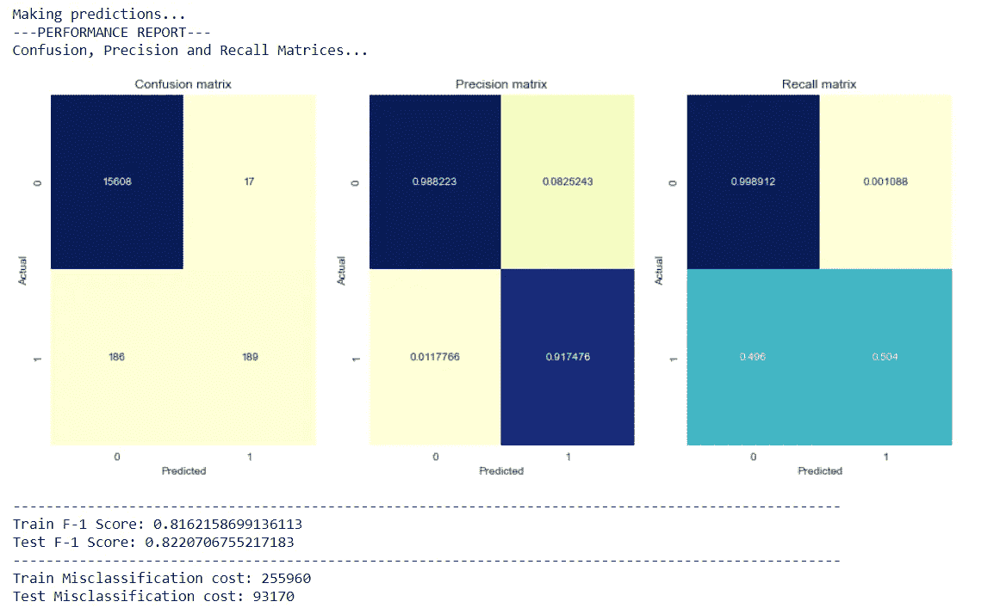**

**逻辑回归性能指标。**

> **正如预期的那样，逻辑回归在正类中工作得非常好。与基线模型相比，它具有更高的 f1 分数和更低的错误分类成本。然而，正如在混淆矩阵中看到的，它在预测正的类数据点方面仍然有问题。正类的精度也很高，即 0.91，这意味着它对正类的预测大多是正确的。然而，从较低的召回率和混淆矩阵可以看出，由于高度的不均衡性和模型固有的类的线性可分性偏差，它没有对正类进行大量的分类。**

**2. **KNN 分类器****

**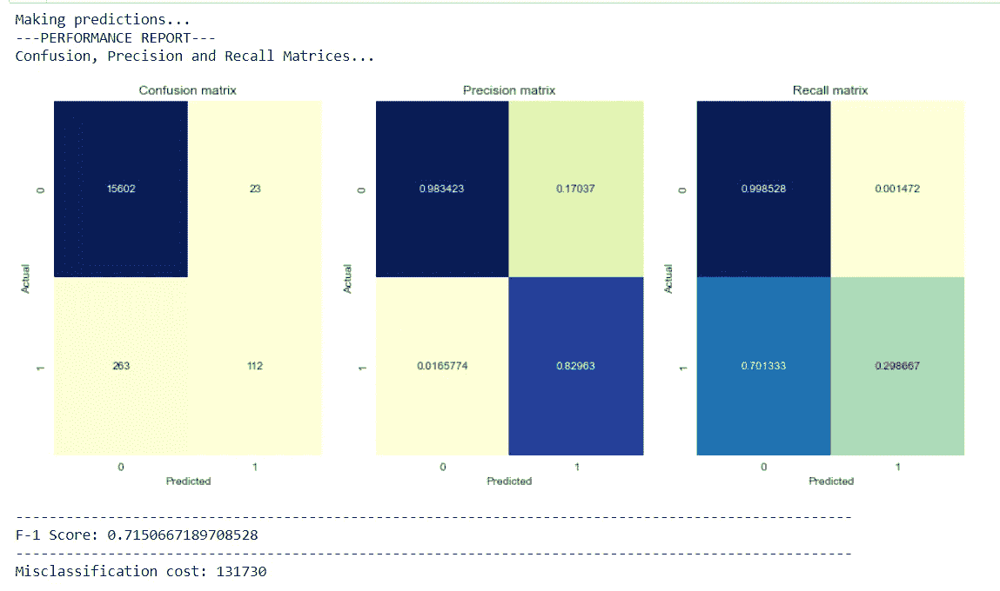**

**KNN 分类器性能指标**

> **从 f1 得分和错误分类成本来看，与逻辑回归相比，KNN 的表现较差，但其表现仍优于基线模型。然而，对负面的偏见仍然存在，而且更多。出现这种情况的原因可能是，正如我们在 EDA 期间的 *tSNE-plot* 中看到的，许多正类数据点被负类数据点包围。这将使基于邻居的模型(如 KNN)表现不佳，我们在这里也可以看到这一点。**

**3.**决策树分类器****

**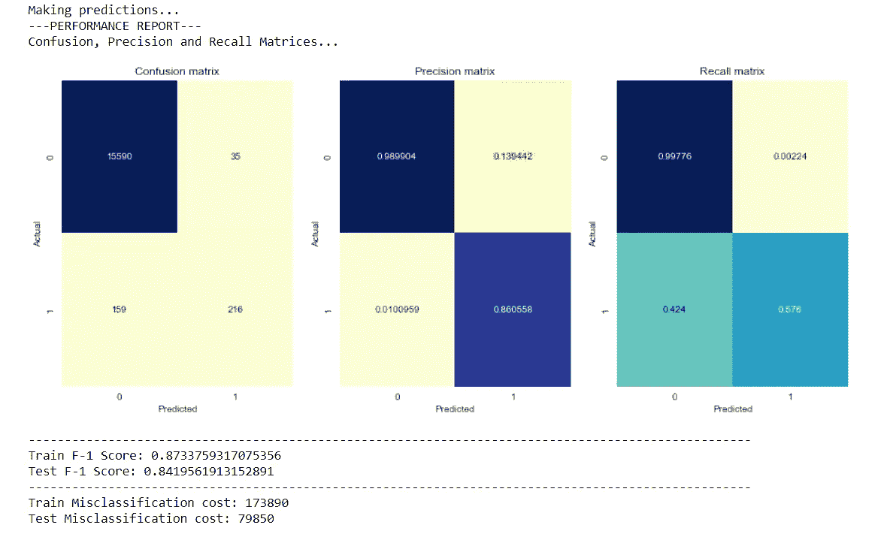**

**决策树分类器**

> **到目前为止，决策树比所有的模型都表现得更好。它的 f1 值为 0.84(近似值)，错误分类成本最低，为 79，830 英镑。如我们所见，与其他型号相比，召回率也更高，为 0.58。**

**4.**随机森林分类器****

**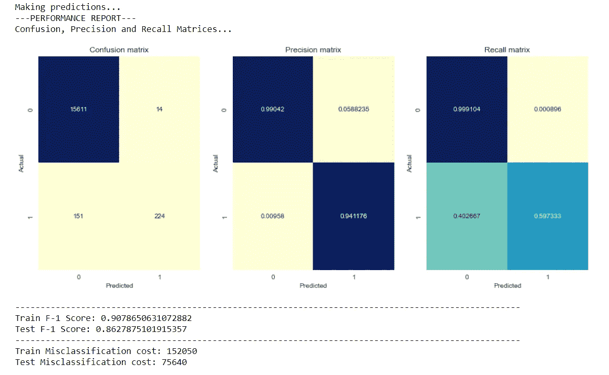**

**随机森林性能指标**

> **随机森林模型的测试 f1 值为 0.85，错误分类成本为 77，640。**

**5. **XGBoost(GBDT)分类器****

**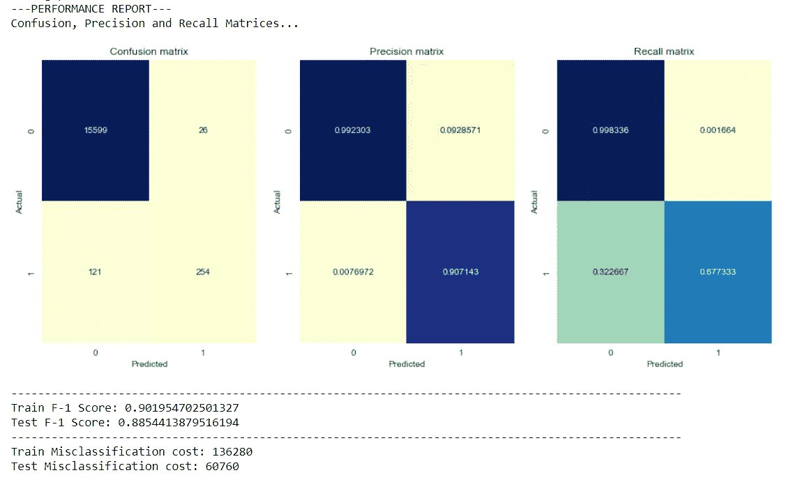**

**XGBoost 性能指标**

> **XGBoost 模型比随机森林模型表现更好，其 *f1 得分为 0.88，错误分类成本为 60670*。在所有模型中，它还具有阳性类别的最高回忆分数。到目前为止，XGBoost 模型在所有其他模型中表现最好。**

**以下是 KNN 估算数据集上所有最大似然模型的最终性能指标:**

****

**KNN 估算数据集上的模型性能**

## **2.基于 MICE 估算数据集的训练**

**现在，让我们看看最佳超参数值在 MICE 估算数据集上的模型性能。**

1.  ****逻辑回归****

****

**逻辑回归性能指标**

> **与 knn 估算数据集相比，小鼠估算数据集上的逻辑回归表现更好。与 knn 估算数据集的 f1 得分和错误分类成本相比，它具有更高的 f1 得分和更低的错误分类成本。**

**2. **KNN 分类器****

**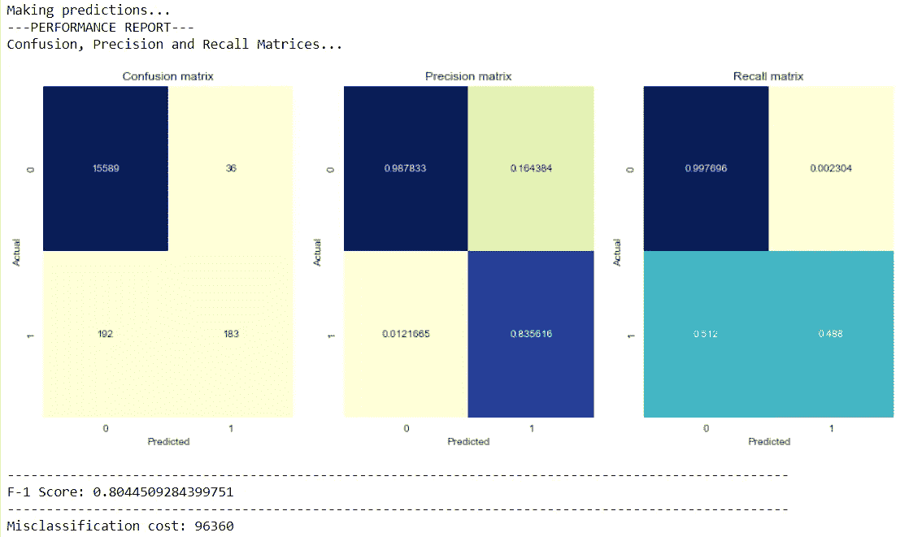**

**KNN 分类器性能指标**

> **就像在 knn 估算数据集上一样，KNN 在这里也表现最差，F-1 得分为 0.80，错误分类成本为 96360。然而，它在 mice 估算数据集上的性能优于在 knn 估算数据集上的性能。**

**3.**决策树分类器****

**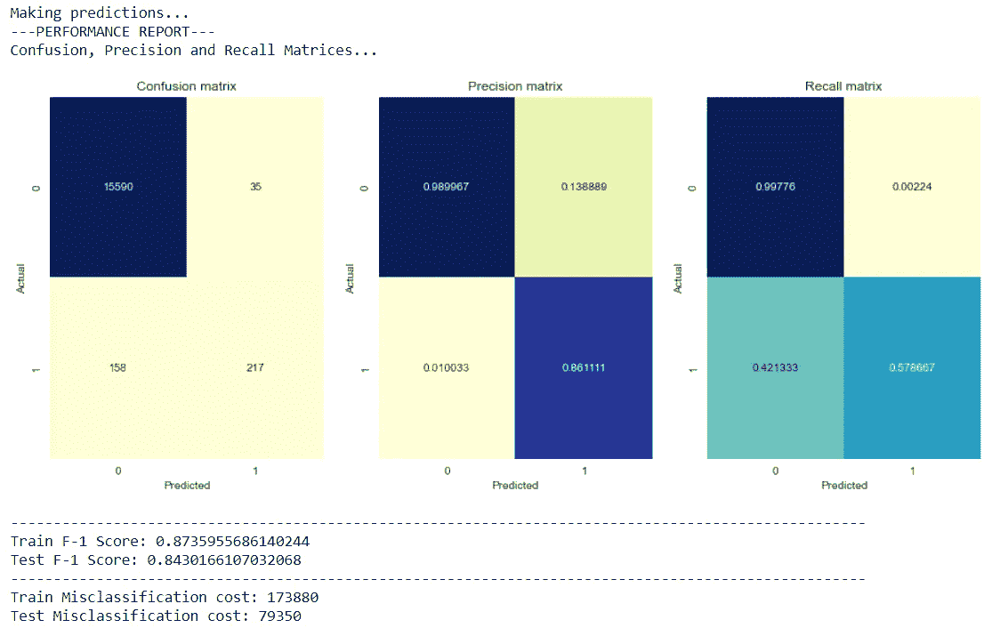**

**决策树性能指标**

> **决策树模型倾向于具有 79，840 的错误分类成本，并且对于小鼠估算数据集的 f1 分数为 0.84。这比 knn 估算数据集要好。**

**4.**随机森林分类器****

**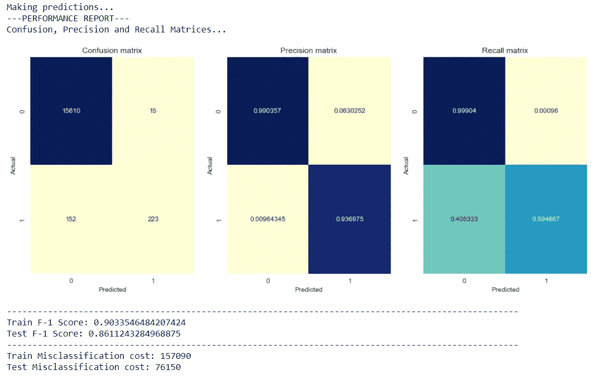**

**随机森林分类器性能度量**

> **mice 数据的随机森林模型的表现与 knn 数据的随机森林大致相同。它的 f1 分数略高，但错误分类的成本完全相同。**

**5. **XGBoost (GBDT)分类器****

**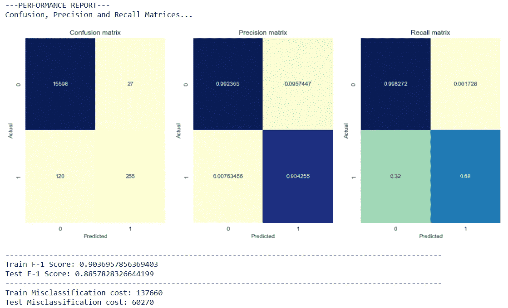**

**XGBoost 性能指标**

> **XGBoost 模型在这里也表现最好，f1 得分为 0.88，错误分类成本为 60，270。类似于 KNN 估算数据集上的 XGBoost，我们可以看到，XGBoost 在 MICE 估算数据集上也具有最佳性能。**

**以下是所有 ml 模型在 MICE 估算数据集上的最终性能指标:**

****

**MICE 估算数据集的模型性能**

**现在，让我们比较两个数据集上的模型性能，并列出我们得到的一般观察结果:**

*   **正确预测负类数据点非常容易，主要挑战归结为正确预测正类数据点。将选择在这方面做得最好的型号。**
*   **正如所料，对于这两种数据集，Random Forests 和 XGBoost 等更复杂的模型表现最好。**
*   **对于更简单的模型，如逻辑回归和 knn，mice 插补似乎比 KNN 插补效果更好。**
*   **XGBoost 和 RandomForest 的性能或多或少是相似的，在 mice 估算数据集上的性能略有提高。**

> **因此，我们将对所有未来模型使用**鼠标插补技术**。尽管这两种技术对最佳模型的表现相似，但小鼠估算器比 KNN 估算器更快，因此它将是更好的选择。至于模型，我们将使用 XGBoost 分类器。**

**查看所有模型的混淆矩阵，我们可以观察到，由于类别不平衡，模型中的负类别数据点存在一些*偏差。这意味着，如果我们能以某种方式消除这种偏差，我们就能提高模型的性能。一种方法是修改模型的分类阈值。默认情况下，对于二元分类场景中的正类，模型的阈值*为 0.5* ，即*如果模型预测某个点属于正类的概率大于 0.5，则该数据点将被分类为正类数据点，反之亦然。*通过降低该阈值，我们可能能够提高正类的模型性能。但是，我们应该记住，这种性能的提高是以多数类的性能为代价的，因此，我们不能降低太多，因为这会对性能产生负面影响。现在，让我们为小鼠估算数据集的 XGBoost 模型找到最佳阈值。我们还将进行更多的超参数调优，以获得性能更好的 XGBoost 模型。***

***n_estimators=20，max_depth=5* 似乎是最佳值。在用这些值训练 XGBoost 模型时，我们得到以下结果:**

**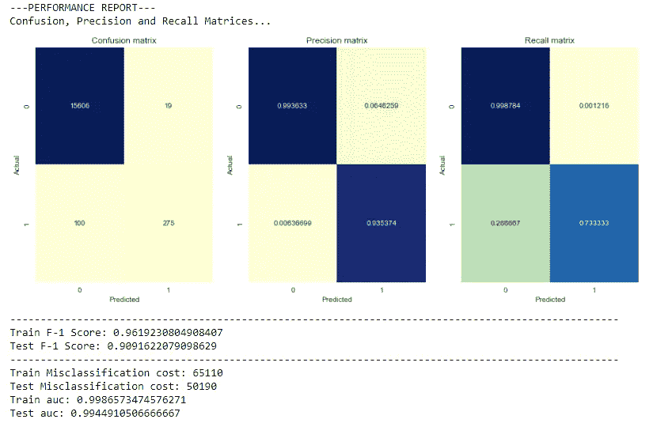**

**XGBoost 的性能指标**

**现在，为了找到最佳阈值，我们将从 [ROC AUC 曲线](https://scikit-learn.org/stable/modules/generated/sklearn.metrics.roc_curve.html)中获得预测阈值，然后使用这些阈值进行预测，并为每个阈值找到 **F-1 分数和错误分类成本**。将*最大化 F-1 分数并最小化误分类成本*的阈值将是最佳值。**

**xgboost 的成本与阈值和成本与 F1 分数图。**

> **对于非常接近 0 的阈值，最低分数是 8850。**
> 
> **对于等于 0.15 的阈值，最大 f1 分数是 0.91。**

**我们将为 XGBoost 选择 0.15 的阈值，因为对于该值，成本非常低(约 20，000)，f1 分数也很高。在使用该阈值进行预测时，我们得到以下结果:**

**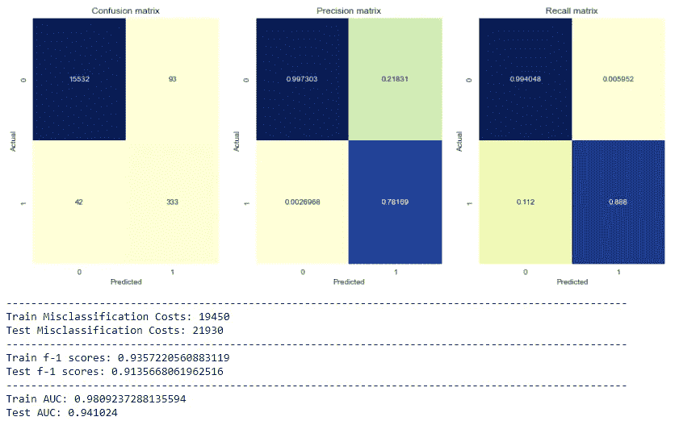**

**阈值==0.15 的 XGB 性能指标。**

**如我们所见，仅仅通过改变阈值，性能就提高了很多。通过设置阈值的最优值，测试集中的误分类代价从 **50190** 下降到 **21930** 。在这里，我们可以清楚地看到，该模型预测许多数据点是积极的。这增加了肯定类别的召回分数，但是也导致了肯定类别的精确分数的降低。**

# **使用 SMOTEBoost 和 RUSBoost**

**如上所述，我们调整预测阈值的原因是我们的模型偏向于负类，因此为了消除这种偏向，我们使预测阈值更小，这将导致模型仅在它们确实确定时将数据点标记为负，否则它们将数据点标记为正。处理这种偏差问题的另一种方法是通过*实际改变数据点*的数量，从而稍微保持数据平衡。有两种方法可以做到这一点:**

> **过采样技术，例如 [SMOTE](https://machinelearningmastery.com/smote-oversampling-for-imbalanced-classification/) (合成少数过采样技术)以及，**
> 
> **欠采样技术，例如[随机欠采样](https://machinelearningmastery.com/random-oversampling-and-undersampling-for-imbalanced-classification/) (RUS)**

**然而，我们不打算直接使用这些技术。相反，我们将使用两种不同的模型，在内部利用这些技术来对抗阶级不平衡。这些是 i) SMOTEBoost 和 ii)RUSBoost。要学习如何在 python 中使用这两个模型，参考[这个](/urbint-engineering/using-smoteboost-and-rusboost-to-deal-with-class-imbalance-c18f8bf5b805)。**

1.  **[**SMOTE boost**](https://www.researchgate.net/publication/220698913_SMOTEBoost_Improving_Prediction_of_the_Minority_Class_in_Boosting)**:**SMOTE boost 是一种定制的 boosting 集成方法，执行 *SMOTE(合成少数过采样技术)*来处理数据集中的类不平衡。SMOTE 是一种复杂的技术，用于对多数类数据点进行过采样。它通过*智能地*为少数类创建合成数据点来做到这一点，从而平衡数据集。SMOTE 在连接现有少数民族类数据点的线上创建合成数据点。SMOTEBoost 在从头开始训练每个基础学习者之前执行 SMOTE，以便为每个基础学习者创建一个平衡的数据集来进行训练。因此，它处理了数据集中的类不平衡并提高了模型性能。**

**现在，让我们执行 SMOTEBoost，调优它，看看结果。对于调整，我们将调整用于 SMOTE 的*数量的基本学习器和邻居数量。***

**SMOTEBoost 调优和培训**

**在这里，我们可以看到 SMOTEBoost 的性能略好于 XGBoost 模型。它将更多的点标记为积极的。然而，他们中的许多人被贴上了错误的标签。因此，SMOTEBoost 明显减少了对多数阶级的偏见，但这仍然不够。**

1.  **[**RUS boost:**](https://sci2s.ugr.es/keel/pdf/algorithm/articulo/2010-IEEE%20TSMCpartA-RUSBoost%20A%20Hybrid%20Approach%20to%20Alleviating%20Class%20Imbalance.pdf)RUS boost 是一种定制的增强集成方法，执行随机欠采样(RUS)以解决类别不平衡的情况。RUS 是一种欠采样技术，它随机丢弃属于多数类的数据点。RUS 的一个问题是，它涉及数据点的丢失，最终导致模型可用于学习的信息减少。然而，RUSBoost 并不在数据集上执行一次 RUS 并减少原始数据集，而是在每次训练基础学习者时执行 RUS(替换)。这不会导致信息丢失，因为为一个基础学习者丢弃的数据点很有可能在未来被一个或多个学习者看到，因此整体信息得以保存。**

**我们将根据我们的数据训练 RUSBoost 模型，并执行超参数调整以获得最佳性能。对于超参数调整，我们将在 RUS 之后调整*I)基础学习者的数量，ii)学习率和 iii)班级比率。***

**RUSBoost 调整和培训**

**正如我们所见，该模型的成本非常低，仅为默认阈值的 39，040 。对于阳性类，它的**召回率为 0.83** 。这确实提高了模型在正类中的性能。然而，如果我们仔细观察混淆矩阵，我们可以看到该模型正在进行大量的*假阳性*预测，导致阳性类别的精度非常差，为 **0.596** 。因此，尽管该模型在正类中表现良好并且具有较低的误分类分数，但其总体性能不能被认为是好的。**

# **堆积分类器**

**现在，让我们训练一个多模型的堆叠分类器，看看它是否能提高模型的性能。对于堆叠分类器，我们将遵循以下步骤:**

*   **把训练数据分成两半，比如 D1 和 D2。**
*   **用替代品从 D1 制造 k 个样品**
*   **在这 k 个样本集中的每一个上训练 k 个模型**
*   **在训练之后，从 k 个模型中的每一个对 D2 进行预测，这将给出 len(D2) * k 形状的预测数据集**
*   **在这个数据集上，使用实际的类标签训练一个元分类器。**
*   **为了评估模型性能，使用测试集并将其传递给 k 个基本分类器中的每一个，并使用元分类器进行决策。**
*   **每个样本中基本模型的数量和数据点的数量可以作为超参数进行调整。**

**堆积系综**

**对于叠加系综，我们将调整*数量的基本模型(k)* 和*每个模型数据集的样本比例(sample_proportion)。*调优模型后，我们得到 *k=10，sample_proportion=0.75* 给出最佳性能。之后，我们调整模型的分类阈值。我们得到以下*成本与分类阈值& f1 分数与分类阈值*的关系图:**

**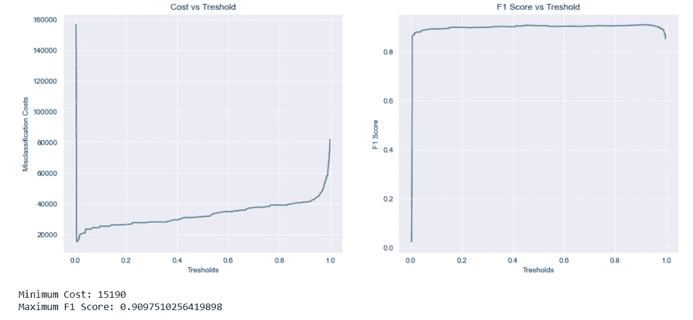**

**成本与阈值和 f1 分数与阈值图**

*   **最低成本是 15，190 英镑，阈值非常接近于 0，与其他型号相比要大一些。**
*   **最大 f1 分数是 0.909，并且在整个阈值范围内或多或少是恒定的。**
*   **从图中，我们可以看到，即使对于阈值接近 0 的最小错误分类误差，f1 分数也相当高。这可能意味着元分类器偏向 0 类点，假设我们使用的元分类器是线性分类器。**

**现在，使用最佳超参数值和预测阈值，我们得到堆叠分类器的以下性能度量:**

**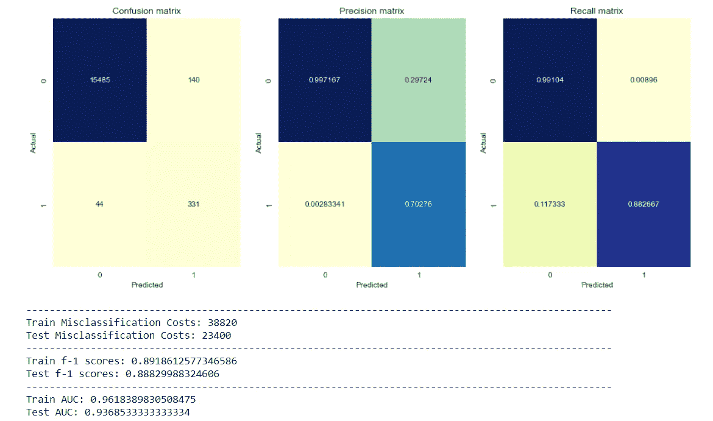**

**堆叠分类器性能指标**

**我们可以看到，使用阈值等于 0.05 的堆积系综，我们得到的错误分类分数接近我们的最佳 xgboost 模型。然而，堆积系综的精度比 xgboost 模型差。**

# **关于模型的最终结论**

**既然我们已经为缺失数据试验了许多模型和不同的插补技术，我们需要选择性能最佳的模型和最佳插补技术。该模型和估算方法将用于最终部署。在我们训练的所有模型中，我们将使用预测阈值为 0.15 的 **XGBoost 模型。****

**我们使用的**鼠标估算器**对象也需要相当长的时间来进行估算，它在磁盘上的大小也很大(准确地说是 1.3 gb)。这将是一个问题，因为我们将要使用的 AWS EC2 实例只有 1GB 的 RAM。因此，对于插补，我们将只对所有特征使用中位数插补器。之后，我们将以类似的方式为新数据集训练新的 XGBoost 模型，并以类似于我们之前所做的方式调整其超参数和预测阈值。通过这样做，我能够得到一个具有以下性能指标的模型**

**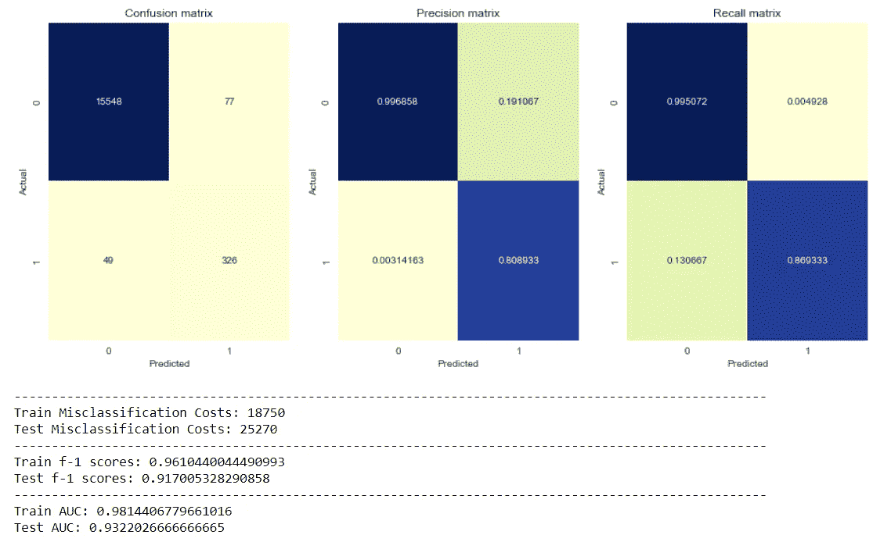**

**均值插补的 XGBoost 性能指标**

# **使用 Streamlit 制作 Webapp**

**该模型可以部署在服务器上，既可以部署在本地系统中，也可以部署在云服务器上，例如 AWS EC2 实例等。我们将在一个 ***AWS EC2 实例*** 中部署它，方法是使用 **Streamlit** 库制作一个 webapp。Streamlit 是一个非常容易使用的 python 库，它允许我们非常容易地为机器学习创建 webapps。有关 streamlit 的更多信息，请参考[本](https://docs.streamlit.io/en/stable/)。**

**我们要制作的 webapp 将以 csv 文件的形式获取数据，执行所有缺失数据插补、特征缩放，然后使用 xgboost 模型进行预测。预测完成后，根据作为输入给出的数据点数，它将以不同的方式为我们提供输出:**

```
if number_of_rows<=10:
    show the datapoints on the screen with class labels
else:
    append the class labels to the original dataset and display a download link for the csv file
```

**webapp 还将有另一种模式，用户可以在其中评估模型的性能，并可以看到*错误分类分数、f1 分数以及混淆、精度和召回矩阵。***

**现在，让我们看看 webapp 的代码:**

*   **主 streamlit 应用程序**

**streamlit_app.py**

*   **实现预测管道的模型函数**

**模型预测管道**

**要了解如何在 aws ec2 实例上部署 streamlit webapp，请参考 Rahul Agrawal 的博客。**

**在此视频中，我们可以看到部署在 AWS EC2 微实例上的 webapp 的运行情况:**

# **结论**

**总而言之，这个问题的主要挑战是数据集中的*类不平衡和缺失值*。一旦我们能够克服这些挑战，我们就能得到性能良好的模型。因此，我们首先解决缺失值问题，首先我们删除具有大量缺失值的特征，然后使用*平均值、中值和 MICE 插补*的组合来插补其他特征。然而，我们观察到，复杂的技术，如鼠标，并没有真正提高性能那么多，我们可以实现类似的性能只使用平均和中位数插补。**

**在建模部分，我们发现所有的模型都偏向于负类。然而，调整预测阈值大大提高了模型的性能。我们还尝试了 SMOTEBoost 和 RUSBoost 等模型，它们也提高了性能，但在降低误分类成本的同时，它们严重影响了正类的*精度。***

**最后，我们决定 XGBoost 将是使用最佳预测阈值的最佳模型，然后使用 streamlit 制作一个 webapp，部署在 AWS EC2 实例上。**

**完整代码请参考我的 [github](https://github.com/AmanSavaria1402/Scania-APS-Fault-Prediction) ，可以随时通过 [LinkedIn](https://www.linkedin.com/in/amansavaria/) 联系我。**

# **参考**

1.  ****IDA 2016 工业挑战赛:利用机器学习预测故障:**[https://link . springer . com/chapter/10.1007/978-3-319-46349-0 _ 33](https://link.springer.com/chapter/10.1007/978-3-319-46349-0_33)**
2.  ****IDA-2016 工业挑战赛:**[https://ida2016.blogs.dsv.su.se/?page_id=1387](https://ida2016.blogs.dsv.su.se/?page_id=1387)**
3.  ****应用人工智能课程:**[https://www.appliedaicourse.com/](https://www.appliedaicourse.com/)**
4.  ****smote boost:Chawla 等人改进 Boosting 中少数类的预测:**[https://www . research gate . net/publication/220698913 _ smote boost _ Improving _ Prediction _ of _ the _ Minority _ Class _ in _ Boosting](https://www.researchgate.net/publication/220698913_SMOTEBoost_Improving_Prediction_of_the_Minority_Class_in_Boosting)**
5.  ****RUSBoost:一种缓解阶级失衡的混合方法:**[https://sci2s . ugr . es/keel/pdf/algorithm/articulo/2010-IEEE % 20 TSMC parta-RUSBoost % 20A % 20 Hybrid % 20 Approach % 20 to % 20 缓解% 20Class %失衡. pdf](https://sci2s.ugr.es/keel/pdf/algorithm/articulo/2010-IEEE%20TSMCpartA-RUSBoost%20A%20Hybrid%20Approach%20to%20Alleviating%20Class%20Imbalance.pdf)**
6.  ****老鼠:**[https://www.youtube.com/watch?v=WPiYOS3qK70&ab _ channel = rachitoshniwal](https://www.youtube.com/watch?v=WPiYOS3qK70&ab_channel=RachitToshniwal)**