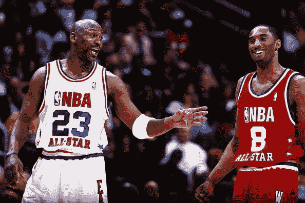
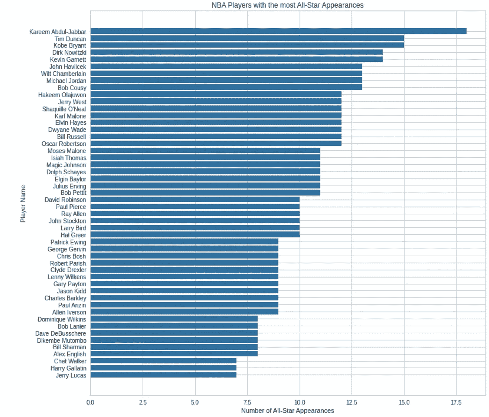
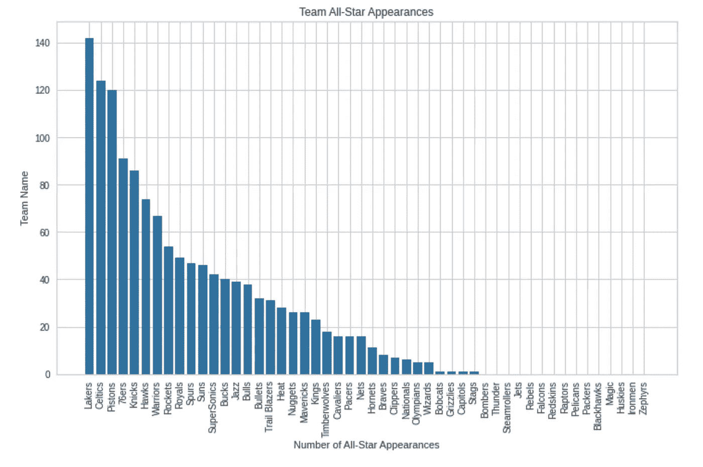
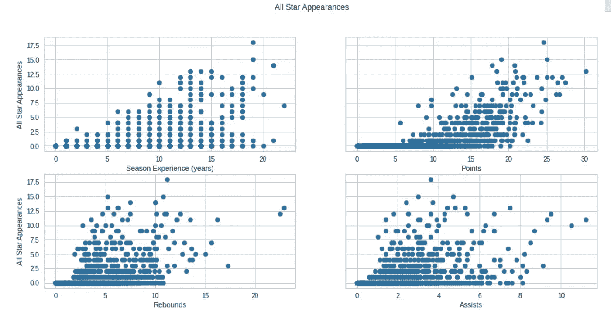
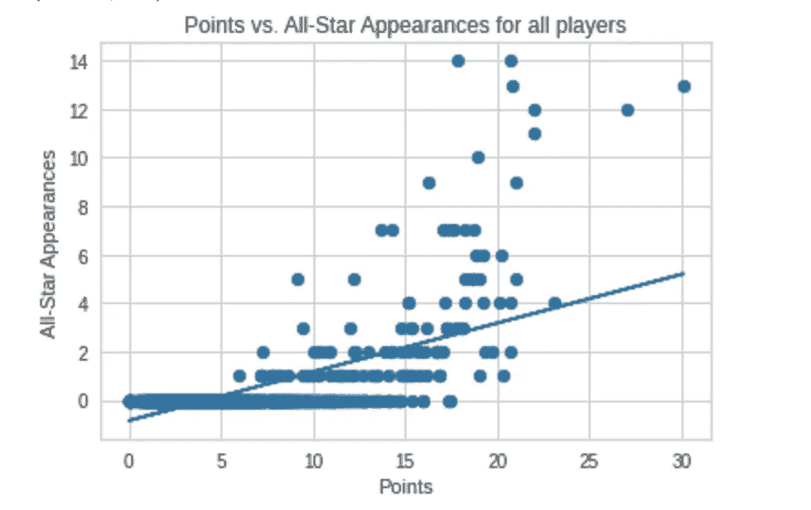
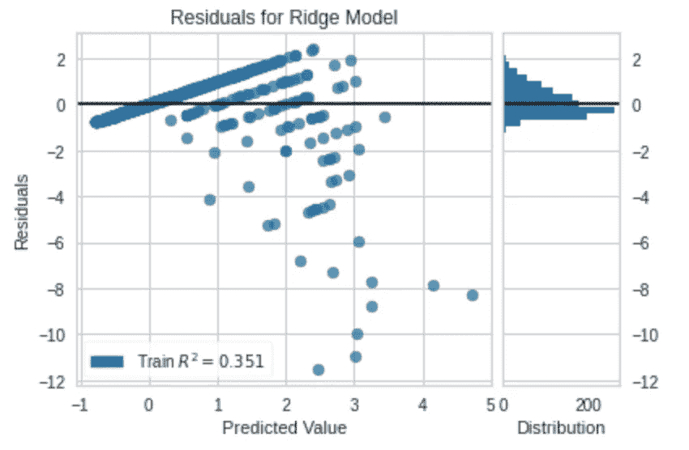
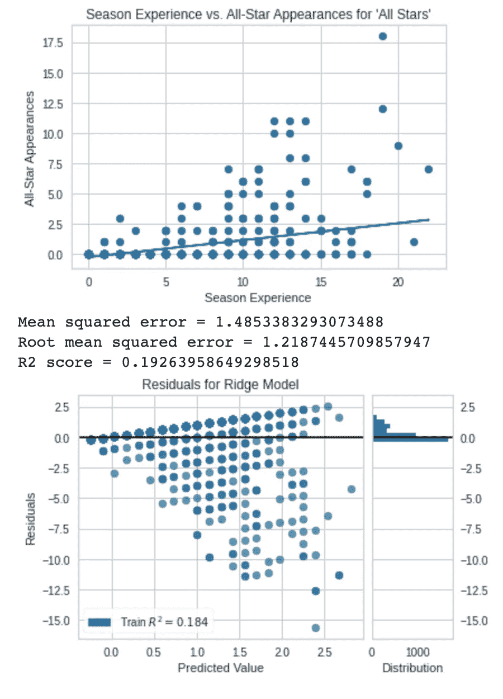

# 用机器学习预测 NBA 球员的全明星出场

> 原文：<https://medium.com/nerd-for-tech/predicting-nba-players-all-star-appearances-with-machine-learning-846146e27479?source=collection_archive---------13----------------------->

迈克尔·乔丹和科比·布莱恩特在 2003 年全明星赛上

NBA 全明星赛长期以来一直是联盟中最令人兴奋的一个方面——它汇集了篮球世界中最好的人。虽然我们喜欢观看全明星赛，并详细讨论谁入选了全明星赛，但入选全明星对球员本身来说可能意味着更多，因为这是 NBA 个人成就的最高标志之一。毕竟，他们只选择最好的来玩游戏。

随着我在过去的一年里重返篮球，我决定利用机器学习做一个数据分析项目，以更好地了解是什么让一名 NBA 球员成为全明星。

首先，我研究了 4500 名 NBA 球员(包括退役和现役球员)的综合数据集，其中包含各种统计数据，如得分、篮板、在联盟中的时间以及他们在哪里上大学。

在我的数据清理过程中，我想确保我只查看那些可以根据我想要预测的属性进行衡量的数据:所有明星出场。

所以我检查了缺失值，从数据集中删除了所有缺失全明星出场次数的球员。

数据清理

为了了解数据的分布情况，我用柱状图展示了全明星出场次数排名前 50 位的 NBA 球员。

看到这张图片后，我注意到像勒布朗·詹姆斯和凯文·杜兰特这样的关键人物从名单中消失了。这是因为这个数据集没有记录当前球员的全明星出场次数，所以当我实现上面显示的代码行时，所有活跃的球员都从数据集中删除了。

我还注意到，在这个前 50 名名单中，全明星球员的数量迅速减少，很可能很快就会达到零，然后才进一步扩大到 4500 名球员的更大数据集(约 4000 名，减去活跃球员)。所以我调查了有多少球员没有全明星出场记录，有多少球员至少有一次全明星出场记录。我发现只有 369 名球员在他们的职业生涯中至少有一次全明星亮相，相比之下，3687 名球员在他们的整个职业生涯中没有一次全明星亮相:

因此，我清楚地知道，就全明星出场次数而言，这些数据根本就不是均匀分布的；这些数值严重倾向于零。同样，这是我后来训练我的模型时一直记在心里的事情。

为了好玩，我还想象了哪些 NBA 球队拥有最多的全明星出场次数:

在数据清理过程的继续中，我删除了所有与手头问题无关的列。这帮助我缩小了一些我认为会对一个 NBA 球员入选全明星的数量产生最大影响的属性。

我为所有这些属性创建了一个关联矩阵，以可视化它们之间的关系。我发现一个球员的平均得分与他职业生涯中全明星出场次数的相关性最高。接下来是篮板，其次是赛季经验和助攻。

为了进一步可视化这些结果，我在散点图上绘制了每个属性与一名球员全明星出场次数的关系。

这些可视化，虽然与我在相关矩阵中看到的一致，却讲述了一个*稍微*不同的故事。分数似乎仍然是与全明星出场相关的最重要的属性，但看起来赛季经验比相关矩阵最初显示的更能说明全明星出场，因为它比该图中的任何其他属性具有更均匀的分布。

基于这些探索性的发现，我决定将“点”和“季节经验”用于这个项目的建模部分。

我使用的第一个模型是线性回归模型，用于绘制最佳拟合线和测试数据的残差图(测试大小:0.3)。这是我得到的:

正如所料，数据的不均匀分布(填充了高比例的零值)拉低了最佳拟合线。

为了评估该模型的性能，我计算了均方误差、均方根误差和 R 值:

用这种模式，性能是缺乏光泽，但不是糟糕透顶。大约 0.346 的 R 分数表明，线性回归模型只能解释全明星出场分布中大约 34.6%的方差(根据每个球员的得分)。

接下来，我使用线性回归来模拟赛季经验(在 NBA 打球的赛季数)与全明星出场数之间的关系。以下是我的结果显示:

这个模型的表现比全明星阵容中的一个模型差。对此的一种解释可能是，赛季经验对个人表现的相关性不如分数，因为许多球员的职业生涯很长，但在他们的球队中却不是全明星。可能导致该模型性能较差的另一个方面是季节经验数据的有限精度；赛季经验的衡量标准仅仅是他们在 NBA 打球的年数，这比球员平均得分的范围要小得多。

最后，在我的线性回归模型中，我使用了逻辑回归模型来预测全明星阵容:积分和赛季经验。

这个模型表现最好，而且到目前为止——它在“点数”和“季节体验”测试集上的准确率都在 90%左右这是有道理的，因为在探索这些数据时，我观察到点数和全明星外观之间的关系似乎是高度非线性的。

事实上，它似乎遵循一个幂律分布:排名前数百名的球员比排名后数千名的球员加起来还多。正如我在数据探索中注意到的，超过 3600 名垫底球员没有任何全明星表现。这几乎是至少有一次全明星亮相的球员人数(369 名球员)的 10 倍。

同样，球员的赛季经验也遵循类似的模式，许多球员甚至没有在 NBA 完成一个完整的赛季(在这个数据集中，这实际上被标记为零年赛季经验)。

尽管差距不是很大，但基于点数的逻辑回归模型的准确性得分仍然优于基于季节经验的模型。这可能是因为在得分数据集中幂律的存在更加夸张，超过 90%的球员在职业生涯中没有入选全明星，相比之下，在 NBA 度过“零年”的球员比例较小。

当我第一次着手这个项目的时候，我期望线性回归是最好的模型，因为我预期了得分和全明星出场之间的线性关系。然而，正如探索性数据分析和可视化所表明的那样(特别是零出场与至少一次全明星出场的球员的细分)，数据集更符合幂律分布。这是为什么逻辑回归模型最终优于线性回归模型的一个重要因素。

总的来说，我并不惊讶地发现，在所有其他属性中，NBA 球员的平均得分与全明星出场次数的相关性最强，并且在我使用的模型中效果最好。你更有可能听到你最喜欢的球员掉了多少分，而不是其他任何事情，在一天结束时，篮球比赛的中心是哪支球队可以得分最多——这使得高分球员变得越来越有价值。