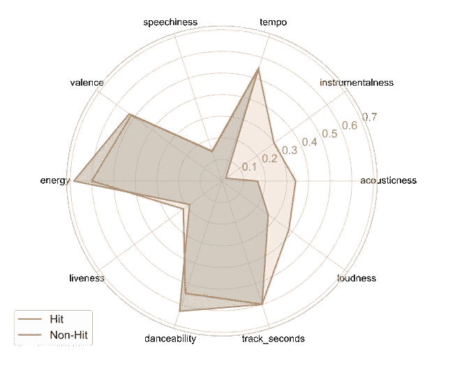
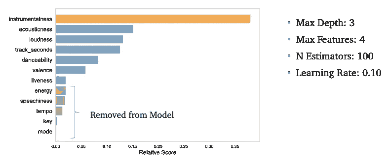
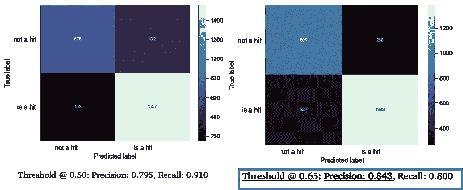
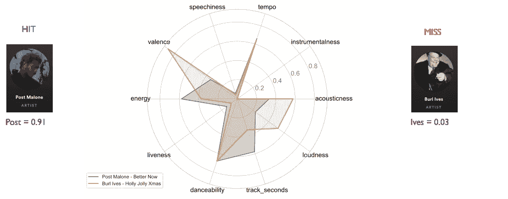
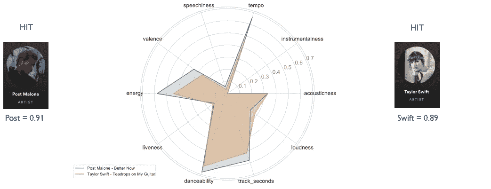

# 预测下一首热门歌曲！

> 原文：<https://medium.com/nerd-for-tech/predicting-the-next-hit-song-f7c697f48647?source=collection_archive---------10----------------------->

## 使用 Spotify 的音频功能来预测一首歌曲是否会成为公告牌百强热门歌曲

你有没有第一次听一首歌时，情不自禁地对自己说…

> 这首歌会大受欢迎的！

…或者可能已经是了，而你只是 2000 年后的人…

不管怎样，你有没有停下来想一想，为什么你认为它可能会成为(或者已经是)一首热门歌曲？这是一首朗朗上口的曲子吗？或者也许它只是击中了生活环境中所有正确的音符。

正是这些时刻和问题启动了我在 [Metis](https://www.thisismetis.com/) 为期 12 周的沉浸式数据科学训练营中的第三个项目。也就是我着手回答这个问题…

> ***我们可以通过分析以前的热门歌曲来预测下一首热门歌曲是什么吗？***

这篇博文的其余部分将描述我回答这个问题的一般方法，但这里是高层次的工作流程:

在深入研究数据和分析之前，让我们提供一些背景信息。

# **什么是热门歌曲？**

出于这种分析的目的，一首“热门”歌曲被定义为任何进入[公告牌百强周排行榜](https://www.billboard.com/charts/hot-100)的歌曲。Billboard 的排名基于美国的销售、广播播放和在线流媒体。

# **我们使用了哪些数据？**

1990 年至 2018 年间，我们大约有 9000 首公告牌热门 100 首歌曲。这些被认为是我们分类建模的目标(下面会详细介绍)。为了建立一个有效的分类模型，我们需要一个包含非热门歌曲的平衡数据集。因此，我们从[百万首歌曲数据集](http://millionsongdataset.com/)中获得了大约 5000 首非热门歌曲的样本，该数据集是……(drumroll)……百万首歌曲的集合！根据该网站的定义，“百万首歌曲数据集是一百万首当代流行音乐曲目的音频特征和元数据的免费集合。”额外感谢在我之前的令人惊叹的数据科学家们，他们已经公开了数据并开始使用( [Billboard](https://github.com/sahilmishra0012/PREDICTING-HIT-SONGS-USING-SPOTIFY-DATA/tree/master/Extract%20Features/BillBoard) ，[百万歌曲数据集](https://drive.google.com/file/d/1p13zKI5Q0QejLB-Q8jQBLRiJDRQNmGgD/view))。

对于我们数据集中的每一首歌(大约有 14000 首歌曲)，我们使用 Spotify 方便的 [API](https://developer.spotify.com/documentation/web-api/guides/using-connect-web-api/) 从 Spotify 中抓取音频特征。Spotify 创建了衡量歌曲特征的指标，如歌曲的可舞性(Danceability)或乐器性(Instrumentalness)。他们把这些放在 0 到 1 的范围内，所以你可以根据这些特征来比较歌曲。

让我们看一个例子。

***Spotify 音频功能:点击率与非点击率***

第一张图表展示了 10 个音频特征，并比较了它们在“热门歌曲”和“非热门歌曲”之间的平均得分。公告牌点击率为蓝色，未点击率为橙色。两者的区别就在于没有重叠的地方。这里的主要观点是，平均而言，“热门”有更高的可舞性和能量，而“非热门”有更高的声学、乐器性、活性和响度质量。

仔细观察几个特征就可以发现“命中”和“非命中”之间的分布可能有很大不同，即使它们的平均值可能很接近。

***特定音频特征的分布:点击与未点击***

# **建模技术**

当我转向数据建模时，我考虑了什么评估指标是最重要的。唱片公司甚至独立音乐人最终都希望最大限度地提高他们正确预测热门歌曲的能力。因此， *precision* 成为了此次分析的主要评估者。*为什么要精密？*请记住，我们上下文中的 precision 评估我们的模型正确预测一首歌曲是否会成功的程度:

*   **=真阳性/(真阳性+假阳性)**

*基本上，在我们预测的所有热门歌曲中，有多少是真正的热门歌曲？*

**回忆*测量我们正确预测了多少*实际*命中。*

*   ****回忆*** *=真阳性/(真阳性+假阴性)**

*如果一首歌成为热门，即使我们预测它不会成为热门(假阴性)，那么我们并没有失去太多，因为这首歌最终成为热门，在我们的情况下，我们可以错过一些。*

*继续建模，我运行了以下基线分类模型进行比较:*

****模型结果:****

**

*我认为将基本评估指标作为一个整体来看是很重要的。最后，我着眼于准确度、精确度和召回率之间的平衡，进行了第一轮模型选择。基于此，我决定研究 XGBoost 模型以进行进一步调优。*

# ***模型调谐***

*比较我在训练集和测试集之间的精度和召回分数，很明显我的初始模型过度拟合了，所以我决定对模型调整做两件事:*

1.  *查看特征重要性相对分数*
2.  *并使用网格搜索找到最佳参数*

**

*由于我的模型调整，我不再过度拟合，最终得到 0.795 的*精度分数。考虑到我想*增加我的精度*多一点而不放弃太多回忆，我决定*增加我的概率阈值从 0.5 到 0.65* 。下面是阈值水平为 0.5(左)和 0.65(右)时混淆矩阵结果的比较。作为复习，混淆矩阵有助于我们衡量分类模型的性能，并根据前面提到的概率阈值调整，直观显示我们的精度和召回率如何变化:**

****混乱矩阵:****

**

*这个*把我的精度提升到了 0.84* 左右，同时保持了 0.8 的合理召回率。这是我的最终模型，这些分数是基于测试数据。*

# ***分析结果***

*那么所有这些到底意味着什么呢？这种模式的实际效果如何？为了帮助回答这个问题，我想我们可以看一些例子:*

*   ****不太好的预测:*** 例如，一首歌曲实际上很受欢迎，但是我们预测为不太受欢迎(预测概率< 0.65)*
*   ****边缘案例:*** 同上但我们*几乎*根据概率得分(得分略低于 0.65)正确预测它为热门歌曲*
*   ****良好预测:*** 一首歌曲被正确预测为热门歌曲的例子(预测概率≥ 0.65)*

*对于下面的每一个例子，我都使用了 Post Malone 的“Better Now”歌曲作为一个很好的预测例子，或者说是“热门歌曲”的黄金标准(因为它的预测概率为 0.91)。然后我对比了三首歌来展示这个模型的表现。第一个例子是一个不太好的预测:*

****不太好的预测****

**

*请看上图，蓝色部分代表波斯特·马龙的歌曲《现在更好》的音频特征。同样，这是一个正确的“命中”预测，预测概率约为 0.91。*

*橙色部分表示艺术家伯尔·艾夫斯的歌曲的音频特征。如果你没有听说过他，你几乎肯定听过他的音乐。他写道“这是一个快乐的圣诞节”。想起来了吗？不出所料，正如图中所示，两首歌曲没有太多音频特征相似之处，但后者进入了公告牌百强，我的模型没有预测它会成为热门歌曲(预测的热门概率为 0.03)。这是怎么发生的？*

*回想一下，这项分析专注于 1990 年至 2018 年期间公告牌 100 大热门歌曲中的热门歌曲。我们现在意识到，一首创作于 20 世纪 90 年代之前的歌曲，比如像 Holly Jolly Christmas 这样的季节性歌曲，可以在最近几年频繁播放，从而登上公告牌排行榜。我的模型还没有考虑到这种类型的季节性，因此我们可能会错过一些热门歌曲，这些歌曲不能代表你当前流行歌曲的原型。*

*让我们来看看另一个未命中的预测，但它相当接近:*

****边案****

**

*回想一下，我将我的概率阈值从 0.5 提高到 0.65，以便在我的模型中获得更高的精度。如图中橙色部分所示，Muse 的这首歌曲“起义”的概率得分为 0.64。所以这首歌错过了成为热门歌曲的机会。一些观察解释了这一失误，你可以看到歌曲中几乎没有声音，我们知道这是该模型的一个重要特征。如果你听这首歌，也许你可以推断出它更倾向于摇滚，而不是主流观众更倾向于的流行/舞蹈。像艺术家受欢迎程度(主流观众所倾向的)这样的因素目前也没有被纳入这个模型。*

*最后，这里有一个很好的预测的例子:*

****好预测****

**

*这是一首泰勒·斯威夫特的歌曲，名为“我的吉他上的泪珠”，它的预测概率为 0.88。它非常符合后马龙歌曲的音频特征，因此我们正确地预测它将成为一首热门歌曲。*

*我想指出的是，如果你听了这两首歌，你会注意到它们在整体声音甚至情绪方面是多么的不同。这给了有抱负的艺术家信心，即使 Spotify 捕捉的音频特征在歌曲之间可能*相似*，但它仍然为*创造力和他们独特的“声音”*留下了足够的空间，而不是必须适应某个特定公式的“声音”。*

# ***未来的改进***

*正如在未命中预测的例子中所看到的，我希望通过将歌曲发布年份限制在最近几年来说明 Billboard 数据中的歌曲发布年份。也许这将有助于排除一些 90 年代以前的节日歌曲，并说明季节性。我还想包括来自抖音或 Youtube 等其他网站的数据，这将使我能够对艺术家的个人资料和受欢迎程度施加一些影响，而不仅仅是音频功能。*

*感谢你阅读这篇文章！更多细节、代码、连接和其他信息，请访问我的 [github 知识库](https://github.com/chan-chris/Metis_proj3)或 [LinkedIn](https://www.linkedin.com/in/chrischanlkn/) 页面。*