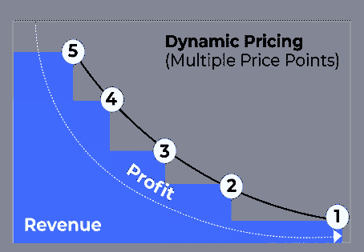
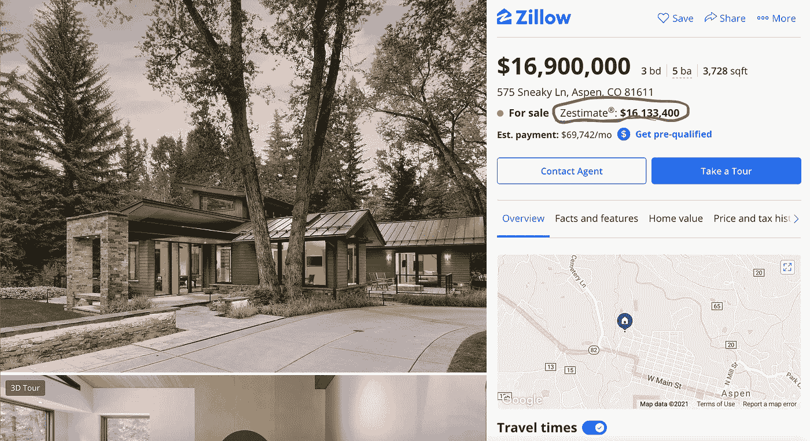
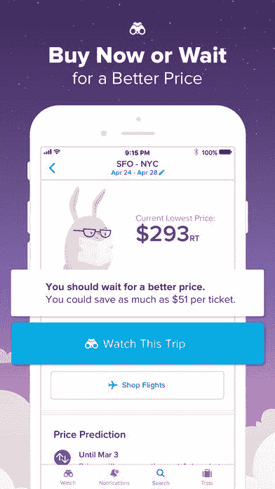
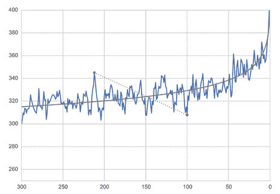

# 价格预测，以应对动态定价和价格波动

> 原文：<https://medium.com/nerd-for-tech/price-predictions-to-tackle-dynamic-pricing-and-price-volatility-cd7430223574?source=collection_archive---------8----------------------->

D 动态定价始于航空业，收入管理模型首先被引入并广泛实施，以动态定价机票，试图使运营商从其航班网络中获得最大收入。但是现在这已经被从酒店业到零售业的许多行业广泛采用。动态定价现在是市场上领先的电子商务和全渠道零售商的标准做法。有没有想过 200 美元的昂贵毛衣如何在夏天突然变成 30 美元的平价毛衣，或者 100 美元的酒店如何在漫长的周末突然定价为 250 美元，这是卖家的收入管理系统在幕后发挥作用。

> "**动态定价**简单来说就是卖方在一段时间内以不同的价格出售相同的产品。"

动态定价。来自 7learnings.com[的图片](http://7learnings.com)

电子商务的兴起是从静态定价向动态定价转变的最大驱动力。假设一个产品在网上定价为 30 美元，竞争对手只需要几分钟就可以调整他们的价格，比如调整到 25 美元，这实际上使这个 30 美元的产品对客户没有吸引力。聚集了多个卖家/供应商的在线市场使得顾客在做出购买决定之前更容易比较来自许多卖家的相同产品。

现在的销售者认为顾客很天真，没有战略眼光。卖家知道这样一个事实，客户没有他们想要购买的产品的每日价格数据，他们可以使用这些数据，学习数据中的价格模式，利用系统，并在低需求/低价格时期购买。因此，销售者能够对他们的顾客进行价格歧视，在对价格敏感的顾客需求低的时候以较低的价格出售产品，而在需求高的时候迅速提高价格，卖给对价格不敏感的顾客。

O 网上市场是卖家动态定价策略的完美衬托；市场积累了大量关于它们所聚集的产品的每日价格/费率的数据。他们拥有客户没有的数据，因此他们代表客户行事。他们预测价格，并向客户提供预测性建议，以便他们可以做出更好的决定，并知道何时购买和从哪个卖家处购买。想知道你是否遇到过提供这种预测建议的市场？好吧，除了 Zillow 的 Zestimate(一种房屋价格预测算法)和 Hopper 的“立即购买”或“等待”功能(一种航班价格预测算法)之外，别无他法。

Zillow 的价格预测算法 Zestimate

Hopper 的“立即购买”或“等待”价格预测算法

illow 是一个在线房地产市场，它为购房者/租房者与房地产列表/卖家牵线搭桥。Zillow 的商业模式就像一家媒体公司，通过在其网站上销售特色房地产列表的广告空间来产生收入。Zillow 根据一系列公开信息(包括附近可比房屋的销售情况)来确定房屋的估价，也称为“Zestimate”。Zillow 的数据科学团队构建的这一算法旨在保护买家免受房地产市场价格波动的影响，并为房屋实际价格的大致估计提供预测性建议。

H opper 是一个旅游产品市场，也是一个旅游产品(如机票、酒店和租车)的电子商务聚合商。Hopper marketplace 采用基于佣金的商业模式运营，卖方/供应商没有进入门槛，因为 Hopper 不向酒店和航班供应商收取在 Hopper 上列出其旅游产品的费用，但酒店/航班每次使用 Hopper 作为预订媒介获得客户时，Hopper 都会收取 x%的佣金。Hopper 每天分析数十亿的价格，预测航班/酒店价格将如何变化，并告诉你是“现在购买”还是“等待”价格下降。

现在，市场如何进行价格预测和逆向工程卖方的动态定价/收入管理系统？构建价格预测算法有两种方式:

> 基于机器学习的预测模型或
> 
> 基于时间序列的预测模型

# **基于机器学习的预测:🤖**

现在，如果市场想要为其客户提供预测性建议，它首先必须建立一个模型来预测未来“x”天的产品价格:

该模型的输入可以是产品级别变量、季节性变量(不同的产品具有不同的季节性趋势)、供应-需求变量(如用户进行市场搜索时类似产品的未售出库存)、卖方/供应商级别变量(如卖方迎合价格敏感型客户还是价格不敏感型客户？)、客户位置水平变量(产品根据客户的位置不同而定价不同)、对其他平行行业产品的需求、竞争对手的产品可用率以及未售出的库存等等。假设我们可以访问每天跟踪产品价格的数据集，目标变量可能是产品的价格，模型预测未来“x”天的产品价格。根据该模型的预测，我们将能够对产品的价格曲线或需求曲线进行建模，如果准确的话，应该与卖方的动态定价/收入管理系统的价格曲线或需求曲线一致。

如果卖方的收入管理系统非常敏感，那么它会根据需求曲线的微小波动做出反应并调整价格。如果需求增加，价格就会上涨，如果需求减少，价格就会下降。收入管理系统的极端敏感性导致价格波动。价格波动对市场和客户来说都是非常令人沮丧的，因为价格一直在波动，这使得预测购买产品的正确时间变得更加困难。

> "**价格波动**用来描述一种产品或商品的价格波动."

机票价格曲线和价格波动

这里的图表显示了出发前 300 天的机票价格趋势和波动性。航班最初将机票价格定得很低，以吸引对价格敏感的休闲旅客，然后他们为对价格不敏感的最后一刻的商务旅客保留库存，因此这导致价格趋势缓慢上升(只有当目的地有商务旅客时才会出现这种情况，但如果目的地更多的是休闲旅客，例如夏威夷，那么随着出发日期的临近，价格曲线会不断下降，因为很少有最后一刻的休闲旅客)。

但是即使在价格曲线内，人们也可以看到价格剧烈波动，这表明了航班动态定价系统的敏感性。现在，这种波动可能是真实的，原因可能是需求增加，或者航班接近饱和等等，但一些**波动是人为引入系统的**，以防止市场解读价格曲线。如上所述，市场可以建立与动态定价系统的价格曲线一致的价格预测模型，但是如果卖方的系统引入了人为波动，那么这将混淆市场的价格预测模型并操纵客户的决策过程。无论这些价格波动是有意引起的，还是仅仅是其他因素的结果，它们都潜在地包含了未来价格变动的信息。

# 基于时间序列的预测:⏰

在机器学习模型中，有如此多的输入；我们还可以探索一种方法，一种非常简单的方法，我们只使用特定时间范围内的价格作为输入，并使用它来进行基于时间序列的预测。这种方法假设卖方的动态定价和收入管理系统并不复杂，事实可能就是如此。在许多情况下，销售者可以简单地使用人工，该人工将基于一天/一周的需求在一天/一周的不同时间动态地和手动地调整产品的价格。

> TL；DR——虽然有些客户对价格不敏感，并出于其他原因购买产品，但价格仍然是唯一最重要的产品属性，因此仍然是最具侵略性的优化。即使是强大的亚马逊也承认，尽管供应链仍然是他们的核心竞争力，但他们的产品不会销售，除非价格与亚马逊以外的其他卖家/零售商相比具有竞争力。