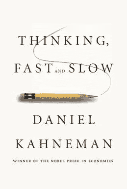

# 优先顺序:快和慢

> 原文：<https://medium.com/nerd-for-tech/prioritization-fast-and-slow-e9b6452c5129?source=collection_archive---------3----------------------->

沃利·戈贝茨的照片 —波士顿—科普利广场:龟兔赛跑

## 区分战略目标的优先顺序与待办事项优先顺序有何不同，以及您可以为每种优先顺序使用什么工具

作为产品经理和产品负责人，我们的主要活动之一是确定优先级。我们需要确保团队在正确的时间做正确的事情来取得成功。

大多数时候，我们的目标是在两个特性之间做出选择。我们使用和改编现有的[框架、公式和工具](https://productcoalition.com/effective-prioritization-with-rapid-experimentation-ddb7c6403d46)来做这件事。然而，我们经常忽略区分对我们期望的目标有不同影响的待办事项和*选择*正确的战略机会来建立和加强我们的战略优势之间的巨大差异。如果我们试图用同样的概念来优先考虑这两者，我们将会失败。

# 金属矿工优先顺序

照片由[佩德罗·亨里克·桑多斯](https://unsplash.com/@phcsantos?utm_source=unsplash&utm_medium=referral&utm_content=creditCopyText)在 [Unsplash](https://unsplash.com/s/photos/miner?utm_source=unsplash&utm_medium=referral&utm_content=creditCopyText) 上拍摄

想象一下为一家金属矿业公司工作:你有一个采矿团队、设备预算和时间限制。你的工作是挖掘最有价值的金属组合，在许多可能的开放式隧道中选择挖掘的地方(*免责声明，我对金属开采没有任何线索，我希望你也没有，所以我们可以继续这个故事*😄).你使用你常用的工具:你检查所有可能的隧道过去的表现，你看到金属价格在市场上如何变化，你看到什么隧道可能更难挖掘，等等。在此基础上，你发展假设，让你决定什么是最有价值的路径。

现在，你换了帽子，成为一名主管，选择下一个要开发的矿。你的决策要素发生了巨大的变化:你能挖掘哪些金属，让你从竞争对手中脱颖而出？你想成为某一类金属中的佼佼者，还是想多样化经营其他金属？你想在地理上扩张还是在一个地区提高你的存在？

我不知道你实际上会如何决定，但你的决定可能会超越一个简单的“投资回报”等式。它们会更有助于提升你的价值主张、战略优势，以及你希望公司关注的焦点，以实现你的愿景。

# 快速和慢速

在他的名著 [*、快与慢*](https://amzn.to/3anfedv) 中，丹尼尔·卡内曼论述了两种思维模式:

*   “系统 1”，快速，本能，冲动
*   “系统 2”，它是缓慢的，更深思熟虑的，更符合逻辑的

虽然我希望你总是优先使用系统 2，但我们可以做一个牵强的类比。

我们的“ ***优先级排序系统 1*** ”针对待办事项，使用基于发现结果的框架和公式来了解哪些是最有希望的解决方案，并对我们选择的指标或关键结果具有最大的影响。作为产品经理，我们将随着时间的推移系统化和优化我们的框架，以帮助我们提高我们的选择和成功。

另一方面，战略优先排序需要一个" ***优先排序系统 2*** "，在该系统中，我们将比较潜在的方向、问题和机会，并选择那些将使您处于更有利地位的方向，以解决您选定的客户需求，建立更可持续的业务并实现产品愿景。虽然它不一定更慢，但是:

*   *整体性*:你实际上是在进行诊断，寻找更多选项，而不是比较一些选项。
*   *更难系统化*:我们通常比较非常不同的可能性，属性和结果更难比较。
*   *多时间跨度*:即使你在为未来 12 个月左右的时间制定战略，你也会包括解决核心业务的紧迫问题，同时，对未来收入来源的押注可能会在 3 年内获得回报。

# “如何”

如前所述，对于“类型 1”优先化，我们可以使用[几种技术](https://roadmunk.com/guides/product-prioritization-techniques-product-managers/)，例如:

*   价值与努力，莫斯科，卡诺，赖斯

“2 型”并不是很明确。在之前，我已经写了一些工具，但是我们可以突出几个来总结这篇文章:

*   [*商业模式画布*](https://www.strategyzer.com/canvas/business-model-canvas) 对机会及其影响有一个整体的看法。
*   [*价值主张竞争因素与产品级别*](https://www.blueoceanstrategy.com/tools/strategy-canvas/) 打造差异化的制胜定位。
*   [*成长的地平线*](https://www.mckinsey.com/business-functions/strategy-and-corporate-finance/our-insights/enduring-ideas-the-three-horizons-of-growth) *或者谷歌的 70/20/10 法则*来确保你不只是在短期内建立。

没有单一的工具，它高度依赖于您的环境，但是我希望我们同意它与待办事项优先排序非常不同。

***本周*** [***我的书产品方向发布***](https://amzn.to/2OHsa6i) ***。在这篇文章中，我更详细地讨论了如何确定战略或“系统 2”的优先顺序，以及如何选择和执行创造和加强你的战略优势的机会。***

[***在推出推广的时候抢个副本***](https://amzn.to/2OHsa6i) ***！*** (所有亚马逊网站都有)。

*本文原载于 LeanExperimentation.com**上的* [*。* *如果你喜欢它，并想收到更多的工具&提示来改进你的产品，你可以*](https://leanexperimentation.com/prioritization-fast-and-slow/) [*订阅这里*](https://www.getdrip.com/forms/245370375/submissions/new)**并加入+1700 读者！**