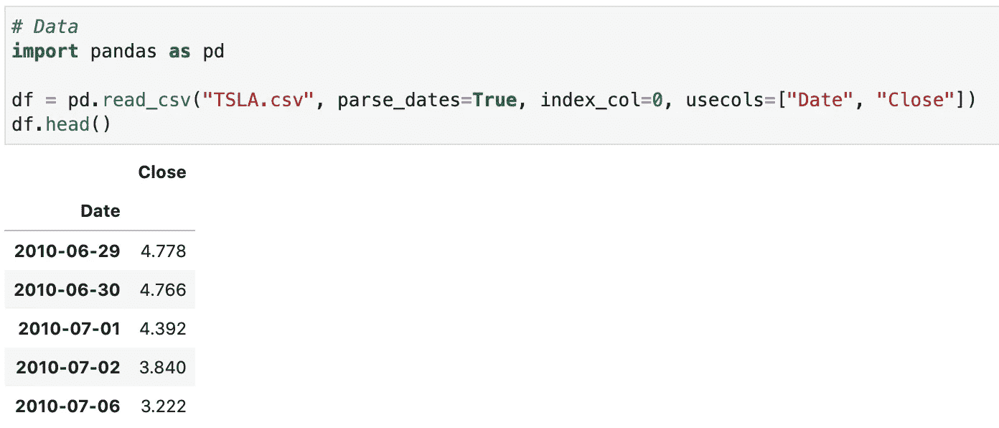
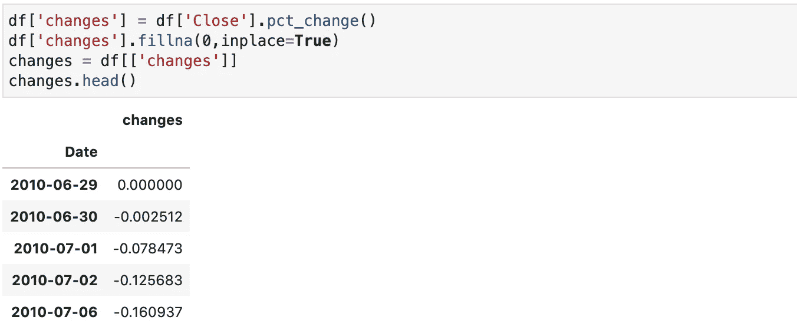
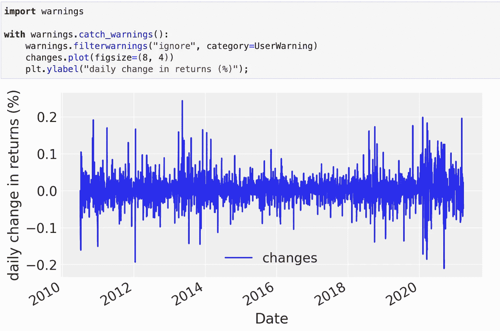
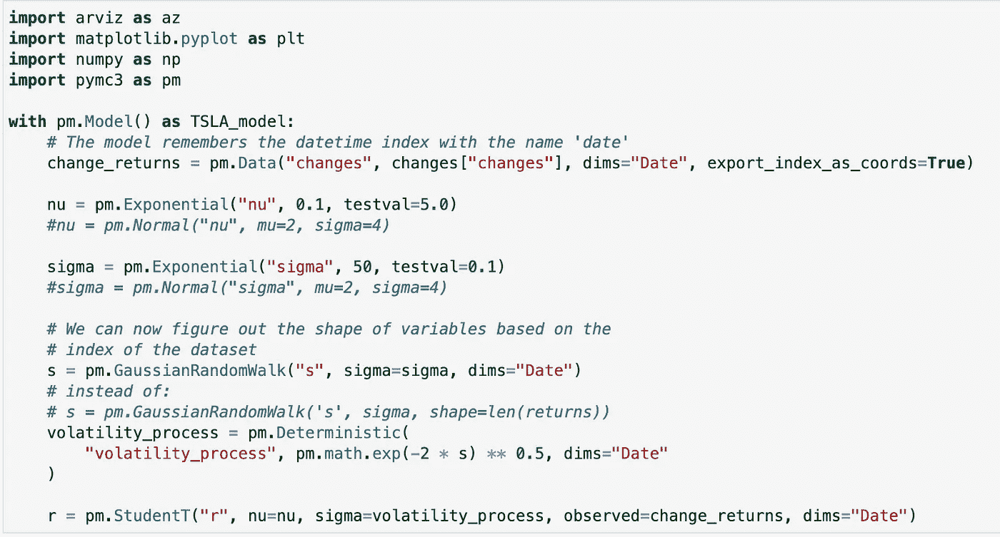
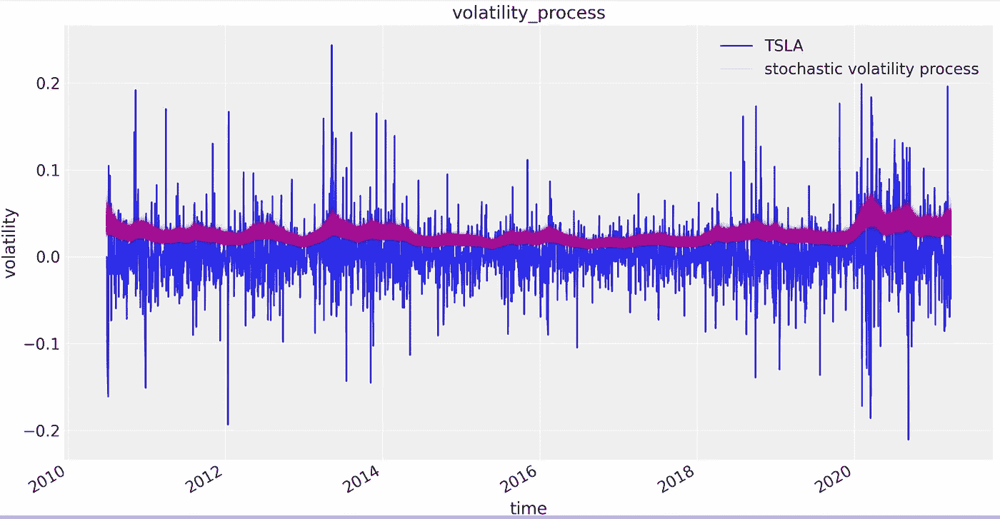

# 使用 PyMC3 的概率规划:特斯拉股票随机波动估计

> 原文：<https://medium.com/nerd-for-tech/probabilistic-programming-using-pymc3-tesla-stock-stochastic-volatility-estimation-573f13a42fae?source=collection_archive---------2----------------------->

概率编程允许定义概率模型和开发贝叶斯推理。它可以用来在面对不确定性时做出决策。概率推理已经广泛应用于大多数人工智能系统中，以完成复杂的任务，如预测股票价格、推荐系统、诊断系统、检测网络入侵和图像检测。

PyMC3 是用 Python 编写的一个新的开源概率编程框架。PyMC3 提供了马尔可夫链蒙特卡罗(MCMC)抽样的最新进展，允许对日益复杂的模型进行推断。PyMC3 具有下一代马尔可夫链蒙特卡罗(MCMC)采样算法，例如无掉头采样器[1]，这是哈密顿蒙特卡罗[2]的自调整变体。这类采样器在高维和复杂的后验分布上工作得很好，并且允许许多复杂的模型在没有关于拟合算法的专业知识的情况下被拟合。HMC 和坚果利用梯度信息的可能性，以实现更快的收敛比传统的采样方法，特别是对于较大的模型。NUTS 也有几个自调优策略，用于自适应地设置哈密尔顿蒙特卡罗的可调参数，这意味着您通常不需要关于算法如何工作的专业知识。在这里，我将使用 PyMC3 和一般贝叶斯统计推断来预测特斯拉股票随机波动率。

# 第一步:定义随机波动模型

在股票市场上，价格每天都有变化。波动性是对给定证券或市场指数的收益分散程度的统计度量。在大多数情况下，波动性越高，证券的风险就越大。波动性通常被衡量为同一证券或市场指数收益之间的标准差或方差。在这里，我试图为特斯拉股票价格生成一个随机波动模型。
特斯拉股票是一只波动性很大的股票，市场收益的分布一般是高度非高斯的。因此，特斯拉挥发度的取样会更加困难。这里使用 PyMC3 非常有用，因为它采用了更先进的 MCMC 技术。
从第一天开始对特斯拉的波动性进行建模就有 1000 多个参数，因此使用 Metropolis-Hastings 等常见采样算法会生成高度自相关的样本。因此，我们使用坚果，这大大提高了效率。
第一步是定义我们的随机波动模型。我使用了[1]提出的模型，如下所示:

这里， *r* 是日收益率序列，用未知自由度参数的 Student-t 分布建模，标度参数由 *s* 确定。个体 *si* 是潜在对数波动过程中的个体日对数波动。
现在我们有了模型，我们读取历史 Tesla 股票数据并测量其波动性:

现在，我们有从 2010 年到 2021 年的每日收益变化。下一步是使用 PyMC3 的模型规格。

# 第二步:PyMC3 模型规格

如上所述，该模型采用了几种新的分布:𝜈和𝜎先验的指数分布，收益分布的 Student-T (StudentT)分布，以及潜在波动率先验的 GaussianRandomWalk 分布。

在上面提出的模型中，指数先验用于自由度𝜈和波动过程的标度参数𝜎.我们还可以使用 testval 参数为任何分布提供初始值(称为“测试值”)。这将覆盖分布的默认测试值(通常是分布的平均值、中值或众数)，如果某些值是非法的，并且我们希望确保选择一个合法的值，这通常非常有用。默认情况下，分布的测试值也用作采样和优化的起点，尽管这很容易被覆盖。

GaussianRandomWalk 给出了潜在波动率的向量 *s* 的先验分布。顾名思义，GaussianRandomWalk 是一个向量值分布，其中向量的值形成长度为 *n* 的随机正态分布，如 shape 参数所指定的。随机游走新息的尺度，𝜎，是用正态分布新息的标准差来规定的，可以是标量，也可以是向量。

# 第三步:拟合模型:后验估计

下一步是从给定轨迹的模型中生成后验预测样本。

以下是分布和抽样𝜈和𝜎后验概率:

最后，我们通过在同一张图上绘制多个样本波动率路径来绘制波动率路径的分布。

正如你所看到的，该模型正确地推断了 2020 年 COVID 危机和 2021 年泡沫期间波动性的增加。此外，请注意，这个模型非常复杂，因为它的高维度和随机游走分布中的依赖结构。然而，PyMC3 中实现的 NUTS 可以轻松地正确推断后验分布。

# 参考

[1]霍夫曼医学博士和盖尔曼(2014 年)。不掉头采样器:哈密尔顿蒙特卡罗中自适应设置路径长度。机器学习研究杂志，30。
【2】Duane，s .，Kennedy，A. D .，Pendleton，B. J .，Roweth，D. (1987)“混合蒙特卡罗”，《物理快报》，第 195 卷，第 216–222 页。