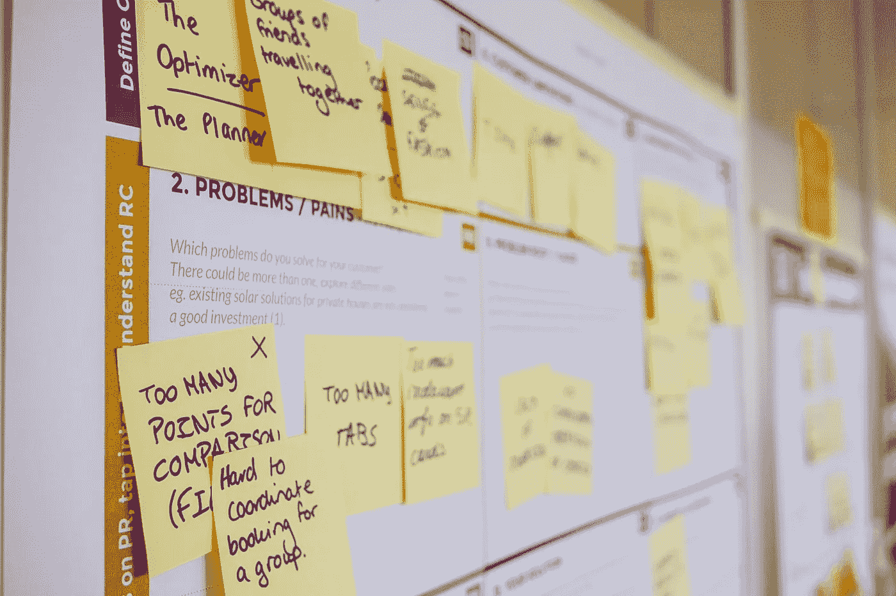

# 产品管理——有效开发新产品的步骤

> 原文：<https://medium.com/nerd-for-tech/product-management-steps-for-effective-building-a-new-product-621853654118?source=collection_archive---------8----------------------->

每一个伟大的产品都曾经只是一个解决某些人问题的小创意。无论你是在制造一个全新的产品，还是在现有的产品上添加一个新的特性，你都会遇到需求非常简单的情况。听起来像是“如何建立一个做这个做那个的 app”或者“如何通过做 X 或者做 Y 来增加收益”。就一句话，一个产品经理的责任，必须像变魔术一样做出一个产品。

所以，今天，我将写一些我的经历，分享一些我在这种情况下通常遵循的步骤。现在让我们开始吧。

## 步骤 1:缩小产品/问题的范围

通常，一个产品的计划或早期需求通常是非常笼统和模糊的。因此，在第一步，我们需要清楚地定义这些需求的每个方面的细节。我经常使用的一些问题，例如:

*   我们的产品是什么？
*   有什么专业术语让我们感到困惑吗？
*   我们需要使用哪些平台？
*   仅在特定地区还是全球？
*   它是一个独立的产品，还是将集成到现有的解决方案/市场中

所以，通过提出澄清性的问题，产品的形态会从之前的层层迷雾中逐渐清晰起来。

## 步骤 2:定义所有用户组

在我看来，我认为这个术语与用户群和用户角色定义有一点不同。此时，您将定义可以在您的产品中扮演任何角色的所有类型的用户。让我给你举个例子:
-如果你的产品是关于购买或销售的东西，那里会有哪些类型的用户？嗯，在我看来，现在能想到的角色有:**买家**，**卖家**，还有谁？它可能会有专家**来验证产品的质量。
-即使是每一种买方和卖方类型，我们也可以分离出两个更详细的层次:个人或组织。**

## **步骤 3:为每次迭代选择目标组**

在分析了第二步的数据后，我们通常会有许多不同类型的用户。但是，根据每个阶段的不同，需要重点关注相应的用户类型。回到上面的例子，假设我需要关注的阶段是启动阶段，那么我将关注的两类对象是买方和卖方，更具体地说，是个人，而不是组织。

这是两个最大的用户群，他们将使用该应用程序，并在市场中获得最大价值。

## 步骤 4:定义用户痛点

得益于第三步，我们可以重点分析用户的类型。下一步，我们必须找出这些用户的痛点。顺便说一句，我们仍然需要为每一个用户分离痛点，而不是合并它们(因为每种类型的用户都有不同的痛点)。

在这个阶段，请随意列出您认为用户会遇到的所有棘手问题。

## 步骤 5:区分用户痛点的优先级

现在，在这一步中，我们将根据三个标准对用户痛点进行优先级排序。它们是它们将如何影响最终用户，对商业价值和技术可行性的影响。这一步听起来简单，但实际上是最难的一步。我肯定会写一篇关于这个的文章。

## 步骤 6:定义解决方案

是的，在列出你认为用户最想解决的所有棘手问题后，你会找到你能找到的所有解决方案。同样，当想法或解决方案进来时，让我们把它们都拿走，不要错过任何想法——即使是最小的和听起来最愚蠢的想法。但是如果你没有足够好的想法或者更糟的是根本没有想法，你怎么能有这些解决方案呢？好吧，别担心，我会帮助你，但在另一篇文章。现在在这个例子中，假设你已经有了几个很好的解决方案。

## 步骤 7:确定解决方案的优先级

就像区分痛点的优先级一样，您也需要为解决方案做同样的事情。根据每个解决方案对最终用户的影响、对业务价值的影响和技术可行性，您将获得所需的功能。

## 步骤 8:列出度量标准

无论你做什么，采取什么步骤，最终，你都要为产品的成功负责。但是，怎么知道是成功还是失败呢？这就是为什么，在这最后一步，你需要拿出度量标准，度量标准来衡量。它可以是每天、每月、每周的新用户注册数、用户保留率或活跃用户率等。

# 结论

我知道会有很多其他的“框架”有更详细的步骤，这只是理论。对于每一种不同的产品类型，影响因素会有所不同，由此，我们会有不同的方法来适当地处理问题。

但是我相信，我在这里列出的步骤不会离实际情况太远。事实上，当面对构建全新的需求时，我经常使用这些步骤。

希望对你有帮助。如果你觉得有用，请给我一些意见。别忘了把这篇文章分享给你的朋友。工作愉快！