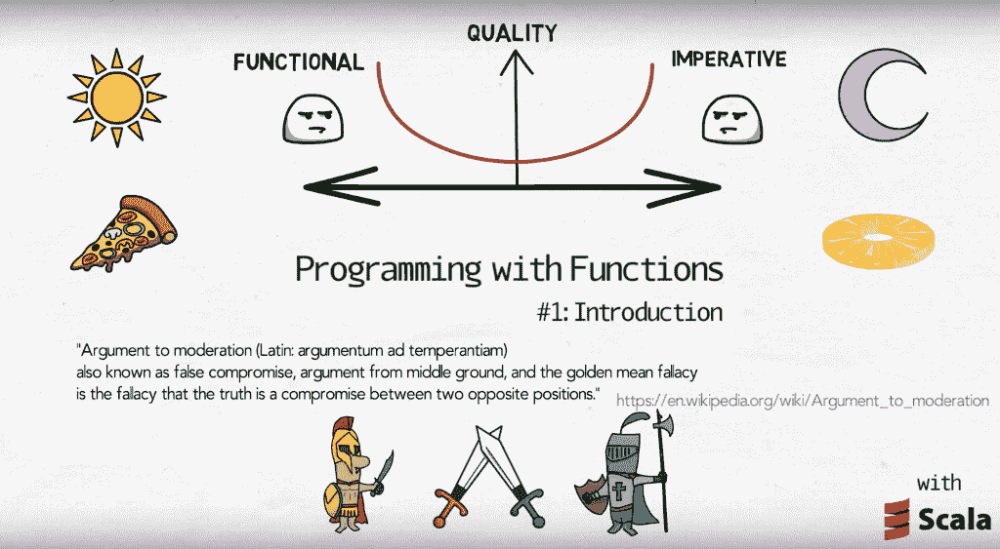
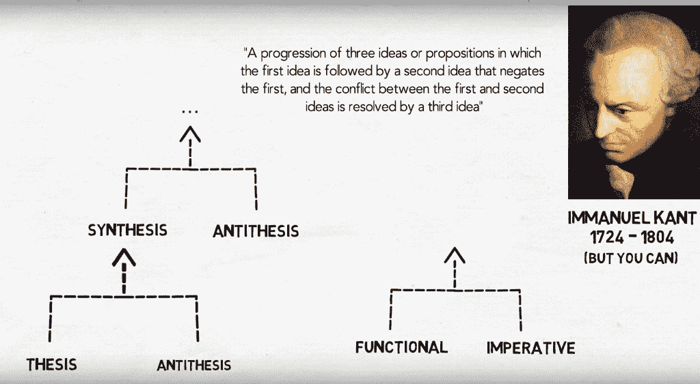
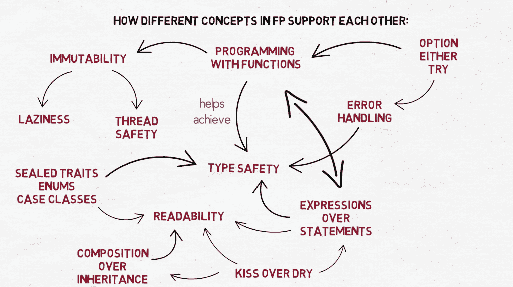
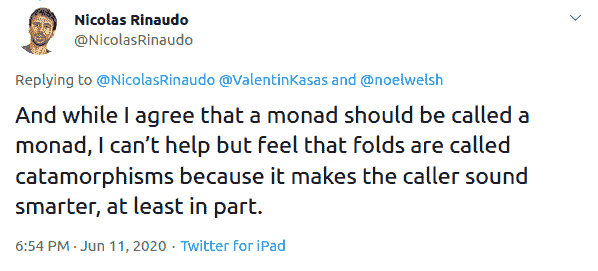
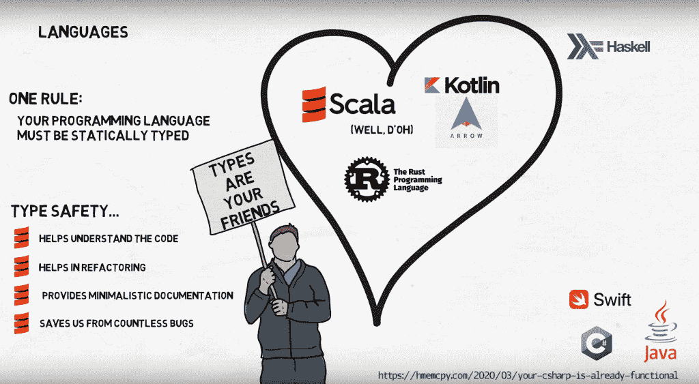

# 函数编程#1:简介

> 原文：<https://medium.com/nerd-for-tech/programming-with-functions-1-introduction-912dedbe49af?source=collection_archive---------1----------------------->

功能编程。根据一些人的说法，编写代码的唯一可能的方式是由特殊字符和魔法组成的混乱，这些字符和魔法是时髦人士根据其他人的说法用来炫耀的。在这个系列中，我将试图让你相信两者都不是。或者两者都有。我还没决定。

*这是 Scala 中 FP 基础系列的第一篇。这也是我关于编程简单性的“宣言”。我觉得在我们学习函数式编程的过程中，我们有时会跳过基础，直接进入高级内容。结果，自然地，我们代码的基础经常是不稳固的。如果你现在开始学习 FP，我会建议你不要这样做。取而代之的是，暂时关注一下这个系列的内容。下一个视频将会在一周左右发布，下一个视频将会一个月发布一次或者更频繁一点。*

问题在于人类的思维喜欢往极端想。黑色和白色，中间没有灰色。不分昼夜。披萨和菠萝。我们喜欢概念之间清晰的边界，所以我们可以把自己放在这个或那个阵营，参加 Twitter 的圣战。我们可以合并两种立场，吸取两者的优点，这种想法在我们看来要么是一种不可能的嬉皮士幻想，我们应该彼此相爱，一切都会很棒，就像[的中庸谬误](https://en.wikipedia.org/wiki/Argument_to_moderation)一样，要么是一种糟糕的妥协，结果是每个人都同样不满意的。因此，如果一方面，我们有函数式编程，通常与安全和可靠相关，但很难编写和理解代码，另一方面，我们有命令式代码，看起来简单，更容易编写，但也容易出错，当涉及到重构时，会非常痛苦。所以，把这两个作为极端，它们之间的中间部分通常看起来像是代码既不简单也不安全的地方。而我们又不想在那里，就选择其中一方，去推特上打。

早在 18 世纪，伊曼纽尔·康德就写道，思想世界的进步是如何以三位一体的形式出现的:一个命题、一个对仗和一个综合:*“三个思想或命题的发展，其中第一个思想后面跟着否定第一个思想的第二个思想，第一个和第二个思想之间的冲突通过第三个思想解决”* [ [维基](https://en.wikipedia.org/wiki/Thesis,_antithesis,_synthesis)。第三个想法，综合，然后成为一个新的论点，循环重复自己。在我们的案例中，我们可以说命令式编程和函数式编程是彼此的论题和对立面，不管哪一个是哪一个。函数式编程是一种更具学术性的思想，它解决了在每一个更大的项目中存在的安全性、并发性和大量错误的命令式编程问题，而命令式编程则是一种更具商业意义的思想，它解决了函数式编程问题，因为它完全是神秘的、过于抽象的，不适合解决现实生活中的问题。

伊曼纽尔·康德从未听说过编程。我提到他只是为了炫耀。抱歉。

然而，我认为有可能走一条既简单又安全的中间道路。我们可以用一种功能性的方式编写，我们的代码仍然非常简洁易读，而且我们从来不用“monad”这个词来解释它。但是为了做到这一点，我们必须花一点时间来讨论函数式编程的真正含义。是的，它是一个与 lambda 演算密切相关的编程范例，因此它充满了数学术语和抽象概念，让我们能够孤立地处理数据的某些特征，声明关于它们的规则，并使用这些规则在我们不做的情况下获得优势。但这并不意味着你必须拥有计算机科学硕士学位才能成为一名功能程序员(相信我，我拥有计算机科学硕士学位)。

## 1.1.但首先作者的几句话

**这是怎么回事？**

这将是一系列 YouTube 视频，讲述函数式编程如何帮助您编写简洁、易读、可伸缩的代码，这意味着如果您的项目显著增长，经过一些重构后，您仍然可以使用相同的代码。这些视频将由我的 WordPress 上的博客帖子备份，并复制到 Medium。(我希望这样我能找到更多的读者)。我承认保持这种格式不崩溃有点棘手:不是每条信息都能在博客和视频中呈现。我可能会在博客文章发布很久之后对它们做一些小的修改，以使它们与视频相匹配(视频更难编辑，所以我不会在这方面做太多的修改)。对于视频，我使用名为 [VideoScribe](https://www.videoscribe.co/en/) 的应用程序来创建白板动画，这使得使用其中的图像来说明博客帖子成为可能。肯定会有很多链接把你从博客带到视频，然后再回来。尽管如此，我预计会有一些差异，所以请不要把博客当作视频中所说的转录。

我会把这个系列的难度水平描述为中下水平。你应该已经知道一些基础知识，已经通过了一些教程，并且已经写了至少一个较小的项目。如果你已经这样做了，现在你想知道接下来会发生什么，这可能是你阅读或聆听这篇文章的好时机。就我个人而言，我发现这是许多人失去方向并开始四处游荡的学习时刻，学习一些这个和那个，直到他们找到自己感兴趣的利基、语言或技术。我想帮你一点忙。

**吻完擦干**

这个系列的原因是要让你相信，简单而不是复杂是优秀编程的标志，函数式编程是实现这一点的一个很好的工具，尽管你可能从一些 FP 会议的演讲中得到这样的印象。简单是一个模糊的术语。它与复杂性相对立，但不是粗糙——在编程中，粗糙意味着编写的东西“只是工作”,但不可伸缩，或者在最轻微的修改下就会崩溃。简单性伴随着 DRY 原则(“[不要重复自己](https://en.wikipedia.org/wiki/Don%27t_repeat_yourself)”)，但只到了这样一个程度，即开发人员开始在只以一种特定方式使用代码的地方使代码变得通用和抽象。通过避免不必要的复杂性和使瓶颈更加明显，它有助于提高性能，但使您不必花费大量时间来优化罕见的极限情况和用更低级的技术重写代码。但最重要的是，它使代码可读。就算没有其他优势，这一条应该也够了。【[链接](https://en.wikipedia.org/wiki/Worse_is_better)

在这些批评中，一个意大利圣人说他是一个好人。
伏尔泰

编程是一项团队工作。程序由个人编写，封闭在地下室和车库里与世隔绝的日子已经过去很久了，并且(希望)被遗忘了。你需要以一种你的队友——以及几个月后的你——能够理解的方式编写代码。

然而，我们通常将简单性与初级水平联系在一起，并倾向于认为随着程序员的进步，我们应该编写更复杂的代码。反之亦然:当我们看到两个程序员，一个做一些简单的事情，另一个写复杂的代码，我们经常会得出结论，第二个是他们中更资深的。这被称为[复杂性偏见](https://fs.blog/2018/01/complexity-bias/)，它存在于生活的方方面面，从艺术到机械。多年来，我一直在练习合气道，这是一种充满流畅动作、投掷和关节锁的日本武术。合气道技术是复杂而美丽的。他们中的大多数也不太擅长自卫。你知道什么更有效吗？跆拳道。

这并不是说复杂的编程技术是无用的，你应该始终坚持基本的。当你足够自信时，你可以——也应该——学习更复杂的东西。诀窍在于对基础知识了如指掌，以至于你能够认识到什么时候复杂的技术对你有利，什么时候同样的技术可以用更简单的方式实现，或者相对于替代方案的优势不值得引入额外的复杂性[ [收益递减法则](https://en.wikipedia.org/wiki/Diminishing_returns) ]。所以这一系列的文章是关于:函数式编程的基础。它是关于或多或少与 FP 相关的不同概念如何一起工作，并能给你未来的学习打下坚实的基础。学会这个，然后去，用单子什么的征服 FP 世界。

**语言**

我的工作主要是在 **Scala** 中，这是我将用于代码示例的语言。但是这个系列并不是要学习 Scala。您可以在许多其他语言中使用函数式编程的某些元素。**当然是 Haskell** ，不过我对 Haskell 没什么经验。我使用和喜欢的其他语言是 **Rust** 和 **Kotlin** (Kotlin 与[Arrow library](https://arrow-kt.io/)混合使用时在这方面表现非常好)。此外，我还听说了一些关于 Swift 的好消息，Java 的新版本倾向于加入越来越多的 FP 元素，这显然是受 Scala 和 Kotlin 的启发。老实说，围绕许多旧编程语言的编程社区正在朝着这个方向发展:[例如，查看 Igal Tabachnik 的这篇关于用 C#编写 FP 的博客文章](https://hmemcpy.com/2020/03/your-csharp-is-already-functional/#more)。

在整个系列中，我将尝试用不需要你了解 Scala 的方式来解释我所说的内容。事实上，如果你了解 Scala，你可能会觉得这个系列的某些部分很无聊。请随意向前跳。请记住，这是我觉得有用的东西——我在这里谈论的一切都来自我作为 Scala 开发人员的经历，我尽量做到简洁(除了笑话)。但是如果你从未在 Scala 中写过任何东西，你可能会发现一些术语令人困惑。如果有，请告诉我，我会努力改进剧本。

在选择编程语言时，我只坚持一件事——它必须是静态类型的。即使这样的语言在开始时有点难学，当我们开始处理更大的项目时，好的静态类型系统所提供的类型安全性也不会被高估。他们帮助我们理解代码，帮助我们重构代码，为我们提供最简单的文档，并从无数的错误中拯救我们。在我看来，动态类型编程语言只适合编写中小型脚本，而不应该在大型项目中使用，这是我将死之地。(我们将在下一章讨论类型安全)。

你可能也会对这个感兴趣:【https://www.fpcomplete.com/blog/2018/10/is-rust-functional/】T2

暂时就这样了。由于这个视频只是这个系列的一个介绍，我会尽快发布下一个视频，在那里我们将开始深入到技术细节。也就是说，我们将讨论作为数据的函数，以及全部和部分函数。

顺便说一下，英语不是我的母语，所以我想借此机会感谢 Jon Pretty 检查我的剧本，也感谢 Jon Pretty 和 Daniel Westheide 的许多有见地的评论。我要感谢我工作的 Wire 团队。这个系列开始于我为我的团队做的一次演讲，内容是关于 Scala 中的某些概念如何被移植到 Kotlin 中。我越想它，它就越长。现在，过了半年多，它是这样的:一系列十个视频，每个大约十分钟长，或多或少。我希望你会喜欢它。

接下来:[用函数#2 编程——函数作为数据](https://makingthematrix.medium.com/programming-with-functions-2-functions-as-data-efe2dd227a9f?source=friends_link&sk=d0b2d1d4e6954a9c7ae105c228d0ef84)

[这一集的“思维导图”](https://drive.google.com/file/d/1RDc2HE7xHpS5etOFVpLkIWdUxoLbHfsH/view?usp=sharing) (PNG，2MB)

*如果你想帮我翻译视频的字幕，* [*在这里你可以下载他们的英文版*](https://drive.google.com/file/d/1a4TzUrlGz9a0ilxoEsLoLSAk95brXS-Q/view?usp=sharing) *，然后请在 Twitter 上找我:* [*，@makingthematrix*](https://twitter.com/makingthematrix) *。*