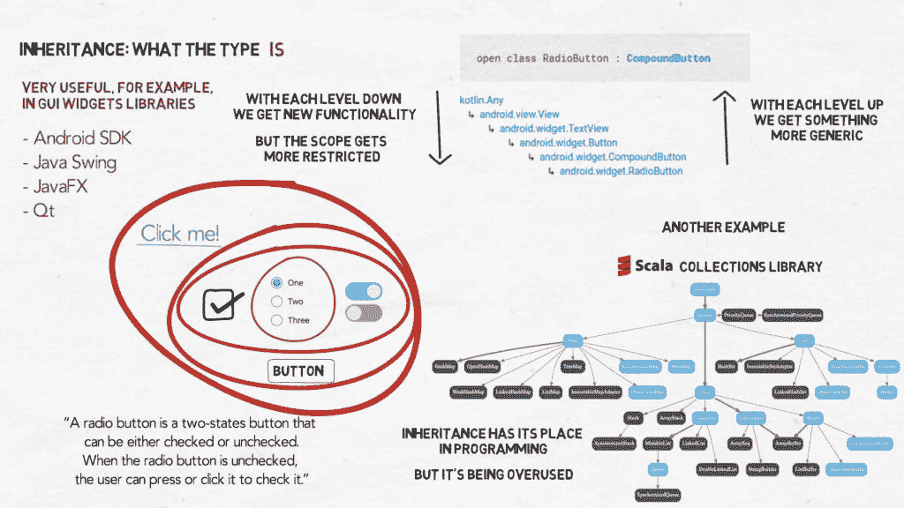
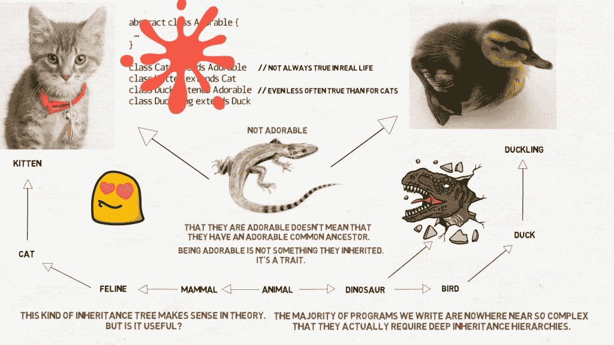
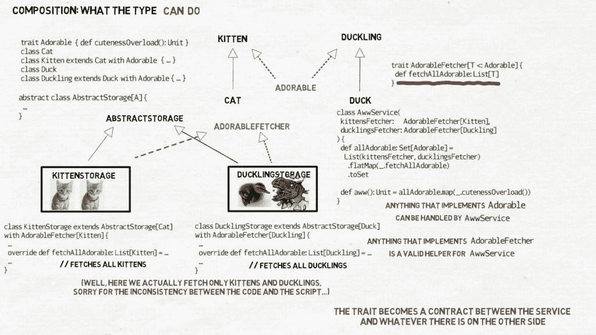
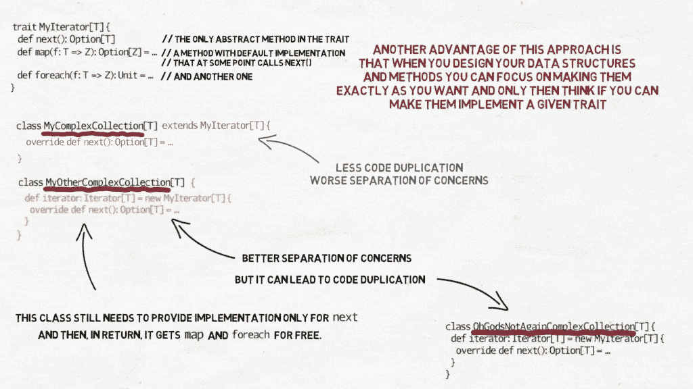
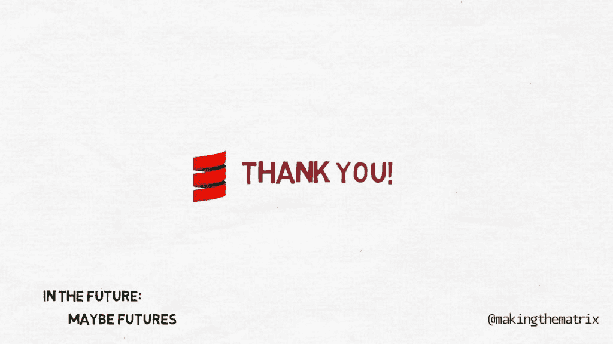

# 用函数编程# 10——继承之上的组合

> 原文：<https://medium.com/nerd-for-tech/programming-with-functions-10-composition-over-inheritance-33bfbcf295c3?source=collection_archive---------7----------------------->

[同一篇文章发表在我的博客上](https://makingthematrix.wordpress.com/2022/02/08/programming-with-functions-10-composition-over-inheritance/)

这个话题有点接近我们所认为的函数式编程的范围。您可能在以前编写 OO 代码时使用过这两种方法。你可能甚至没有考虑就编写了函数代码并使用了组合。我之所以把这个话题放在这里，作为我关于函数式编程的视频系列的最后一个条目，是因为我把它近年来受欢迎程度的上升与 OOP 中的幻灭和 FP 概念受欢迎程度的普遍上升联系在一起。在这一点上我可能是错的。但是……无论如何。

继承和组合都解决了如何用新功能扩展现有代码的问题。我们已经有了一些代码，可能来自另一个模块，我们希望编写一些代码来重用这些代码的某些部分，这样我们就不必重复自己或反过来:我们希望编写一些可以被这些代码使用的代码，并且只是在幕后工作与最初的实现有一点不同。或者也许根本就没有原始的实现，只是一些抽象，告诉我们应该如何编写实现，以便它可以被代码的其余部分使用。

实际上，我在这里讨论的是继承方面的抽象类，而不是组合方面的接口或特征。正如你已经注意到的，在许多编程语言中，你可以两者兼得:Java 和 Kotlin 有类和接口，Scala 有类和特征。很久以前，我们可以说特征是一个接口，它可以为它的方法实现一些默认的功能，而接口不能，但是从那时起，Java 和 Kotlin 中的接口也获得了拥有默认方法的可能性。在 C++中，它们甚至是同一个:一个接口只是一个没有字段的抽象类，它的所有方法都是抽象的。另一方面，Rust 完全在组合方面:我们有数据结构和可以为这些结构实现的特征。根本没有类，抽象与否。所以，再一次，就像在关于表达式和语句的那一章一样，差异归结于我们如何决定编写我们的代码，以及那个决定——希望在开发的早期阶段做出——如何影响代码的外观。

而且，说实话，我们使用哪一个并不重要，重要的是我们如何使用它们。即使在考虑到组合的情况下从头开始编写的代码中，我们有时也可以找到一个抽象类，而基于继承的代码中的接口或特征非常常见。至少在我看来，区别主要在于我们是更喜欢类的深层层次结构，每一层都有一个建立在其他类型之上的新类型，还是更喜欢松散链接的、非常独立的类型，这些类型实现了一堆接口，以便它们可以相互通信。

好吧，但是我在说什么？例子在哪里？嗯…用猫来解释这个话题并不容易，但我会试试。

## 继承:类型是什么

在编程中仍然存在继承的深层层次结构。一个是 GUI 工具包，比如 Android SDK，Java 中的 Swing 或 JavaFX，或者 C++中的 Qt。让我们来看看 Android SDK 的一个简单的 RadioButton。



引用文档:*“单选按钮是两种状态的按钮，可以选中也可以不选中。当单选按钮未选中时，用户可以按下或单击它来选中“* [ [链接](https://developer.android.com/reference/kotlin/android/widget/RadioButton)”。`RadioButton`是`CompoundButton`的一个特例，它也是`Checkbox`、`Toggle`和`Switch`的一个公共父类——所有的按钮都以某种方式标记它们被点击过。反过来，`CompoundButton`从一个不知道如何做的常规`Button`继承而来，事实上与它所继承的`TextView`非常相似。一个`TextView`可以显示任何类型的文本(也可以被点击——因此在 Android 中我很少使用`Button`，`TextView`通常就足够了)。反过来，它从`View`继承而来，几乎可以是 Android 可以显示的任何东西。

简而言之，每一个后代都是其直系祖先的更专门化的版本。随着每一层的降低，我们得到了一些新的功能，但是类的范围也受到了更多的限制。随着每一级的提升，我们得到了更一般的东西；可以有更多用途的东西。(从技术上讲，可以从另一个方向编写层次结构:顶部更专业，底部更通用，但我不推荐这样的设计)。

藏书图书馆。这里更复杂——你可以看到特征和类别在一起——而且通常更复杂。如果你对 Scala 感兴趣，我强烈推荐你阅读 Scala 2.13 集合的文档。当然，你不必阅读并记住所有的东西，但是它会给你一个如何设计类层次结构的好主意，并且你可能会学到你不知道存在的方法。

最好的方法。它在最终用户应用程序中使用得太多、太频繁，使用它的主要原因是我们已经习惯了使用它。我记得我第一次接触它是在 2001 年左右，当时我在大学里接触了 C++。在用 C 写了一学期的数据结构之后，我突然创建了那些抽象和具体类的金字塔，重用代码并重写代码。这就像是给我越来越复杂的代码进化树添加了新的物种。我想，*没错，这就是高级编程*。我现在是专业人士了。因此，有一段时间我在任何地方都使用它，即使没有必要或者通过继承找到连接两段代码的方法非常不直观。

想象一下，例如，一个`Kitten` …和一个`Duckling`。他们都是`Adorable`。

> 特质萌
> 类猫
> 类小猫萌
> 类鸭
> 类小鸭萌

如你所见，这里有些不对劲。即使他们很可爱，也不意味着他们有一个共同的祖先，那就是可爱本身。猫和鸭最后的共同祖先很可能是生活在大约 3 . 5 亿年前的一种小型爬行动物。他们的可爱不是遗传的。是特质(啊哈！)他们彼此独立发展。最重要的是，当它们变成成年动物时，有时会失去这种能力。可爱更像是他们能做的事情(比如用他们的可爱来影响人们)，而不是他们本身。比起让类`Kitten`扩展一些可爱的东西，我们更有可能让类`Kitten`扩展具有特征`Adorable`的`Cat`，类似地，我们也将让类`Duckling`扩展具有特征`Adorable`的`Duck`。

```
trait Adorable
class Cat
class Kitten extends Cat with Adorable
class Duck
class Duckling extends Duck with Adorable
```

但是*“啊哈！”你可以回答我。*“尽管如此，很明显小猫和小鸭子的进化祖先有很深的层次，双方都有一个很大的进化树！小猫是猫，猫是猫科动物，猫科动物是哺乳动物，哺乳动物是动物。对小鸭子来说也是一样，顺便说一句，如果我们研究鸭子的进化树，那么那里一定有霸王龙…”**



两者都来自一个灭绝物种的长系列，并且/或者它们被分成越来越多的在某一点上有联系的通用动物组？不要！你去*【aww】*因为他们很可爱！就这么简单！不涉及遗产！

将这个相当冒险的比喻转化为编程，我认为我们编写的大多数程序都远没有复杂到实际上需要很深的继承层次。使用我们的数据模型的代码通常对那些数据模型**能做什么**更感兴趣，而不是它们**本质上是什么**。

## 组成:类型能做什么

在一个真正的终端用户应用程序中，我们更有可能遇到存储、服务，以及某种 UI 视图或另一段帮助我们与程序通信的代码。很有可能，对于这些类中的许多类，我们实际上可能会找到它们的公共部分，并将它们放在超类中。但是在大多数情况下，这种层次结构是扁平的:一种抽象存储，一种抽象服务，等等。相反，如果我们发现代码的某些部分行为相似，并且我们想要使用它，我们将通过组合来实现。

对于继承，我们倾向于这种心理模型，即几个子类的超类属于那些子类。整个层次结构——或者至少是它的核心部分——将位于同一个模块中。子类是沉重的:几乎总是有一些我们不关心的代码，但我们仍然继承它。

有了构图，就相反了。接口和特征倾向于小而轻，相比之下更独立于实现它们的类。想象一下，我们构建了一个带有服务和存储的应用程序，在某个时候，我们想要一个服务，该服务通过任何可以获取数据的存储来处理数据。为此，我们将创建一个特征`AdorableFetcher`，并将其与方法`fetchAdorable`一起放在新服务附近的某个地方:

```
trait Adorable
trait AdorableFetcher[T <: Adorable] {
 def fetchAllAdorable: List[T]
}
```

只是在那之后，几乎就像是事后想起的一样，我们将去存储，并让其中一些实现`AdorableFetcher`特征，以便将来服务将知道它可以使用它们来获取可爱的数据。

```
abstract class AbstractStorage[T] { 
 …
}
```

所以这里我们有一个抽象类`AbstractStorage`，和一个用小猫的`AdorableFetcher`扩展了`AbstractStorage[Cat]`的`KittenStorage`，我们将有一个被覆盖的方法`fetchAllAdorable`来获取所有可爱的小猫。

```
class KittenStorage extends AbstractStorage[Cat] 
with AdorableFetcher[Kitten] { 
 … 
 override def fetchAllAdorable: List[Kitten] = … 
 …
}
```

然后我们有一个扩展了`AbstractStorage`的类`DucklingStorage`，但是这次是 ducks 的，它也实现了一个`Duckling`的`AdorableFetcher`。这里我们覆盖`fetchAllAdorable`来获取所有的小鸭子。

```
class DucklingStorage extends AbstractStorage[Duck]
with AdorableFetcher[Duckling] {
 …
 override def fetchAllAdorable: List[Duckling] = …
 …
}
```

最后，我们将拥有由小猫的`AdorableFetcher`和小鸭子的`AdorableFetcher`创建的`AwwService`。在那里，我们将有一个方法`allAdorable`，它将获取所有可爱的小猫和小鸭子，并将它们一起返回。这里还有我们的方法`aww`，它将调用来自特征`Adorable`的方法`cutenessOverload`，因此我们可以对我们能找到的每一个可爱的生物调用它。

```
class AwwService(
 kittensFetcher: AdorableFetcher[Kitten],
 ducklingsFetcher: AdorableFetcher[Duckling]
) {
 def allAdorable: Set[Adorable] =
 List(kittensFetcher, ducklingsFetcher)
 .flatMap(_.fetchAllAdorable)
 .toSet

 def aww(): Unit = allAdorable.map(_.cutenessOverload())
}
```

通过使用 traits，我们的服务不再局限于只处理类层次结构。从字面上看，任何实现`Adorable`的事情都可以用`AwwService`来处理。同样的道理也适用于`AdorableFetcher`——这就是为什么我不称它为存储的原因。任何实现特征`AdorableFetcher`的东西现在都是`AwwService`的有效助手。它不一定是一个仓库。另一方面，并不是每个仓库都能满足`AwwService`提出的标准——有些仓库拿不出任何可爱的东西。特性`AdorableFetcher`成为服务和另一边的任何东西之间的**契约**。换句话说，如果它像鸭子一样走路，像鸭子一样嘎嘎叫，那么它就可能是我们所关心的霸王龙，因为我们只对它符合鸭子的要求感兴趣。



## 嘲弄框架

在一个更严重的例子中，这种能力是在单元测试中模仿类的基础。模拟是一个接口的实现……嗯，我想说*“假的”*，但它确实是一个实现。它只是没有做真正的实现应该做的事情。相反，mocking 框架让我们以一种我们甚至感觉不到的方式构建一个简化的实现。然后我们可以创建一个我们测试过的服务的实例，所有这些存储都替换为它们的模拟副本。每次服务访问一个模拟存储并调用它的一个方法时，它不会运行实际的产品代码，而是运行模拟框架提供的实现。例如，当我们用下面的代码运行单元测试时…

```
val mockedKittens = mock[AdorableFetcher[Kitten]]
when(mockedKittens.fetchAllAdorable)
 .thenReturn(List(simba, nala))
```

…然后`mockedKittens`将被转换成实现`AdorableFetcher[Kitten]`的匿名类的实例，并且它对方法`fetchAllAdorable`的实现将总是返回`List(simba, nala)`。

类似地，`mockedDucklings`将是一个`AdorableFetcher`小鸭子的模仿版本，当我们对模仿的小鸭子调用`fetchAllAdorable`时，将使用一个生成的方法返回三只小鸭子的列表:休伊、杜威和路易。

```
val mockedDucklings = mock[AdorableFetcher[Duckling]]
when(mockedDucklings.fetchAllAdorable)
 .thenReturn(List(huey, dewey, louie))
```

(说实话，我一直不喜欢 DuckTales 里的那三个)。

现在我们可以创建非常真实的`AwwService`，它永远不会知道我们传递给它的两个 fetchers 不是小猫和小鸭子的真实存储，而是它们的模拟副本:

```
val awwService = new AwwService(mockedKittens, mockedDucklings)
```

感谢这一点，我们可以测试`AwwService`的方法`aww`。`aww`的代码和生产中的一样(这才是重点；这就是我们想要测试的)但是反过来，它将访问我们模拟的`fetchAllAdorable`实现。最终，我们将从嘲讽代码中获得一个由我们的小猫和小鸭子组成的列表。这将证明 aww 方法能够正常工作。方法按照它应该的方式工作。

```
awwService.allAdorable 
 shouldEqual List(simba, nala, huey, dewey, louie)
```

## 具有特征的代码架构

这种方法的另一个优点是，当您第一次坐下来设计数据结构和处理它们的方法时，您是自由的。你可以专注于让它们完全如你所愿，然后才考虑你是否能让它们实现一个给定的特性。如果这样做不是微不足道的，您可以决定——要么您可以更改刚刚编写的代码中的某些内容，要么可能有其他方法。例如，也许你可以提供一个方法，从你现有的类创建另一个类的实例，这个新的类将能够实现 trait(想象一个集合和一个迭代器)。



第二种解决方案提供了更好的关注点分离，但是，另一方面，它也有一个缺点，那就是会导致代码重复。在许多情况下，一个接口将在几个类中以相同或非常相似的方式实现。但是由于这些实现是相互独立的，所以代码必须重复。对此的一个部分解决方案是 traits 方法的默认实现。然后，默认实现可能会在实现特征的类中被覆盖，或者它们可能会保持原样。

```
trait MyIterator[T] {
 def next(): Option[T] // the only abstract method in the traitdef map(f: T => Z): Option[Z] = … 
 // a method with default implementation 
 // that at some point calls next()
 def foreach(f: T => Z): Unit = … 
 // and another one 
}
```

例如，trait `MyIterator`只有一个抽象方法 next，但是它有默认的 map 和 foreach 实现，这两个实现都使用 next 方法。然后我们可以有一个类，例如`MyComplexCollection`，它扩展了`MyIterator`，并定义了下一个方法:

```
class MyComplexCollection[T] extends MyIterator[T] {
 override def next(): Option[T] = …
}
```

然后我们可以用`MyOtherComplexCollection`来创建一个迭代器...

```
class MyOtherComplexCollection[T] {
 def iterator: Iterator[T] = new MyIterator[T] { 
 override def next(): Option[T] = … 
 }
}
```

..另一个创建另一个迭代器…

```
class OhGodsNotAgainComplexCollection[T] {
 def iterator: Iterator[T] = new MyIterator[T] {
 override def next(): Option[T] = …
 }
}
```

实现`MyIterator`的类只需要为下一个方法提供实现——作为回报，它可以免费获得 map 和 foreach。你可以看到它在 Rust 中工作得非常好，你只需要在你的数据结构上实现一些关键的特征，突然你就得到一大堆额外的功能。

## 最后的话

这就是我们如何最终到达系列的结尾。我想我现在会从制作视频中稍微休息一下，专注于一些其他的东西…但不会太久。当然，我想制作一个关于 Scala 未来的后续视频，在 Scala 函数式编程社区中，人们对此有些不屑。我想为它们辩护一下，谈谈它们的优点和缺点，看看它们的内部是如何工作的。

我真的希望你喜欢这个系列，如果你学到了新的东西，耶，太棒了。让我知道，在评论里，或者在推特上。此外，请浏览该系列，并与朋友分享您感兴趣的任何内容。我所做的一切都是在知识共享许可下发布的，所以如果它能以任何方式帮助你，请接受并使用它。

[回到“函数编程”系列的第一篇文章](/nerd-for-tech/programming-with-functions-1-introduction-912dedbe49af)

