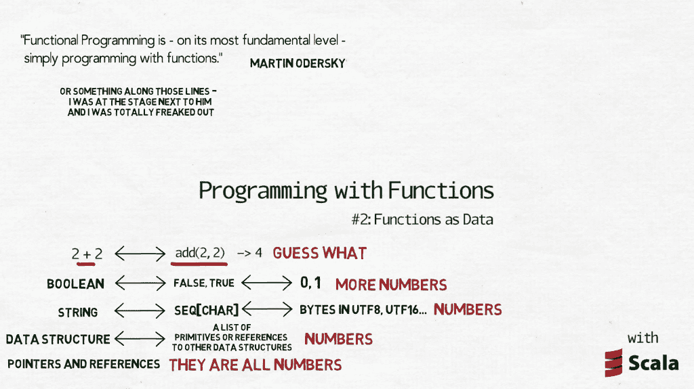
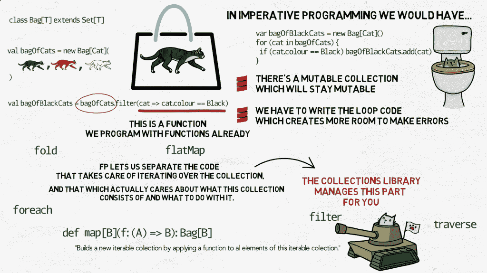
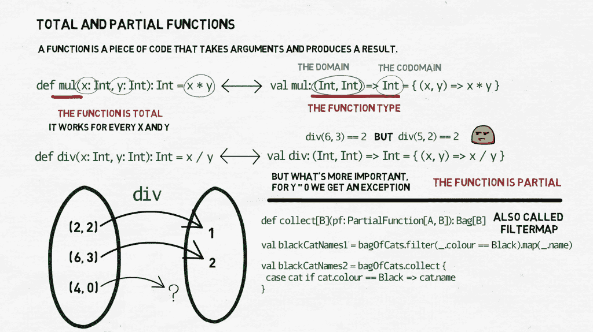

# 用函数编程#2:函数作为数据

> 原文：<https://medium.com/nerd-for-tech/programming-with-functions-2-functions-as-data-efe2dd227a9f?source=collection_archive---------1----------------------->

用 Scala 的创始人 Martin Odersky 的话说，*函数式编程在最基本的层面上就是简单地用函数编程*。函数是一段代码，它将一些数据作为参数，对其执行一些操作，并将结果作为另一段数据返回。2 加 2 意味着执行一个函数。这两个数字都是自变量。如果我们想使用标准符号，函数的名称是“add ”,如果我们想使用操作符，函数的名称是“+”——两者是等价的。结果是 4。

当然，不只是数字可以是数据。虽然，严格来说，是的，只是数字。我们有布尔值，假的和真的，但这些只是 0 和 1。我们有字符串，这是字符序列，但这些字符实际上只是数字，当我们向人类显示它们时，它们被解释为字母表中的字母。我们有复杂的数据结构，但它们由更简单的数据结构组成，最终由数字组成。根据编程语言的不同，我们有指针或引用，它们是我们可以找到其他数据的地址，但这些地址基本上也只是数字。

在命令式编程中，函数和数据是不同的概念。数据是函数的工作对象。函数是处理数据的工具。他们属于不同的世界。

在函数式编程中，**函数也是数据**。告诉我们如何处理其他数据的数据。我们可以将它用作另一个函数的参数，这样高阶函数将能够在自己操作的某个点上使用它。如果你想知道它在实践中是如何工作的，我会给你许多例子中的第一个:集合。在编程中，集合无处不在。如果只有一条数据，那就没办法了。那会是什么呢？你的名字？你的名字是一串字符。一个地点？一个位置只有在有其他位置与之比较时才有意义。除了非常琐碎的例子之外，无论你的程序做什么，在某种程度上，都有不同元素的集合赋予程序的功能以意义。当你有一个元素集合时，你可以对它们进行操作。运营意味着功能。例如，你可以有一袋(一批)猫，而你只想有一袋黑猫。因此，您使用集合的 filter 方法(目前，方法和函数之间的区别并不那么重要)。filter 方法将集合作为其第一个参数，也就是所谓的“主题”,或者 self，以及作为其第二个参数的函数，该函数将为每只猫返回 true 或 false。filter 方法的结果是一个新的集合，其中只有那些通过测试的猫。在我们的例子中——那些黑色的。

`bagOfCats.filter(cat => cat.colour == Black)`

在命令式编程中，我们会使用循环。我们将首先创建一个新的、可变的、空的集合，然后对原始集合中的所有猫运行一个 for 循环，如果它们是黑色的，我们将把它们放入新的集合中。

`var bagOfBlackCats = new Bag[Cat]()
for (cat in bagOfCats) {
if (cat.colour == Black) bagOfBlackCats.add(cat)
}`

这里有两个问题:首先，可变的黑猫包**将保持可变**，即使在循环结束后，这使得代码容易受到添加更多猫的人的攻击(甚至可能不是黑猫！)后来。第二，我们必须编写自己的循环实现，即使它是我们从第一次编程课程开始就反复编写了多年的相同实现。这很无聊，需要时间，而且因为这个例程，我们甚至可能写错，试图访问一个溢出的猫，得到一个猫超出范围的异常。函数式编程让我们将负责迭代集合的代码与真正关心这个集合由什么组成以及如何处理它的代码分开。第一部分不关心它是脾气很差的人还是狗，或者可能是完全不同的东西，只要它是可以过滤的元素的集合。这样，我们就可以将 filter 方法的实现放在 collections 库中，再也不用想它了。

类似地，我们还有其他方法，比如`map, flatMap, foreach, fold... traverse ...`，我不认为我需要在这里详细讨论它们，但是我想指出的是，它们中的每一个都封装了一种对集合中的元素进行操作的方法，而不需要知道它操作的是什么元素。我们剩下要做的就是给这些方法更多具体的函数作为参数，这样它们就知道该做什么了。这意味着我们要写的代码更少，因此犯错误的机会更少，而有更多的时间在 Twitter 上争论。

## 全部和部分函数

函数是一段接受参数并产生结果的代码。当我们谈论全函数和部分函数时，这意味着我们对论点的类型感兴趣，以及我们是否能从中得出一个结果。或者我们可以说，我们对函数的领域感兴趣，用一种更计算机科学的语言。我认为解释什么是最简单的方法是用例子。

假设我们有一个乘法函数，

`def mul(x: Int, y: Int): Int = x * y`

它接受两个整数`x`和`y`，并产生第三个整数——将`x`和`y`相乘的结果。我们的乘法函数是 total:您可以向它提供任意两个整数，并且您将获得一个声明类型的结果—也是 Int。
但是除法呢？假设我们有另一个函数 div，它看起来像这样:

`def div(x: Int, y: Int): Int = x / y`

对于`x`和`y`的很多值来说，`div`函数给出了`Int`类型的正确结果，但是……你已经看到我们要去哪里了……如果`x`不能被`y`除尽而没有余数，那么在 Scala 中余数将被忽略，我们将只得到整数部分。比如`div(5, 2) == 2`。这肯定不是一个理想的解决方案。更重要的是，对于`y == 0`，另一件奇怪的事情发生了:我们得到了 `java.lang.ArithmeticException`。这意味着产生一个整数的一对整数的除法是部分函数——它不适用于所有的整数对。同样，从更数学的角度来看，我们可以说这样的函数是从一组元素到另一组元素的映射。在我们的例子中，参数集都是整数元组或整数对。这组结果都是整数。该函数尝试将参数集中的每个元组映射到结果集中的一个整数。乘法函数能够做到这一点，但是除法函数对于某些元组来说是失败的。除法函数是部分的。

并不意味着部分函数永远没有用。有时我们可以利用他们只对可能输入的子集起作用这一事实。Scala 中一个流行的例子是集合中的`collect`方法，在其他一些语言中也称为`filterMap`。这是一种常见情况的简写，在这种情况下，我们首先过滤原始集合，然后映射获得的子集，以获得更小的其他集合。我们可以使用 collect，并为它提供一个只对元素子集有效的部分函数，它将映射这些元素，而不是首先过滤整个集合，然后映射子集。collect 将忽略部分函数不起作用的所有元素。

`val blackCatNames1 =`
`bagOfCats.filter(_.colour == Black).map(_.name)`

`val blackCatNames2 = bagOfCats.collect {
case cat if cat.colour == Black => cat.name
}`

有两种方法可以把部分函数变成整体函数。一种是简单地拓宽域——在我们的例子中，将结果类型从`Int`更改为`Double`,并在实现中做一些小的更改，以便我们在使用之前将`x`和`y`转换为`Double`。

`def div(x: Int, y: Int): Double = x.toDouble / y.toDouble`

由于历史原因，类型`Double`以这种方式命名，但很久以来几乎被所有人遗忘，它表示有理数——不仅包括整数，还包括分数，但只包括小数点后一定数量的零。除此之外，我们还有两个常数——`Infinity`和`-Infinity`——以及一个神奇的非数字数字:`NaN`。

如果`y == 0`，和`x > 0`，我们将得到`Infinity`作为结果。同样，如果`x < 0`我们会得到`-Infinity`，如果`x == 0`我们会得到`NaN`。这实际上解决了我们所有的问题，但它也迫使我们处理一种我们可能想要的更灵活的结果类型。如果我们实际上只想对没有余数的整数使用 div 函数，而其他任何结果都被视为错误，那该怎么办呢？这就是另一个更好的方法的工作原理:它使用类型将部分函数转换为整体函数，以更好地描述函数可以接受什么作为参数，以及它返回什么。我们将在下一章讨论这个问题。

重要的是它给了我们更好的控制。

正确定义的类型是一条信息，可以帮助我们避免许多错误。我们可以利用这些信息来缩小我们的思考范围，专注于对我们来说重要的事情，我们的幸福之路，同时清楚地勾勒出角落案例和错误。我们也可以将它作为一种极简的形式传递给其他开发人员，但它总是可用的，并且总是最新的文档。我们说“这个函数在这里只接受这样那样类型的参数，其他的都不接受，但是所有符合这些规则的参数总是有效的，它就这样返回结果，仅此而已”。

今天到此为止。感谢您的观看。在下一个视频中，我们将讨论模式匹配——如果我们很好地定义了类型，这一特性可以让我们编写非常强大的代码——以及智能构造函数和密封特征。和往常一样，如果你有任何问题或者因为其他原因想联系我，你可以在下面留言。或者你也可以在推特上找到我。

*   [Scala collections 库](https://www.scala-lang.org/api/current/scala/collection/index.html) —随便浏览一下。最重要的类可能是 Seq、Set 和 Map。用他们的方法写一些简单的程序。实验。玩得开心。
*   [诺尔·威尔士和戴夫·古内尔的《斯卡拉与猫》](https://underscore.io/books/scala-with-cats/)——要知道这本书很快就从简单变成了非常高级的东西。
*   Noel Welsh 著[Creative Scala](https://www.creativescala.org/)——这本书对初学者更友好，但它仍然从一开始就关注 FP。

先前:[用功能#1 编程—简介](/nerd-for-tech/programming-with-functions-1-introduction-912dedbe49af?source=friends_link&sk=e5f0a8d26423226f007cc7f69dc6dc1b)

接下来:[使用功能#3 编程—模式匹配](https://makingthematrix.medium.com/programming-with-functions-3-pattern-matching-64d3fba6929f?source=friends_link&sk=484b7abb953d3b61c35ad23fb5c0bba3)

*如果你想帮我翻译视频的字幕，* [*在这里你可以下载他们的英文版*](https://drive.google.com/file/d/1YC2QZup5JKSW0PjsjBU0xvp386ut2i0z/view?usp=sharing) *，然后请在 Twitter 上找我:*[*@ making thematrix*](https://twitter.com/makingthematrix)*。*