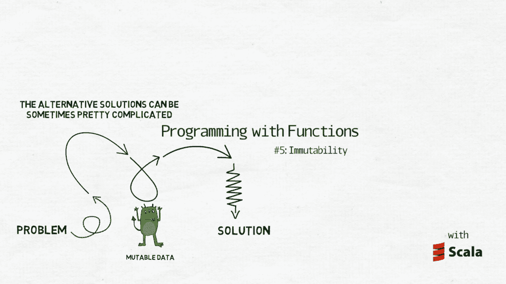
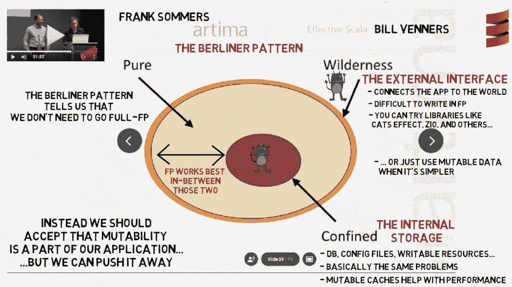
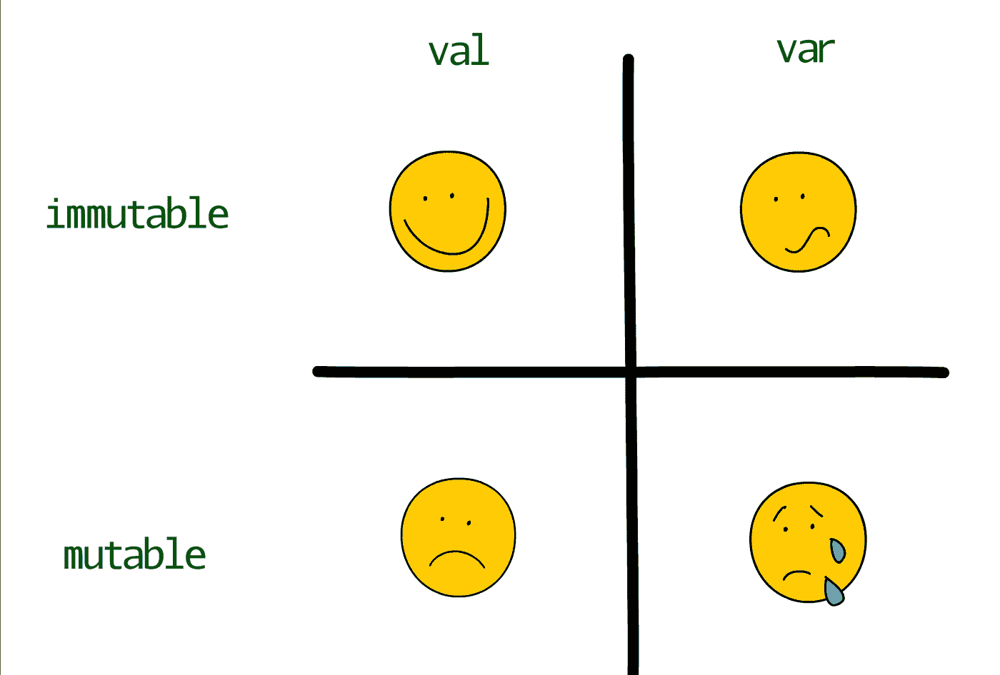
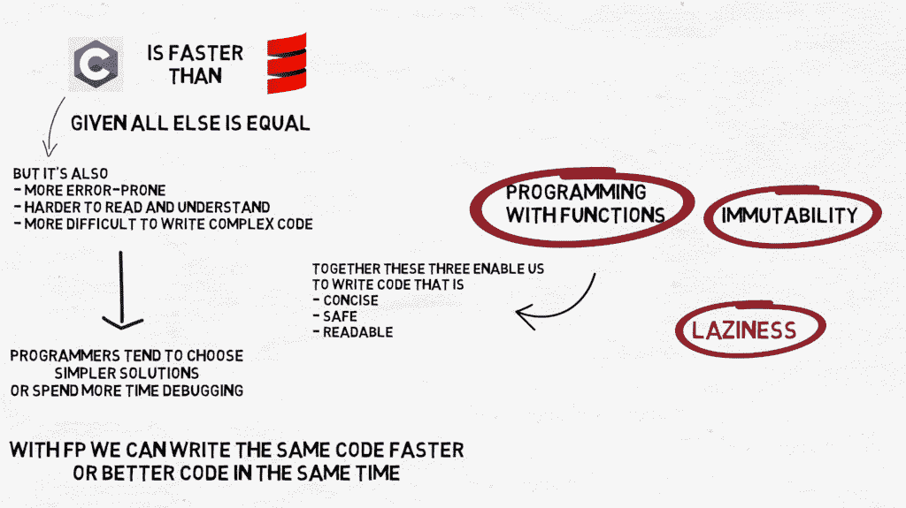

# 函数编程#5:不变性

> 原文：<https://medium.com/nerd-for-tech/programming-with-functions-5-immutability-41611bb7a044?source=collection_archive---------32----------------------->

用函数编程的一个非常酷的事情是，我们处理的数据不必经常变化。理论上——以及像 Haskell 这样的语言——永远不使用可变性是可能的，但是对于一般的程序员来说，替代的解决方案有时会非常复杂，或者至少看起来非常怪异。幸运的是，越来越多的编程语言开始是平凡的命令式语言，现在它们变得越来越功能化，同时保持了与旧石器时代版本的向后兼容性，这意味着如果需要，我们仍然可以使用可变数据。



当然，还有 Scala，它从一开始就被设计成连接两个世界。

## 柏林模式

因此，与其不惜一切代价避免可变性，我想在这里向您介绍一下 Bill Venners 和 Frank Sommers 在柏林 Scala Days 2018 上发表的关于 ["Effective Scala"](https://www.youtube.com/watch?v=DhNw60hxCeY) 的演讲，以及他们对柏林建筑模式的概念。简而言之，我们可以认为每个应用程序都有三层:外部接口、内部接口和中间空间。外部接口让我们的应用程序与其他程序通信，无论是后端、其他 web 服务还是操作系统(并通过操作系统与用户通信)。那些其他程序的工作方式可能会使我们很难以一种纯功能的方式编写外部接口。请注意，我并没有说这是不可能的，但通常情况下，在这里或那里使用一些临时的可变数据结构会更简单或更快。



我们的应用程序还将以数据库、配置文件等形式拥有自己的数据存储(通常它只是一个数据库和文件)。这些也不在我们的完全管辖范围内，所以我们需要内部接口，让我们与操作系统或 SQL server 进行通信。但是对文件和数据库的访问很慢，所以为了获得更好的性能，我们通常在内存中建立一些缓存和快捷方式，使得搜索更快，而且根据定义，它们通常包含一些可变的组件。同样，我们可能会尝试全 FP，有时这是有意义的，但在其他情况下，这是不值得的。

柏林模式告诉我们，我们不需要全力以赴。相反，我们应该接受可变性是我们应用程序的一部分，但是我们可以把它推开:外部和内部。我们从所有业务逻辑所在的中间部分开始，这是函数式编程真正闪耀的地方，慢慢地向两个方向努力。最终，我们将只在外部和内部接口的薄层中，在有意义的地方保留可变性。

我特别喜欢这种模式既适用于新的应用程序，也适用于重构旧的应用程序。在第一集中，我用命令式风格编写了一个代码示例:

```
val bagOfBlackCats = new mutable.Bag[Cat]() // empty mutable collection
for (cat in bagOfCats) {
  if (cat.colour == Black) bagOfBlackCats.add(cat) // initialization
}
bagOfBlackCats // it will always be mutable, 
               // even if you never want to modify it again
```

在命令式编程风格中，您经常会发现以下模式:变量最初被设置为某个默认值、空集合、空字符串、零或 null。然后循环运行一些初始化代码，逐步创建实际有用的值。在这个过程之后，分配给变量的值不再改变——或者如果改变了，也可以通过将变量重置为默认值并再次运行初始化来替换。但是修改它的可能性仍然存在，即使不需要。在程序的整个生命周期中，它就像一根电缆的松散末端一样悬挂着，邀请每个人去触摸它。

函数式编程为我们提供了构建有用值的方法，而不需要初始默认值和临时可变性。数据结构，即使是非常复杂的数据结构，也可以通过大量使用高阶函数来计算，然后赋给一个常数，以防止将来的修改。如果我们需要它的更新版本，我们可以简单地创建一个新的数据结构，而不是修改旧的。

```
val bagOfBlackCats = bagOfCats.filter(_.colour == Black)
```

为什么重要？

第一，我们的数据越受限，对未来发展越安全。通过说这种数据结构不应该被修改，我们不仅给了编译器更多的信息，也给了将来开发同一段代码的开发者更多的信息。让他们毫不怀疑他们能用它做什么。这将导致将来更少的错误。

第二，比赛条件。如果两个或更多的线程访问相同的数据并可以修改它，我们可能很快就会进入无效状态，并且很难调试出错误的确切原因。我们试图使用互斥、监视器和其他模式来防止这种情况。让数据变得不可变并不能解决我们所有的问题，但是它确实让我们的工作变得更容易。

第三，变量中的初始默认值是邪恶的。程序员总是使用它们，然后忘记把它们改成有意义的东西。它们是很多错误的来源，尤其是[臭名昭著的“空”引用](https://www.infoq.com/presentations/Null-References-The-Billion-Dollar-Mistake-Tony-Hoare/)。

## 可变和不可变集合

当我们谈到数据结构，特别是集合时，不变性的概念变得有点复杂。你可能已经看过类似这张图表的东西了:



在 Scala 中，集合库分为两部分:可变的和不可变的，不可变是默认的。这与`val`(值)和`var`(变量)之间的区别不同。让我快速解释一下，这样我们在本章的剩余部分就有了共同点。

不可变集合是指创建后就不能更改的集合。它充当任何后续操作的数据源，但是该操作的结果将是另一个集合或任何数据结构。原始收藏将保持不变。一方面，这有时可能导致次优的性能——如果您只想替换集合中的一个元素，那么您是否需要将所有其他元素复制到新的元素中呢？这就是为什么你也可以使用每个集合的可变对应物，比如用`mutable.ListBuffer`代表`List`，用`mutable.HashMap`代表`Map`，或者用`mutable.ArrayBuffer`代表……呃...`Vector`[链接](https://docs.scala-lang.org/overviews/collections/concrete-mutable-collection-classes.html)。它们就是你在图表左下角看到的。您将这样一个可变的集合作为 val 保存，因为您不希望在赋值后替换对它的引用，但是它的内容是可变的。可以把它想象成一个构建器:在一系列 CPU 密集型操作的开始创建它，执行这些操作，然后把它删除。如果您需要结果，请将其复制到一个不可变的集合中。保持可变集合的局部性——只在方法内部创建它。永远不要将对它的引用作为类的字段，这样其他线程就不可能试图访问它。

相反，如果您必须公开可以更新的数据，请使用不可变的集合，但在一个`var.`代码中保留对它的引用，该代码应该进行更新，将获取该引用，复制数据并进行一些更改(可能使用可变的集合)，然后在一个原子操作中用对新的不可变集合的引用替换原始引用。与此同时，代码中的其他地方将使用旧的引用，在更新之后，旧的引用将开始指向过时的数据，但至少它将是一致的——您可以确保数据不会改变，直到您再次显式访问源。

## 怠惰

但是不变性不仅仅是为了将我们从不安全的操作中拯救出来。考虑一下:如果你有变量，你想组合它们并返回一个结果，你需要使用一个函数。每次你调用函数时，变量可以有不同的值，所以每次你都必须再次访问这些值。你不能假设你已经了解他们了。而且每次的结果都可能不一样。

但是如果你有常数而不是变量，如果函数是纯的，我们一会儿会回到纯函数的含义，那么结果总是一样的，因为常数不会改变，如果你访问它们一次，计算结果，记住它，下一次你就可以返回你记住的。本质上，函数变成了另一个常数，只是…它的计算是**懒惰的**，这意味着它不是在声明常数时完成的，而是在第一次访问它时完成的。

```
val cat = Cat(name = ..., age = ..., colour = ...)def changeCatColour(cat: Cat): Cat = async {
  val bestColour: CatColour = await { chooseTheBestColour() }
  // waits for the UI thread, each time the response can be different
  cat.copy(colour = bestColour)
}
```

但是:

```
val cat = Cat(name = ..., age = ..., colour = ...)
val bestColour = Black // it is known
...
// here we always know which `cat` and `bestColour` we use
lazy val bestColourCat: Cat = cat.copy(colour = bestColour)
```

这里没有魔法。实际上，惰性 val 是一个未初始化(或初始化为`None`或`null`)私有变量和一段初始化代码的包装器。第一次访问 lazy val 时，运行代码并将结果赋给变量。在每个连续的情况下，将返回存储的值，而不是再次运行代码。

这不是实际的代码，但它应该会让您知道它是如何工作的:

```
private var _bestColourCat = Option.empty[Cat]
def bestColourCat: Cat = _bestColourCat match {
  case Some(_cat) => _cat
  case None =>
    val _cat = cat.copy(colour = bestColour) // the actual lazy val initialization
    _bestCatColour = Some(_cat)
    _cat
}
```

让我们考虑一下其中的含义。一个当然是我们为计算机节省了一些工作。我们现在可以调用一次函数，然后永远使用计算结果，而不是一遍又一遍地调用函数。这对性能来说已经很好了，但这还不是全部。懒惰意味着我们只在需要的时候才计算结果。如果我们不需要它，我们可能永远都不需要做它。不再有导致数据结构随后被忽略的计算，因为程序的逻辑选择了另一条路径。毕竟，最快的代码是那些从未被调用过的代码。

## 处理代码复杂性



一个普遍公认的事实是，低级语言比更高级、更抽象、功能更强的语言更有表现力。当我们对比同一个算法，比如排序，用两种语言写的，用 C 或 C++写的会比用 Scala 或 Haskell 写的快。但这里的关键词是“相同”。排序就像许多其他操作一样，可能有更简单和更复杂的实现。更简单的代码更容易编写，但是通常情况下会更慢或者更好，但是在极端情况下会很糟糕。函数式编程帮助我们编写复杂的代码，而懒惰在其中扮演了重要的角色。将懒惰和不变性结合起来，用函数编程，我们可以将复杂的代码分成更简单的片段，只在必要的时候使用它们。写起来更安全，也更快。代码更简洁。在现实世界中，这意味着如果我们有两个程序员，一个用低级语言编写，另一个用高级语言编写，我们给他们相同的任务和相同的截止日期，第一个可能会选择更简单的实现，而另一个可能会更渴望尝试更复杂的版本，并修补角落情况的处理。

我想今天够了。在下一章中，我们将讨论线程安全以及不变性是如何帮助它的。感谢阅读。

先前:[用函数#4 编程:](https://makingthematrix.medium.com/programming-with-functions-4-unapply-and-the-newtype-pattern-7584cceb3e9?source=friends_link&sk=76a17a4f1ba7b7e895c0de0027286eef) `[unapply](https://makingthematrix.medium.com/programming-with-functions-4-unapply-and-the-newtype-pattern-7584cceb3e9?source=friends_link&sk=76a17a4f1ba7b7e895c0de0027286eef)` [和 newtype 模式](https://makingthematrix.medium.com/programming-with-functions-4-unapply-and-the-newtype-pattern-7584cceb3e9?source=friends_link&sk=76a17a4f1ba7b7e895c0de0027286eef)

接下来:[用函数#6 编程:线程安全](https://makingthematrix.medium.com/programming-with-functions-6-thread-safety-7a5e1b361c8e)