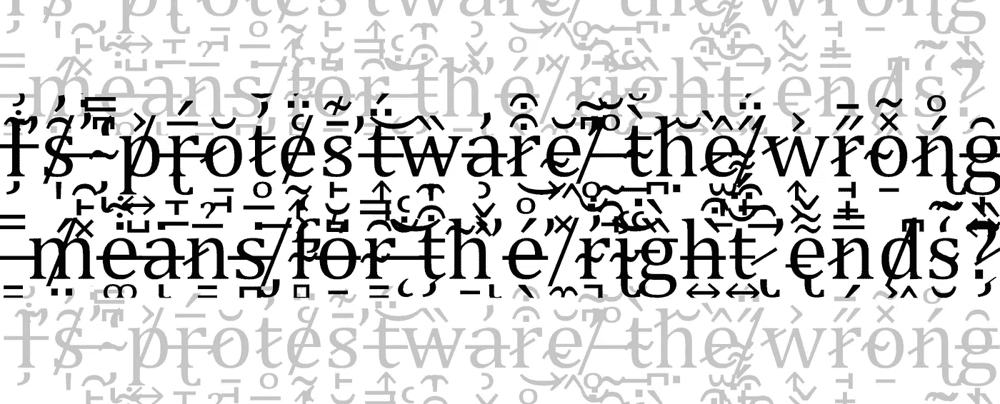

# 抗议者:正确的结果，错误的方法？

> 原文：<https://medium.com/nerd-for-tech/protestware-right-ends-wrong-means-eb1460c7e0cf?source=collection_archive---------2----------------------->

结果证明了手段的正当性吗？我们大多数人可能会说这要看情况。这个问题的答案往往伴随着一大堆限定词——毕竟，这个世界并不全是黑白的。

但总的来说，那些同意结果的人更有可能证明手段的一些回旋余地，而那些不喜欢结果的人也不太可能喜欢手段，如果他们偏离了“规则”。

这描述了正在进行的关于所谓“抗议软件”的辩论，所谓“抗议软件”是指恶意软件或其他恶意程度较低但仍会分散注意力或令人恼火的代码，它们被注入开源软件包，以表达政治、个人或道德观点。最近几个月，在一些针对政治目标的抗议恶意软件被推出后，这场辩论变得更加热门和激烈，开源倡导者大声谴责这一事实，即它可能会损害比预期目标更多的用户。

最突出的例子是 3 月份广泛报道的[，涉及 JavaScript 库 node-ipc 的开发人员 Brandon Nozaki Miller，他在入侵乌克兰后，恶意修改了他标记为“peacenotwar”的代码，旨在清除位于俄罗斯或白俄罗斯的系统上的数据。](https://www.techtarget.com/searchitoperations/news/252515031/Pro-Ukraine-sabotage-renews-scrutiny-on-open-source-security)

开源倡议组织(OSI)谴责俄国入侵乌克兰，并在[发表了一篇名为“抗议者”的博客文章，该文章只是发布相对无害的反战信息。但它呼吁结束对恶意软件的抗议，称开源的“武器化”损害了开发者和运营商的工作，仅仅因为他们有一个俄罗斯分配的 IP 地址。它对和平缔造者和战争贩子的伤害一样大——甚至使用 VPN 来对抗入侵的道德黑客也可能成为附带损害。”](https://blog.opensource.org/open-source-protestware-harms-open-source/)

OSI 执行董事 Stefano Maffulli 写道:“破坏开源项目的负面影响远远超过任何可能的好处，反作用最终将损害项目和负责的贡献者。”“推而广之，所有的开源都受到了损害。是的，使用你的权力——但要明智地使用。”

**多重动机**

然而，动机并不总是政治性的。有时候是私人恩怨。随着[开源软件成为几乎每个代码库中的主流软件](https://www.synopsys.com/software-integrity/resources/analyst-reports/open-source-security-risk-analysis.html?cmp=pr-sig&utm_medium=referral)(大约 80%)，一些开发人员感到不满，他们觉得自己在制造其他人免费(并且为了盈利)使用的产品，却没有得到多少支持、认可或补偿。

事实上，一些开源项目的开发人员和维护人员干脆放弃维护它们，因为他们厌倦了这样做，或者想专注于其他事情。这是一个持续存在的问题。

但是在一月份，开源项目开发者和维护者 Marak Squires 走得更远。他[破坏了他的两个广泛使用的开源项目](https://www.bleepingcomputer.com/news/security/dev-corrupts-npm-libs-colors-and-faker-breaking-thousands-of-apps/)，显然是因为对大公司和商业消费者使用这些免费组件而不支持整个开源社区感到失望。

colors.js 和 faker.js 这两个开源库的用户突然发现使用这些库的应用程序在打印乱码。Paul Ducklin，[在裸机安全博客](https://nakedsecurity.sophos.com/2022/01/11/javascript-developer-destroys-own-projects-in-supply-chain-lesson/)上写道，Squires 在应用了一个名为 zalgo 的函数后，在末尾添加了一个无限循环，反复打印文本“testing testing testing ”,从而“破坏了他自己的代码”。

“Zalgoification，如果你从未听说过的话，是一种让常规罗马字符看起来怪异和无意义的方法，方法是在这些字符中添加重音、变音、元音和其他所谓的发音符号，”Ducklin 写道。

斯奎尔斯早些时候警告说“我不会再用我的免费工作来支持财富 500 强(和其他小公司)。其他没什么好说的了。以此为契机，给我一份六位数的年度合同，或者把这个项目交给别人来做。”

因此，关于手段和目的的辩论。大多数参与者都同意，一个人可能有高尚的理由支持一个受到攻击的国家，或者有正当的理由要求对其他人从中获利丰厚的产品进行补偿。

但是正如广大开源社区的许多成员所指出的，像这样的抗议所造成的损害能够并且确实影响了比据称的目标更多的用户。

事实上，虽然一些开源倡导者说他们可以理解 Squires 由于缺乏支持而破坏他的项目，但像“peacenotwar”这样的抗议软件是严重的破坏行为。

不要在食物中下毒

“维护你对自己东西的权利就像说，‘我不再提供免费食物了，’”T2 unlock open 的负责人托比·兰格告诉 TechTarget 。“这就像把免费的食物留在周围，但你把让人恶心的东西放在上面。”

在一次电子邮件采访中，Maffulli 说抗议是“言论自由的一个重要因素，应该受到保护。如果维护者添加了一个显示政治信息的横幅，但并没有真正改变程序的行为，这是一回事。”

“完全不同的情况是，如果软件检测到它运行在世界上某个特定地区或某个特定地区的计算机上，它就会被修改以删除系统文件。”

这有多重要？根据一些开源专家的说法，至少现在还没有普及，他们指出抗议者目前还只是一种边缘活动。他们说，这应该只是对开源用户的另一个提醒，他们应该在信任之前总是进行验证。

事实上，有很多黑客的动机是犯罪，而不是政治或个人，他们希望利用开源软件的弱点。毕竟，开源软件组件是软件供应链的一部分，可能有成千上万的组件需要被跟踪和检查安全缺陷。

最有效的方法之一是使用一个叫做软件组合分析的自动化工具，它可以帮助创建一个[软件材料清单](https://www.synopsys.com/blogs/software-security/software-bill-of-materials-bom/?cmp=pr-sig&utm_medium=referral) (SBOM)。拜登总统 2021 年 5 月关于网络安全的行政命令呼吁联邦机构购买的每个软件产品都要有一个 SBOM，尽管这仍在进行中。

新思网络安全研究中心(Synopsys cyber security Research Center)首席安全策略师蒂姆·麦基(Tim Mackey)表示，对于开源软件的消费者来说，抗议软件“与缺乏任何有意义的开源治理实践的组织所消费的开源软件中可能存在的任何其他风险一样，都是一个问题。”

他的同事，新思软件完整性小组的应用工程师迈克尔·怀特同意这一观点。“当你选择使用来自‘别处’的软件包时，你是在非常信任该软件包的作者、维护者和发行者，”他说。

**没有盲目的信任**

因此，虽然抗议者供应商的动机可能有争议，但怀特说，“归根结底，这确实是作者的特权，这是你必须承担的风险。”

“不要忘记，”他补充说，“我们已经熟悉了恶意第三方通过劫持攻击故意后门的包，所以‘包变坏’的想法对许多安全团队来说根本不是一个新现象。他们解决这个问题的方法是通过一个集中的 SBOM 库存。”

除此之外，是否有办法解决沮丧或疲惫的开发人员和维护人员的潜在增加，他们厌倦了免费工作以提高他人的利润？

Maffulli 说，没有放之四海而皆准的解决方案。“我在大多数关于支持维护者的谈话中抱怨的主要问题是，他们描绘和处理它时好像开源维护者的世界是同质的，而事实显然不是这样，”他说。“GNU LibC 或 Kubernetes 的维护者与小型 npm(节点包管理)包的维护者有着完全不同的需求。”

怀特也认为没有简单的解决办法，一味呼吁“支持”可能会产生一些意想不到的后果。“看到社区团结起来，支持一些关键包的长期维护，这很好，”他说，“但这是社区多年来一直试图解决的问题。”

“可能没有维护者期望他们‘需要’支持，但从整体和商业角度来看，这仍然是正确和合理的事情，因为这些包的许多顶级消费者和集成商都有所回报。”

“不过也有不好的一面，”他补充道。“虽然爱好或激情项目是一回事，但将付费捐赠者的增强请求置于其他需求之上可能会很有挑战性。因此，看看这将如何发展会很有趣。”

“我也想知道这对许可条款会有什么影响，”他说。“支持是否以许可条款不变为条件？它会迫使特定的许可证优先于其他许可证吗？”

所有这些都提醒我们，这个世界并不全是黑白的，就像手段和目的一样。