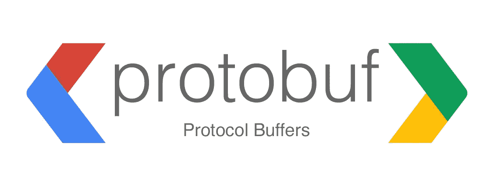

# 两分钟后协议缓冲

> 原文：<https://medium.com/nerd-for-tech/protocol-buffers-in-two-minutes-6b8f908efe5?source=collection_archive---------1----------------------->

这篇文章将在两分钟内教会你开始使用协议缓冲区所需要知道的一切。

## 什么是协议缓冲区？

Protocol Buffers(简称 ProtoBuf)是一种序列化数据(将其转换为二进制)以便能够传输数据的方法。多亏了 ProtoBuf，我们可以通过运行命令这样简单的事情将数据翻译成不同的语言。因此，对于微服务来说非常方便。

而 Json 数据不是结构化的，不需要 ProtoBuf 所需要的模式。这意味着您不需要使用 Json 为对象的每个属性定义数据类型并坚持使用它，但是您可以使用 ProtoBuf。

## 入门指南

要开始使用 ProtoBuf，您必须首先用**创建一个文件。proto** 扩展。那么，该文件中的第一行应该是:

> 语法= " proto3//你可以写你在这里使用的任何原型版本。

每个对象都是一条带有 ProtoBuf 的消息，我们必须在。原型文件。对于消息中的每个属性，我们还必须分配一个 id，以便 ProtoBuf 可以对其进行解码和编码。因此，如果我们创建一个学生对象，它应该是:

> 消息学生{
> 
> int 32 id = 1；
> 
> 字符串名称= 2；
> 
> 浮点 GPA = 3；}

如果我们正在创建一个学生类对象的数组，它应该是:

> 消息学生{
> 
> 复读生学生= 1；}

我们还必须为应用程序中的每个控制器创建一个服务，对于控制器中的每个函数，我们必须在服务中放置一个 rpc，如下所示:

> 服务控制器名称{
> 
> RPC function name(whatModelItTakes)retuns(whatModelitReturns)；}

现在，为了能够将它转换成我们喜欢的任何语言，我们需要首先获得协议 Proto Buffer 编译器。你可以在[这个链接](https://github.com/protocolbuffers/protobuf/releases)上安装它。只需选择一个适合你的操作系统，不要担心语言的问题。将它移动到 C:/下并解压缩，然后打开终端，导航到项目文件夹并运行命令:

> c:\ protocol-21.2-win 64 \ bin \ protocol-js _ out = import _ style = common js，binary:。原文件名.原

**注意:**你可以把 commonjs 部分改成你喜欢的任何语言，但是那个是用来翻译成 JavaScript 的。

上面的命令将创建一个**proto filename _ Pb . language extension**(即。protoFileName.js)文件。现在，我们可以开始在我们为之创建 protobuf 的任何语言中实际使用这些类了。但是首先，确保将 google-protobuf 库安装到你的项目所使用的任何语言中。然后在将要使用它的每个文件上导入 protoFileName_pb 文件。

现在，您可以简单地从该模式中初始化和创建对象。对于从 protobuf 创建的任何对象，现在都有预定义的方法将其翻译成任何语言，例如:

> 学生. serialize binary()；//将其翻译成二进制
> 
> students . deserialize binary()；//将其转换回原始形式