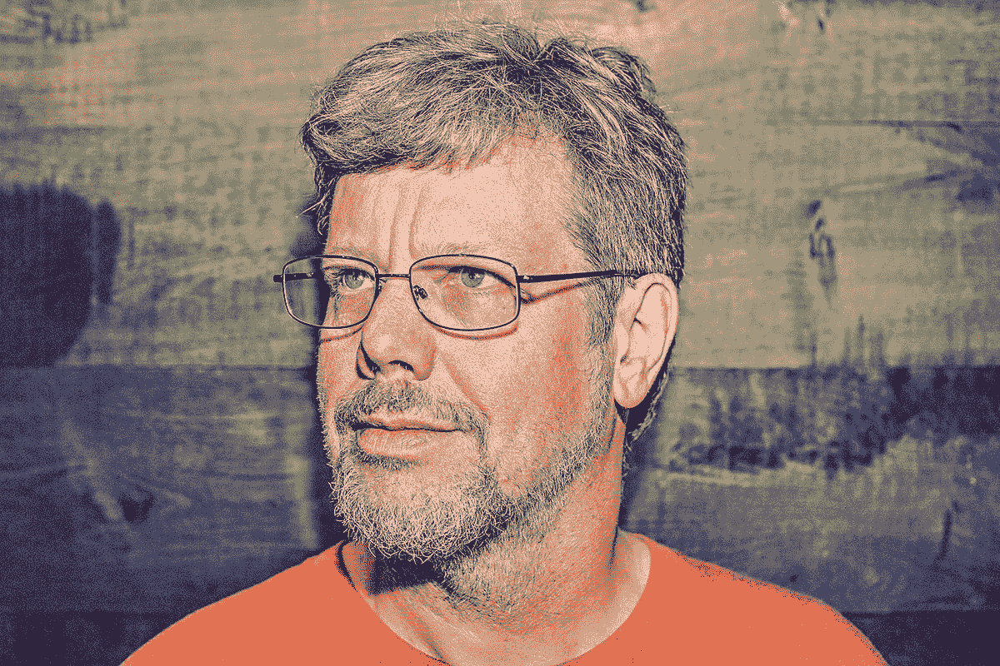
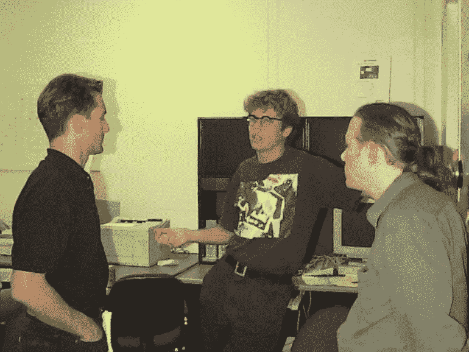

# Python 统治地球:一个微不足道的副业如何席卷编程语言世界？

> 原文：<https://medium.com/nerd-for-tech/python-dominating-the-planet-how-a-trivial-side-project-took-the-world-of-programming-languages-77271fdf2a52?source=collection_archive---------8----------------------->

程序员吉多·范·罗苏姆想出了 Python，因为他不喜欢现有的编程语言。在接受 ZDNet 采访时，van Rossum 讲述了 Python 是如何创建的，以及它的前景。

# 序言

1994 年末，一群来自美国各地的程序员聚集在一起谈论他们的新秘密武器。工程师 Barry Warsaw 是最近引入的 Python 语言的第一个研讨会的参与者之一。大约有 20 名开发人员参加了会议，他们都对这个新工具非常满意。

巴里回忆起一位工作坊参加者的话:“请不要告诉任何人我在这里，让 Python 成为我在比赛中的秘密武器。”根据 Warsaw 的说法，早在 1994 年，很明显 Python 为程序员开辟了新的机会，使用这种语言编写代码和解决实际问题更加容易和方便。

Barry Warszawa 分享了他对 Python 的第一印象，“这是可读性和趣味性的结合”。

第一次研讨会的参与者没有保守秘密。如今，在 1994 年庆祝 Python 的 Python 爱好者远不止 20 人。它是最受欢迎的语言之一，有着很好的前景，而且 Python 专家在就业市场上很吃香。

Python 是一种通用语言。它应用于各个领域，包括 web 开发、机器学习、数据科学。这种语言被大公司、政府组织、教育机构所使用。例如，Python 被 NASA、网飞和 Instagram 使用。

# Python:早年

Python 像英国漫画团体 Monty Python 一样迅速和出乎意料地变得流行和受欢迎，这种语言就是以它命名的。

Python 是由来自荷兰的程序员吉多·范·罗苏姆创建的。20 世纪 80 年代末，Guido 在阿姆斯特丹的数学和计算机科学中心工作。Van Rossum 不喜欢现有的编程语言，所以他开始开发一种新的编程语言。圭多想制造一种简单而强大的乐器。

Python 的创造者吉多·范·罗苏姆——(图片)感谢[维基百科](https://en.wikipedia.org/wiki/Guido_van_Rossum)

对于一个局外人来说，创造你自己的编程语言的想法可能看起来类似于自己组装一架飞机的想法。然而，上世纪 80 年代末 30 岁左右的吉多·范·罗苏姆并不是从零开始的。

在数学和信息学中心的三年时间里，他致力于解释型编程语言 ABC 的研究。因此，Guido 设想如何开发一个命令解释器和语法。

理解范罗森在 20 世纪末所面临的困难是很重要的。它运行在 Amoeba 操作系统上，这需要使用 C 或 Unix 外壳。这些皮肤有严重的局限性。例如，C 需要手动内存管理。

它也缺乏库，所以程序员需要在每个项目中重新发明轮子。Unix 命令 shell 的主要限制是它的低速度，这使得专家很难实现复杂的逻辑。

这些语言的局限性是如此严重，以至于创造一种自己的语言对范·罗森来说并不是一个疯狂的想法。“我想，为什么不从 ABC 吸取最好的想法，创造一种更简单、更方便的编程语言，”吉多·范·罗苏姆回忆道。他借用了飞行马戏团喜剧演员蒙蒂·派森的名字，并于 1989 年底开始研究这门语言。

“在那些日子里，我很少离开家，因为我主要是看电视和写代码，”Guido 说。顺便说一句，范·罗森和很多人在一起。在 20 世纪 80 年代后期，世界上出现了几种编程语言，它们是由于工程师对他们可用的工具不满意而产生的。这就是拉里·沃尔如何创建 Perl，约翰·奥斯特如何开发 Tcl。

在三个月内，van Rossum 创建了一个可工作的 Python 原型。Guido 说 Python 与这种语言的今天的版本非常相似，尽管它缺少今天实现的重要抽象。

“解释器和语言的所有基本组件都工作正常，第一个简单的 Python 程序可能今天仍然工作正常，”van Rossum 说。根据这位工程师的说法，80 年代后期的函数是以同样的方式定义的，字典和元组有同样的语法，缩进也是一样的。

Van Rossum 的同事立即开始使用 Python 的第一个版本。但是圭多怀疑这种语言会不会流行。在前互联网时代，在线课程不存在的情况下，编程语言的普及和学习更加困难。

今天，任何人都可以在一个专门的平台上发布培训课程，例如，在代码基础上，只需点击几下鼠标。而且在 80 年代末 90 年代初，编程语言的普及难度更大。吉多·范·罗苏姆在美国广播公司工作时就面临这个问题。

“当我大约在 1985 年第一次来到美国时，我的行李里有磁带盒，”Guido 说。在他的笔记本里，范罗森有对 ABC 感兴趣的人的地址和电话号码。Guido 会见了他们，并在磁带的帮助下展示了这种语言的可能性。

互联网的兴起帮助 van Rossum 在没有一箱卡带的情况下普及了 Python。

吉多·范·罗苏姆将 Python 引入了 alt。1991 年来源新闻组。它实际上是一个开源项目，尽管术语“开源”在 6 年后才首次使用。新闻组用户不得不连夜下载 Python 解释器文件。但是这已经比带着磁带挨家挨户的旅行有效多了。

Van Rossum 不断收到使用 Python 的专家的反馈。在开发该语言的新版本时，他考虑了他们的建议。

# Python 为何胜出

到 90 年代中期，Python 已经成为一种流行的编程语言。这启发了吉多·范·罗苏姆。这位专家认为，其他程序员使用 Python 的原因与 Guido 产生创造一种新的编程语言的想法是一样的。他们希望使用一种高级语言，这种语言没有 Unix shell 的限制，但同时又保持简单。

Barry Warszawa 认为 Python 在 90 年代已经是一种平衡的语言:一方面简单方便，另一方面功能强大。根据 Warsaw 的说法，在那个时代，除了 Python 之外，没有一种编程语言具有这样的品质。

“我使用过 Perl、C 和 Tcl，这并没有给我带来快乐，”Barry 说。他继续说道，“当 Python 出现的时候，我意识到享受编写代码意味着什么。”

在诞生的最初几年，Python 就因其清晰易懂的语法而脱颖而出。用缩进将代码块分组在 90 年代吸引了程序员，在 2019 年也吸引了他们。

研究公司 Gartner 的发言人 Fintan Ryan 指出，语法整洁在 Python 的普及中几乎起了主要作用。

根据吉多·范·罗苏姆的说法，纯 Python 语法不是偶然产生的。Guido 强调编程不仅仅是为机器创建指令。也是开发者之间的思想交流。因此，代码应该是人们可以理解的。

反过来，Fintan Ryan 强调，自 90 年代初以来，Python 为程序员提供的不仅仅是纯语法。“该语言实现了类、异常处理、lambda 函数、高阶映射和过滤函数，”Fintan 说。

根据 van Rossum 的说法，如果 20 世纪 80 年代存在的语言更先进，Python 可能不会出现。Guido 喜欢 Perl，但是他不能在 Amoeba 操作系统上使用它。“如果不是因为这种不兼容性，我永远不会考虑创造一种新的编程语言，”范·罗森说。

Python 在 90 年代中期获得了流行和认可，但它仍然落后于最流行的语言。Python 的主要竞争对手是 Perl 和 Tcl / Tk。这些语言的开发者也努力追求易用性和广泛的功能。

根据 StackOverflow 开发者调查，Python 目前比其他编程语言发展更快。Perl 的受欢迎程度如此之低，以至于没有进入所有的研究。下图形象地展示了 Python 流行程度的显著提高。

# Python 越来越受欢迎

如何解释 Perl 和 Python 的不同命运？吉多·范·罗苏姆说，Python 成功的秘密在于为相对较大的应用程序编码是多么容易。“Perl 对于只有 10 行代码的程序来说很方便，”Guido 回忆道。

根据他的说法，当应用程序有 500 行代码和数千行库时，程序员需要额外的努力来维护这样一个 Perl 程序。“有了 Python，就没有这个问题了，代码始终保持可读，程序员不必花太多时间维护它，”van Rossum 说。

根据 van Rossum 的说法，在 90 年代早期到中期，开发人员需要一种工具，允许他们无需额外的努力就可以编写大型应用程序。在这里，Python 优于 Perl、C、C ++和 Java。

90 年代中期，吉多·范·罗苏姆仍在数学和信息学中心工作。但是 Python 已经获得了发展势头，所以 Guido 花了很多时间与来自世界各地的开发者交流。

# Python 和互联网

到 90 年代中期，程序员使用 Python 完成各种任务，包括创建音频记录的程序和 web 开发的最初尝试，这后来成为该语言的主要使用领域之一。吉多·范·罗苏姆指出，他对在 web 开发中使用 Python 的体验非常感兴趣。

Fintan Ryan 回忆道，通过使用 Python，程序员可以快速创建复杂的程序。根据专家的说法，这种语言降低了进入开发的门槛，尤其是 web 开发。Ryan 强调了 Python 的多功能性:“系统管理员使用这种新语言来自动化系统，开发人员喜欢它，因为它能够以函数式风格编写代码。”根据 Fintan Ryan 的说法，在这个意义上，Perl 比 Python 差得多。

1994 年，Python 引起了美国国家标准局(NBS)的 Michael McLay 的注意。今天，这个机构被称为国家标准和技术研究所。麦克莱在 NBS 看到了 Python 的前途。当时，该组织拥有“大量数据，但没有足够的程序员来处理这些数据，”范罗森说。

迈克尔·麦克莱邀请吉多·范·罗苏姆作为数学和计算机科学中心的访问专家到国家统计局工作。按照专家们的设想，这一步是为了帮助向 NBS 管理层推销 Python。麦克莱的决定对范·罗森的一生和 Python 的命运起了重要作用。顺便说一下，关于这种语言的第一次研讨会是在国家统计局办公室举行的。

吉多·范·罗苏姆，巴里·华沙和罗杰·马斯。信用:巴里华沙

在 NBS，范·罗森遇到了参与开发 TCP / IP 协议的鲍勃·卡恩。卡恩邀请范·罗森为国家研究计划公司(CNRI)工作。这是一个非政府组织，一直在研究和开发信息网络。这个邀请派上了用场，因为那时范·罗森正在认真思考他在数学和信息学中心的未来。

根据 Guido 的说法，数学和信息学中心是一个科学机构，因此领导层将专家置于获得博士学位的需要之前。比起科学研究，Van Rossum 更喜欢开发 Python。

1995 年 4 月，吉多·范·罗苏姆加入了 CNRI 队。在这里，他开发了 Knowbot 软件。团队用 Python 工作。在 CNRI，van Rossum 与 Jeremy Hilton、Roger Masse、Barry Warsaw、Ken Manheimer 和 Fred Drake 合作。这些人成为了 Python 社区的核心，并在语言的发展中发挥了重要作用。

和新朋友一起，吉多·范·罗苏姆开通了 python.org 网站。该资源托管 Python 核心。该网站还帮助协调参与 Python 开发的专家的工作。

早在 90 年代后半期，一个围绕 Python 的大型社区已经形成。为了正式管理这种语言，吉多·范·罗苏姆和他的朋友们建立了 Python 软件基金会的模型。这个组织最终于 2001 年成立。定期的 Python 研讨会已经发展成为一年一度的 PyCon 会议。

到 21 世纪初，Python 的发展很大程度上归功于社区的贡献。程序员们不再开玩笑说“如果范罗森因为不可预见的情况退休了，语言会发生什么”然而，圭多在这门语言的发展中起到了关键作用。他甚至被称为“仁慈的独裁者”。它完美地诠释了 van Rossum 致力于解决关键 Python 开发问题的承诺。

Gartner 的 Fintan Ryan 强调，一种语言的创造者想要控制其发展的愿望是正常的。类似地，Perl 的创造者拉里·沃尔和 Node.js 的创造者瑞安·达尔也是如此。

吉多·范·罗苏姆本人认为，开放性已经成为 Python 成功的一个重要因素。据他说，语言发展的关键问题一直在社区中讨论。

# Python 进化

Python 在接下来的几年里发展迅速。2008 年，Python 3.0 的引入带来了结构性的变化。

2018 年，吉多·范·罗苏姆离开了仁慈独裁者的非正式职位，也就是说，他不再领导语言的发展。这一决定是由于社区不愿意实现 van Rossum 提出的在 Python 中使用赋值表达式的建议。Guido 相信这个新工具会提高 Python 的速度。社区认为赋值表达式会降低 Python 代码的可读性。

根据 van Rossum 的说法，他习惯于讨论创新。他辞职是因为与一些反对者争论时咄咄逼人的态度，也是因为批评者的个人化。

“这不是一场革命，但我觉得社区里的关键人物不信任我，”吉多·范·罗苏姆评论这种情况。根据 Guido 的说法，导致他辞职的争论是由 Python 的流行促成的。

后来，社区选举吉多·范·罗苏姆、巴里·华沙、布雷特·坎农、卡罗尔·威林和尼克·科格兰进入监督委员会，监督语言的发展。根据 Barry Warsaw 的说法，随着编程语言越来越受欢迎，这些排列将有助于推动 Python 的发展。

Barry Warszawa 指出，25 年前，吉多·范·罗苏姆独自承担了 Python 未来的责任。“在当前的环境下，这对于一个人来说工作量太大了，”华沙说。

根据 Warsaw 的说法，监事会的选举将在 Python 的每次重大更新后进行。Barry Warszawa 强调说:“如果我们希望 Python 在未来 25 年也能繁荣发展，必须管理这个过程的是年轻的领导者，而不是 Guido 和我自己。”

社区的主要成员之一 Mariatta Vijaya 认为情况正在正确地发展。“监事会比一个人更擅长处理语言发展，”玛丽雅塔说。

# Python 的未来

Python 的受欢迎程度越来越高，截至 2019 年秋初，它是最受欢迎的编程语言之一。但是有经验的社区成员已经在谈论这种语言在不久的将来将面临的挑战。Python 必须克服这些挑战才能保持流行。

例如，在一次会议上，BeeWare 的联合创始人 Russell Keith-Maggie 在一次演讲中说，如果对移动和现代网络平台的支持不尽快改善，Python 将开始出现严重问题。

“几乎每个人都使用智能手机和平板电脑，笔记本电脑和台式机从来没有梦想过这样的事情，”基思-马吉说。据他所说，Python 开发者社区需要考虑在这种类型的设备上使用这种语言。

Russell Keith-Maggie 指出了需要机构群体关注的其他问题。其中主要的有:

Python 测试工具在移动设备上无法正常工作；
应用在“python”上的安装文件太“重”；asyncio 库需要额外的努力才能在不同的平台上正常工作；
除了 CPython 之外，许多标准库模块不能与解释器一起使用。

巴里·华沙呼应了基思·马吉的担忧。Warsaw 认为 Python 社区应该注意该语言与平板电脑和智能手机的兼容性，以及 WebAssembly 等现代技术。

Warsaw 认为“教会”Python 在处理器内核之间有效地分配任务非常重要。巴里强调了埃里克·斯诺正在研究的 Python 解释器的重要作用。这些解释器提供了在不同处理器内核上执行 Python 代码的能力。

Python 开发者正在更新标准库。最近，社区建议从其中移除过时的模块。标准库被认为是 Python 的优势之一。多亏了她，他们说 Python 有“工具箱里的电池”。但是 Python 语言峰会 2019 积极讨论了从 PyPl 库中选择库的可能性。理论上，这种能力将为程序员选择工具提供更大的自由。

Python 社区正在积极讨论扩展控件的可能性。这一步骤将反映社区成员的多样性，特别是其性别和种族构成。Mariatta Vijaya 表示，她希望将更多来自印度和非洲的人带到皮拉迪斯社区。

Barry Warszawa 说 Python 的开发很大程度上是由社区推动的，尽管人们谈论的是仁慈的独裁。对 Python 产生重大影响的社区创建项目的一个例子是类型提示。该工具允许您在运行时检查类型并减少错误。社区创建工具的另一个例子是上面提到的 asyncio 库。

吉多·范·罗苏姆也相信社区将成为 Python 未来发展的主要引擎。“我们有一个非常强大的社区和一个新的管理系统，所以我们已经准备好迎接语言将面临的挑战，”van Rossum 说。

巴里·华沙支持范·罗森:“如果有人怀疑这个群体找到使用语言的新方法的能力，看看有史以来第一张黑洞的快照。”2019 年初，由于用 Python 编写的程序，天文学家成功获得了一个太空物体的快照。

改编自 Nick Heath 的文章“Python 正在吞噬世界:一个开发人员的项目如何成为这个星球上最热门的编程语言”。