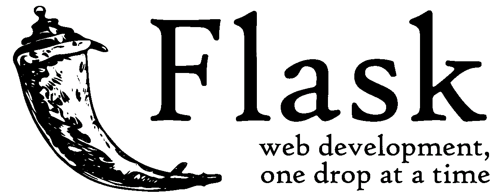

# Python 微 Web 框架烧瓶

> 原文：<https://medium.com/nerd-for-tech/python-micro-web-framework-flask-7b9aa7b9aeaa?source=collection_archive---------7----------------------->



## 介绍

在这篇博客中，我们将了解 Python 微型 Web 框架 Flask。它是用 Python 写的。从最好的标准来看，Flask 是一个小框架。它被归类为微框架，因为它不需要特定的工具或库。它没有数据库概念层或任何其他机制，在这些机制中，预先存在的第三方库提供通用功能。

规模小并不意味着它比其他框架修复得少。Flask 是通过一个可扩展的框架来设计的。Flask 有助于增强应用程序结构的扩展，例如，如果它们被应用于 Flask 中，如上所述。扩展是为对象关系映射器提供的。它们出现在验证、上传行为、许多开放认证技术和一些联合框架相关工具中。

Flask 提供具有基本服务的坚实核心。扩展使得剩下的部分可用。因为我们可以挑选我们需要的扩展包。我们最终得到一个精简的堆栈，它没有膨胀，准确地完成了我们所需要的。

## 描述

烧瓶最初是由阿明·罗纳彻在 2010 年设计开发的。Flask framework 通过其整体配置和依赖关系，代替 Django 项目得到了广泛的开发。

Flask 的成就形成了发行票证和拉取请求方面的一大堆后续工作。多年来，阿明一直用自己的 Github 账户管理 Flask。他最终制作了 Pallets 项目的开源代码库集合。如今，托盘项目作为一个社区驱动的组织发挥了作用。它处理 Flask 和其他相关的 Python 库，例如 Lektor、Jinja 和其他一些库。

Flask 有两个关键的依赖项。

*   Web 服务器网关接口(WSGI)子系统、路由和调试源自 Werkzeug。
*   而模板帮助是由 Jinja2 提供的。

Werkzeug 和 Jinja2 是 Flask 的核心开发者写的。

Flask 中没有对检索数据库、验证 web 表单、验证用户或其他高级任务的内置支持。这些以及其他各种 web 应用程序最需要的重要服务都可以在扩展中获得。与核心包相适应。作为开发者，我们有权选择扩展。这对于项目来说是最好的，或者如果我们有动力的话，直接写自己的。这就是框架更大的冷漠。在一个更大的框架中，大多数选择都是为我们做出的。它们是牢不可破的，或者偶尔很难改变。

为什么选择 Flask web 框架？

Flask 是经过深思熟虑的，比 Django web 框架更 Pythonic 化。这是因为在通常情况下，同一个 Flask web 应用程序是额外显式的。作为初学者，Flask 也很容易相处。因为有一个小的样板代码来接收一个简单的应用程序启动和运行。

## 成分

我们已经讨论过微型框架烧瓶是托盘项目的一部分。因此，它是建立在许多其他的基础上的。

Werkzeug

Werkzeug 一词在德语中用于工具。对于 Python 编程语言来说，它是一个实用程序库。我们也可以说它是 Web 服务器网关接口(WSGI)应用程序的工具包。它在 BSD 许可下获得批准。Werkzeug 可以理解应用程序、回复和实用功能的软件对象。它可以用来构建一个基于它的常规软件框架，并帮助 Python。

**金佳**

金贾是由阿明·罗纳切尔创作的。Python 编程语言是一个 web 模板引擎。它在 BSD 许可下获得批准。Jinja 类似于 Django 模板引擎。它提供了类似 Python 的单词，但确保模板是在沙箱中评估的。它是一种基于文本的模板语言。它可以用来和源代码一起做任何标记。

Jinja 模板引擎支持定制。标签、过滤器、测试和全局变量。它允许模板设计者调用带有对象参数的函数。

**MarkupSafe**

MarkupSafe 是 Python 编程语言的字符串控制库。它是在 BSD 许可证下注册的。同名的 MarkupSafe 类型涵盖了 Python 字符串类型。它将其内容编写为安全的。将 MarkupSafe 与固定字符串相结合的。但是，它避免了先前标记的字符串的双重转义。

它很危险

ItsDangerous 是 Python 编程语言的安全数据系列库。它通过了 BSD 许可证的认证。它用于将 Flask 应用程序的会话存储在 cookie 中，而不允许用户干预会话内容。

## 装置

我们需要唯一安装了 Python 的计算机来安装 Flask。

安装 Flask 最合适的方法是使用虚拟环境。这是 Python 解释器的私有副本，我们可以在上面秘密地安装软件包。这是在不影响安装在我们系统中的全局 Python 解释器的情况下完成的。虚拟环境是非常有价值的，因为它们阻止了系统的 Python 解释器中的包混乱和版本冲突。

为每个应用程序创建一个虚拟环境确保应用程序只接触它们使用的包。尽管如此，全局解释器仍然是有序和干净的。它只是作为一个来源来帮助形成更多的虚拟环境。虚拟环境不需要管理员权限作为附加优势。

键入以下命令，检查我们是否已经在系统中安装了它:

```
$ virtualenv --version
```

如果我们得到一个错误，我们将不得不安装实用程序。

此外，大多数 Linux 发行版都为 virtualenv 提供了一个包。例如，Ubuntu 用户可以用以下命令安装它:

```
$ sudo apt-get install python-virtualenv
```

对于 Mac OS X，我们可以使用 easy_install 安装 virtualenv:

```
$ sudo easy_install virtualenv
```

对于 Microsoft Windows 或任何不提供官方 virtualenv 软件包的操作系统，我们有一个稍微复杂一些的安装过程。

*   使用网络浏览器导航到[https://bitbucket.org/pypa/setuptools](https://bitbucket.org/pypa/setuptools)，setuptools 安装程序的主页。
*   在该页面上查找下载安装程序脚本的链接。
*   将名为 ez_setup.py .的脚本文件保存到计算机上的临时文件夹中。
*   在该文件夹中运行以下命令:

```
$ python ez_setup.py$ easy_install virtualenv
```

*   我们需要创建一个文件夹来存放可以从 GitHub 仓库获得的示例代码。
*   使用下面的命令从 GitHub 下载示例代码。

```
$ git clone [https://github.com/miguelgrinberg/flasky.git](https://github.com/miguelgrinberg/flasky.git)$ cd flasky$ git checkout 1a
```

*   将应用程序文件夹初始化为版本 1a，即应用程序的初始版本。
*   接下来，使用 virtualenv 命令在 flasky 文件夹中创建 Python 虚拟环境。
*   虚拟环境的名称是该命令的一个参数。
*   将在当前目录中创建一个以所选名称命名的文件夹。
*   所有与虚拟环境相关的文件都在里面。
*   虚拟环境通常使用的命名约定是称它们为 *venv* :

$ virtualenv venv

venv/bin/python2.7 中的新 python 可执行文件

同样在 venv/bin/python 中创建可执行文件

安装安装工具……完成。

安装 pip…………完成。

*   我们有一个 *venv* 文件夹在一个崭新的虚拟环境中。它拥有一个私有的 Python 解释器。
*   我们必须激活它才能开始使用虚拟环境。
*   对于 Linux 和 Mac OS X 用户，如果我们使用 bash 命令行，我们可以用这个命令激活虚拟环境:

```
$ source venv/bin/activate
```

*   对于 Microsoft Windows，激活命令是:

```
$ venv\Scripts\activate
```

*   当激活虚拟环境时，Python 解释器的位置被添加到路径中。
*   这种变化不是永久性的。它只会扰乱当前的命令会话。
*   因为我们已经激活了一个虚拟环境，所以激活命令会调整命令提示符以接受环境的名称:

```
(venv) $
```

*   使用虚拟环境并返回到全局 Python 解释器后，在命令提示符处键入 deactivate。
*   使用以下命令将 Flask 安装到虚拟环境中:

```
(venv) $ pip install flask
```

*   Flask 及其依赖项是用这个命令安装在虚拟环境中的。
*   我们可以通过启动 Python 解释器并尝试导入它来验证 Flask 安装是否正确:

```
(venv) $ python>>> import flask>>>
```

*   祝贺你，如果没有错误出现。

更多详情请访问:[https://www . technologiesinindustry 4 . com/python-micro-we b-frame-work-flask/](https://www.technologiesinindustry4.com/python-micro-web-frame-work-flask/)