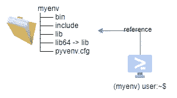

# Python vs C++系列:开发环境设置和虚拟环境

> 原文：<https://medium.com/nerd-for-tech/python-vs-c-series-development-environment-setup-and-virtual-environment-8df69b78bb06?source=collection_archive---------0----------------------->

本文是 [Python 与 C++系列](/nerd-for-tech/python-vs-c-series-getter-setter-and-property-e92d7801c21a)的一部分。不像之前的文章着重于语言差异。，本文将讨论开发环境的设置。不同的语言有不同的工具集，当然，建立工作环境的方式也不同。当我们开始学习一门新语言时，我们问的第一件事可能是我们如何建立一个工作环境。如果我们已经熟悉另一种语言，这种经历可以加快我们的学习过程。当我开始学习 Python 时，C++是我的主要语言。我希望有人能告诉我，我是如何使用我已经知道的概念或术语开始使用 Python 的。这就是我写这篇文章的原因；希望能让其他人受益。虽然这篇文章是为 C++背景编写的，但它对那些想了解 Python 工作环境设置的人也有帮助。

(注意，本系列中的 Python 代码假设使用 Python 3.7 或更高版本)

# C++开发环境设置

人们可能有不同的偏好和工作方式，但是作为 C++程序员，最基本的可能包括以下内容:

1.  根据平台和 C++版本安装工具链，如 [GCC](https://gcc.gnu.org/) 或 [MSVC](https://docs.microsoft.com/en-us/cpp/build/reference/compiling-a-c-cpp-program?view=msvc-170) 。
2.  安装相关库，例如 [Boost 库](https://www.boost.org/)。
3.  开始写代码。

# Python 开发

毫不奇怪，Python 有一个类似的工作流程，但增加了一个步骤——设置虚拟环境。

1.  根据 Python 版本的选择安装 Python。
2.  建立一个虚拟环境。
3.  安装相关库。
4.  开始写代码。

# 虚拟环境

当我们想到虚拟环境时，虚拟机(例如 [VirtualBox](https://www.virtualbox.org/) )和容器(例如 [Docker](https://www.docker.com/) )可能是我们首先想到的东西。然而，Python 虚拟环境是一种比虚拟机和容器简单得多的机制。Python 虚拟环境的概念是一种机制，它允许创建具有各种 Python 版本的环境，以及在环境的站点目录中安装的一组独立的 Python 包。它只是一个目录，包含 Python 解释器、库和它们的安装包，并允许我们拥有一个隔离的环境。

## 我们为什么需要虚拟环境？

考虑我们在多个项目上工作的场景，每个项目都有不同的依赖项或版本。在 C++中，在这种情况下工作可能是不愉快的，尤其是当版本不兼容的时候。如果我们没有多台机器，我们可能需要虚拟机或使用容器来为每个项目提供隔离的环境。但是在 Python 中，我们可以利用虚拟环境机制为每个项目提供隔离的环境，这比虚拟机或容器要便宜得多。

## 怎么用？

从 [Python 3.3](https://www.python.org/downloads/release/python-330/) 开始，该语言已经原生支持虚拟环境。本课程将通过在 Linux 中创建一个名为 *myenv* 的虚拟环境来演示 Python 虚拟环境的主要用途。

*   **创建虚拟环境**

```
user:~$ python -m venv myenv
```

该命令将创建一个名为 *myenv* 的文件夹，并在该文件夹中安装其 Python 二进制文件和默认包(虚拟环境可以是具有任何首选名称的任何位置)。

*   **激活虚拟环境**

创建虚拟环境后，我们可以通过调用激活脚本来激活它。

```
user:~$ source ./myenv/bin/activate
```

一旦虚拟环境被激活，虚拟环境的名称将显示在我们的 shell 上。

```
(myenv) user:~$
```

命令提示符中的文本 *(myenv)* 表示当前 shell 处于 *myenv* 环境中。一旦我们进入虚拟环境，Python 解释器将被指向虚拟环境中的那个。我们可以通过运行 *which python 命令来验证它，向*显示 python 解释器现在位于 *myenv* 文件夹中。

```
(myenv) user:~$ which python 
/home/user/myenv/bin/python
```

同样，如果我们安装一个 Python 包，这个包将被安装到 *myenv* 的站点目录中，在这个例子中是*/home/user/myenv/lib/Python 3.7/site-packages/*。

*   **停用虚拟环境**

一旦我们完成了我们的编码或者想要退出虚拟环境，我们可以使用*去激活*命令来离开虚拟环境。虚拟环境停用后，我们的外壳就正常了。

```
(myenv) user:~$ deactivate
user:~$
```

由于 Python 虚拟环境只是一个文件夹，如果我们不再需要它或者想要重新开始，我们可以通过删除虚拟环境文件夹 *myenv* 来实现，在这种情况下——没有剩余。

## 它是如何工作的？

当执行 *python -m venv myenv* 命令时，该命令会创建一个名为 *myenv* 的文件夹，并创建一个我们执行该命令的 python 二进制文件到 *myenv* 文件夹的符号链接。该命令还将我们执行该命令的 Python 解释器中的其他相关文件复制到 *myenv* 文件夹中。换句话说，虚拟环境是我们用来创建虚拟环境的 Python 环境的副本。例如，如果我们的系统有 Python 3.7，并且我们使用它来创建一个名为 *myenv* 的虚拟环境，那么虚拟环境 *myenv* 只是系统 Python 3.7 的克隆。

当我们激活它时，激活脚本通过将虚拟环境的路径附加到变量 *PATH* (如果是 Linux)来更新 shell。以下代码片段是导出路径的激活脚本的一部分。

```
…
VIRTUAL_ENV="/home/user/myenv"
export VIRTUAL_ENV

_OLD_VIRTUAL_PATH="$PATH"
PATH="$VIRTUAL_ENV/bin:$PATH"
export PATH
…
```

因此，我们可以用下图来概括 Python 虚拟环境的概念。



当我们需要安装一个包时，无论是 [pip](https://pip.pypa.io/en/stable/) 还是其他包安装程序，这个包都会被安装到我们例子中的*myenv/lib/python 3.7/site-packages/*文件夹中。因此，我们可以使用虚拟环境来管理每个项目的依赖性，而不会与其他项目发生冲突。

## Python 虚拟环境笔记

虽然 Python 虚拟环境非常方便，但是在使用虚拟环境时，我们需要注意一些事情。

首先，隔离只发生在 Python 级别。与提供整个虚拟化计算机系统的虚拟机不同，Python 虚拟环境只是现有 Python 及其站点目录(即我们安装 Python 包的地方)的副本。如果我们的代码或 Python 包有外部依赖，如 C/C++库，Python 虚拟环境不能隔离它们，将使用系统中任何可用的东西。

其次，当我们创建一个虚拟环境时，它的 Python 版本将与我们用来运行 create 命令的 Python 二进制文件相同。例如，如果我们的系统只有 Python 3.7，我们只能创建一个拥有 Python 3.7 的虚拟环境。因此，如果我们想用 Python 3.9 创建一个虚拟环境，我们需要用 Python 3.9 创建一个有 Python 3.9 的虚拟环境。

然而，在我们的系统中安装多个版本的 Python 是一件痛苦的事情，并且很难在它们之间切换。幸运的是，许多工具试图简化这项工作。最流行的解决方案之一是 [pyenv](https://github.com/pyenv/pyenv) 。 *Pyenv* 允许我们安装多个 Python 版本，并提供了在它们之间切换的简单方法(查看[简单 Python 版本管理:pyenv](https://github.com/pyenv/pyenv#simple-python-version-management-pyenv) 了解更多信息)。至此，我们创建工作环境的工作流程如下。

1.  使用 *pyenv* 切换到所需的 Python 版本。
2.  使用所需的 Python 版本创建虚拟环境。
3.  激活虚拟环境。
4.  将依赖项安装到虚拟环境中。

第三，由于虚拟环境只是一个包含 Python 解释器及其站点目录的克隆的目录，所以不建议在项目中创建虚拟环境，尤其是如果项目是由 Git 之类的源代码控制系统管理的话。相反，常见的是[在一个公共位置](https://docs.python.org/3/library/venv.html#creating-virtual-environments)下创建虚拟环境，例如*。venv* 。

# 软件包安装

我们不太可能只使用语言的标准库来编写程序。我们经常利用其他库来构建我们的程序。在 C++中，我们通常会访问库的网站，下载并安装它。安装库的方式取决于库——使用安装程序(如果提供的话),自己构建，或者甚至手动将其复制到适当的位置(例如， */usr/local/lib/* )。在 Python 中，找到库最常见的地方是 [PyPI](https://pypi.org/) ，安装 Python 库最常见的方式是 [pip](https://pip.pypa.io/en/stable/) 工具。

PyPI 代表 Python 包索引，这是 Python 语言的软件仓库。它可以被视为托管 Python 项目的中心位置。所以，我们可以从 PyPI 中找到大多数 Python 开源。

尽管安装 Python 包的方法有很多种，但 pip(Python 的包安装程序)是事实上安装和管理 Python 包的推荐工具。开箱即用，pip 连接到 PyPI，因此安装 Python 包可以像下面这样简单(以 [NumPy](https://numpy.org/) 为例)。

```
$ python -m pip install numpy
```

该命令将从 PyPI 下载 NumPy 包，并将其安装到 Python 环境的 *site-packages* 文件夹中，例如*myenv/lib/Python 3.7/site-packages/*。

注意，我们可能会看到许多文档或包安装说明，比如使用 *pip* 来安装一个包，而命令中没有 *python -m* 。举个例子，

```
$ pip install numpy
```

虽然这是有效的，但是推荐使用带有 *pip* 的 *python -m* 。原因是 *-m* 参数(详见 [-m](https://docs.python.org/3/using/cmdline.html#cmdoption-m) )告诉 Python 解释器将 *pip* 作为主模块运行。这意味着当使用 *python -m* 和 *pip* 时，我们执行 *pip* 位于我们指定的 python 解释器的确切位置，例如 *myenv/bin/* 。如果不使用 *python -m* ，将要使用的 *pip* 将取决于我们系统的*路径*。因此，它不能确保使用哪个 *pip* 。

*pip* 的另一个注意事项是 *pip* 也可以配置为连接私有或本地存储库。如果我们有存放 Python 包的仓库，我们仍然可以使用 pip。关于安装 Python 包的更多细节可以在[安装包— Python 打包用户指南](https://packaging.python.org/en/latest/tutorials/installing-packages/)中找到。

# 结论

Python 和 C++(可能还有其他语言)之间的显著区别是虚拟环境的使用，我们应该始终使用虚拟环境进行 Python 开发。

*原载于 2022 年 10 月 4 日*[*https://shunsvineyard . info*](https://shunsvineyard.info/2022/10/03/python-vs-c-series-development-environment-setup-and-virtual-environment/)*。*