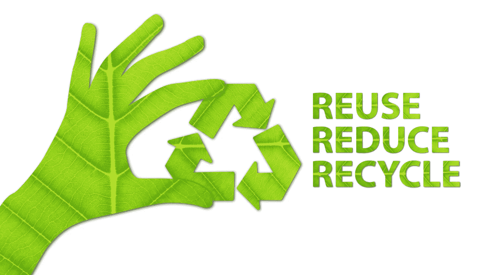
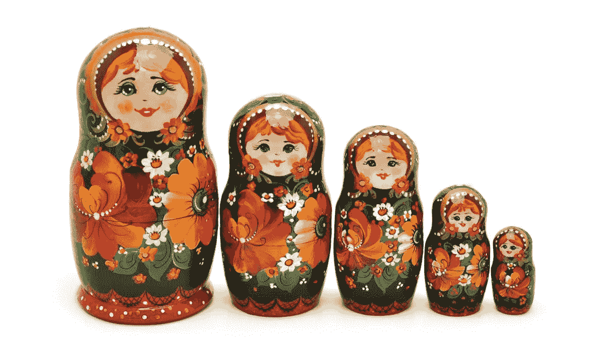

# rails——使用视图缓存增强应用程序性能

> 原文：<https://medium.com/nerd-for-tech/rails-enhancement-application-performance-using-cache-on-views-513d279e473e?source=collection_archive---------9----------------------->

可持续发展的 3r 形象:再利用、减少和回收

> verso em português do post no link[https://medium . com/sumone-technical-blog/rails-melhorando-a-performance-das-suas-views-com-cache-C4 e 318 a 7 df 45](/sumone-technical-blog/rails-melhorando-a-performance-das-suas-views-com-cache-c4e318a7df45)

当我们谈论应用程序性能时，缓存是最常用的方法之一。关于缓存的思考可以类似于[环境可持续性 3R 规则](https://www.fiaformulae.com/en/news/2014/october/sustainability-the-3-r-s-rule.aspx):我们**减少**资源和应用程序负载和请求的使用，**重用**先前处理和保存的资源，而我们需要**不时地回收**那些资源，以维护与用户相关的所有信息，并且不显示过时和旧的信息。

说起 rails 应用，缓存并不是一个新话题。它从框架一开始就存在，但是如果我们没有真正理解如何使用和回收它，那么犯错误是很常见的。

我非常喜欢 rails 的一点是可以在 rails 视图中直接使用缓存，缓存 erb 生成的 html。这种方法也被称为[俄罗斯娃娃缓存](https://guides.rubyonrails.org/caching_with_rails.html#russian-doll-caching)。

## 什么是俄罗斯娃娃缓存？

一个俄罗斯娃娃，所有的“孩子”都并排在一起

[rails 指南](https://guides.rubyonrails.org/caching_with_rails.html)是关于高速缓存的一个很好的信息来源，并且有一个关于这种方法的独家主题，在那里您可以详细了解并查看如何使用的示例。简而言之，这是在视图中使用的链式缓存，其中您在另一个缓存的视图片段内的一个较小的视图片段中使用缓存。这个名字的灵感来自古老的俄罗斯娃娃，如上图所示。

## 在视图中使用缓存

我们可以在 rails 视图中直接使用助手方法`cache`。正如我们在[文档](https://api.rubyonrails.org/classes/ActionView/Helpers/CacheHelper.html#method-i-cache)中看到的，这个方法接收 1 到 2 个参数和一个代码块。第一个也是必需的参数是 object，第二个也是可选的参数是 options hash。传递的代码块是经过处理并生成 html 片段后将保存在缓存中的内容。还有另外两种方法可以在视图中直接使用，在这里可以传递一个条件参数:`cache_if` ( [doc](https://api.rubyonrails.org/classes/ActionView/Helpers/CacheHelper.html#method-i-cache_if)) )和`cache_unless` ( [doc](https://api.rubyonrails.org/classes/ActionView/Helpers/CacheHelper.html#method-i-cache_unless) )。

例如，假设我们需要构建一个包含作者列表的页面，其中包含每个作者的姓名、书籍数量和上一本书的出版日期。为了使这个练习更容易，我们现在不要担心分页。

让我们使用上面的代码来理解 rails 将如何处理缓存。当页面被渲染时，它将首先检查传递给`cache`的所有块是否已经被处理并保存在缓存中。如果在缓存存储中找到它，它将不会使用保存在缓存存储中的先前处理和生成的 html 再次处理该块。否则，它将处理该块，生成一个新的 html 片段，并将其保存在缓存中以备将来使用。

## 缓存失效

关于缓存最困难的事情之一是正确地使它无效。我们可能会忘记使缓存键无效。当这种情况发生时，我们会看到过时和无效的信息。使一些缓存失效的最简单的方法是定义一个截止日期。

使用可选的散列参数，您可以在调用`cache`方法时将时间戳传递给`expires_in`键来定义到期日期，正如我们在下面的示例中看到的:

通过这种方式，我们保证这个页面最多会有 1 小时的延迟。在某些情况下这就足够了，但是如果我们想确保信息总是最新的呢？如果页面总是显示新信息很重要，该怎么办？

为了做到这一点，我们必须真正理解当我们在视图中直接调用`cache`时，rails 是如何定义缓存键的。为了定义缓存键，rails 将使用至少三个信息:首先是可以唯一识别对象传递的信息；另一个标识缓存新鲜程度的信息，换句话说，一个时间戳，它显示所传递的对象的最新信息是何时保存的；最后，传递给`cache`方法的唯一标识代码块的信息。

在以上段落中使用的作者列表示例中，这将与 rails 一起工作，为作者查询生成一个标识符，并为被查询的作者获得计数结果和`updated_at`列的最大值。除此之外，rails 将生成一个散列来标识传递的代码块。我们可以在下图中看到所有这些，在显示`read fragment`动作输出的行中。它显示了一个字符串，该字符串包含所用部分的路径，后跟代码块哈希标识符、查询标识符和作者计数 4219，以及最大 updated _ at 20210132190705856638 结果。

显示带有缓存信息键的 rails 控制台输出的控制台图像

使用所有这些信息，rails 使我们处理缓存失效变得容易多了。因为它在缓存键中使用 authors count，所以如果在数据库中创建了另一个作者，它将生成一个新键并使旧键失效。这同样适用于数据库中任何作者处理的任何更新，它将更新`updated_at`列并自动使旧的缓存键失效。最后，使用查询和代码块散列标识符使得如果我们改变查询或改变缓存的 erb 片段中的某些内容，它将获得更新的查询/erb 片段并生成具有最新信息的新缓存成为可能。

## 缓存中的缓存—使用俄罗斯娃娃方法

在上面的作者列表页面示例中，我们看到了如何拥有一个始终为整个页面工作的缓存。如果单个作者的名字被更改，整个页面缓存将失效，所有列表将被重新加载并重新生成。如果页面中有一个非常大的列表，这可能是一个问题。

俄罗斯娃娃缓存是解决这个问题的一个非常好的和有用的选择。使用这种方法，我们不仅可以缓存作者列表，还可以缓存每个作者片段。

它的工作原理和我们之前看到的作者列表缓存一样。不同之处在于，time rails 将对每个作者片段执行这些步骤，为每个作者片段生成一个缓存键，使用每个代码块的标识符哈希、作者 id 和 updated_at 信息。

显示 rails 控制台输出的控制台图像，其中包含每个次要作者片段的缓存信息键

在上图中，我们可以看到 rails 将对每个片段执行读取片段动作。我们可以看到缓存键模式与作者列表缓存中使用的模式相同——代码块标识符、对象标识符和时间戳。

通过这一更改，现在将在三种可能的情况下加载和处理页面:

*   如果作者没有改变，则对整个页面列表使用缓存
*   使用片段缓存并处理一个或多个作者片段，对于每个有新信息的作者，这些信息以前没有保存在缓存中。在这种情况下，它将为整个列表生成一个新的缓存值，并保存它以供下一个请求使用
*   处理所有的片段和列表块，并为每个片段和列表块生成一个缓存，保存起来供以后使用。

## 多模型信息缓存

到目前为止，本文中使用的所有示例都让我们认为 rails 会处理好一切，我们不需要担心任何事情，只需使用缓存就可以了。

这在一定程度上是正确的。Rails 确实处理了很多事情，使得在 rails 应用程序视图中使用缓存更加容易。但是它不能单独处理一种情况:同时缓存多个模型。

让我们回到我们的作者列表示例。在这个页面中，我们显示了作者的名字，书籍数量和最后出版的日期。最后两个信息不是来自作者表，它们与图书表有关。实际上，如果我们为某个作者创建另一本书，页面将不会正确显示图书数量和最后出版日期，因为它不知道我们刚刚添加的这本新书。发生这种情况是因为向数据库添加新书的操作不会改变用于生成页面上使用的缓存键的任何信息。它既不改变作者查询的代码块，也不改变作者查询计数或任何作者的`updated_at`列。

我们可以使用两种方法。最简单的方法是将对象列表作为第一个参数传递给`cache`方法。这个列表应该包含所有可能影响缓存的对象，包含代码块中使用的信息。

这样做，rails 会将列表中所有对象的信息添加到缓存键中，因为现在缓存的对象是列表，而不仅仅是作者，正如我们在下面看到的。

我们需要谨慎对待这种方法，因为我们传递的每个对象都会增加 rails 检查和加载缓存所需的查询。它还会生成更复杂的缓存键。

另一种方法，我个人更喜欢和使用的，是当作者的一本书被更新、创建或删除时，“更新”作者。我们也可以用 rails 轻松解决这个问题，我们只需要确保当通讯作者的一些书有任何变化时，我们会更新他的专栏。我们可以这样做，将`touch: true`参数添加到图书模型中的图书`belongs_to :author`关系，如下所示:

不同之处在于，在第一种方法中，我们向图书 CRUD 操作添加了更多的负载，我们向页面加载添加了更多的负载和复杂性，我们希望提高性能以获得更好的用户体验。

## 结论

使用缓存是提高 rails 应用程序性能的一种非常有用的方法。Rails 通过它的助手和缓存键规则使得使用起来更加容易。在大多数情况下，您只需要确保不使用跳过模型回调和验证的方法(比如`update_column`)，所有的 rails 都会处理好。在某些情况下，在同一个片段缓存中使用多个模型，您可以将两个对象作为一个列表传递给`cache`方法，或者，我更喜欢并且认为更好的是，您可以使用带有`touch: true`选项的`belongs_to`来“更新”关系模型。

使用缓存时需要知道的最重要的事情是理解缓存键以及如何正确地生成这些键。

## 更多示例

我创建了一个[项目](https://github.com/jplethier/russian-doll-cache-examples)，作为我写这篇文章的基础，在那里你可以找到更多的例子和场景。这些场景总是有一个带缓存的版本和一个不带缓存的版本，因此您可以比较 erb 文件中的差异。要在本地运行项目并运行缓存版本页面，只需将 env var `CACHE_ON`设置为 true。

## 其他资源和链接

 [## Rails 缓存:概述——Ruby on Rails 指南

### 使用 Rails 进行缓存:概述本指南介绍了如何使用缓存来加速 Rails 应用程序。缓存…

guides.rubyonrails.org](https://guides.rubyonrails.org/caching_with_rails.html) 

[https://blog . app signal . com/2018/04/03/Russian-doll-caching-in-rails . html](https://blog.appsignal.com/2018/04/03/russian-doll-caching-in-rails.html)

 [## 用 Rails 5 缓存俄罗斯娃娃(示例)| GoRails - GoRails

### 你的老师|克里斯奥利弗大家好，我是克里斯。我是 GoRails，Hatchbox.io 和 Jumpstart 的创造者。我花时间…

gorails.com](https://gorails.com/episodes/russian-doll-caching-with-rails-5)