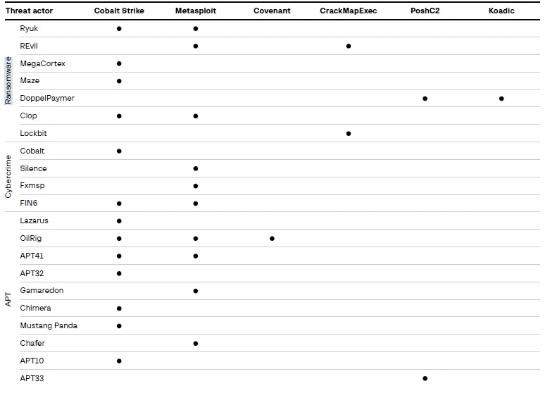

# 勒索软件攻击飙升，助推更恶意

> 原文：<https://medium.com/nerd-for-tech/ransoms-soar-and-boost-more-malicious-a952755d6147?source=collection_archive---------24----------------------->

根据许多供应商的报告，2021 年威胁行为者瞄准受害者索要更多的钱，今年受害者支付的赎金跃升 200%以上，超过 30 万美元。此外，赎金要求在去年有所增加，赎金要求增加到 5000 万至 7500 万美元，我从新闻中听到的最后一条消息是，威胁分子向宏碁电脑索要 5000 万美元。

**不确定性中的网络安全**

自去年以来，不可预见的漏洞不断增加，对安全堆栈的影响超过了已知的漏洞。虽然安全和业务转型仍在继续，但由于无效的配置和缺乏对堆栈的衡量，SecOps 的性质为威胁参与者打开了大门。

在整个疫情，各种组织都专注于确保核心业务功能，并需要知道他们的基础架构不会被攻击中断，与此同时，高管们正在将更多的自动化视为其运营的重要组成部分

勒索软件仍然是关键的攻击媒介之一。在成千上万的受害者中，威胁行为者并不总是要求金钱，他们也泄露其公司数据，这些数据被勒索软件团伙发布在数据泄露黑市网站上。最终，清除勒索软件的后果是许多公司负担不起的，并且妥协评估项目的平均成本超过每个事件 10 万美元以上。

**同样的故事，不同的情节**

通过勒索软件即服务(RaaS)传播的恶意软件导致了国家行为者复杂攻击活动的激增。

为了增加他们的利润，国家支持的团体，一旦渗透到目标，他们已经开始向其他威胁者或恶意软件加载者出售公司网络的初始访问权，这是恶意工具的一部分。

在许多攻击活动中，最初的威胁参与者提供网络访问权限，空客和波音攻击就是很好的例子。网络罪犯基本上使用了两种后利用方法，通过横向移动来增加他们的持久性，并获得对目标网络的控制。

不幸的是，很难发现勒索软件集团攻击的严重事件。事实上，赎金应该由受害者支付，即使已经支付了赎金。1%交了赎金却没有拿回自己的数据。根据 Sophos Ransomware report 2020，瑞典的赎金支付率位居第二。同一调查结果中有趣的一点是，与不支付赎金或从备份中取回数据相比，支付赎金超过了总体补救成本。也许不付赎金会让你感觉更舒服，因为你没有付钱给网络罪犯。

将成功的攻击集中在网络上需要东西桥的工具，以在野外将横向移动和特权升级武器化。犯罪分子导致后利用框架被更频繁地使用，例如勒索软件分支机构/合作伙伴和国家支持的行为者使用的框架。

2021 年 IB 组高科技犯罪趋势

## 对抗勒索软件

*   定期练习识别和分类最初妥协的迹象、方法、工具、用于在网络中获得持久性的策略以及横向移动。一般的攻击技术通常很简单，可以通过人类的专业知识和工具发现。更复杂的攻击只能由威胁猎人识别。
*   利用红队活动和连续笔测试，定期检查您的基础架构是否存在已知和不良的危害迹象。
*   勒索病毒 bug bounty 和众包笔测试程序的成功将强化您的网络和安全实践，以抵御威胁参与者。
*   强烈建议使用可操作的 CTI 环境和威胁归因。
*   确保您的安全投资能够检测/防止针对新兴 TTP 和利用后攻击的攻击。
*   确保有足够数量的训练有素的安全人员参与你的安全任务。

# 参考

*   Sophos 勒索软件 2020 报告
*   2021 年 IB 组高科技电子商务趋势报告
*   Synack 2020 信任报告