# 树莓派 4 作为您的个人广告拦截器

> 原文：<https://medium.com/nerd-for-tech/raspberry-pi-4-as-your-personal-ad-blocker-ef5fd7ecc840?source=collection_archive---------3----------------------->

# 目标

通过对家庭网络上的所有设备进行简单设置，消除侵扰性广告、在线跟踪，并保护您的计算机免受恶意软件的侵害。

# 问题

网站广告:看到许多网站(大部分是免费新闻网站)越来越多地提供侵入性广告，这非常令人恼火。不仅如此，广告是重复的，有时非常令人不快。

**手机/平板电脑应用内广告**:这些广告不仅限于网站。打开一个相当受欢迎的本地新闻应用，你会看到广告。许多免费应用程序充斥着过多的广告。不仅仅是广告，这些应用程序还会跟踪和监控你的搜索/使用。

**其他问题:**

*   *恶意软件网站*:提供恶意软件、恶意内容的网站
*   *成人内容等*

# 解决办法

解决这些问题的一些方法:

1.  **浏览器扩展**:使用 [Brave](https://brave.com/) 之类的浏览器，或者 AdBlock 之类的浏览器扩展——设置起来很容易，但是 ***对应用内广告*** 不起作用
2.  **带广告拦截器的 VPN**:连接到一个可以拦截所有广告和追踪器的 VPN 服务器——你需要连接到一个开放的 VPN 服务器(这是 ***不安全的*** )或者， ***为 VPN 提供商购买一个定期订阅***
3.  **广告拦截器 DNS 服务器**:在你的本地 wifi 网络上设置一个全网广告拦截器软件。一次花费但会带来心灵的平静:)

让我们看看第三个选项。一般来说，安装这样的软件意味着你需要一台笔记本电脑，或者一台 24x7 运行广告拦截软件的个人电脑，以便为连接在你的 wifi 网络上的其他设备提供不间断的服务。

如果你没有备用的电脑或笔记本电脑怎么办？

别担心！让我们来看看一个便宜的替代方案:**运行全网广告拦截软件的树莓 Pi 4**。

# 最低设置要求

*   连接到本地网络的计算机
*   访问你的 Wifi/路由器(在我的例子中，是 Google Nest Wifi)
*   [树莓 Pi 4](https://www.raspberrypi.org/products/raspberry-pi-4-model-b/) (最好是 2GB 或 4GB)
*   [USB-C 充电器](https://www.raspberrypi.org/products/type-c-power-supply/) (5.1V / 3.0A DC)
*   [树莓 Pi 4 案](https://www.raspberrypi.org/products/raspberry-pi-4-case/)
*   MicroSD 卡(最好是高续航的那种；16GB 或更多)或者 USB 闪存驱动器

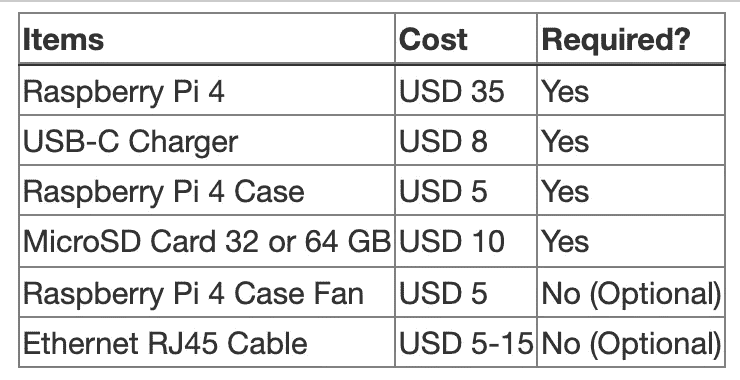

## 需要时间

1-1.5 小时

## 所需技能

*   在 Linux 操作系统上安装软件
*   更改本地 wifi 路由器的设置
*   在终端/命令提示符下执行系统命令

# 步伐

## 步骤 1:安装 MicroSD 卡或 USB 驱动器

*   将 MicrosSD 卡或 USB 闪存驱动器连接到计算机


*   用 SD 读卡器或 u 盘下载并安装 Raspberry Pi Imager 到你的电脑:[Windows](https://downloads.raspberrypi.org/imager/imager_latest.exe)|[MAC OS](https://downloads.raspberrypi.org/imager/imager_latest.dmg)|[Ubuntu Linux](https://downloads.raspberrypi.org/imager/imager_latest_amd64.deb)
*   打开 Raspberry Pi 成像仪
*   点击“选择操作系统”

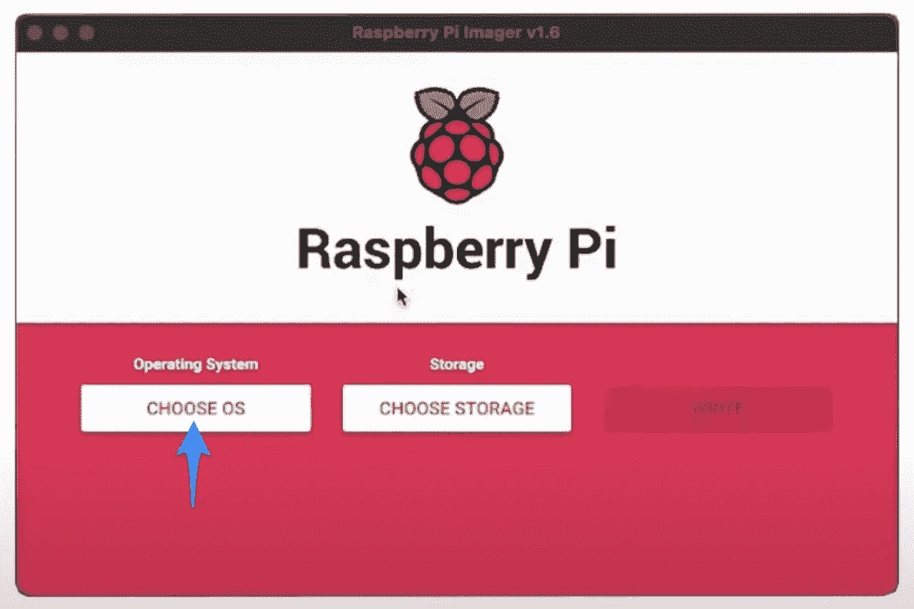

*   点击“Rapberry Pi OS”

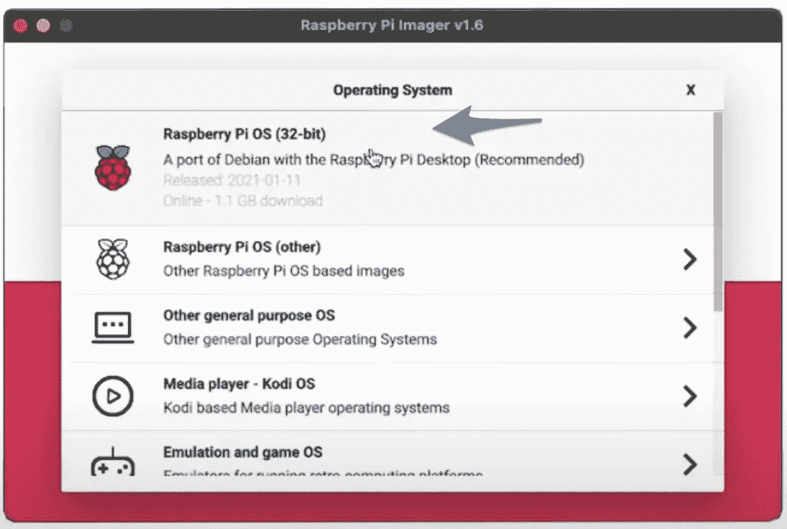

*   按下 *Ctrl + Shift + X*
*   在高级选项屏幕上，选择“启用 SSH”选项。另外，检查“*使用密码认证*”。“为‘pi’用户设置密码”为 ***树莓*** *。*或者，设置一个你能记住的密码。我们需要密码来连接董事会。注意:我们将使用 SSH 访问 Raspberry Pi(不需要单独的监视器/显示器来连接)。

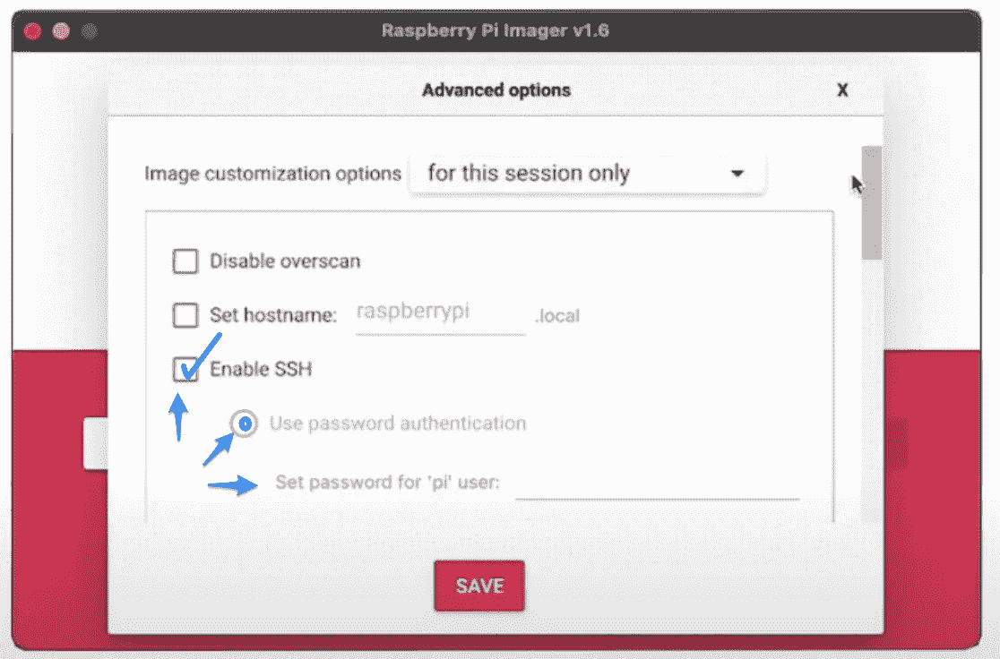

*   检查*设置区域设置*。输入适当的*时区*和*键盘布局*信息。

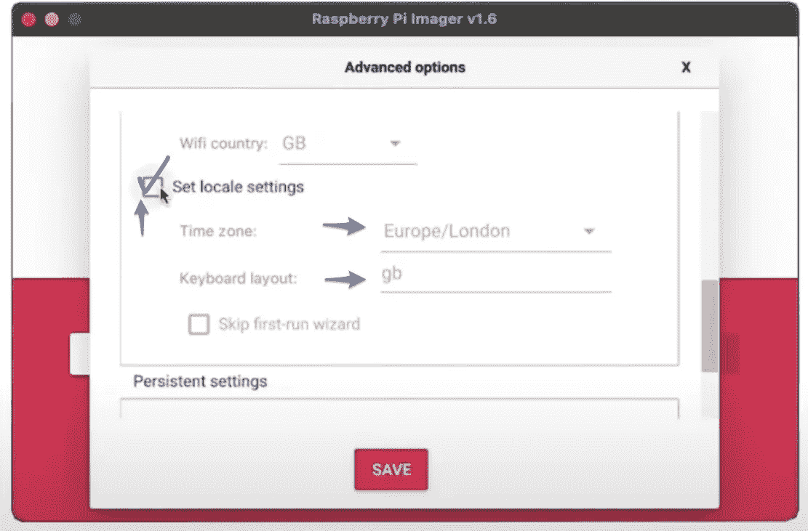

*   **可选:**如果您想用 wifi 连接 Raspberry Pi，请输入您本地 Wifi 网络的 *SSID* 和*密码*

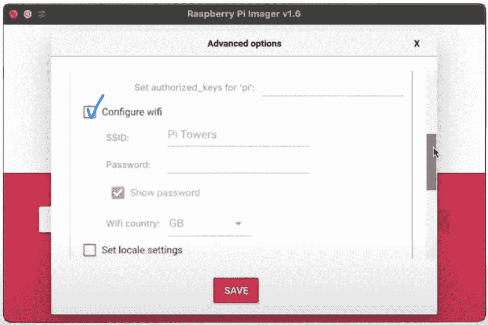

*   点击“保存”按钮
*   点击“选择存储”并选择 MicroSD 卡(或 USB 驱动器)

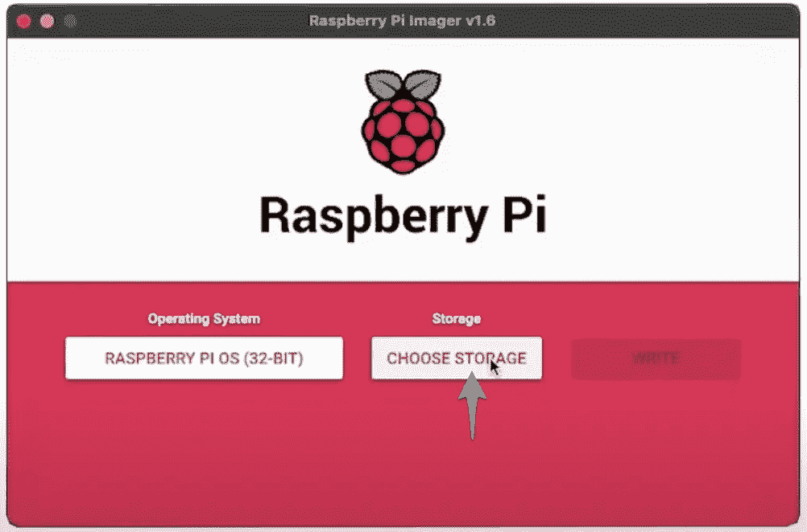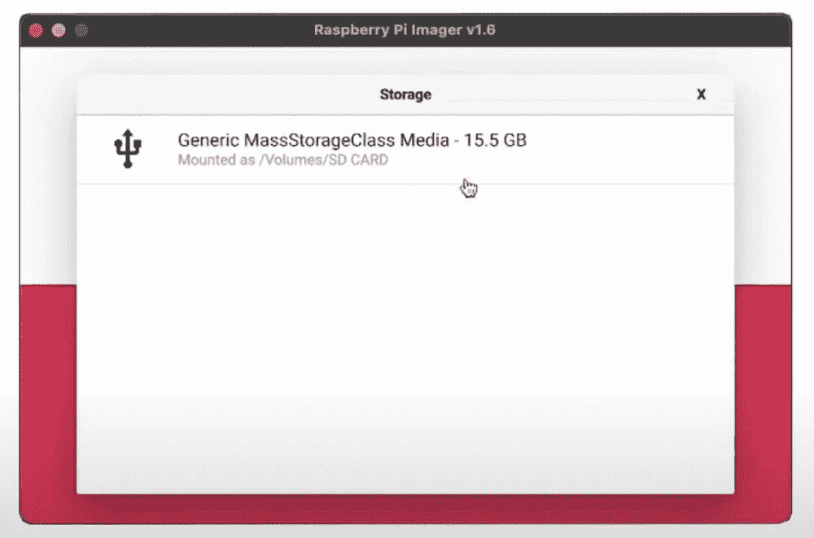

*   选择 MicroSD 卡或 USB 驱动器后，点击“写入”按钮。您可能会看到一个警告对话框:“将清除…上的所有现有数据。您确定要继续吗？”。点击“是”按钮。

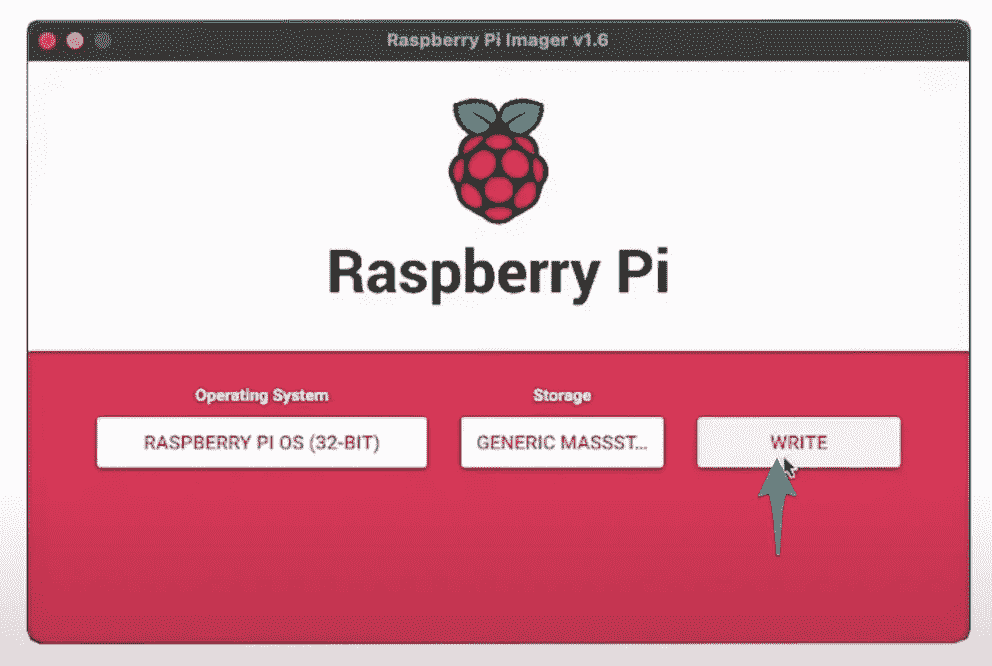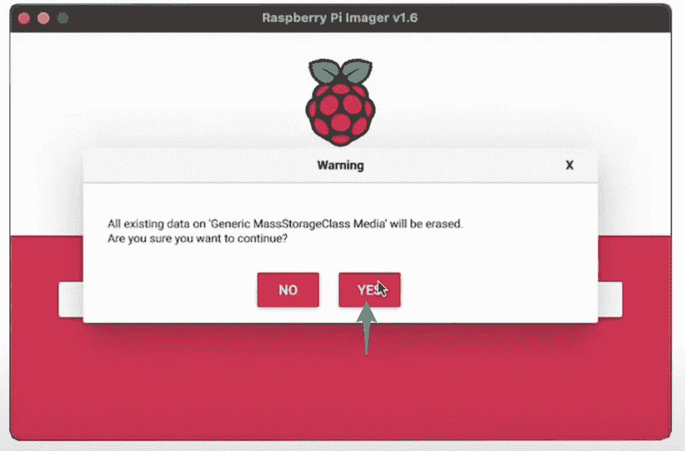

*   你可能会注意到一个进度条。如果一切顺利，您应该会看到“写入成功”对话框。点击“继续”按钮，取出 MicroSD 卡(或 USB 驱动器)。

## 步骤 2:连接树莓 Pi

*   I**n 插入包含上一步创建的 Raspberry Pi 操作系统映像的 MicroSD 卡**。(或者，将 USB 驱动器连接到 USB 端口，只需要其中一个端口)

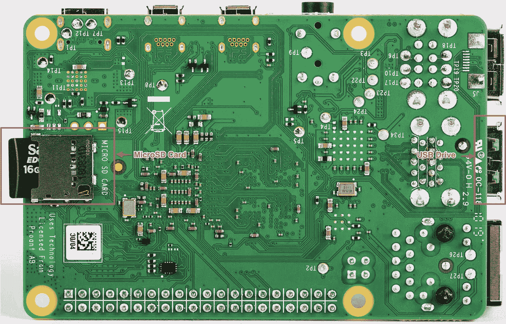

*   **用以太网线**连接路由器和 Raspberry Pi 板。如果您没有以太网电缆，或者您的路由器没有空的以太网端口，您可以使用 wifi 连接。要使用 wifi，您必须在创建映像时设置 wifi SSID 和密码凭据。
*   **将 Raspberry Pi 与 USB-C 充电器**连接，然后将充电器连接到电源。*注意:树莓 Pi 板连接到 USB-C 充电器后，切勿触摸，以免触电，除非您已关闭电源。*

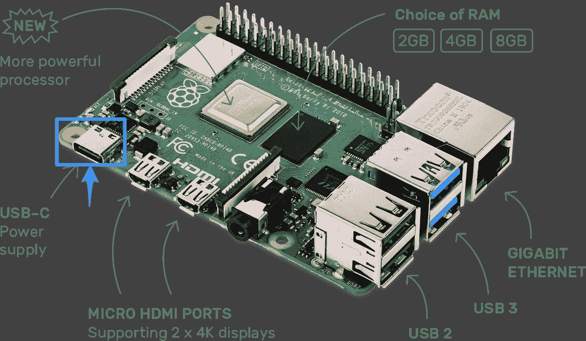

看看你的路由器手册，更改路由器设置，为 Raspberry Pi 预留一个 IP 地址。记下 IP 地址。以我为例，我在我的 Google Nest Wifi 上预订了 192.168.86.28。*我们需要静态/保留的 IP 地址，以便其他设备可以使用相同的 IP 地址连接到 Raspberry Pi。您可以在:*找到为 Dlink、Google Wifi、华硕路由器预留 IP 地址的步骤

> [**Dlink**](https://eu.dlink.com/uk/en/support/faq/cameras-and-surveillance/mydlink/settings/router/how-do-i-configure-dhcp-reservation-on-my-dir-series-router) **路由器**:[https://eu . Dlink . com/uk/en/support/FAQ/camera-and-surveillance/myd link/settings/Router/how-do-I-configure-DHCP-reservation-on-my-dir-series-Router](https://eu.dlink.com/uk/en/support/faq/cameras-and-surveillance/mydlink/settings/router/how-do-i-configure-dhcp-reservation-on-my-dir-series-router)
> 
> [**谷歌巢 Wifi**](https://support.google.com/googlenest/answer/6274660):[https://support.google.com/googlenest/answer/6274660](https://support.google.com/googlenest/answer/6274660)，
> 
> [华硕路由器](https://www.asus.com/sg/support/FAQ/114068/):[https://www.asus.com/sg/support/FAQ/114068/](https://www.asus.com/sg/support/FAQ/114068/)

*   打开您的计算机，它应该在同一个本地网络上。
*   ***Mac/Linux*** :打开**终端**应用。我们将使用`ssh pi@<ip_address>`例如`pi@192.168.86.28`命令来连接到 Raspberry Pi。将`<ip_address>`替换为您在上一步中保留的 IP 地址。当连接工作时，您将看到一个安全性/真实性警告。键入`yes`继续。您只会在第一次连接时看到此警告。
*   ***Windows*** : [下载安装 Putty](https://www.chiark.greenend.org.uk/~sgtatham/putty/latest.html) 应用。在**主机名**字段下输入`pi@<ip_address>` ，例如`pi@192.168.86.28`。点击“打开”按钮。此外，当出现安全警告对话框时，单击“是”按钮。Raspberry Pi 操作系统的默认登录是`pi`，密码是`raspberry`。

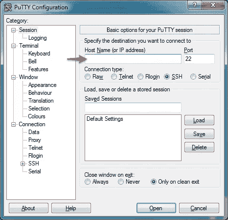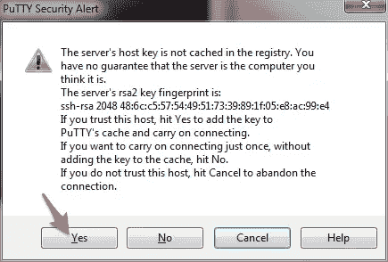

## 步骤 2:配置树莓 Pi

*   首次登录 Respberry Pi 时，您应该看到带有选项的“ ***树莓 Pi 配置工具*** ”。如果您没有看到它，只需在 SSH 登录后运行命令`sudo raspi-config`。当询问密码时，输入密码`raspberry`

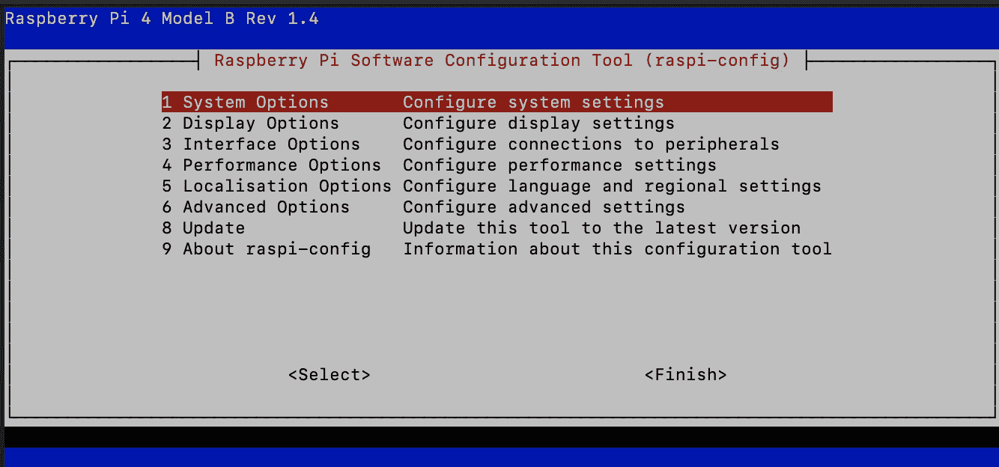

*   您可以选择配置无线设置: ***1 系统选项> S1 无线局域网*** 如果您想无线访问树莓派
*   (可选)如果您想为 Raspberry Pi 设置新密码，您可以选择使用: ***1 系统选项> S3 密码*** 设置新的 SSH/VNC 密码。注意:更改为新密码后，您必须为 SSH/VNC 连接使用相同的密码。更改默认密码是一个**最佳实践**；请做它。
*   按几次 *Esc* 键退出树莓 Pi 系统配置。

## 步骤 3:树莓 Pi 上的广告拦截器设置

*   从 SSH 客户端运行以下命令。您将下载 AdGuard 应用程序并将其解压缩。

```
sudo apt update
sudo apt full-upgradewget [https://static.adguard.com/adguardhome/release/AdGuardHome_linux_arm.tar.gz](https://static.adguard.com/adguardhome/release/AdGuardHome_linux_arm.tar.gz)tar xvf AdGuardHome_linux_arm.tar.gz
```

*   安装 AdGuardHome

```
cd ~/AdGuardHome
sudo ./AdGuardHome -s install
```

*   当您第一次运行 AdGuard Home 时，它将开始监听`0.0.0.0:3000`，并提示您在浏览器中打开它:

```
AdGuard Home is available on the following addresses:
Go to http://127.0.0.1:3000
Go to http://X.X.X.X:3000
```

*   您将完成初始配置向导。记下 DNS 服务器的 IP 地址。它应该与我们到目前为止一直使用的保留 IP 地址相同(用于 SSH 访问等。)
*   为 AdGuard Home 应用程序设置用户名和密码。注意:不要使用与 Raspberry Pi 系统用户`pi`相同的用户名和密码(出于安全考虑)。

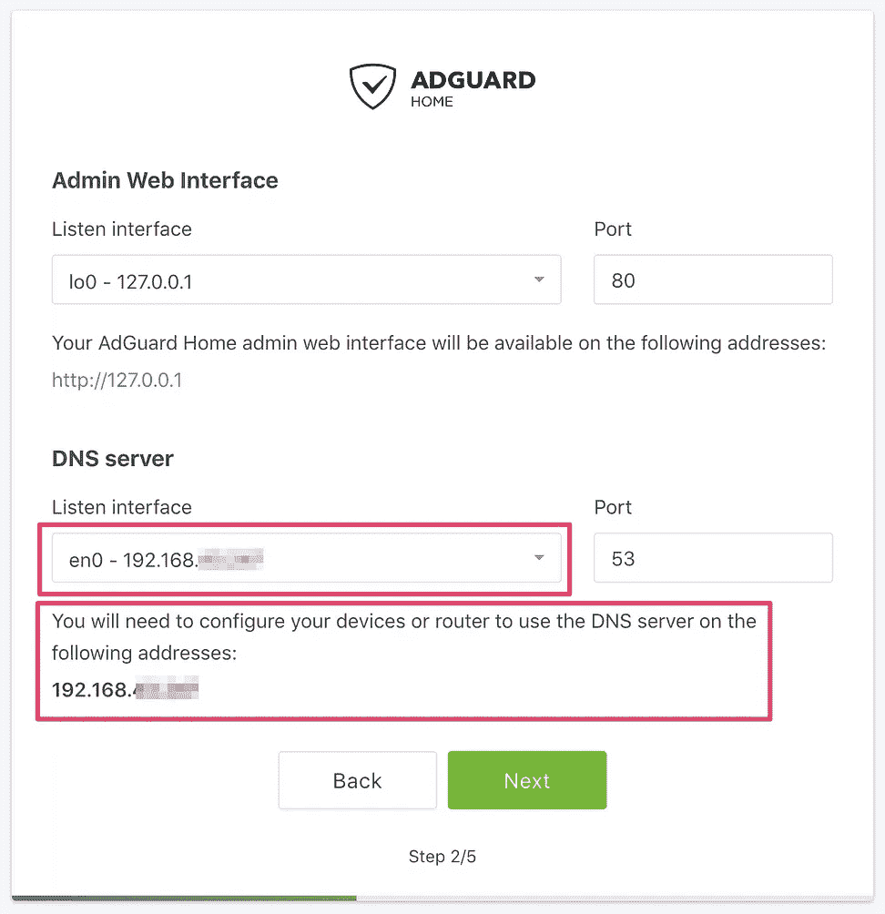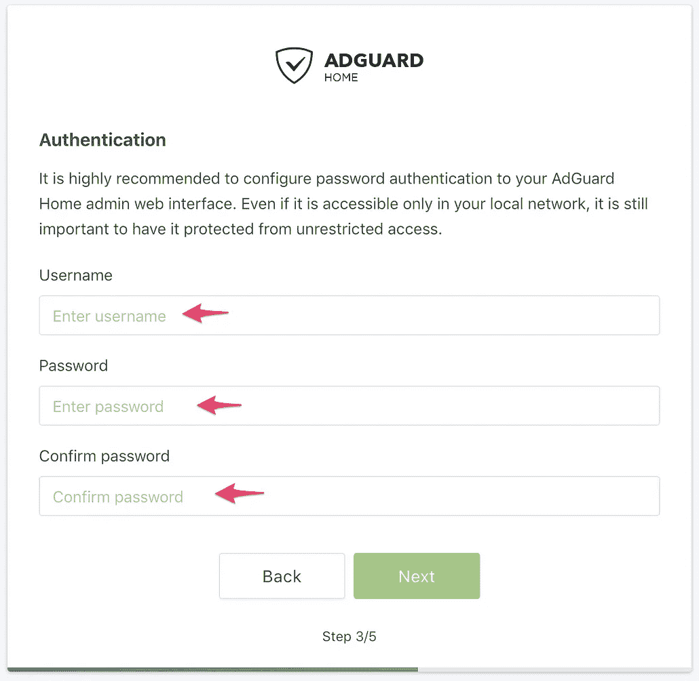

*   在步骤 4 中，您可能需要配置路由器。(您也可以稍后再做)

打开路由器的首选项。通常，您可以通过 URL(如 [http://192.168.0.1/](http://192.168.0.1/) 或 [http://192.168.1.1/](http://192.168.1.1/) )从您的浏览器访问它。可能会要求您输入密码。如果不记得了，经常可以在路由器的贴纸上找到密码。有些路由器需要特定的应用程序，在这种情况下，您的电脑/手机上应该已经安装了该应用程序。

找到 DHCP/DNS 设置。查找允许两组数字的字段旁边的“DNS”字母，每组数字分为四组，每组一至三位数。

在那里输入您的 AdGuard 主服务器 IP 地址(Raspberry Pi IP 地址)。

> *对于 Google Nest Wifi 路由器，打开 Google Home 应用。Tap Wifi >设置>高级联网> DNS >选择自定义 DNS >设置树莓派的 IP 地址*

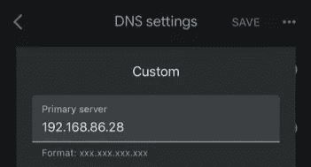

> 这里列出了一个很好的为各种路由器设置自定义 dns 的参考页面:[https://support . opendns . com/HC/en-us/sections/206253667-Individual-Router-configuration s](https://support.opendns.com/hc/en-us/sections/206253667-Individual-Router-Configurations)**注意**:别忘了在你的路由器中设置 Raspberry Pi 的 IP 地址作为主 DNS 字段。

*   此时，您可以通过访问链接`http://<raspberry_pi_ip_address>`来访问 AdGuard 应用程序
*   输入用户名和密码。更新*通用设置*和 *DNS 设置。*

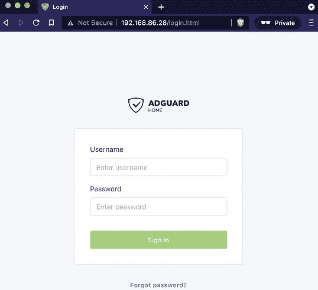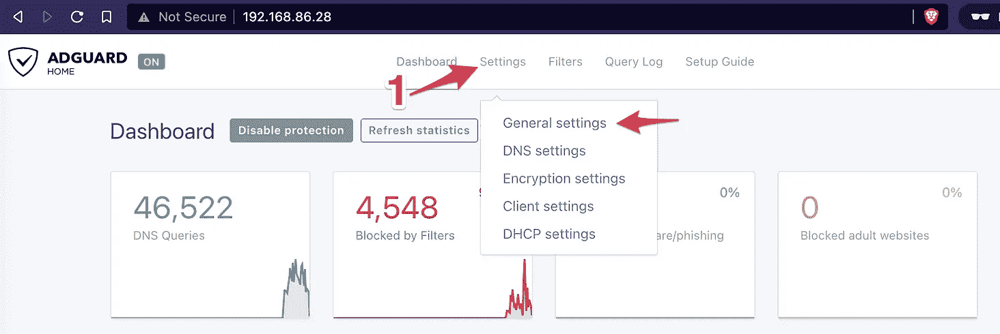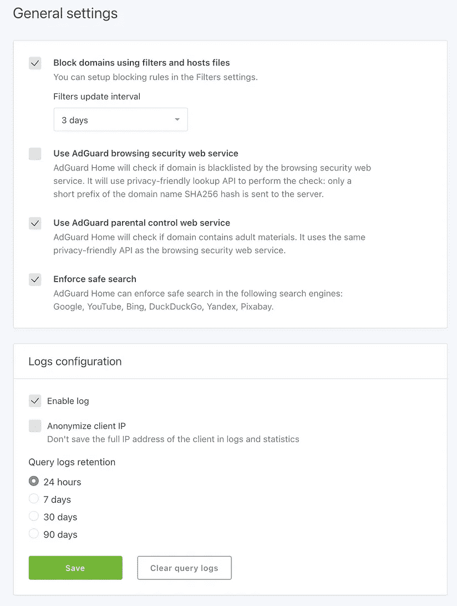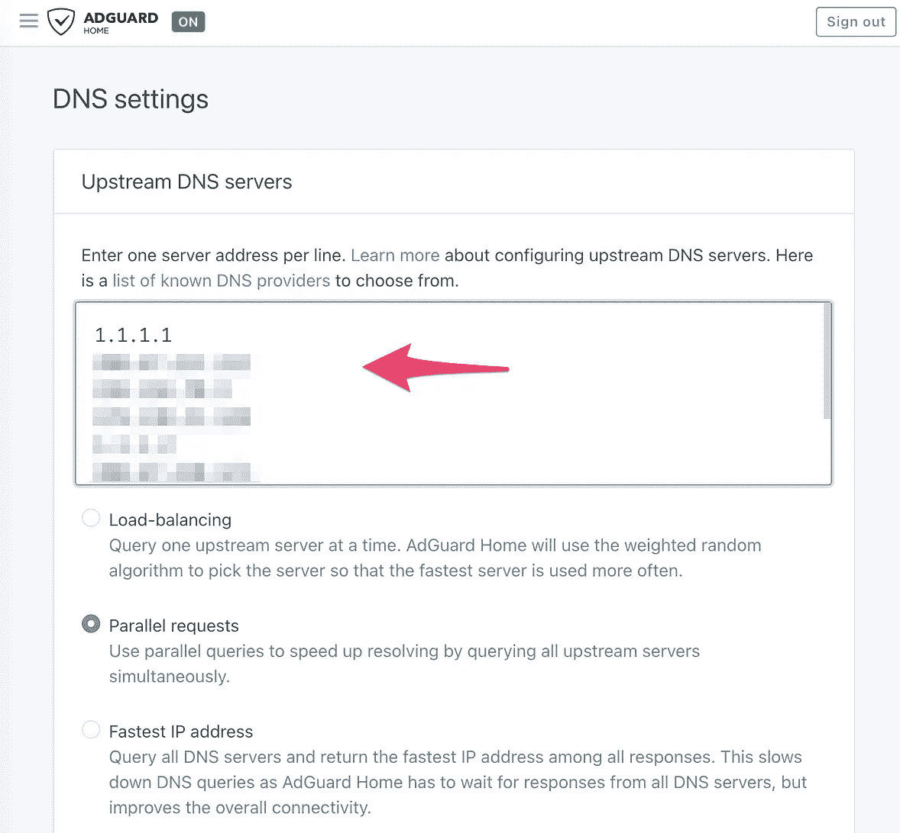

*   对于 ***上游 DNS 服务器*** ，请查看[https://kb.adguard.com/en/general/dns-providers](https://kb.adguard.com/en/general/dns-providers)并使用合适的上游 DNS 服务器。如果你想走最简单的路线，就进去

```
1.1.1.1
1.0.0.1
208.67.222.222
208.67.220.220
```

*   对于恶意软件和成人内容拦截，请输入以下 IP 地址(或者，此处[列出的其他此类 IP 地址](https://kb.adguard.com/en/general/dns-providers))

```
1.1.1.3
1.0.0.3
208.67.222.123
208.67.220.123
```

*   省省吧。
*   配置 DNS 阻止列表。点击*过滤器> DNS 黑名单。根据您的需要选择黑名单。*

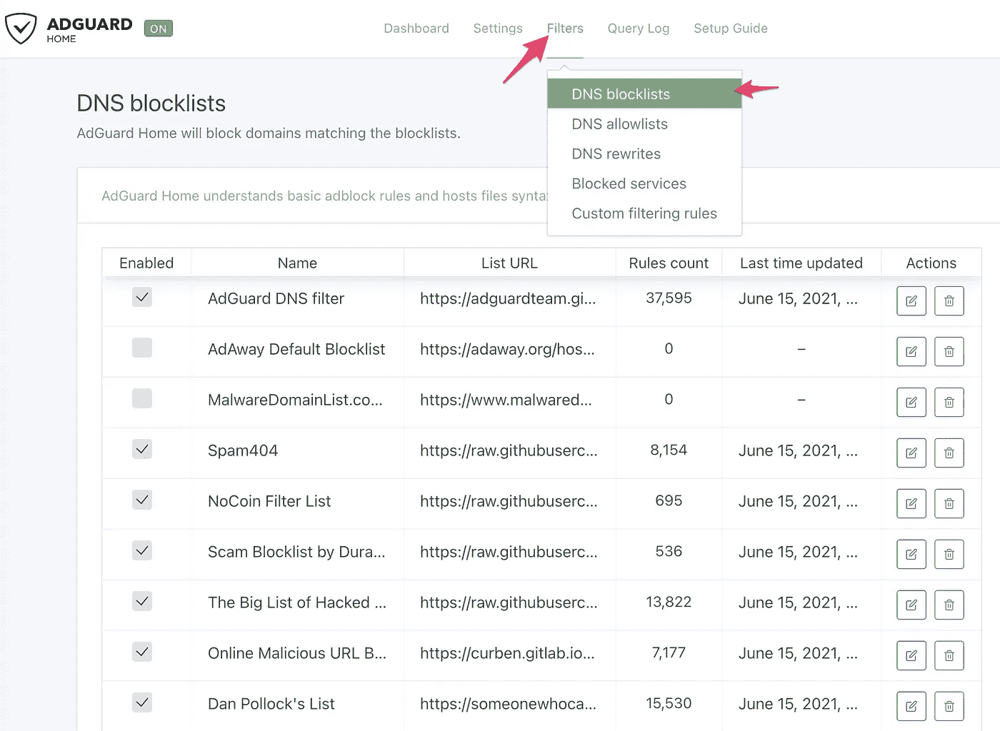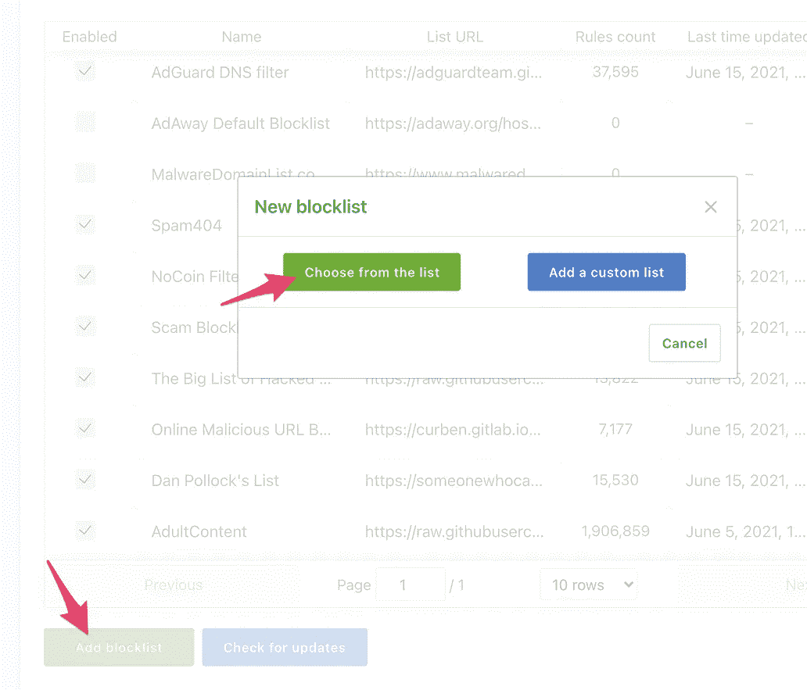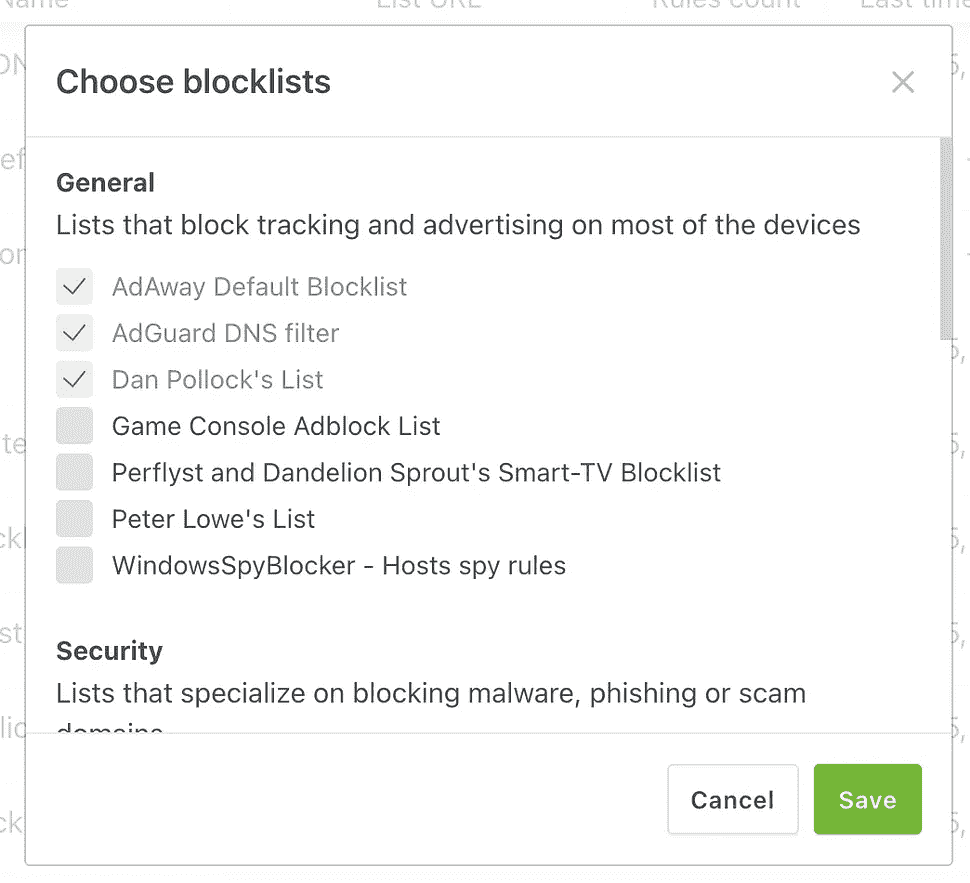

*   您可能希望添加的一些自定义阻止列表有:

```
[https://raw.githubusercontent.com/Spam404/lists/master/main-blacklist.txt](https://raw.githubusercontent.com/Spam404/lists/master/main-blacklist.txt)[https://raw.githubusercontent.com/hoshsadiq/adblock-nocoin-list/master/hosts.txt](https://raw.githubusercontent.com/hoshsadiq/adblock-nocoin-list/master/hosts.txt)[https://raw.githubusercontent.com/durablenapkin/scamblocklist/master/adguard.txt](https://raw.githubusercontent.com/durablenapkin/scamblocklist/master/adguard.txt)[https://raw.githubusercontent.com/mitchellkrogza/The-Big-List-of-Hacked-Malware-Web-Sites/master/hosts](https://raw.githubusercontent.com/mitchellkrogza/The-Big-List-of-Hacked-Malware-Web-Sites/master/hosts)[https://curben.gitlab.io/malware-filter/urlhaus-filter-agh-online.txt](https://curben.gitlab.io/malware-filter/urlhaus-filter-agh-online.txt)[https://someonewhocares.org/hosts/zero/hosts](https://someonewhocares.org/hosts/zero/hosts)[https://raw.githubusercontent.com/blocklistproject/Lists/master/porn.txt](https://raw.githubusercontent.com/blocklistproject/Lists/master/porn.txt)
```

*   注意:您也可以选择性地将网站列入白名单/黑名单:

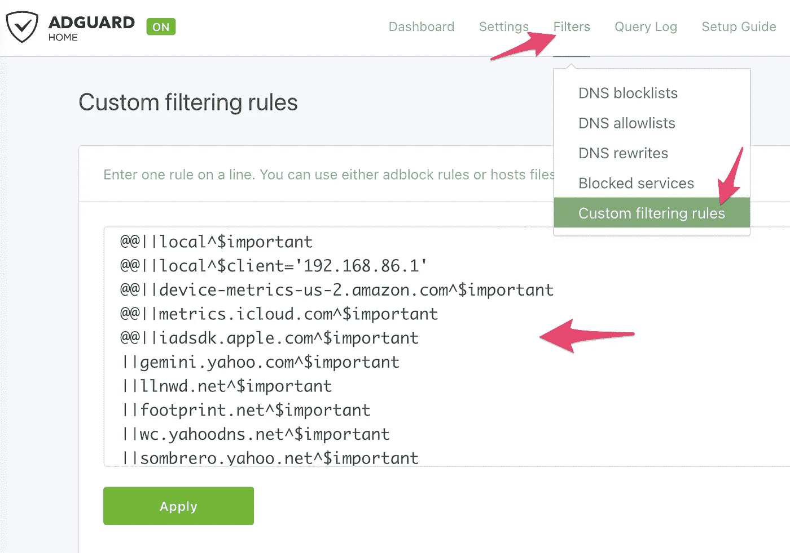

*   恭喜你！你已经成功实现了目标。你会注意到大多数广告已经从网站上消失了。:)

> 混乱的视图与整洁的视图


注意:YouTube、脸书的广告仍然能够逃脱，因为它们不容易被任何软件屏蔽。

> 我的个人设置是:
> 
> Google Nest Wifi 路由器+ Raspberry Pi 4 4GB + 32 GB MicroSD 卡+连接以太网和无线两者+ AdGuard Home running + Cron job 每天凌晨 2 点重启 Raspberry Pi 以保持 RPi 性能(我将在其他文章中分享 Cron job 的更多信息)