# 重新访问 JavaScript 迭代(使用迭代器和生成器)

> 原文：<https://medium.com/nerd-for-tech/re-visit-javascript-iterations-using-iterators-and-generators-1cbcfd042d82?source=collection_archive---------10----------------------->

# 介绍

来到**优步**后，我最近对 JavaScript 很感兴趣。当我还在学习的时候，我想和你分享一些关于循环和迭代的有趣的东西。

**迭代**是任何算法设计的**基础部分。现在有很多方法可以学习循环和条件(或类似的基础)，但是在这里，我想**采取一种特殊的方式思考**关于**迭代**和**在各种各样的日常用例**中推广**相同的想法**。因此，没有进一步的到期让我们开始。**

如果你简单地`**console.log()**` 这个`**Array.prototype**`，展开它，再往下一点，你会发现一个**符号迭代器**函数。就像这样，这里的符号只不过是获取函数引用的一个键。

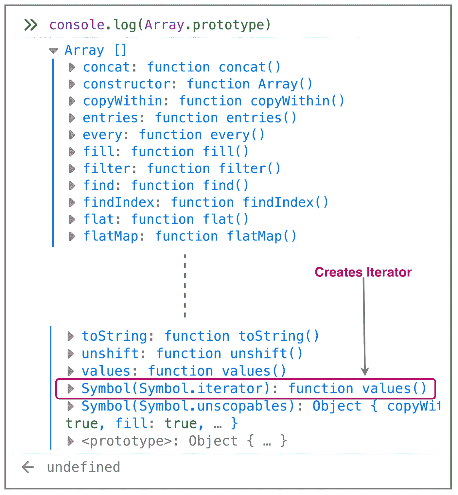

数组.原型

现在，有了这个属性，我们可以得到一个迭代器，它可以遍历数组。

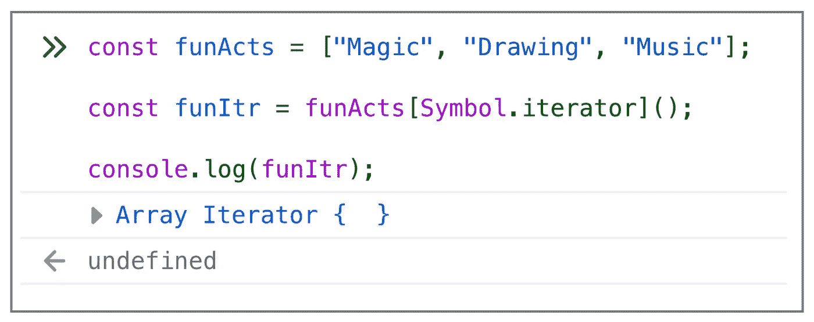

数组迭代器

**注意** : *迭代器函数在调用时应该绑定到上下文中的数组，否则将无法创建迭代器。例如，在上面的例子中，如果我们只是获取对* `***funActs[Symbol.iterator]***` *的引用并在稍后调用它来获取引用，而不是获取* `***funItr***` *。不会像预期的那样起作用。在这种情况下，我们可以做我们想做的，把函数表达成这样* `***const createIterator = funActs[Symbol.iterator].bind(funActs)***`

# 默认数组迭代器

根据定义，**迭代器**有一个特殊的`**.next()**` 函数与之相关联。当调用 **时，哪个**从**集合**(数组)中返回 **一个值** **。每次调用`**.next()**` 时，它从数组中一次返回一个连续的项目，直到数组结束。类似这样的事情，**

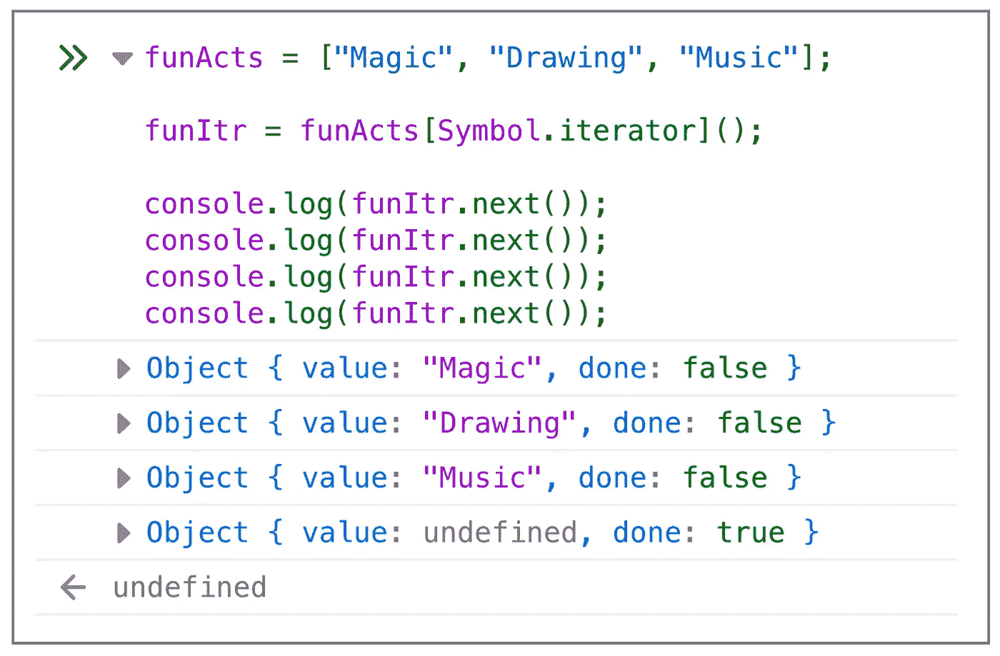

使用。默认迭代器上的 next()

请注意，`**.next()**`的返回值产生一个**结果**(对象)，它有两个键**。首先是名为`**value**`的键，它可以存在也可以不存在，这取决于集合中是否有更多的项目需要循环。其次，它有一个强制的`**done**`布尔变量，指示**集合中是否有更多的值**，**或者我们已经完成了对集合的迭代**。**

**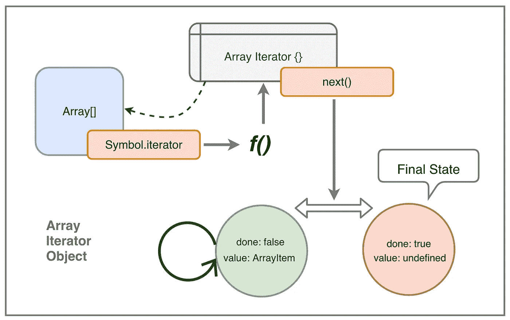**

# **可迭代接口**

**我们可以用下面的**可迭代**(数组是一个**可迭代**元素)的接口来总结我们到目前为止学到的东西。基本上，它需要一个**符号.迭代器**函数，返回一个迭代器，这个迭代器基本上就是一个附加了`**.next()**` 函数的`**Object**`。调用下一个函数时，返回此格式的结果`**{value: any, done: boolean}**` **。****

**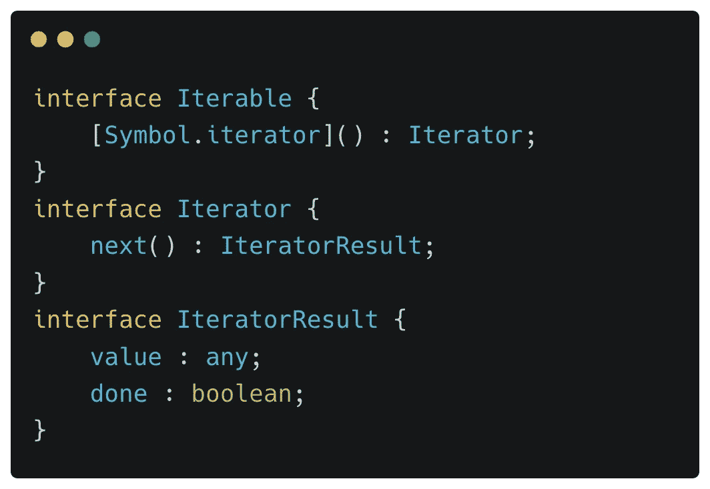**

**可迭代接口**

**在 JavaScript 中，我们有一个特殊的**迭代语法，叫做** `**for..of**`，这个**遵守这个可迭代契约**的 **。这使得使用`**for..of**`循环遍历对象变得轻而易举。看一看，****

**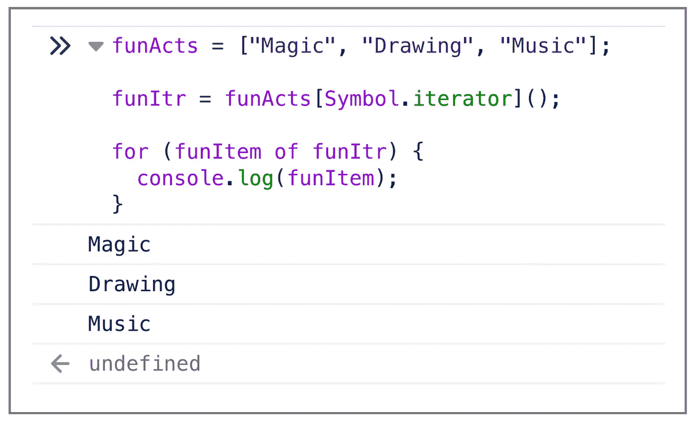**

**为..具有数组迭代器的循环的**

# **创建自定义数组迭代器**

**我们已经经历了学习围绕 **iterables** 的所有细节的艰苦工作，因为现在我们可以开始 ***使用它，并修改它*** 来创建我们自己的定制迭代器。**

**所以，假设有人要求你以相反的方式迭代**数组**。不讨论基于循环的索引肯定可以实现这一点，让我们看看如何通过创建我们自己的第一个自定义迭代器来实现这一点。首先，让我们从`**.next()**`函数开始，当我们试图得到迭代器时，**

**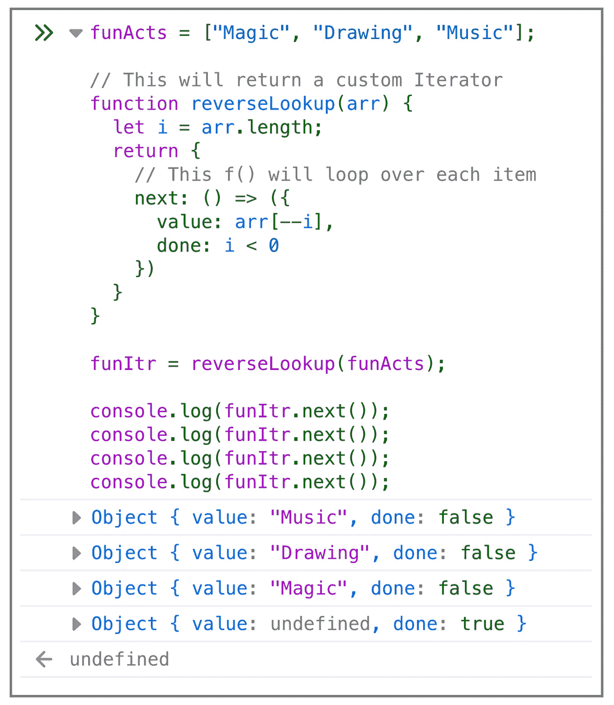**

**创建反向查找**

**为了让它与`**for..of**`循环一起工作，我们将用一个**符号.迭代器**函数来修饰它，使它看起来像一个数组**可迭代**，然后我们可以像往常一样使用`**for..of**`循环，它会以相反的顺序打印值。**

**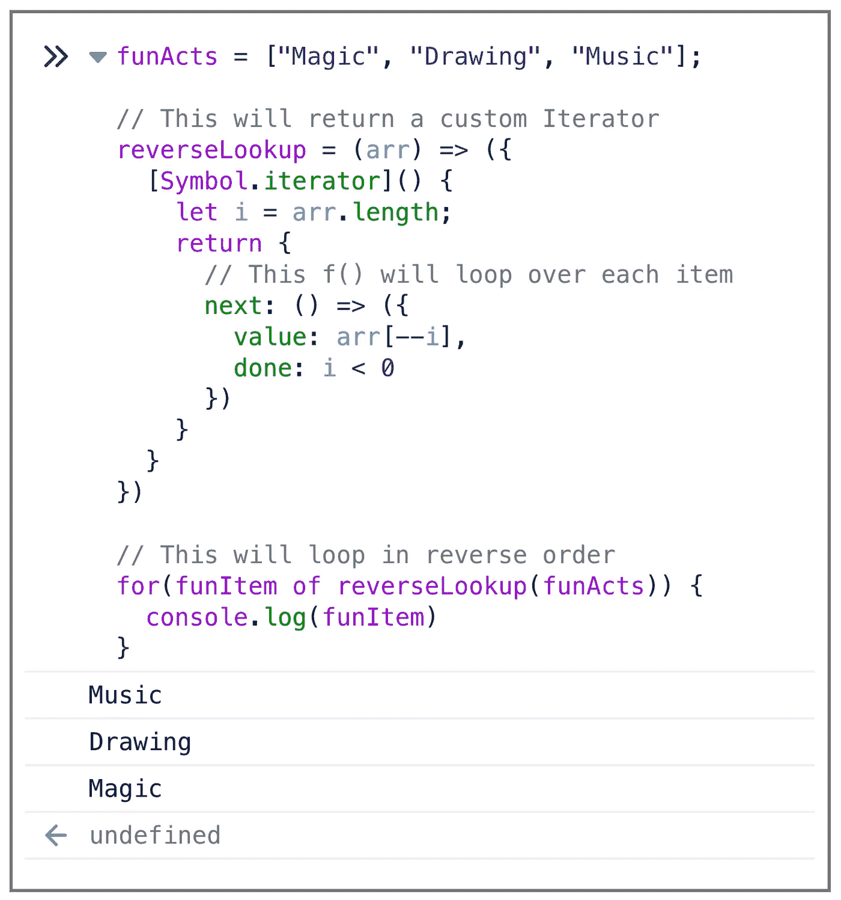**

**完全反向查找**

# **迭代生成器**

**虽然自定义迭代器是一个有用的工具，但是由于需要显式维护它们的内部状态，因此创建它们需要仔细编程。**生成器函数**提供了一个强大的选择:它们允许你通过编写一个不连续执行的函数来定义一个迭代算法。生成器函数是使用`[function*](https://developer.mozilla.org/en-US/docs/Web/JavaScript/Reference/Statements/function*)`语法编写的(这允许我们使用神奇的 **yield** 关键字来暂停执行)**

**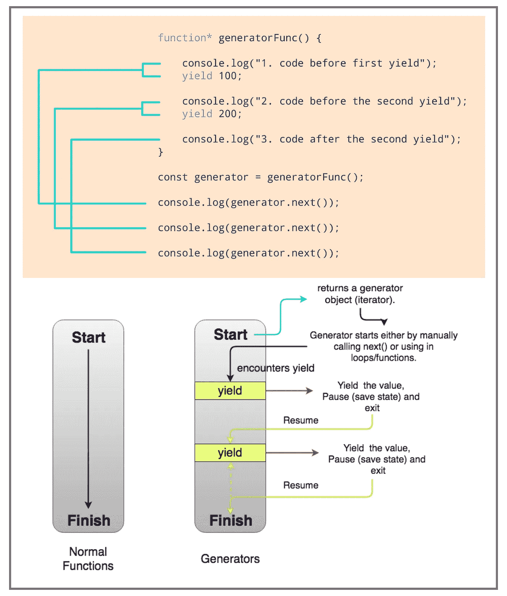**

**函数生成器**

> **生成器允许我们用更简洁的语法编写迭代器，并在每次迭代中给我们更多的灵活性。**

**让我们使用生成器来重构它。我们将从上面取出所有的片段，并在我们的 **reverseGen** 中使用它们，这次是生成器函数，**

**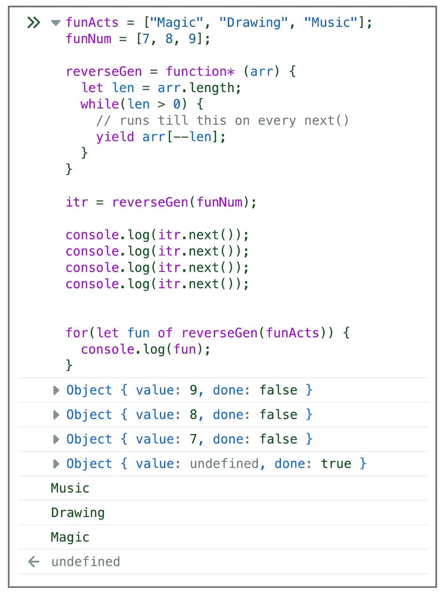**

# **控制迭代**

**请注意，在讨论 **Iterables** 特别是关于生成器的时候，我们只关注了`**.next()**`函数，因为它是最常用的。但是还有其他方法可以让你控制迭代器的行为。例如，如果我们在迭代器中随时使用`**.return()**`方法，迭代器将立即完成，任何对`**.next()**`的调用都将被忽略。看一看，**

**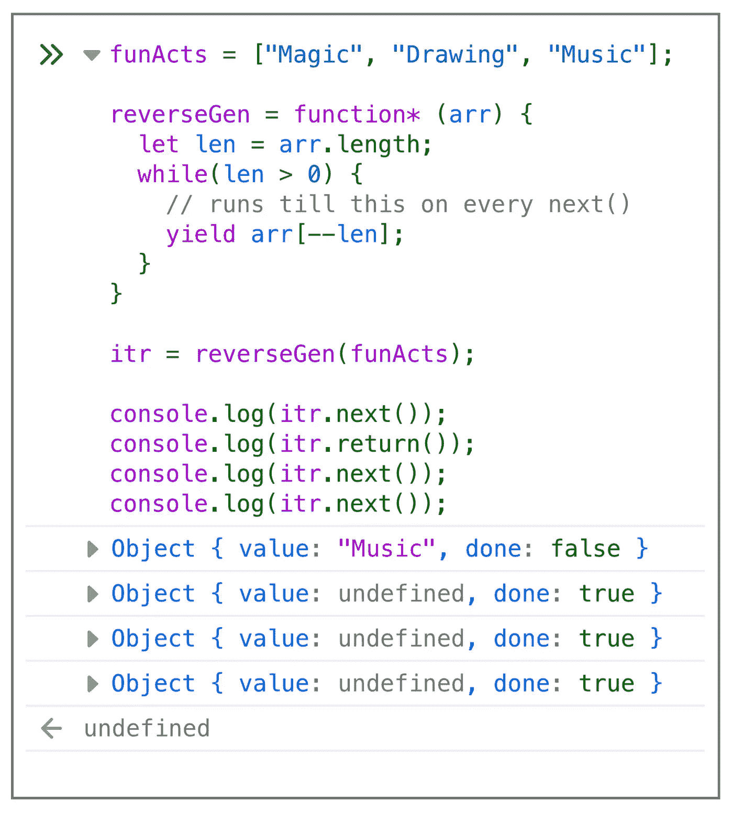**

**迭代器。return()效果**

**我们可以 ***也可以定制生成器*** 内部的逻辑，然而我们希望哪个能够**自动影响**如何使**迭代**整体运行。比如这里*说当数组的长度剩下的是 1 的时候，我们就不想再循环了。*所以，在我们的例子中，当 ***长度为 1***时，我们**简单地从生成器**返回。这不会循环遍历最后一项并跳过它。看一看，**

**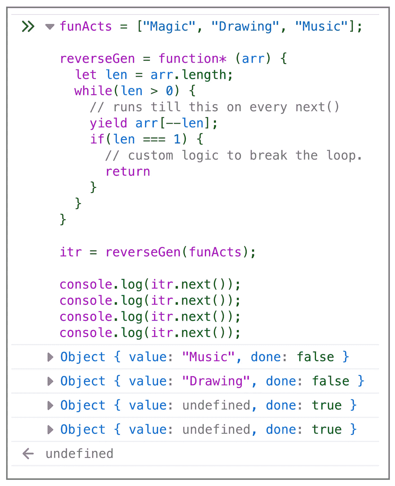**

**带返回的短路迭代逻辑**

# **嵌套迭代产生(yield*)**

**函数生成器**的一个巨大好处是能够迭代其他嵌套生成器**。如果我们正在生成的**值** **本身是另一个生成器**，那么我们可以**使用特殊的语法 yield*** ，这将**确保遍历 yield 中嵌套生成器的所有值**，然后继续执行其他 yield。让我们举一个简单的例子，来阐明我的意思，**

**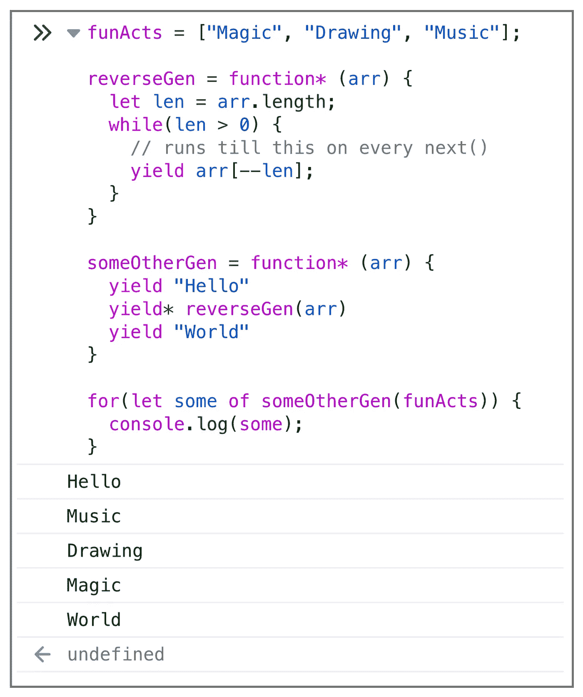**

**在这个例子中，你可以清楚地看到，我们的 **someOtherGen()** 是一个独立的生成器，它**生成“Hello”作为第一个值**。然后，由于**需要从 reverseGen()** 中一次获取一个值，因此**我们使用了**语法 **yield*** ，最后，在其完成后，外部生成器照常继续，并产生独立于 **reverseGen** ()的最后一个值作为“ **World** ”。因此，您可以看到在生成器中使用生成器来处理复杂执行场景的好处。**

# **用于生成数据的生成器**

**我们可以巧妙地利用生成器的工作方式，非常容易地生成自定义数据。让我们以一个**范围操作符**为例，它采用类似`**range(start, end, inc)**`的格式，从开始到结束产生所有值，并带有一个增量(inc)。它在 JS 语言中并不存在，但是让我们看看如何在生成器的帮助下，在 JS 中轻松添加类似于 **range()** 的功能。**

**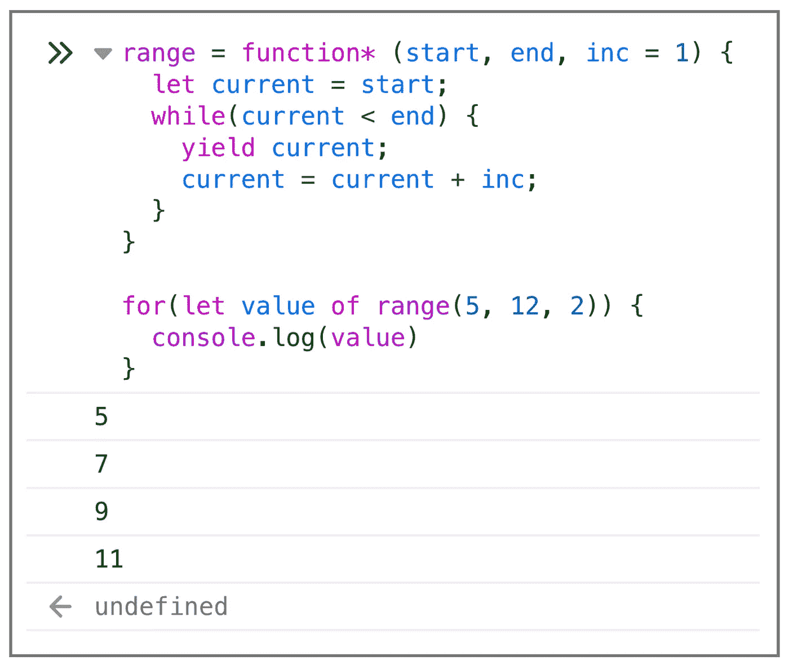**

**JS 中的 range()运算符**

**当你想用一些数据(基于自定义逻辑)生成一个预填充的数组时，这个**也非常方便，就像这样，****

**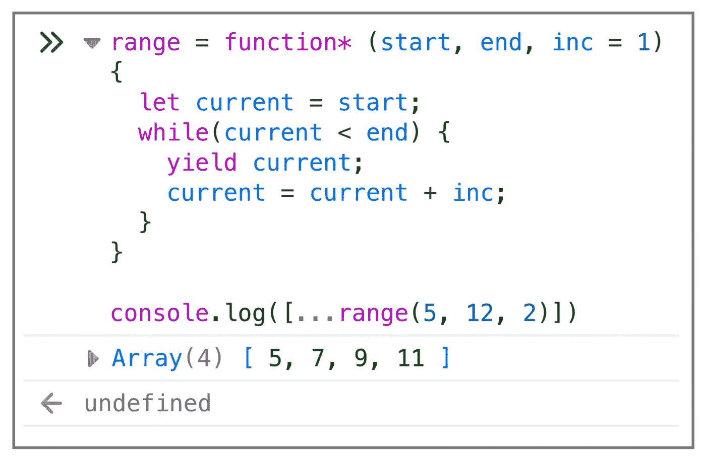**

**用生成器生成预填充数组**

# **用于管理状态的生成器**

**在本帖中，我们将探讨的关于生成器的最后一个方面，**是它们保存和管理应用程序/变量的内部状态的能力**。因为我们**可以在我们的生成器**函数中捕获状态，并且还可以在需要时暂停和执行，所以我们可以在没有任何外部库或代码的情况下做类似**创建状态机**的事情。**

**这里有一个简单的例子，基于增量/减量计数器的状态机使用生成器实现**，****

**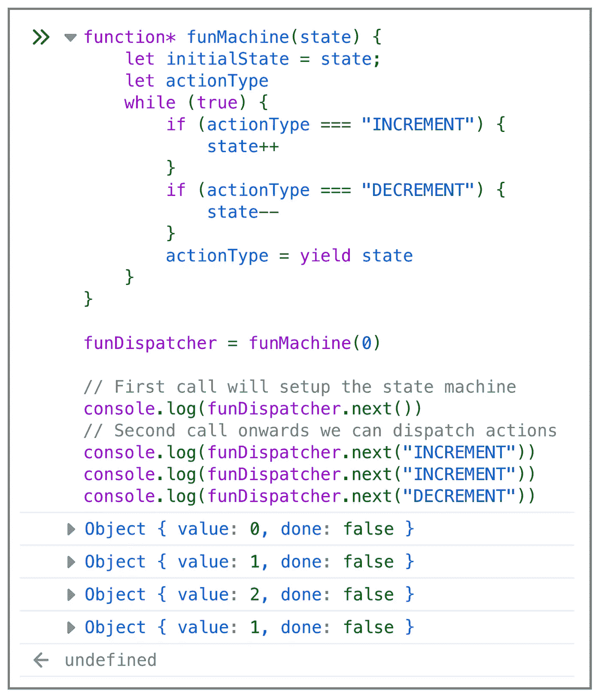**

**带生成器的状态机**

# **结论**

**如果到目前为止你和我在一起，我们涵盖了一些好的东西，我们从一个简单的**可迭代**接口和适用于许多可迭代数据结构的**契约开始。**然后**看了自定义迭代器**以及**如何创建你想要的任何类型的循环**。然后我们看了看**生成器，它给了你一个自然的可迭代接口**，这个接口**产生所有的值。在它上面调用 next()**。我们使用函数生成器重新实现了我们的**自定义迭代器。最后，我们看了使用生成器、嵌套循环、数据生成和状态机类应用程序的好处，我们可以很容易地实现它们。****

*****额外收获:*** 我相信拥有这些基础知识对于处理手头的各种任务非常有用。有时，你可以发挥创造力，开发一些独特而有用的模式。所以，作为总结，我留给你最后一个创造性地使用生成器的例子，使用类似于**的方法来处理集合。map()，。过滤器()****

**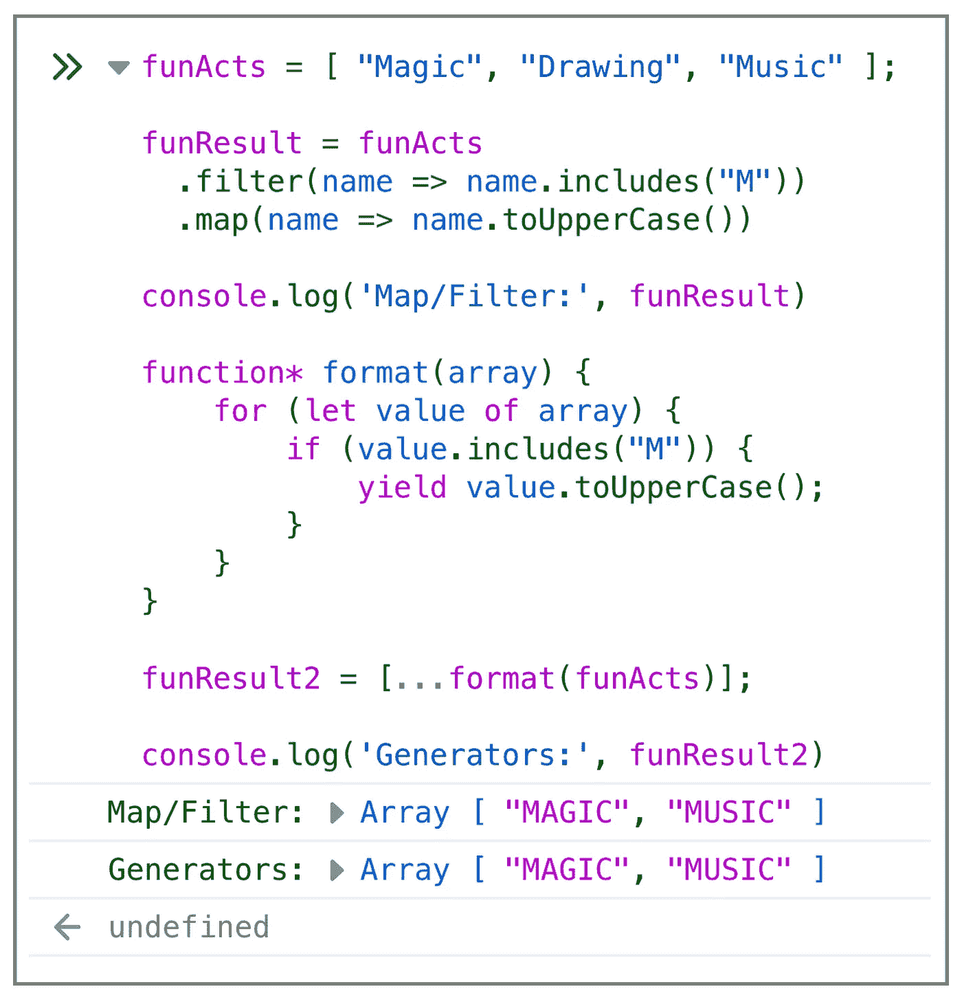**

**使用生成器处理集合**