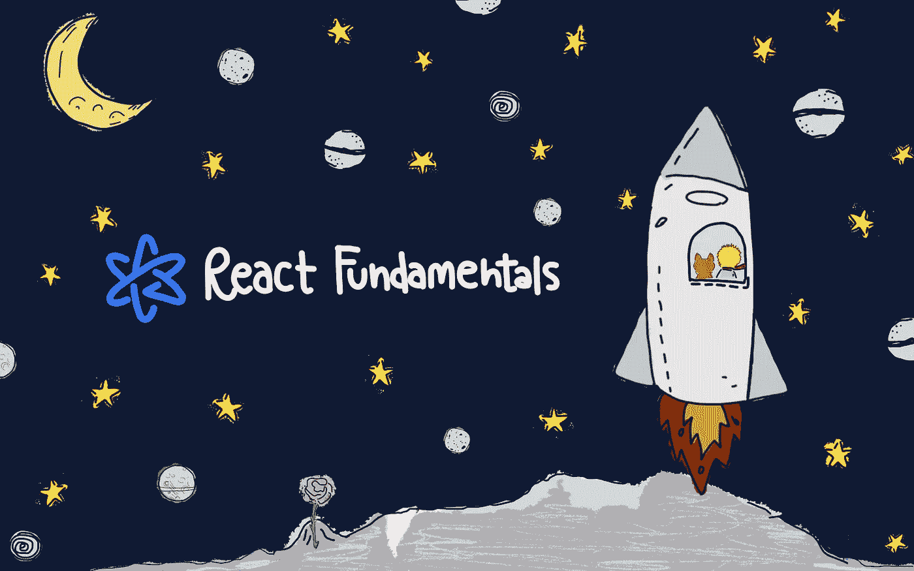

# 反应原理:我从中学到了什么？

> 原文：<https://medium.com/nerd-for-tech/react-fundamentals-what-i-learnt-from-710134ade203?source=collection_archive---------7----------------------->

[React Fundamentals](https://epicreact.dev/learn) 是由[肯特·c·多兹](https://twitter.com/kentcdodds)教授的课程，是 [Epic React](https://epicreact.dev/learn) 的一部分



**免责声明:**本文的目的不是总结课程内容，也不是回顾它，而是记录它对我的影响。

我发现以下几点让这门课变得有趣，与众不同。

## **要点#1 这将被编译成通用 Web API**

本课程的目的不是直接学习 React API，而是创建 React 如何在幕后工作的心理模型。让我举一个课程中的例子:

1.  课程从如何使用 Web APIs 在 DOM 树中插入文本元素开始。

```
const rootElement = document.getElementById('root')
const element = document.createElement('div')
element.textContent = 'Hello World'
element.className = 'container'
rootElement.append(element)
```

2.然后，通过使用原始的 React APIs 演示如何做到这一点。

```
const rootElement = document.getElementById('root')
const element = React.createElement('div', {
  className: 'container',
  children: 'Hello World',
})
ReactDOM.render(element, rootElement)
```

3.最后，演示如何在 JSX 身上实现同样的事情。

```
const element = <div className="container">Hello World</div>
ReactDOM.render(element, document.getElementById('root'))
```

完成前三章后，我可以从 JSX 到原始的 React APIs 再到 Web APIs，这个黑盒子里没有魔法！

## **第 2 点**定制组件及其来源

这个过程确实逐步揭示了从“**返回一切从** **普通 JSX** ”到“**提取到** **函数返回 JSX****到**调用 react . createelement****内部函数到**自定义组件的演变。**最后，我相信这与关于创建心智模型的**点#1** 是一致的，并揭示了**自定义组件**背后没有魔法。****

## **结果**

**如前所述，我们的目的不是总结课程内容。我只记下对我有用的东西，“创造我的心智模型”，对其他人可能有用也可能没用。本课程还有更多的内容，例如样式化— *样式属性和类名属性*，表单— *表单事件处理程序、输入事件处理程序和受控表单输入*，以及数组渲染。**