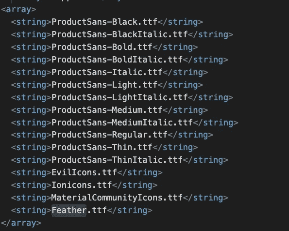

# 反应原生向量图标

> 原文：<https://medium.com/nerd-for-tech/react-native-vector-icon-33daae482eed?source=collection_archive---------18----------------------->

Muo 适马班级| Piyush Bajpai

嗨，伙计们，我希望你们都很好。

在本教程中，我将向你展示谁来设置以及如何为 React Native Vector 图标创建通用处理组件。

一般来说，人们在某种程度上使用 vector icon，他们只是导入包，每次都要多次编写处理代码。所以你们不需要这么做。

我给你的组件代码，我会教你如何使用它。

让我们开始吧。

第一步——制作 react 本地项目

react-native init 项目名称

然后使用以下命令安装 react native vector 图标包

**npm i react-native-webview**

对于 android，我们不需要做任何其他事情。

对于 IOS one，我们需要在 info.plist 中定义家族名称。

如何做到这一点？



别担心，我也给你这个代码。向下看。

```
<key>UIAppFonts</key><array><string>ProductSans-Black.ttf</string><string>ProductSans-BlackItalic.ttf</string><string>ProductSans-Bold.ttf</string><string>ProductSans-BoldItalic.ttf</string><string>ProductSans-Italic.ttf</string><string>ProductSans-Light.ttf</string><string>ProductSans-LightItalic.ttf</string><string>ProductSans-Medium.ttf</string><string>ProductSans-MediumItalic.ttf</string><string>ProductSans-Regular.ttf</string><string>ProductSans-Thin.ttf</string><string>ProductSans-ThinItalic.ttf</string><string>EvilIcons.ttf</string><string>Ionicons.ttf</string><string>MaterialCommunityIcons.ttf</string><string>Feather.ttf</string></array>
```

不要说谢谢，没关系，只要去我的 [youtube 频道](https://www.youtube.com/muosigmaclasses)看同样的视频，订阅频道，关注[科技书呆子](https://editorialteamnft.medium.com/)。

现在，您希望看到的最重要的是 react 本机矢量图标组件代码。

```
import React from ‘react’;import IconFeth from ‘react-native-vector-icons/Feather’;import MetIcons from ‘react-native-vector-icons/MaterialCommunityIcons’;export default function VectorIcon(props) {return (<>{props.familyName == ‘Feather’ && (<IconFethcolor={props.color}onPress={props.onPress}name={props.status ? props.primaryName : props.secondaryName}size={25}/>)}{props.familyName == ‘MaterialCommunityIcons’ && (<MetIconscolor={props.color}onPress={props.onPress}name={props.status ? props.primaryName : props.secondaryName}size={25}/>)}</>);}
```

把这个组件放到你常用的组件里就行了。

接下来跟着我。

现在，您必须在您的父组件中使用 react 本地向量图标组件，因为您必须导入 react 本地向量图标组件。

像这样。

从该位置导入

```
import VectorIcon from “../../../component/VectorIcon”;
```

并利用它。

```
<VectorIconfamilyName={“Feather”}status={eyeIcon}primaryName={“eye-off”}secondaryName={“eye”}onPress={() => setEyeIcon(!eyeIcon)}/>
```

感谢阅读。