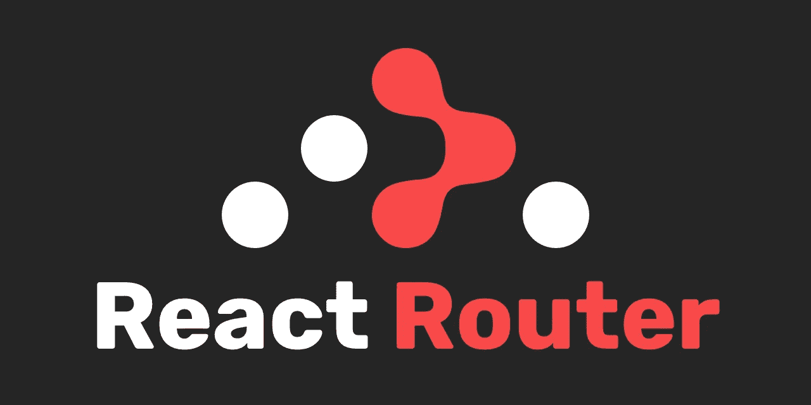

# React 路由器 DOM v6 —第一部分

> 原文：<https://medium.com/nerd-for-tech/react-router-dom-v6-part-i-49a63a92d858?source=collection_archive---------0----------------------->



React 使我们能够开发单页面应用程序，即单个 HTML 页面。本质上，我们在一个 HTML 文件中呈现不同的组件。这是通过连接不同的。js 文件(React 组件)到 HTML 文件中特定的

文件。

## 为什么选择 React 路由器？

我们如何基于 URL 实现不同的组件？

**abc.com/login**和**abc.com/home**不应该给出相同的分量，对吗？。登录需要一个登录页面，因此需要主页。

所以这里的解决方案是基于 URL 的组件呈现，即 **/login** 给出登录组件， **/home** 给出 home 组件。

## 网址改了怎么还是单页申请？

单页和多页的主要区别是页面重载。当您在多页中移动到不同的 URL 时，页面会重新加载。对于单页的情况，它不会重新加载。这是因为相同的 HTML 文件用于呈现不同的组件。React Js 启用此功能。

所以，

*不同组件的单页→ React Js*

*单个页面+不同组件的不同 URL→React Js+React Router*

> 基于 URL 动态获取组件的过程称为**路由**。

这是在 React 和 React 路由器的上下文中。

注意:我们在 React 路由器中实现了**动态路由**。

简而言之，

**静态布线** →布线发生在渲染之前

****动态路由** →路由发生在渲染期间**→本质上是一个反应组件****

> **React Router DOM = React Router+API ' s like<browserrouter>组件</browserrouter>**

**您可以在网上了解更多关于静态和动态路由的信息。请记住，React router 中的几乎所有东西都是组件，因为它是一个动态路由(在渲染期间)。**

## **React 路由器如何连接 React app？**

**这意味着将浏览器 URL 连接到您的应用程序。因此，它必须位于应用程序的顶层。但是等等，怎么连接？包好就行了。包什么呢？<browserrouter>来自‘react-router-DOM’。</browserrouter>**

```
<BrowserRouter> 
<App /> 
</BrowserRouter>
```

**为了更好地理解概念，我在这里跳过了像 import 语句这样的整个代码。**

**假设我们有三个组件 App、用户和产品，我们需要有相应的 **'/app、“/users'** 和**'/Products '**URL。**

***App — /app***

***用户—/用户***

***产品—/产品***

```
<BrowserRouter> 
**<Routes>  
<Route path='/app' element = {<App />} />  
<Route path='/users' element = {<Users />} />  
<Route path='/products' element = {<Products />} /> 
</Routes>** 
</BrowserRouter>
```

**如果我们给 URL '/users' →它将呈现用户组件，对于'/products '呈现产品组件，对于'/'也是如此。**

## **如果我们想嵌套路由呢？**

**比如**'/app/用户'**或者**'/app/产品'**。这可以通过<路线>组件的父子关系来完成。**

```
<BrowserRouter> 
<Routes>  
<**Route** path='/app' element = {<App />}>    
  *<Route path='users' element = {<Users />} /> --> only renders Users    
  <Route path='products' element = {<Products />} /> --> only renders Products*  
</**Route**> 
</Routes> 
</BrowserRouter>
```

**注意:我删除了用户和产品前面的“/”，因为 react-router 将它标识为/app 的子级**

> ***这里我们添加一个综合的* ***/app*** *与* ***用户*** *与* ***产品*** *中的****URL****而已。***
> 
> ***/app/users = '/app '+' users '***
> 
> ***/app/products = '/app '+' products '。***

**这将在<route>中呈现我们给定的任何组件作为元素道具。</route>**

## **如果我们想继承<app>组件本身呢？</app>**

**这是布局一致性的最佳用例。比方说 **< App >** 组件包含的标题和导航栏在所有嵌套的路线中都是一致的，比如产品和用户。**

**上面的代码不会继承 **< App >** 组件的 header 和 navbar。它只渲染 **<路径>** 中元素属性中给定的内容**

**我们需要使用 react-router-dom 中的**<Outlet/>**(*一些奇怪的名字‘Outlet’我无法解释*)组件进行共享布局。**

****在哪里连接<插座/ >？****

**显然，在应用程序组件<app>中，因为这是布局，我们希望在嵌套的路线之间共享。</app>**

```
export const function **App**() => { 
return ( 
<> 
{whatever code ...} 
**<Outlet />** 
</> 
) 
}
```

**现在，如果我们键入 **— /app/users** 或 **/app/products** →它将在 **< Route >** 中呈现 app 组件的标题和导航栏以及元素属性组件**