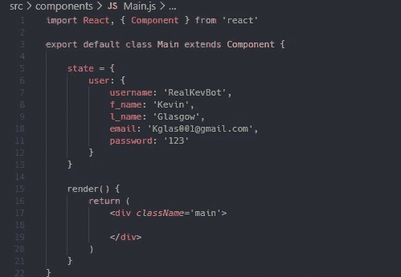
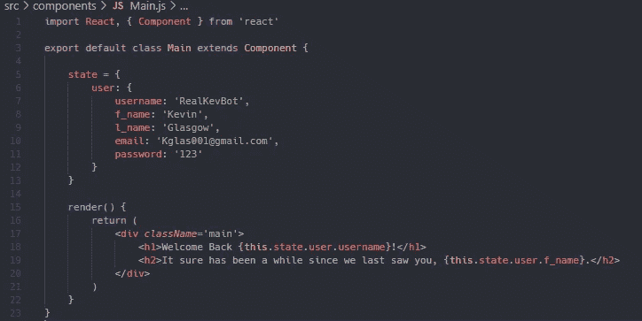
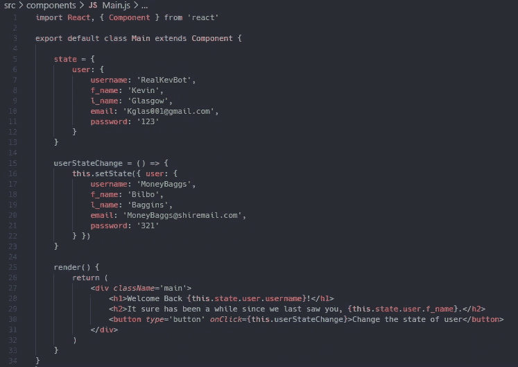
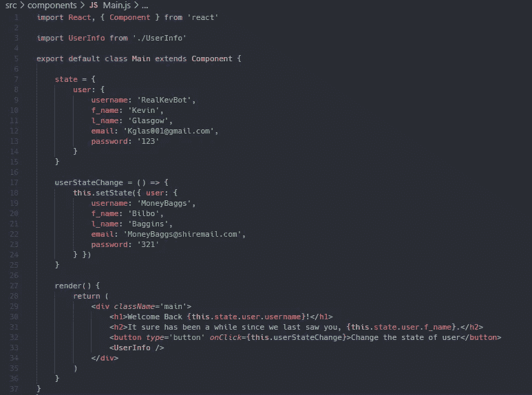
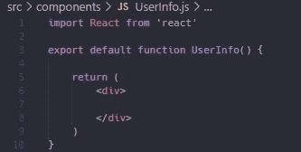
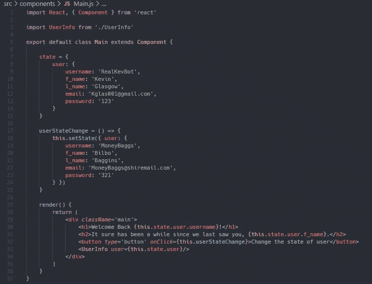
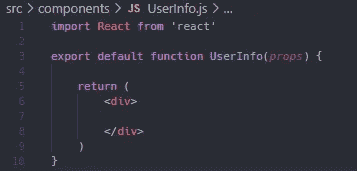
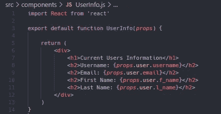
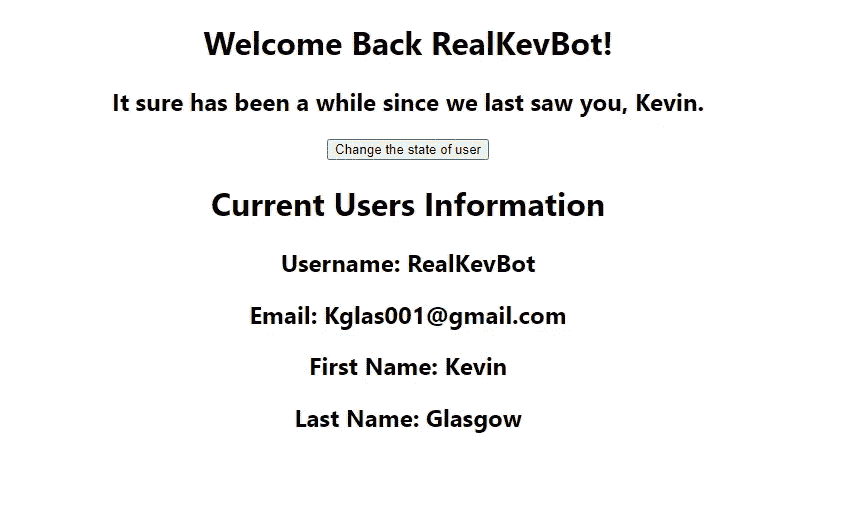
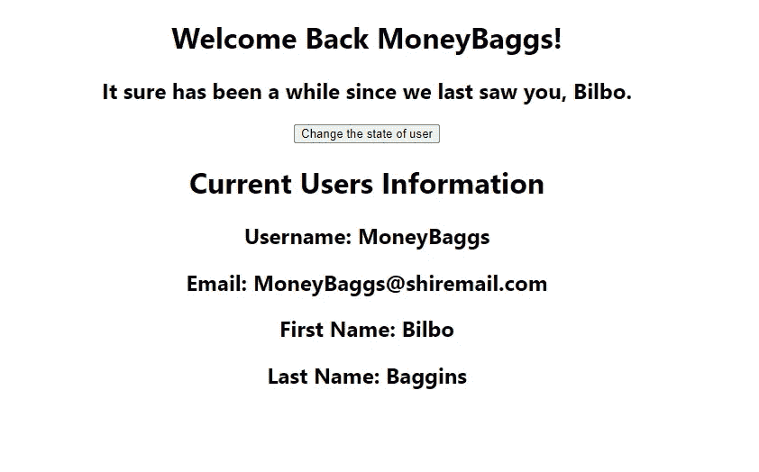

# 反应:国家对道具

> 原文：<https://medium.com/nerd-for-tech/react-state-vs-props-392d436b841c?source=collection_archive---------16----------------------->

## 我和你有什么区别？

大多数开发人员在学习 React 时的一个常见问题是，状态和道具之间的区别到底是什么？理解它们之间的区别是很重要的，也是理解 JavaScript 最流行和使用最广泛的库之一的一大进步。在深入研究它们之前，让我们先来看看它们的简单定义。

**State:** 描述了 React 组件中的默认数据值，该值会随着时间的推移而改变，这通常是基于用户在用户界面中要求改变的操作。

**:Props:**property 或 properties 的简称，用于将数据从一个组件传输到另一个组件，但数据只能从父组件传输到子组件。

现在我们对什么是状态和道具有了一个大致的概念，我们现在可以更深入地看看它们中的每一个，以及它们在你的应用程序中扮演的重要角色。

## 状态

根据上面的定义，我们可以将状态放在一起，状态将保存不同的数据值，这些数据值会随时间而变化。一个主要的例子可能是用户购物车的状态，或者更简单的用户本身。用户的界面在每种情况下将是不同的天气比较他们的购物车或用户信息。简而言之，当我们希望或需要跟踪组件渲染之间的数据时，我们在应用程序中实现状态。默认情况下，我们的组件没有状态，在下面的示例中，我们将简单地将我们的状态设置为用户的状态，以及用户从数据库中获得的所有附带信息。

主要组件:

应该注意的是，我们的状态仅仅是用户的状态。用户对象的状态只是包含或保存用户名、名、姓等。(数据)与用户相关联。

现在我们已经设置了用户的状态，让我们开始将用户的一些信息放到页面上。如果你看看下面的例子，下面的解释将会分解我们实际上是如何调用状态的。

主要组件:

在上面的例子中，我为我们的用户创建了一个小小的 welcome，调用我们用户的用户名以及他们的名字。但是，让我们更仔细地看看将该状态呈现到页面所涉及的所有元素。当处理状态时，我们必须总是从这个开始，这是状态在组件中的实例。然后，我们选择我们想要呈现的状态的对象，在这种情况下，唯一可用的选择是用户。从这里，我们现在可以访问用户状态包含的任何数据。如前所述，我们访问了他们的用户名和名字，允许我们选择制作可定制的消息，为我们的用户体验添加个人风格。

如果我不是 RealKevBot，我该如何改变用户的状态呢？不用担心，React 已经实现了一个方法来帮助我们做到这一点，它被恰当地命名为 setState()。如果你看一下下面的例子，你会看到我们如何将这个方法实现到其他函数中。

主要组件:

如您所见，我们的默认用户状态已经被硬编码为我自己。这并没有使我们的应用程序非常动态，因为我可以是唯一的用户，setState()允许我们更动态地设置我们的状态，比如当它被实现到函数中时。在这种情况下，一旦点击按钮，用户的状态将变为比尔博·巴金斯的状态。刷新时，状态将变回硬编码状态，直到再次按下按钮。

如果另一个组件需要访问用户的状态怎么办？不要担心，我们将能够这样做，但首先我们将进入…

## 小道具

Props 用于将数据从一个组件传输到另一个组件，在这种情况下，该数据将是用户的状态。值得注意的是，传递的数据是单向的，从父组件传递到子组件。我们当前的用户状态驻留在我们的主组件中，这将是父组件。因此，让我们构建一个名为 UserInfo 的子组件，并将其导入到主组件中。一旦导入，我们将返回它就在我们的按钮下面，从而使它成为一个子组件一旦呈现。

主要组件:

UserInfo 组件:

要将用户的当前状态作为道具传递给用户信息子组件，我们只需将下面的代码行添加到主组件上导入的用户信息组件中。有点困惑，对吧？在这里，看看这个小小的改变

主要组件:

放大:

如您所见，我们已经将它传递给了用户名为 user 的用户信息，其中包含了整个用户的状态。您还可以选择通过添加。用户名和发送状态作为一个整体。出于这些目的，我们只希望在适当的时候将我们的用户状态传递到我们的用户信息页面。确保我们的子组件可以访问 props 的最后一步，用户信息组件必须像这样接受它。

请注意，道具目前在我的截图上是暗淡的，这是 VSCode 告诉我，它目前没有被使用。

既然我们已经将用户作为道具进行了访问，我们就可以在这个组件中使用用户的“状态”来呈现与数据集完全不同的东西。在用户的信息页面上，你猜对了，我们会显示所有相关的信息。看看下面的例子，我们将讨论调用道具的一些不同之处。

上面我已经创建了一个简单的从 props 中读取当前用户信息的方法。我们调用 props，我们在传递这些 props 时给它们起的名字，然后是我们想要提取的数据元素。类似但非常不同，这可能会令人困惑，因为我仍然从用户拉，但如上所述，我们从适当的用户拉，因为我已经命名它，而不是我们的用户状态。你可以给它起任何你喜欢的名字，但是作为参考，我相信这样会更容易。

另一个需要注意的区别是，我不需要为 props 调用这个实例，也不需要在调用 props 之前使用它。这是因为道具不会改变，在这个和 everyone 组件实例中它们将保持不变。这可能会令人困惑，因为道具可以保存一些东西，比如我们的用户状态，这是可以改变的。

为了澄清一点，用户的道具将总是包含用户的状态，这是不可改变的。但是，对于不同的用户来说，可以改变的是用户的当前状态。虽然用户的状态变了，但是我们的道具没变。例如，如果我们加载当前的 react 应用程序，它看起来就像这样。

按下按钮后，用户的当前状态将变为比尔博·巴金斯。您会注意到，由于状态的改变，两个组件都将更新。

主要组件直接从状态中提取数据，一旦状态发生变化，数据自然也会发生变化。我们的用户信息组件也更新了，但不是因为我们的属性发生了任何变化，而是因为我们的属性保存了一个可变对象的值，在本例中是用户的状态。

如果你想查看这段代码的副本，或者只是作为参考，你可以在这里找到 GitHub Repo [的链接。](https://github.com/TheRealKevBot/StateVsProps)

我要感谢你的阅读，并希望你学到了新的东西！请关注未来更多文章！