# 使用 Prometheus & Grafana 进行实时监控

> 原文：<https://medium.com/nerd-for-tech/real-time-monitoring-using-prometheus-grafana-ca2ff2d6be03?source=collection_archive---------0----------------------->

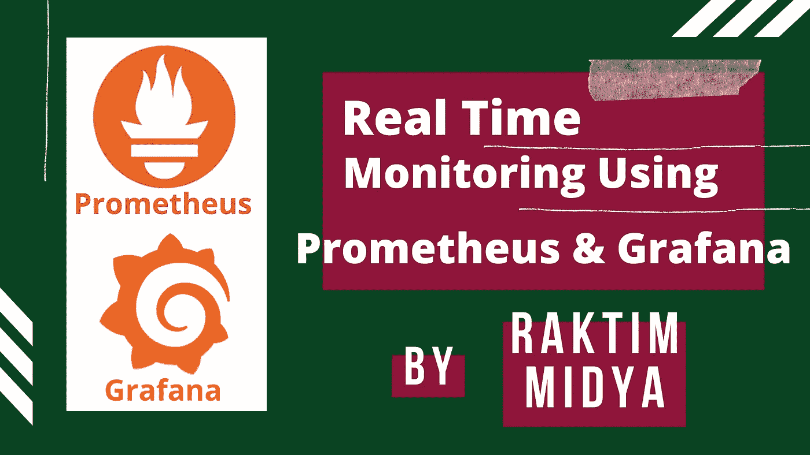

由 Raktim 创建

在本文中，我将描述我们如何在 Kubernetes 上设置 **Prometheus 和 Grafana 服务器，并监控其他服务器的指标。此外，我将演示如何使 Prometheus 和 Grafana 服务器的**数据持久化**，这样，如果 Kubernetes 中的 pod 以某种方式终止，数据将不会丢失。**

> **注意:我将从基础开始谈论一切，最后我有一个奖金，所以如果你理解这篇文章，那么在未来你可以通过看到奖金来探索更多。**

让我们从学习这些技术的一些基础知识开始。还有，我们先熟悉一些以后需要用到的专业术语。

# 普罗米修斯:


普罗米修斯标志

Prometheus 是一个开源系统监控和警报工具包，最初由 SoundCloud 开发。自 2012 年成立以来，许多公司和组织都采用了 Prometheus，该项目拥有非常活跃的开发人员和用户社区。

**普罗米修斯的主要特点是:**

*   **多维数据模型，其中时间序列数据由指标名称和键/值对标识。**不依赖分布式存储，单个服务器节点是自治的。
*   **PromQL** ，一种利用这种维度的灵活查询语言，多种图形模式和仪表板支持。
*   时间序列收集是通过 HTTP 上的拉模型进行的，推送时间序列是通过中间网关支持的。
*   目标是通过服务发现或静态配置发现的。

***了解更多普罗米修斯:***[***https://prometheus.io/docs/introduction/overview/***](https://prometheus.io/docs/introduction/overview/)

# 节点导出器:

Node Exporter 是一个 Prometheus exporter，用于硬件和操作系统指标，带有可插拔指标收集器。它允许我们测量各种机器资源，如内存、磁盘和 CPU 利用率。 **Prometheus 使用节点导出器收集目标节点的指标。**

***了解更多节点出口商:***[***https://prometheus.io/docs/guides/node-exporter/***](https://prometheus.io/docs/guides/node-exporter/)

# 格拉夫纳:


Grafana 标志

**Grafana 是一款多平台开源分析和交互式可视化 web 应用。**当连接到支持的数据源时，它为 web 提供图表、图形和警报。它可以通过一个插件系统进行扩展。终端用户可以使用交互式查询构建器创建复杂的监控仪表板。

**Grafana 的主要特点是:**

*   Grafana 的关键特性之一，模板化允许您创建可以在许多不同用例中重用的仪表板。这些模板没有对值进行硬编码，因此，例如，**如果您有一个生产服务器和一个测试服务器，那么您可以为这两个服务器使用同一个仪表板。**
*   你可以用 Grafana 写任何东西。例如，如果您正在启动一个新的 Kubernetes 集群，那么您也可以使用一个脚本自动启动一个 Grafana，该脚本将预先设置并锁定正确的服务器、IP 地址和数据源。
*   如果你正在使用 Grafana alerting，你可以通过许多不同的通知程序发送**警报，包括寻呼机、短信、电子邮件或 Slack。**
*   Grafana 支持不同的身份验证方式，如 LDAP 和 OAuth，并允许您将用户映射到组织。

***了解更多 Grafana:***[***https://Grafana . com/docs/Grafana/latest/getting-started/what-is-Grafana/***](https://grafana.com/docs/grafana/latest/getting-started/what-is-grafana/)

# 那么，让我们来看看问题陈述:

按照以下步骤整合 Prometheus 和 Grafana。通过创建资源部署、复制集、pods 或服务，将它们作为 Pods 部署在 Kubernetes 之上。
2。并使他们的数据保持持久。
3。而且两个人都要接触外界。

# 先决条件:

*   我使用 Windows 10 作为我的基本操作系统。在 Windows 上面，我安装了 Oracle VirtualBox 和 Minikube 程序。安装 Minikube 非常简单。如果您的系统中没有安装 Oracle VirtualBox 和 Minikube，请点击此链接。
*   【https://www.virtualbox.org/wiki/Downloads】VirtualBox:[](https://www.virtualbox.org/wiki/Downloads)
*   ****Minikube:**[**https://kubernetes.io/docs/tasks/tools/install-minikube/**](https://kubernetes.io/docs/tasks/tools/install-minikube/)**

****为了提示 Kubernetes 主节点(Minikube ),我们需要安装 Kubectl (Kubernetes 客户端程序)。**请点击下面的链接。**

*   ****库贝克:**[**https://kubernetes.io/docs/tasks/tools/install-kubectl/**](https://kubernetes.io/docs/tasks/tools/install-kubectl/)**

**另外，为了展示如何使用节点导出器，我们可以监视服务器节点的指标，**我使用 RHEL8 作为我运行节点导出器的服务器。**我在 VirtualBox 上安装了 RHEL8。要设置节点导出器，请遵循下面提到的链接。**

*   *****节点导出器:***[***https://devopscube . com/monitor-Linux-servers-Prometheus-Node-Exporter/***](https://devopscube.com/monitor-linux-servers-prometheus-node-exporter/)**

**好了，我们已经完全准备好投入这项任务了。**

# **设置普罗米修斯:**

**为了设置普罗米修斯，我使用普罗米修斯的官方 Docker 图像。**在 Kubernetes 中，我们将创建一些 YAML 脚本来设置应用程序的组件。**那么，让我们一个一个地开始吧……**

## **为普罗米修斯服务:**

**我们可以注意到，这个 YAML 文件正在为 Prometheus 在 Kubernetes 上创建一个 NodePort 服务。**普罗米修斯服务器工作在端口 9090** 上，我选择的外部端口是 30050。此外，这个**选择器很重要**，因为它将在部署文件中帮助连接这个服务。**

## **普罗米修斯的存储:**

**这个，YAML 文件正在为普罗米修斯创建一个**永久卷。**我分配了 5GB 存储，此处存储的**名称非常重要**，因为将来我们将在部署脚本中使用此名称将其附加到特定的 pod。**

## **普罗米修斯的配置图:**

****在 Prometheus 中，我们不得不提到“prometheus.yml”文件中目标节点的 IP 地址和具体端口号。**使用 ConfigMap，我们主要是将这些行复制到“prometheus.yml”文件中，将来我们将挂载此文件并覆盖先前存在的“prometheus.yml”文件。因此，将来如果我们的 pod 不知何故被终止，我们不必担心，因为部署会自动创建一个并添加这个“prometheus.yml”文件。这意味着我们的数据不会在任何时间点丢失。**

## **普罗米修斯的部署:**

**正如您可以注意到的，使用这个文件，我们正在创建一个 Kubernetes 部署，它有助于连接我们以前为 Prometheus 创建的所有组件。如果你注意到**，我提到了选择器，就像我们之前在服务文件**中提到的一样，因为这个选择器将有助于为这个部署找到正确的服务。接下来，如果你注意到在卷**中，我提到了我之前在卷创建文件中使用的相同的名称。**另外，你可以看到我使用的 Docker 图像名称。我正在普罗米修斯储存数据的地方安装存储器。最后，您可以注意到，在 args 上，我提到了我想使用配置映射覆盖的文件名，您也可以看到我装载了这个配置映射文件。**

## **因此，我们已经完成了部署 Prometheus 所需的所有脚本。**

# **设置 Grafana:**

**现在我们将看到 Grafana 的部署脚本。**这里的一切也和普罗米修斯几乎一样。**那么，让我们一个一个地开始吧……**

## **Grafana 的服务:**

**类似于普罗米修斯，我为格拉夫纳写了这个剧本。需要注意的一件小事是 **Grafana 服务器工作在 3000 号端口上。****

## **Grafana 储物空间:**

**在这里，我还为 Grafana 创建了一个 5GB 的持久卷。一件小事，**因为我要在 Grafana 上创建我自己的仪表板，而且我知道 Prometheus 的 IP 地址，所以我没有为 Grafana 使用任何配置图。但是如果你想动态获取 Prometheus 的 IP 并在 Grafana 中设置，那么你需要为 Grafana 写配置图。****

## **Grafana 的部署:**

**类似于普罗米修斯，我们使用 Grafana 的官方 Docker 图像部署 Grafana。你可以注意到**我将卷附加到了“/var/lib/grafana/”文件夹中，因为在这个文件夹中 grafana 存储了它的数据。****

# **让我们在 Kubernetes 上部署我们的应用程序:**

**有两种方法可以部署整个设置，一种是一个接一个地运行文件，另一种选择是使用“kustomization”文件。**我将使用 kustomization 文件，因为使用它我们可以同时运行所有的脚本。****

## **kustomization:**

**我按顺序写下所有文件名。**记住这里的顺序很重要，因为一些文件依赖于其他文件。**还有一件事**这个文件的名称应该始终是“kustomization.yml ”,因为这是一个预定义的名称。**最后，确保在您的工作区中有 kustomization 文件，以及您在 kustomization 文件中提到的所有文件。现在，这是部署整个设置的最后一个命令…**

```
kubectl create -k .kubectl get all
```

**因此，第一个命令将部署整个设置，根据您的网络速度，Minikube 将从 Docker Hub 下载映像并进行部署。使用第二个命令，您将能够看到所有的资源，部署，服务，存储等。那么，让我们运行这些命令…**

**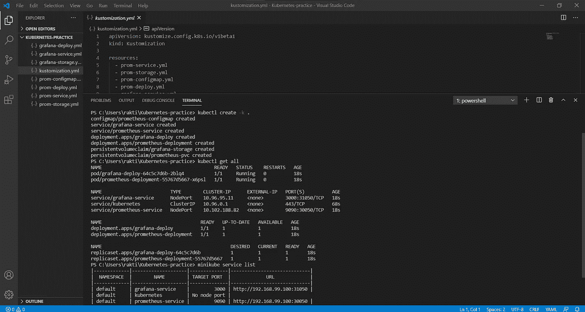**

**使用 VS 代码进行库定制化部署**

**现在，一旦你注意到你的吊舱正在运行，你可以使用下面提到的命令，这将有助于你获得普罗米修斯和格拉夫纳服务器的网址。**

```
minikube service list
```

## **让我们看看普罗米修斯是什么样子的:**

**无论你从 Prometheus 的服务列表命令中得到什么样的 URL，复制并粘贴到你的浏览器上…**

**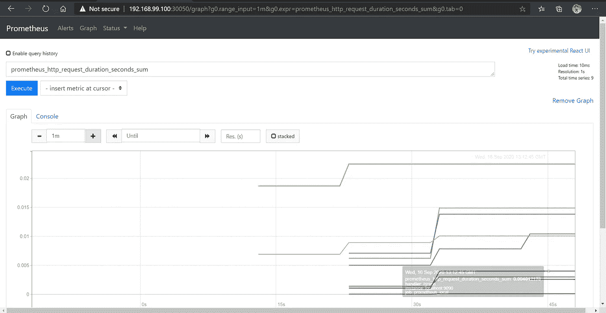**

**普罗米修斯仪表板**

**在查询中，您可以请求许多查询，并且可以注意到指标。在这里，我不会向您展示如何使用 PromQL 进行搜索。但是在下面的官方文档链接中，你可以找到更多关于 PromQL 的信息。**

*****PromQL 官方文档:***[***https://Prometheus . io/docs/Prometheus/最新/查询/基础知识/***](https://prometheus.io/docs/prometheus/latest/querying/basics/)**

**现在我们必须注意普罗米修斯从哪些节点收集指标。**点击 Status = > Targets** ，你会发现我们只有一个目标，就是 localhost。这是因为在配置映射文件中，我们提到了一个节点。看看下面的截图你就明白了…**

**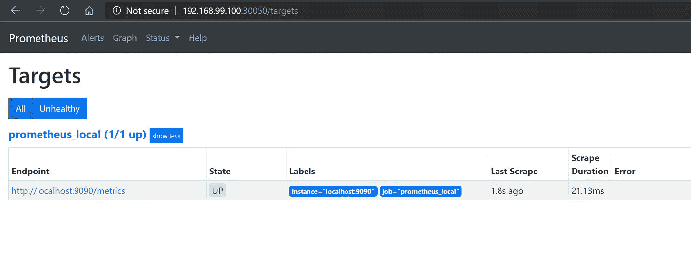**

**普罗米修斯目标**

## **让我们设置节点导出器:**

**我使用 RHEL8 作为我的节点来设置节点导出器。最初，我给出了一个链接，你可以找到如何设置节点导出器，但如果你错过了，没关系，这里是链接:**

*   *****节点导出器:***[***https://devopscube . com/monitor-Linux-servers-Prometheus-Node-Exporter/***](https://devopscube.com/monitor-linux-servers-prometheus-node-exporter/)**

**一旦您启动了节点导出器，如果您进入 Windows 浏览器并键入 RHEL8 的 **IP 以及端口号 9100** ，您将会注意到节点导出器正在工作。如果您更感兴趣，可以单击指标来查看 Node Exporter 正在收集哪种指标。**

**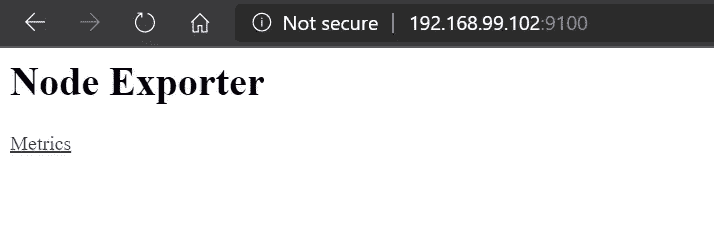**

## **让我们将节点导出器与普罗米修斯集成:**

**现在，你将看到 ConfigMap 的强大功能。转到“prom-configmap.yml”文件，在 localhost 之后添加以下几行。这将创造一个新的就业机会。**

```
- job_name: 'RHEL’
  static_configs:
  - targets: [‘192.168.99.102:9100’]
```

> **如果你不知道放在哪里、如何放或者如何保持缩进，不要担心，我马上会显示截图。**

**所以，现在我们必须用最新的配置来更新 ConfigMap 的预先创建的资源。在 Kubernetes 中，您只需要运行一个简单的命令。**

```
kubectl replace -f .\prom-configmap.yml
```

**您将看到配置图已经用最新的详细信息进行了更新。接下来，我们需要在 Pods 上更新这个。通常，我们可以在容器中复制这些信息，但是由于我们使用的是 Kubernetes 部署，所以使用另一种方法来更新 pod 非常容易，这种方法称为 **rollout** 。你只需要运行下面的命令；**

```
kubectl rollout restart deployment/prometheus-deployment
```

> *****免责声明:请确保您的 RHEL8 和 Minikube 使用的是相同的 VirtualBox 网络适配器。还要关闭 RHEL8 上的防火墙，以便它可以与外部连接。*****

**最后，我们来看看截图，以便更好的理解。**

**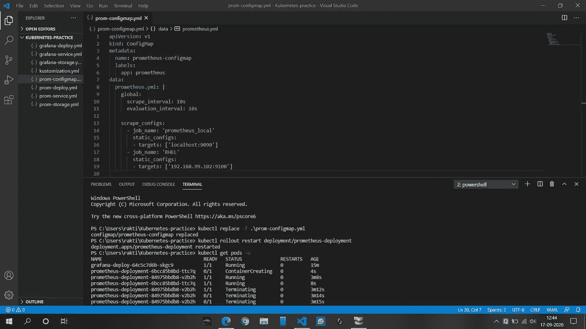**

**更新部署**

**接下来，让我们观察普罗米修斯 WebUI 门户上的目标。**

**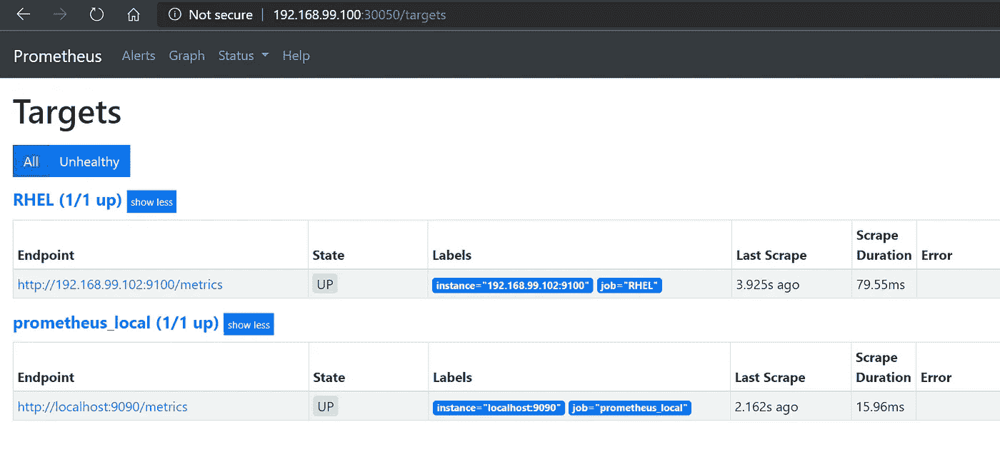**

**更新的目标**

**太好了，我们已经成功地与普罗米修斯建立了 RHEL8 节点。现在，我们将使用 Grafana 来可视化和分析这些指标。**

## **让我们设置 Grafana:**

**类似地，像普罗米修斯一样，进入 Grafana 服务器的 URL，你会看到它要求输入用户名和密码。**两者的初始用户名和密码都是“admin”。一旦你输入了密码，就创建一个新密码以备将来使用。接下来，您会注意到如下所示的仪表板或 WebUI****

**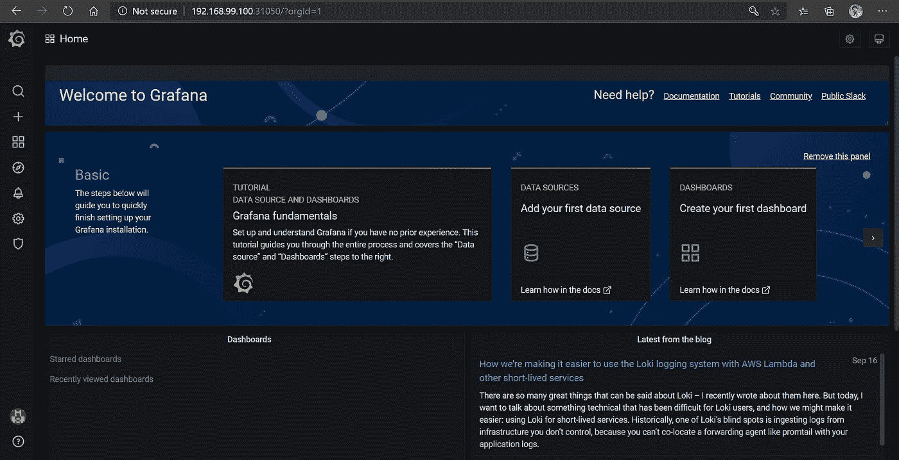**

**Grafana 仪表板**

**现在我们要把普罗米修斯和格拉夫纳联系起来。**点击数据源，选择 Prometheus，给出 Prometheus 的 URL，点击保存并测试。**在右上角你会得到“数据源更新”的通知，这意味着你的 Grafana 已经与 Prometheus 连接。**

**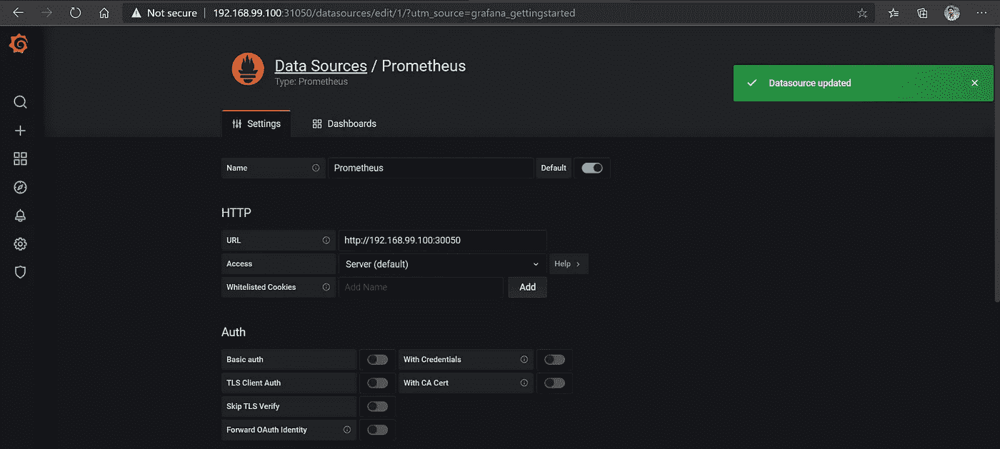**

**Grafana 数据源设置**

**最后的工作是创建仪表板。在这篇博客中，**我不会展示如何在 Grafana 上创建一个仪表板。但是为了展示 RHEL 8 节点指标是如何工作的，我将导入一个控制面板**。在 Grafana 中，有许多预先创建的仪表板可用，你只需要知道他们的 ID 号。因此，进入浏览器并搜索 Grafana Dashboard，你会发现许多仪表板。**

*   ****我正在使用一个仪表盘，您可以在此链接中找到:**[**https://grafana.com/grafana/dashboards/11074**](https://grafana.com/grafana/dashboards/11074)**

****要导入仪表板，请单击左侧面板上的加号(+)图标，然后单击导入。接下来，给 ID，对我来说，我使用 11074 作为 ID，然后加载，你会看到它加载了所需的信息。接下来在下面的普罗米修斯框中点击并选择普罗米修斯数据源，最后导入**，你将能够使用 Grafana 监控 RHEL8 节点。请参考下面的截图。**

**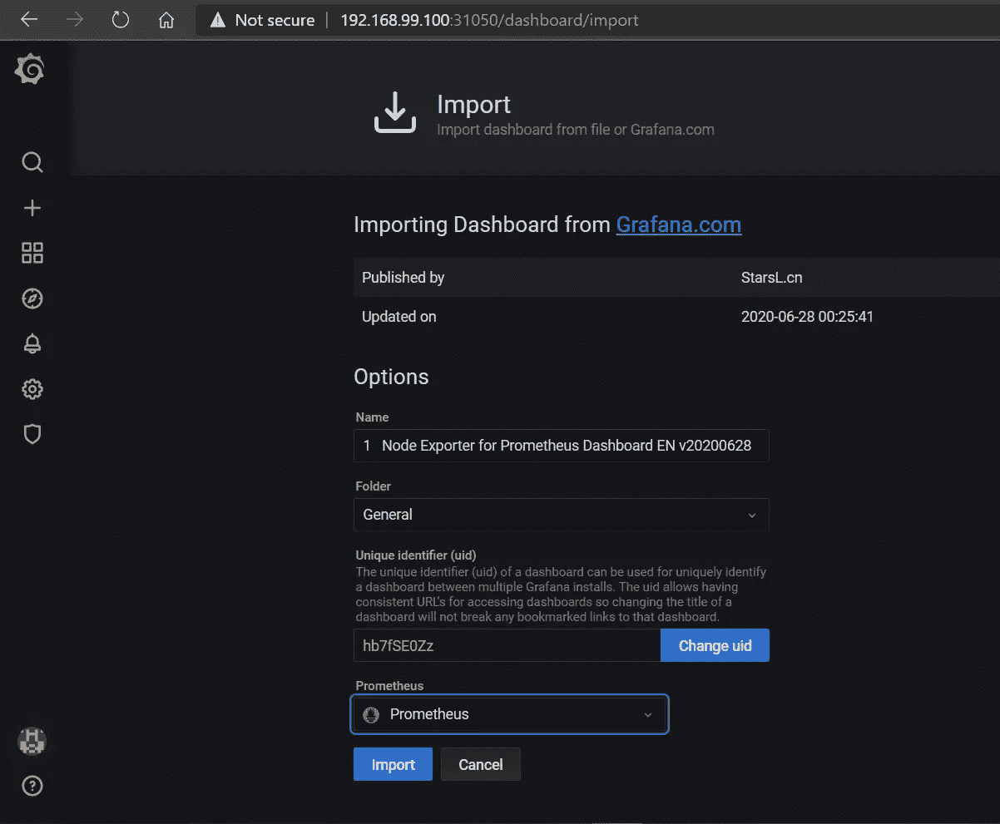**

**Grafana 仪表板导入**

## **最后，这里是仪表板的截图…**

**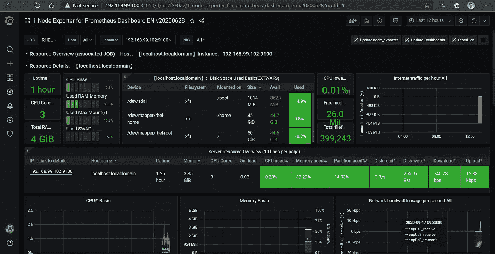**

**单节点导出器仪表板**

**太好了，我们终于完成了整个设置。现在，您可以轻松监控您的服务器:)**

# **现在是奖金的时候了:**

**有一种更加简单和灵活的方法，或者你可以说是在 Kubernetes 上部署这两个应用程序的自动化方法，而不需要创建任何部署脚本。我们可以用头盔来做这件事。就在几天前，我写了一篇博客，解释如何使用 AWS EKS 或弹性 Kubernetes 服务，并从非常基础的使用 Helm，我们可以非常容易地设置这些应用程序。**

****我提供了下面的链接，如果你有兴趣可以去看看……****

**[](/@raktim00/deploying-joomla-prometheus-grafana-on-aws-eks-37177a116acb) [## 在 AWS EKS 上部署 Joomla、Prometheus 和 Grafana

### 在本文中，您将了解如何在 AWS EKS 上部署 Joomla、Prometheus 和 Grafana

medium.com](/@raktim00/deploying-joomla-prometheus-grafana-on-aws-eks-37177a116acb) 

# 最后的话:

*   虽然我们已经成功地部署了 Prometheus 和 Grafana，但未来还有很多可能性，比如我们可以为不同的服务器使用不同的 Prometheus Exporter。此外，我们可以根据自己的需求创建定制的仪表板和面板。我们还可以配置警报来防止服务器故障。利用普罗米修斯和格拉夫纳我们可以做很多事情。
*   我试图让它尽可能简单。希望你从这里学到了一些东西。请随意查看我的 LinkedIn 个人资料，当然也可以随意发表评论。
*   我写 DevOps，云计算，机器学习等。博客，所以请随时关注我的媒体。最后但同样重要的是，如果你有任何疑问，请在 LinkedIn 上联系我。

[](https://www.linkedin.com/in/raktim00/) [## 微软学习学生大使(Alpha) -微软学习学生大使 CEE |…

### ★我是一名技术爱好者，致力于更好地理解不同流行技术背后的核心概念，如…

www.linkedin.com](https://www.linkedin.com/in/raktim00/) **