# RNN 和 LSTM——概述。

> 原文：<https://medium.com/nerd-for-tech/recurrent-neural-network-an-overview-1128ffc34ce7?source=collection_archive---------5----------------------->

我在以前的博客中分享过 ANN 和 CNN 的工作，但是它们不能以有效的方式处理序列数据。CNN 更适合用于图像数据，rnn 更适合用于序列数据(例如，带时间戳的销售数据、文本序列、心跳数据等)。)

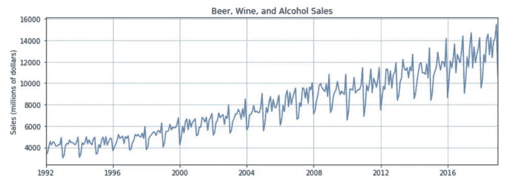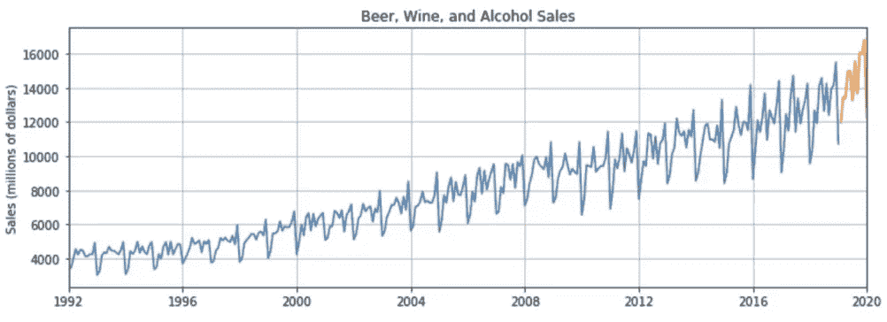

时序数据

首先，让我们想想时间序列到底是什么。上图代表了一定时期内美国各地的啤酒、葡萄酒和酒精销售情况。x 轴表示从 1992 年到 2019 年的时间范围，Y 轴表示以百万美元计的销售额。当我们考虑预测和时间序列预测时。RNN 了解历史信息，预测未来。

预测句子中的下一个单词。

它也可以在从类似句子的序列中预测下一个单词时实现。如果给我们一个模型，你好，你好吗，它会预测这个句子最有可能出现的单词，比如你好，你今天好吗？你可能在 gmail 中见过这项技术，它帮助我们在撰写邮件时建议下一个单词序列。

我们为什么需要 RNN？

我们将在序列数据上使用递归神经网络，序列数据可以是时间序列数据、音频数据、句子，本质上序列是以特定顺序出现的数据，顺序对数据中包含的信息很重要。因此，在输入模型之前，顺序很重要。

让我们想象一个场景，人类不会每次都从头开始思考，当你阅读这篇文章时，你通常会记住前一句话的主要上下文，并将其与当前句子联系起来，以更好地理解上下文，你通常不会每次都扔掉这个单词，并从头开始思考。你的思想有持久性。

传统的神经网络无法处理序列数据，因为在传统的神经网络中没有记住先前输出的可能性。RNN 通过简单地将其输出作为输入反馈到自身来解决这个问题，允许信息持久化。

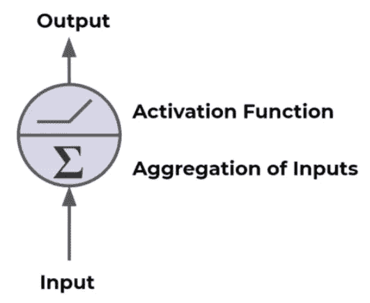

人工神经网络

让我们考虑一下前馈网络中的正常神经元。在正常神经元中，我们有一堆数据作为输入，这些数据经过聚集函数，然后经过激活层后提供输出。这是一个正常神经元的工作方式，但我们如何利用自身的历史信息。我们可以使用循环神经元将输出发送回自身。我们可以随着时间的推移展开单个循环神经元。

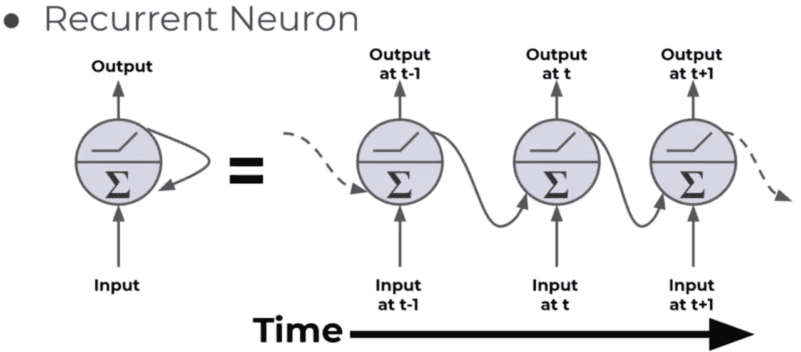

随着时间展开一个单一的循环网络。

让我们来讨论这是如何工作的，在 t-1 时，我们有一些来自前一层的一批数据输入，并在 t-1 状态下传递输入，这两个数据都在聚合函数中处理，然后在 t-1 时神经元的输出在通过激活函数后创建。随着时间的推移，在神经元状态时间 t，我们不仅输入了 t 时刻的数据，还馈入了 t-1 时刻的前一次输出的历史信息，这就给了我们 t 时刻的输出，现在你可以想象 t 时刻的输出馈入了 t+1 时刻的前一次信息。这样我们就保留了历史信息。递归网络序列的长度取决于句子中单词的长度。作为先前时间步长输入的函数的单元也称为存储单元。

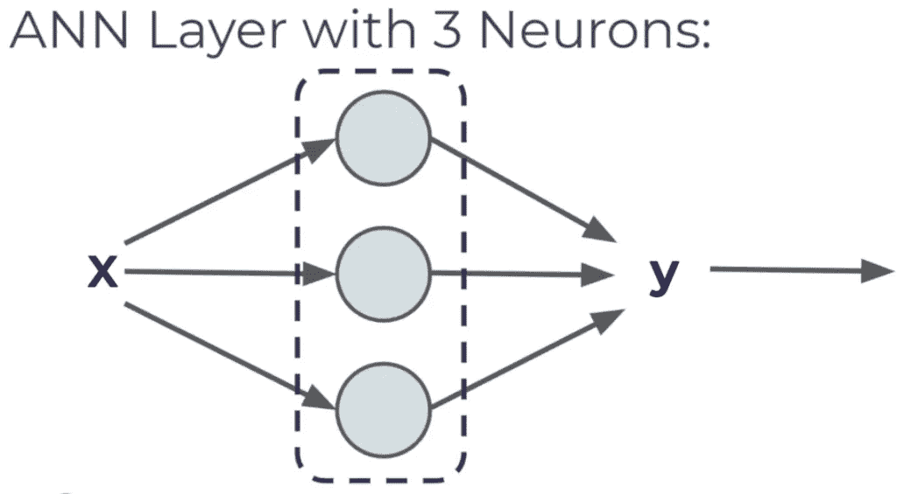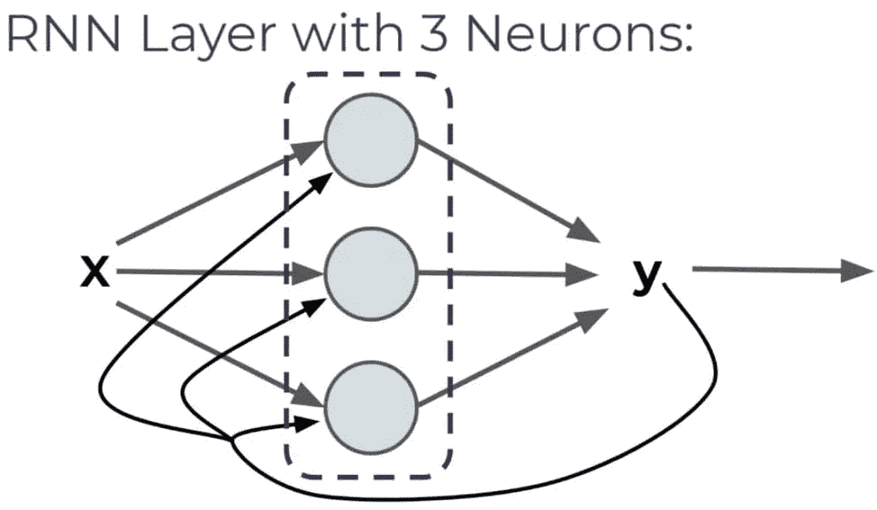

安 vs RNN

上图是人工神经网络和 RNN 架构的比较，我们将输出连接起来，并沿着每个神经元的输入传递。

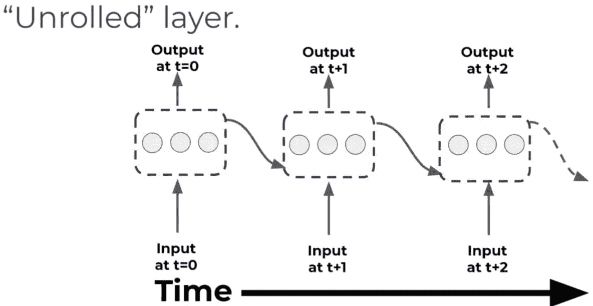

回归神经元的展开层

展开的层图像示出，输入在时间 0 被传递，然后时间 0 的输出作为时间 t+1 的输入被传递，并且该链发生直到时间 n

**RNN 的种类:**

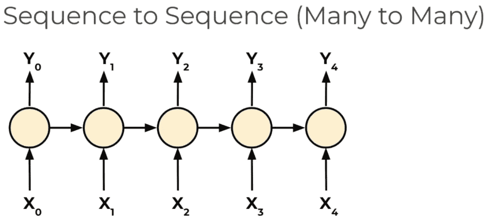

*   根据前面的 5 个单词，预测接下来的 5 个单词。

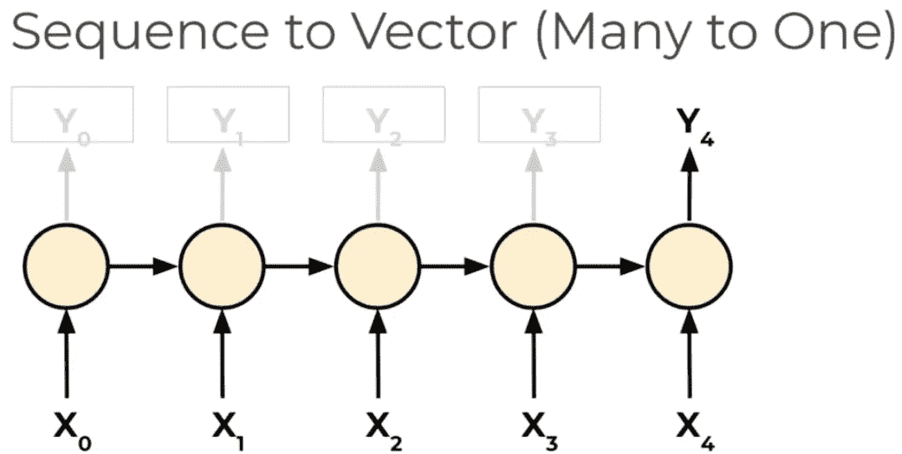

*   给定前 5 个单词，预测下一个单词。

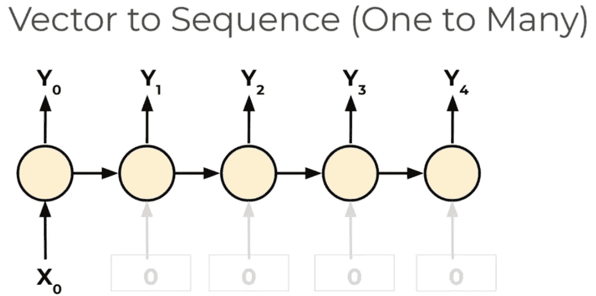

*   给定一个单词，预测接下来的 5 个单词。

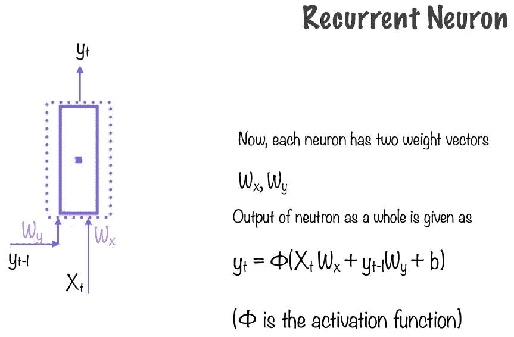

→由于我们将前一个神经元的输出连接到当前神经元的输入，每个神经元有两个权重向量 Wx，Wy。神经元的输出如上图所示，其中激活函数为 tanh。

**反向传播:**

梯度在网络中用于通过反向传播来更新网络中的权重和偏差。它取所有步骤的总和，然后反向传播，这被称为通过时间的**反向传播(BPTT)。**对于复杂数据，我们需要深度网络，当我们越来越深时，在反向传播步骤中可能会出现问题，如消失梯度和爆炸梯度。当你回到“较低”层时，梯度通常会变小，最终导致较低层次的权重永远不变。相反的情况也可能发生，梯度在返回的途中爆炸，造成问题。我们可以通过各种方法避免这些问题，例如

→权重和偏差的正确初始化(Xavier 初始化)。

→渐变剪辑

→批量标准化

→使用不饱和激活功能。

基本 RNN 有一个很大的缺点，我们只能真正“记住”以前的输出。如果你看到上面展开的图表，我们只是从过去的一个时间点开始，如果我们有很长的历史，RNN 模型倾向于忘记更老的历史样本。如果我们能记录长期历史，而不仅仅是短期记忆，那就太好了。基本 RNN 的另一个问题是消失和爆炸梯度问题。所有这些问题的解决方法都是通过使用长短期记忆来避免的(LSTM)。

**长短期记忆网络**:

长短期记忆网络——通常简称为“lstm”——是一种特殊的 RNN，能够学习长期依赖性。他们是由[hoch Reiter&schmid Huber(1997)](http://www.bioinf.jku.at/publications/older/2604.pdf)介绍的。

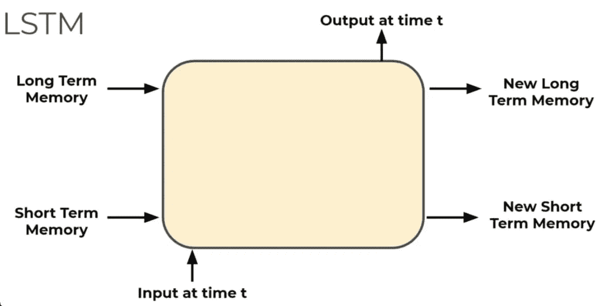

LSTM 的总体结构。

在 LSTM，我们不是跟踪单一的历史信息，而是同时跟踪长期记忆输入和短期记忆，然后在 t 时刻创建一个新的长期记忆输出和短期记忆输出以及当前输入

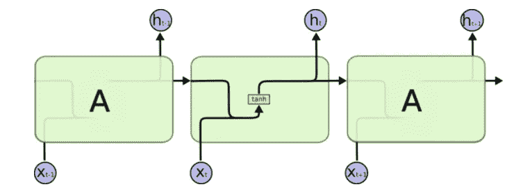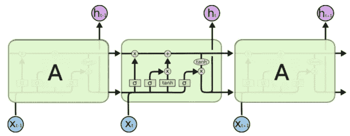

RNN vs LSTM 结构

在标准 RNNs 中，这种中继模块将具有非常简单的结构，例如单个 **tanh** 层。LSTMs 也具有这种链状结构，但是重复模块具有不同的结构。神经网络不是只有一层，而是有四层，以一种特殊的方式相互作用。

LSTM 崩溃

→输入门

→隐藏状态

→忘记盖茨

→输出门。

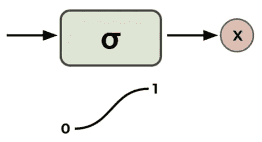

LSTMs 结构中使用的门

*   盖茨通常是一个数学的 sigmoid 层。sigmoid 层输出 0 到 1 之间的数字，描述每种成分应该通过多少。值为 0 表示“不允许任何东西通过”，而值为 1 表示“允许任何东西通过！”

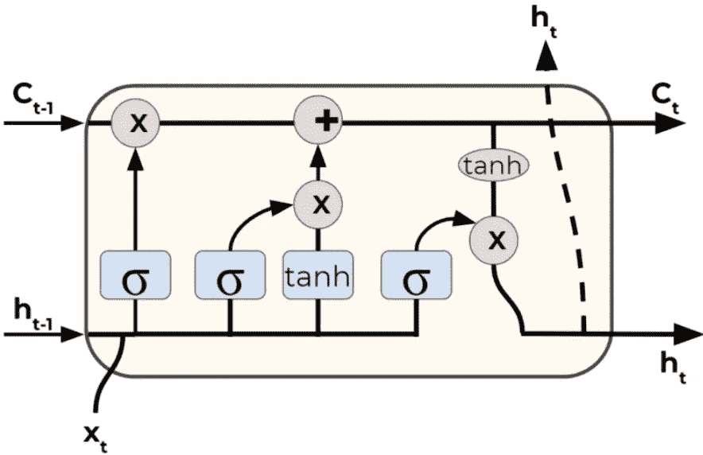

LSTM

LSTM 有三个这样的门，用来保护和控制细胞状态。这是整个 LSTM 牢房。我们将基本上一步一步地经历这个过程。

**忘门:**

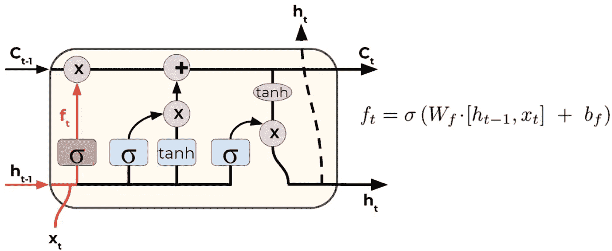

忘记大门

LSTM 的第一步是决定我们要从细胞状态中丢弃什么信息。忘记栅极层有助于实现从先前的单元状态中忘记什么信息。请记住，这些门本质上只是通过一个 sigmoid 函数，它越接近 0，意味着你给它的权重越小，越接近 1，意味着你给它的权重越大。因此，在“忘记门”层的上下文中，它越接近于零，本质上意味着忘记它并将其清除。输出越接近 1，就意味着完全记住了，记住这一点可能很重要。这是遗忘门的功能，请注意，它本质上是 h(t 1)的线性组合，即先前的隐藏状态与当前状态输入(x(t))的组合，我们有自己的一组权重和偏置，它通过一个激活层，给出 f(t)。

简单来说，就是从之前的细胞状态 C(t-1)决定要记住什么，忘记什么。

让我们来看一个语言模型的例子，它试图根据所有前面的单词来预测下一个单词。在这样的问题中，单元状态可能包括当前主题的性别，以便可以使用正确的代词。当我们看到一个新的主题时，我们想忘记旧主题的性别。

**输入门:**

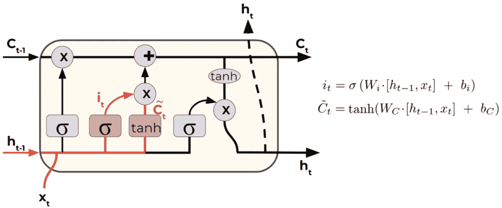

输入门。

遗忘门之后的下一步是，我们要在单元状态中存储什么新信息。它有两个部分，首先我们有一个 sigmoid 层，它将决定我们要在单元状态(c(t))中更新什么信息，接下来我们有一个双曲正切层，它创建一个向量新的候选值 C̃(t，它可以更新单元状态的某种权重。再次注意，只有一个线性组合，它有自己的一套权重和偏差。

简而言之，输入门决定在单元状态中添加什么信息。

在我们的语言模型的例子中，我们希望将新主体的性别添加到细胞状态中，以替换我们遗忘的旧主体。

**隐藏状态:**

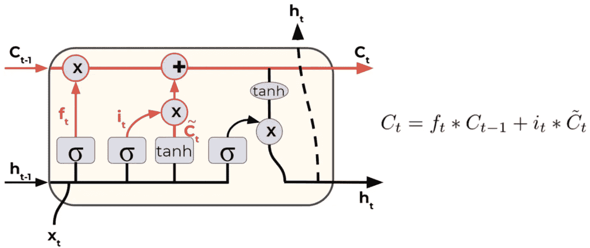

隐藏状态。

现在是更新旧单元状态 C(t-1)的时候了。为了计算新的细胞状态 C(t)，我们最终会输出。我们有 C(t)等于 f(t)乘以 C(t)然后我们要加上 i(t)乘以新的候选值 C̃(t)，这是新的候选值，按我们决定更新每个状态值的多少进行缩放。

简而言之，隐藏状态更新了细胞状态中需要添加哪些新信息来形成当前的细胞状态(长期记忆)。

在语言模型的情况下，这是我们实际删除旧主题的性别信息并添加新信息的地方，正如我们在前面的步骤中决定的那样。

**输出门:**

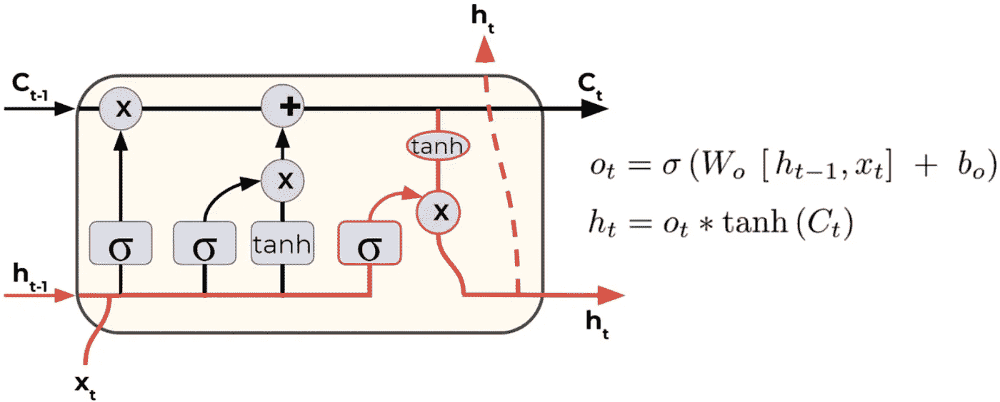

输出门

最后，我们要决定，我们实际上要输出什么作为短期记忆。这个输出将基于我们的细胞状态，这将是一个过滤的版本。首先，我们运行一个 sigmoid 层，它决定我们要输出细胞状态的哪些部分。然后，我们通过 tanhtanh 设置单元状态(将值推至 1 和 1 之间),并乘以 sigmoid 门的输出，这样我们只输出我们决定的部分。

简而言之，它给出了短期记忆的输出。

对于语言模型示例，由于它刚刚看到了一个主题，它可能希望输出与一个动词相关的信息，以防接下来会出现这个信息。例如，它可能输出主语是单数还是复数，这样我们就知道一个动词应该变成什么形式，如果接下来是什么的话。

我们只讨论了 LSTM 的标准版本，LSTM 有一些变化。他们是

**一个带有“窥视孔”的 LSTM 细胞**

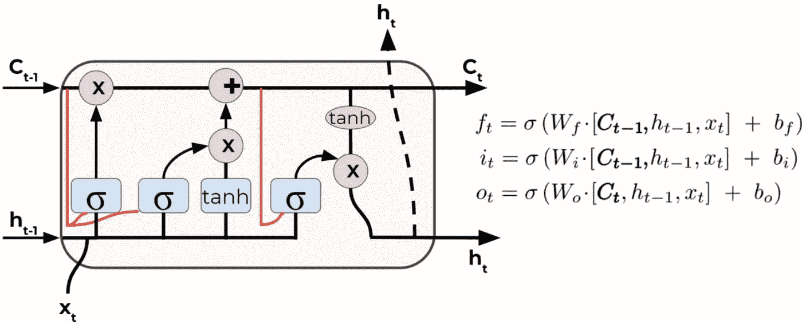

窥视孔连接

在这个单元中，我们最终做的是，基本上我们在这里添加了这些窥视孔连接作为红线，这意味着我们让多个栅极层 F(t)、i(t)和 o(t)查看单元状态。请注意，在上面的公式中，我们添加了 C(t-1)和 C(t ),之前，我们在栅极层中没有单元状态。另一个变化如下

**门控循环单元:**

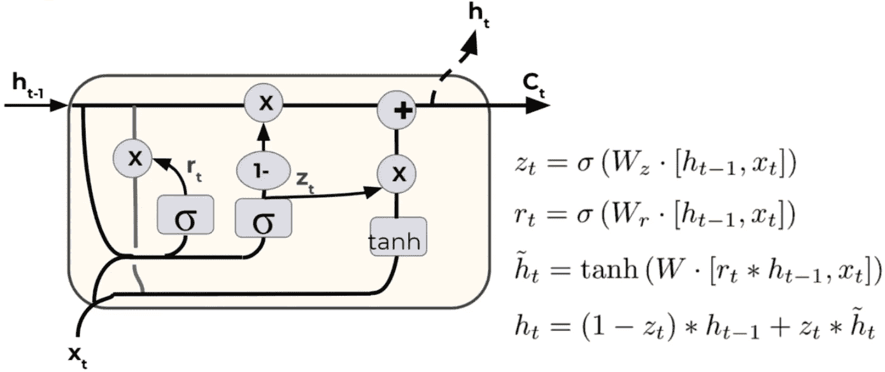

门控循环单元

门控循环单元将把遗忘门和输入门合并成一个更新门，它还合并了单元状态隐藏状态并做了一些其他的改变。所以最终发生的是，你有这个比标准 LSTM 模型更简单的模型。GRU 比标准的 LSTM 模式更快，并且一直在不断增长。

谢谢你把这篇文章看完。希望你们都知道 RNN 的想法，它的更新版本就像 LSTM，GRU 的作品。

如果有任何疑问，请通过 LinkedIN 联系我:【https://www.linkedin.com/in/rishi-kumar4197/】T4。

具体实施参考本本:[点击此处](https://github.com/Rishikumar04/RNN-Practise-Problems/blob/main/02-RNN-Exercise%20.ipynb)