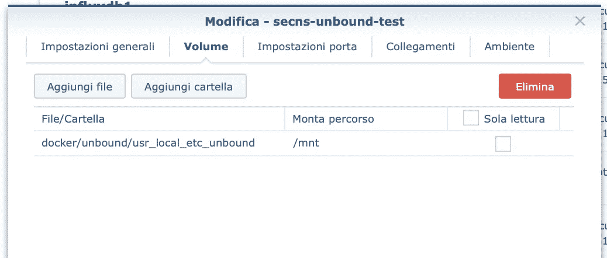
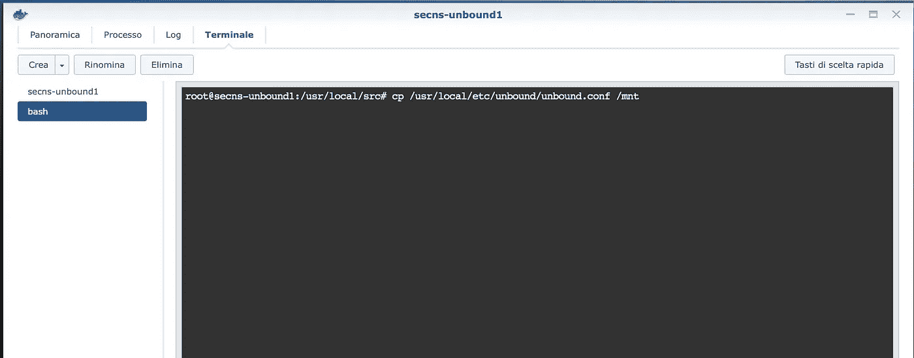
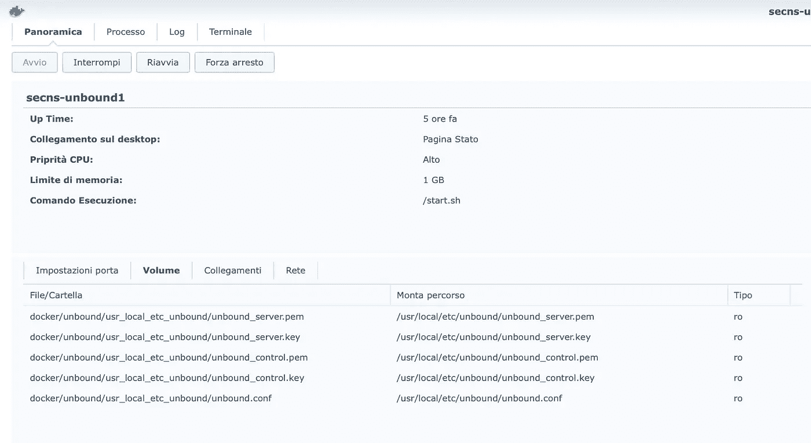

# 递归 DNS+广告拦截器—第 3 部分:用 Docker 在 Synology NAS 上安装未绑定的 DNSSEC

> 原文：<https://medium.com/nerd-for-tech/recursive-dns-ad-blocker-part-3-installing-unbound-with-dnssec-on-synology-nas-with-docker-d40bb36035dc?source=collection_archive---------1----------------------->

## 安装启用了 DNSSEC 的 SecNS Unbound 非常容易，让我们看看如何将它配置为之前在本系列文章的第 1 部分中在 Raspberry 上配置的 Unbound 实例。

## 介绍

正如我们在 [**递归 DNS+广告拦截器—第 2 部分:使用 Docker**](/nerd-for-tech/recursive-dns-ad-blocker-part-2-installing-pi-hole-without-caching-on-synology-nas-with-docker-5363bc7258f4) 在 Synology NAS 上安装没有缓存的 Pi-hole 一样，为了拥有一个冗余的*Pi-hole+未绑定的*堆栈(详见 [**具有广告拦截功能的递归 DNS 解析器**](https://giannicostanzi.medium.com/recursive-dns-resolver-with-ad-blocking-features-dea766d4f703) **)** 在我的家庭网络中，我也将未绑定的服务器加倍，再次选择我的 Synology NAS 作为一个伟大的目标。

## 选择正确的图像

由于在第 1 部分*中*我们没有在 Pi-hole 中启用 *DNSSEC* 验证，我们想在我们的递归 DNS 解析器中启用它。经过一段时间的挖掘和一些测试，我选择了由 *SecNS* 提供的图像，即[***SecNS/unbound***](https://hub.docker.com/r/secns/unbound)*。*该图像已经配置为启用 DNSSEC 验证，因此它符合我们的目的。

## 未绑定容器首次运行

如 *Synology Docker* 上 *Pi-hole* 安装的*部分 2* 所示，浏览注册表，搜索*secns/unbounded*并下载(拉取)该图像。

在启动容器之前，我准备了以下文件夹，在 File Station 应用程序中创建它们:

```
/volume1/docker/unbound/usr_local_etc_unbound
```

(我使用了 *usr_local_etc_unbound* ，因为我将把其中包含的一些文件映射到容器内的 */usr/local/etc/unbound* 文件夹中。可以选择最符合自己口味的命名约定)。

我建议您启动映像并创建一个新的容器，而不设置卷和网络映射，只是为了检索一些文件。假设您创建了一个名为 *secns-unbound1* 的容器，那么您可以使用以下命令从 Synology NAS 的 CLI(作为 root)中检索主配置文件/*usr/local/etc/unbound/unbound . conf*:

```
docker cp secns-unbound1:/*usr/local/etc/unbound/unbound.conf /volume1/docker/unbound/usr_local_etc_unbound/*
```

如果你不想以 root 用户的身份使用 CLI，你可以在容器内的临时路径 */mnt* 上挂载*/volume 1/docker/unbound/usr _ local _ etc _ unbound/*。然后你可以双击 Synology Docker 应用程序中的容器，点击 Terminal 选项卡，然后创建一个新的 *bash* 会话。在该会话中，您可以运行以下命令来完成与使用 *docker cp* 相同的任务:

```
cp /*usr/local/etc/unbound/unbound.conf /mnt*
```



mount/volume 1/unbound/usr _ local _ etc _ unbound 到容器的/mnt 文件夹



将容器的 unbound.conf 复制到/mnt(即/volume 1/docker/unbound/usr _ local _ etc _ unbound)

现在，您可以定制 *unbound.conf* 文件，稍后我们将以只读模式挂载到/*usr/local/etc/unbound/unbound . conf*。

## 未绑定的控件证书和密钥

如果您想监控您的非绑定性能，您可以使用 *unbound_control* (非绑定 Linux 安装中包含的实用程序)或 Python 模块 *unbound_console* 进行查询(更多细节将在另一篇文章中介绍)。如果您查看一下*/etc/unbounded*(在 linux 上)或/usr/local/etc/unbounded(在 SecNS 未绑定映像上)的内容，您可以看到以下 4 个文件:

```
unbound_control.key
unbound_control.pem
unbound_server.pem

unbound_server.key
```

为了连接到未绑定的控件服务，前 3 个文件是必需的，因此如果您想要与之交互，您必须从容器中获取这 3 个文件。你可以按照对 *unbound.conf* 的描述来完成这个任务(通过 *docker cp* 或者通过挂载*临时文件夹*)。

在我的家庭安装中，我没有特别的安全顾虑，我从我的 Unbound Raspberry 安装中获得了这 4 个文件，然后我将它们复制到*/volume 1/docker/Unbound/usr _ local _ etc _ unbounded*中，并在 RO 模式下将它们一个接一个地挂载到 SecNS Unbound 映像上(即容器中的每个*unbounded _ XXX . yyy*文件挂载到*/usr/local/etc/unbounded/XXX . yyy*)。这样，我可以在我的 Raspberry 上使用 *unbound_control* 命令来监控 Raspberry 和 Synology Docker 未绑定实例，而无需指定不同的 pem 和密钥文件(当您启动 *unbound_control* 工具时，它默认使用未绑定服务器的 */etc/unbound.conf* 配置文件来了解它可以在哪里找到控件和服务器 *pem* 文件以及控件*密钥*

## 自定义 unbound.conf

遵循我在 SecNS 未绑定容器上使用的配置(我将只显示未注释的指令)。有关配置的更多详细信息，您可以查看具有广告拦截功能的 [**递归 DNS 解析器**](https://giannicostanzi.medium.com/recursive-dns-resolver-with-ad-blocking-features-dea766d4f703) ，在这里您可以看到我的 Raspberry 未绑定配置以及更多行内注释(配置略有不同，我没有统一两个配置文件，我只是用 Raspberry 上的定制修改了容器文件)。

请注意，在我的 Raspberry 配置中，我已经将默认 TCP 和 UDP DNS 端口从 53 更改为 50053，但是如果端口 53 已经为 Pi-hole DNS 服务公开，您完全可以保留默认端口 53，然后通过 *Docker 的网络映射*将其作为 50053(或任何您喜欢的端口)向外界公开。

SecNS 未绑定容器 unbound.conf 文件

## 为最终用途重新配置容器

在将容器投入生产之前，让我们在停止时从 Synology Docker 应用程序修改它的配置。选择容器并按修改。

**卷绑定**

选择卷选项卡，然后为每个文件按添加文件。

在图中可以看到，我已经安装了配置文件和从我的 Raspberry 安装中复制的 4 个 SSL 相关文件(不需要，如前所述)。我将展示双击容器可以看到的最终结果。



将外部配置文件映射到未绑定容器中的原始文件上

**端口映射**

然后，我暴露了 TCP 和 UDP 的端口 50053。我需要公开它们，因为我希望我在 Raspberry 上运行的 Pi-hole 指向 Raspberry 和 Synology NAS 容器的未绑定实例，否则，如果您希望仅从在同一 docker 实例和同一*非默认桥接网络*上运行的 Pi-hole 指向未绑定实例，您不需要向外界公开未绑定的 DNS 端口。我还展示了端口 8953/TCP，这是使用 *unbound_control* 或 *unbound_console* 监控未绑定性能所需的端口。


发布 DNS 和未绑定的控制端口

## 验证 DNSSEC

详细的 DNSSEC 测试在第 1 部分中显示，顺便说一句，我在这里显示一个快速测试。我从我的 Raspberry 运行了以下命令，指向 nas.homenetwork IP 地址上的 SecNS Unbound exposed on port*50053/UDP*:

```
# You should get the bold values in order to confirm DNSSEC is working# delv tool is provided by *dnsutils* package
**delv** [**@**](http://twitter.com/127)**nas.homenetwork -p 50053 internetsociety.org A +rtrace +multiline**
;; fetch: internetsociety.org/A
**;; fetch: internetsociety.org/DNSKEY
;; fetch: internetsociety.org/DS**
;; fetch: org/DNSKEY
;; fetch: org/DS
;; fetch: ./DNSKEY
**; fully validated**
internetsociety.org.    300 IN A 104.18.16.166
internetsociety.org.    300 IN A 104.18.17.166
internetsociety.org.    300 IN **RRSIG** A 13 2 300 (
          20210418094324 20210416074324 34505 internetsociety.org.                
          vSNyWVP0EivHHRAyiqvwJqV+5N2FgUlrBq++xzsmdafn
          4zhz4CGuIBWbljDSxD2bmJYDFxfHOtR9QDX9YEHc2Q== )**dig** [**@**](http://twitter.com/127)**nas.homenetwork -p 50053 internetsociety.org. A +dnssec +multiline**; <<>> DiG 9.11.5-P4–5.1+deb10u3-Raspbian <<>> [@](http://twitter.com/127)x.x.x.x -p 50053 internetsociety.org. A +dnssec +multiline
; (1 server found)
;; global options: +cmd
;; Got answer:
;; ->>HEADER<<- opcode: QUERY, status: NOERROR, id: 38788
;; flags: qr rd ra **ad**; QUERY: 1, ANSWER: 3, AUTHORITY: 0, ADDITIONAL: 1;; OPT PSEUDOSECTION:
; EDNS: version: 0, flags: **do**; udp: 4096
;; QUESTION SECTION:
;internetsociety.org. IN A;; ANSWER SECTION:
internetsociety.org. 11 IN A 104.18.16.166
internetsociety.org. 11 IN A 104.18.17.166
**internetsociety.org. 11 IN RRSIG** A 13 2 300 (
 20210418094324 20210416074324 34505 internetsociety.org.
 vSNyWVP0EivHHRAyiqvwJqV+5N2FgUlrBq++xzsmdafn
 4zhz4CGuIBWbljDSxD2bmJYDFxfHOtR9QDX9YEHc2Q== );; Query time: 1 msec
;; SERVER: nas.homenetwork#50053(x.x.x.x)
;; WHEN: Sat Apr 17 10:48:13 CEST 2021
;; MSG SIZE rcvd: 195
```

## 2xPi-孔+2x 未绑定冗余

现在我们已经在 Raspberry 上配置了一个 Pi-hole +非绑定堆栈，在 Synology NAS 上配置了一个 Pi-hole+非绑定堆栈，通过从每个 Pi-hole 指向两个非绑定实例，我们最终可以得到一个更加冗余的解决方案。这可以通过 Pi-hole GUI 上的*设置→ DNS 配置*面板完成，根据需要定义第二个自定义上游 DNS 服务器。

这里我发现了一个大问题，我不能指定一个 FQDN(完全限定域名)来指向一个自定义 DNS，所以在我运行在 Synology Docker 上的 Pi-hole 上我不能通过名字来指向运行在同一个 Docker 网络上的 Unbound(es:*sec ns-un bound 1*)。我可以在与我的 Pi-hole 容器共享的网络上用命令*docker inspect secns-un bound 1*检查 docker 分配给 *secns-unbound1* 的 IP，但是如果从头开始重新创建容器，它可能会改变。作为一个解决方案，我选择了一个私有 IP 地址 192.168.1.100，它位于我的家庭局域网之外，因此，流向该 IP 的流量通过默认路由被定向到我的 *MikroTik* 路由器，作为一个特殊的 IP 地址用作上行 DNS。

假设我家局域网是 10.0.0.0/24，家里路由器是 10.0.0.254，NAS 是 10.0.0.100。我可以将运行在 10.0.0.100 上的 Pi-hole 配置为 IP 192.168.1.100 的上游 DNS。

从 Pi-hole 到 SecNS Unbound 的 DNS 查询退出源 IP 为 10.0.0.100、目标 IP 为 192.168.1.100 的 NAS。MikroTik 路由器接收流量(必须使用 10 . 0 . 0 . 0/24 之外的 IP **，否则 NAS 会尝试直接到达它，而不将流量发送到其默认网关，除非您直接将路由器 IP 地址指定为 DNS ),然后它用 10 . 0 . 0 . 0 . 254(局域网上路由器 IP 的 SNAT)替换源 10 . 0 . 0 . 0 . 100，用 10 . 0 . 0 . 0 . 100 替换目的地 192.168.1.100NAS 接收查询并将其发送到 SecNS Unbound 的内部地址。现在，对查询源的未绑定回复:在这里，您可以看到有必要拥有一个源 NAT，否则，如果源是 10.0.0.100，Pi-hole 将直接从 NAS 的 IP(也是 10.0.0.100)接收回复，而不是它期望的 192.168.1.100。因此，由于 SNAT，回复返回到 MikroTik 路由器，与之前的 SNAT/DNAT 相反，带有源 192.168.1.100 和目的地 10.0.0.100 的响应数据包到达 NAS，然后 NAS 将其发送到 Pi-hole 容器的内部 IP。**

您可以用 MikroTik 用这两行代码实现这个 SNAT/DNAT(第二行代码看起来很奇怪，因为源地址和目的地址是相同的，但这是因为目的地址已经被 DNAT 更改了，这发生在 SNAT 之前):

```
**/ip firewall nat** **add action=dst-nat** chain=dstnat in-interface=lan_bridge src-address=10.0.0.100 dst-address=192.168.1.100 **to-address=10.0.0.100****add action=src-nat** chain=srcnat out-interface=lan_bridge src-address=10.0.0.100 dst-address=10.0.0.100 **to-address=10.0.0.254**
```

不幸的是，SNAT/DNAT 解决方案无法在可配置性较低且更常见的家用路由器上实现，因此使用由 *docker inspect* 显示的 ip 可能是唯一的解决方案，除非您有像 Raspberry 这样的 linux 机器，在这种情况下，您可以通过指向 Raspberry 的 ip 和特定端口，然后将 SNAT/DNAT 与 *iptables、*一起应用，其逻辑与我的 MikroTik 示例相同:

```
# Suppose Raspberry has IP 10.0.0.200 on eth0 and NAS 10.0.0.100
# As you can see, we swap src/dst ip addresses with SNAT/DNAT# First we translate the destination address to NAS IP address 
# with DNATiptables -t nat -A PREROUTING -i eth0 -s 10.0.0.100 -d 10.0.0.200 -j DNAT --to-destination **10.0.0.100**# As on MikroTik, DNAT already happened, so we match 10.0.0.100 as
# both source and destination and change source to Raspberry IP 
# address whit SNATiptables -t nat -A POSTROUTING -o eth0 -s 10.0.0.100 -d **10.0.0.100** -j SNAT --to 10.0.0.200# Enable IP forwarding "on the fly" to test if everything works
echo 1 > /proc/sys/net/ipv4/ip_forward# If you want to enable it permanently, edit /etc/sysctl.conf
# and set the following
net.ipv4.ip_forward = 1
```

我还尝试了一个更简单的解决方案，将 NAS 10.0.0.100 的 IP 和端口 50053 指定为上游 DNS，该端口由未绑定的容器映射，但我发现回复返回到内部网桥 lan 172.18.1.1 的 GW IP 的 Pi-hole 容器，而不是 10.0.0.100:

```
root@pihole-nocache:/# nslookup
> server 10.0.0.100
Default server: 10.0.0.100
Address: 10.0.0.100#53
> set port=50053
> google.it
;; **reply from unexpected source: 172.18.1.1**#50053, **expected 10.0.0.100**#50053
;; reply from unexpected source: 172.18.1.1#50053, expected 10.0.0.100#50053
;; reply from unexpected source: 172.18.1.1#50053, expected 10.0.0.100#50053
```

## 结论

我希望这篇文章对您有所帮助，如果您想避免 SNAT/DNAT 来实现同一个 Docker 实例上的容器之间的无绑定通信，请留言告诉我:)

在本系列的下一篇文章中，我将向您展示我是如何实现一个监控脚本的，该脚本从 Pi-hole 服务器收集指标并上传到 InfluxDB2 服务器，以允许我在 Grafana 仪表板上绘制有用的信息:

[](/nerd-for-tech/recursive-dns-ad-blocker-part-4-pihole2influxdb2-how-to-monitor-your-pi-hole-servers-b2f03de2baf2) [## 递归 DNS+广告拦截器—第 4 部分:pihole 2 influxd 2—如何监控您的 pihole 服务器

medium.com](/nerd-for-tech/recursive-dns-ad-blocker-part-4-pihole2influxdb2-how-to-monitor-your-pi-hole-servers-b2f03de2baf2)