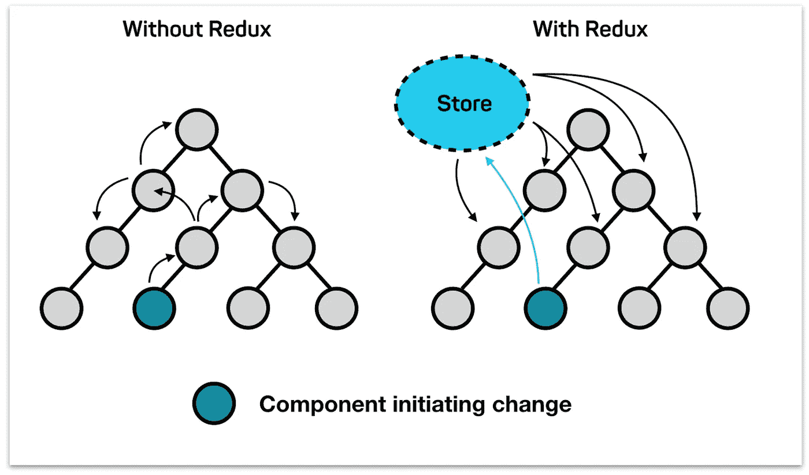

# Redux + React

> 原文：<https://medium.com/nerd-for-tech/redux-react-bc34e0a52b2b?source=collection_archive---------11----------------------->

反应还原

Redux 是什么，为什么用？

首先，React 是 UI 库，Redux 是 JavaScript 库。Redux 允许我们管理 JavaScript 应用程序中的状态。Redux 不绑 React。它可以与 React、Angular、Vue 甚至 Vanilla JavaScript 一起使用。我认为 React 和 Redux 的名字被一起提到太多了，因为他们在一起很受欢迎，他们以一种集成的方式工作得很好。Redux 在文献中被称为应用程序语句管理器(ASM ),即应用程序状态管理器。

> ***“Redux 是 JavaScript 应用的可预测状态容器”***

图 1

想象一下，你在一个项目中使用数百甚至数千个组件。过了一段时间，不使用 Redux 来管理我们的统计数据几乎是不可能的。在这一点上，我们可以说使用 Redux 挽救了生命。😃Redux 为我们提供了在全局范围内使用状态的机会，所以当我们想在项目的底层组件中使用顶层的状态时，我们可以借助 redux 消除这种称为道具钻取的现象🚀

当我们检查 Redux 时，有一个商店的概念，如上图所示。那么这家店是什么？

Store 实际上是一个 JavaScript 对象。我们可以把这个叫做商店的概念想象成一个数据库。虽然它不完全符合数据库的含义，但我们可以先理解一下。😄。假设我们有一个状态，我们的组件正在跟踪这个状态。当我们对此状态进行更改时，我们的组件会根据更改进行自我更新。这个单一状态实际上是我们的存储对象。

因此，如果我们简单总结一下，Redux 为我们提供了全局状态管理，它从一个地方为我们提供了状态管理，从而防止我们淹没在道具中。🚣

# 冗余数据流

在本节中，我将尝试在下图中解释 Redux 数据流。

冗余数据流

上图中看到的视图部件是用户打开网页时遇到的第一个屏幕。假设我们在这个屏幕上有一个输入字段，我们的用户键入自己的名字并按下保存按钮。当他/她按下它的时候，一个动作发生了。这个动作对应于动作部分。在 Actions 部分，我们需要将用户写的名字发送到 Store 部分。发送的信息到达商店后，由我们在相关位置的还原员进行处理。Reducers 获取由 store 提供的状态，并进行需要完成的更改或操作。之后，将更新后的状态提交给存储。我们在存储上只有一个状态对象，在状态被更新后，它返回到视图部分，视图部分也得到更新。

在我看来，最重要的事情是:

*   只有一家商店
*   商店下面有减速器
*   Reducers 所做的唯一工作就是数据交换。减速器是纯函数，也就是说，它们是不起作用的函数。纯函数称为返回单个值的函数😅

# 反应还原

现在，我们应该知道我们已经有了 React，它是一个 UI 库，我们有了 Redux，它是一个状态管理库。它们彼此独立工作，在我们的 React 应用程序中直接使用 Redux，这有点令人困惑，也很困难，这就是我们有 React-Redux 包的原因。React-Redux 是 React 的官方 Redux UI 绑定库。我们的意思是，React- Redux 提供了几个函数，可以帮助我们将 React 应用程序与 Redux 连接起来，所以如果我们一起使用 React 和 Redux，我们也应该使用 React-Redux 来绑定这两个库。

让我快速总结一下我们到目前为止学到的要点

*   React 是一个用于构建用户界面的库
*   Redux 是一个用于在 JavaScript 应用程序中以可预测的方式管理状态的库
*   React-Redux 是一个库，它提供了在应用程序中一起使用 React 和 Redux 的绑定

感谢阅读，下次见👋