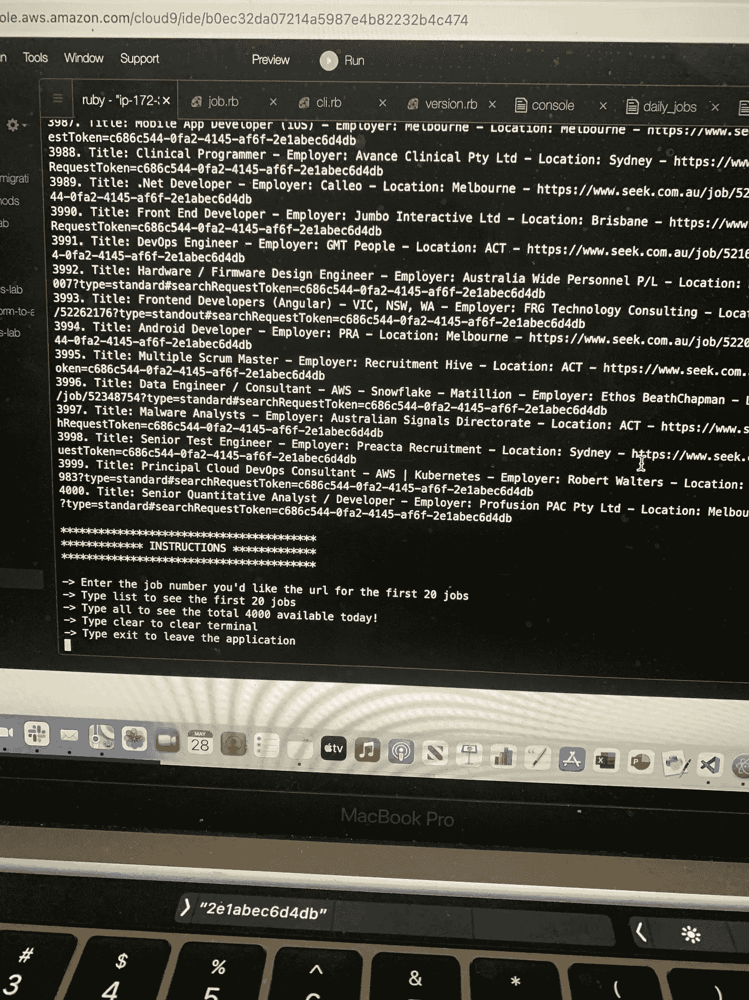

# 反思:使用 Ruby 的 Web Scraper CLI 应用程序

> 原文：<https://medium.com/nerd-for-tech/reflections-cli-application-web-scraper-with-ruby-cbb98ca2d8d5?source=collection_archive---------26----------------------->

这个全栈软件工程课程模块的任务是用 Ruby 构建一个抓取公共网站的 CLI 应用程序。

这项任务的主要目标是:

1.  理解 Ruby 中 CLI 应用程序的结构
2.  演示面向对象编程在 Ruby 中的应用
3.  用 Ruby 编写一个 CLI 应用程序，其中提供的数据必须至少深入一个级别。“级别”是用户可以做出选择，然后获得关于他们选择的详细信息的地方。
4.  通过创建一个对象集合，而不是存储数据的散列，展示面向对象设计模式的良好使用。
5.  演示使用 Nokogiri(一个 Ruby gem)解析 HTML 和 XML
6.  演示开放 URI(一个 Ruby gem)的使用，它是 Net::HTTP、Net::HTTPS 和 Net::FTP 的包装器。
7.  将 DRY(“不要重复自己”)和关注点分离原则应用到编程中。

**总结**

我决定构建一个 CLI 应用程序来收集 Seek.com.au 的数据，这是一个列出澳洲工作的搜索引擎网站。

我之所以选择这个，是因为我觉得应用我新的 Ruby 编程技能，修改 CSS 选择器的使用来提取 HTML 数据，并抓取一个相对建立和复杂的网站，这将是一个很大的学习挑战。

**Ruby 编程的改版**

构建一个能抓取公共网站的 CLI 应用程序是一次丰富的学习经历，巩固了我的 Ruby 编程技能和知识，因为它涵盖了一些 Ruby 的基本知识，包括:

*   基本控制流——“如果”语句如何工作
*   可变范围—方法、实例和类
*   对象实例化— #new(可能还有#initialize)
*   “自我”关键字的含义
*   方法类型—类方法与实例方法
*   方法返回类型—知道什么方法返回
*   遍历集合——至少在一个块中使用#each

**挑战**

我经历的主要挑战是将 CSS 选择器应用到一个复杂的网站来收集数据，并巩固我对使用 Ruby 的面向对象编程的理解——特别是上下文/“自我”的含义，以及应用 DRY(“不要重复自己”)和关注点分离计算机科学原则。通过学习实验室工作有助于巩固新概念，但是构建应用程序是将概念及其关系联系在一起的更有益的方法。

最后，由于我使用了新的 MacBook Pro M1 处理器，我在课程和 Ruby rspec 测试中遇到了一些软件兼容性问题。因此，我从 Visual Studio 代码过渡到了基于 web 浏览器的 AWS Cloud9 IDE。我在 Cloud9 上的体验非常特别，除了需要重新登录的罕见的连接丢失。对于我一直从事的编程工作来说，它做得非常好，在某些方面，比在任何有互联网连接的计算机上操作 Visual Studio 代码还要快！

**结论**

这是一个压倒性的，但有价值的学习经历，同时兼顾全职工作和家庭。它强调了制定严格的时间管理和“学习如何学习”的技能是多么关键，这样你就可以继续保持强大的人际关系和良好的健康，同时掌握作为软件工程师的技能。

带着我新的自信、知识和技能，我非常期待 Ruby on Ruby rails 框架的下一个模块。