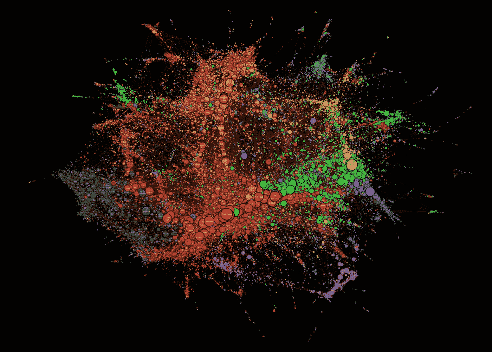
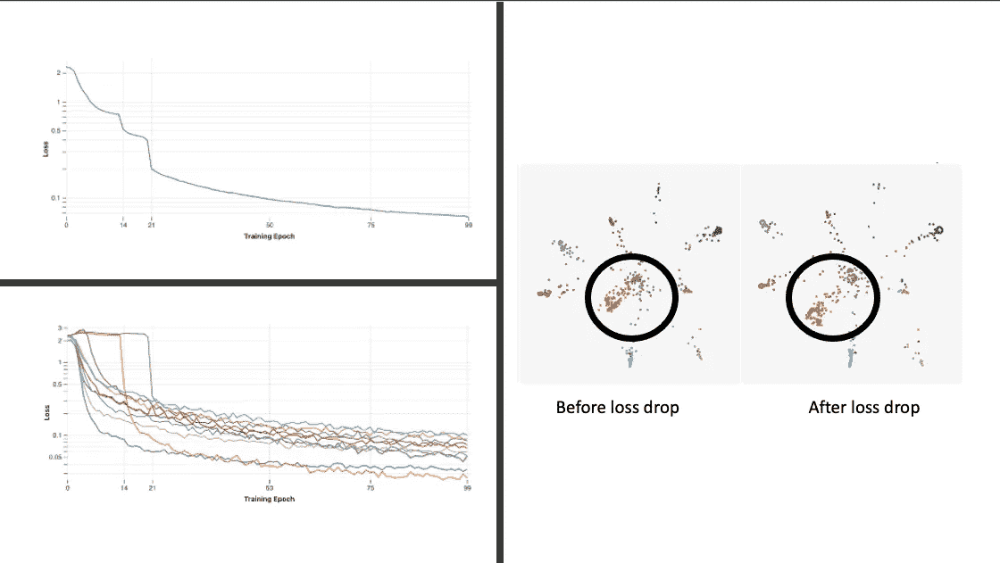
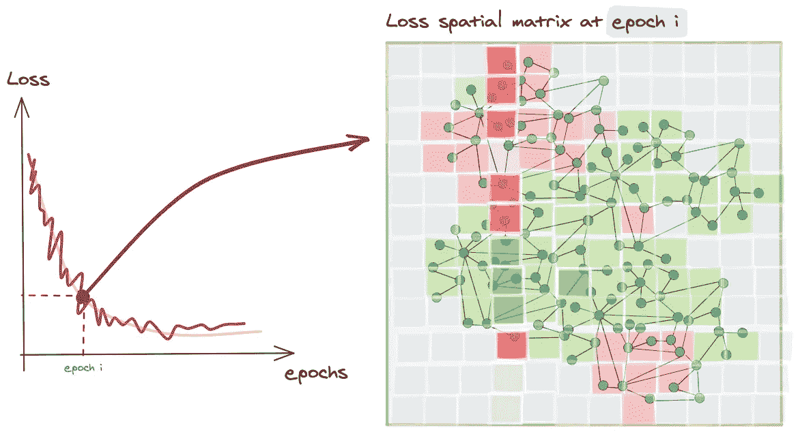
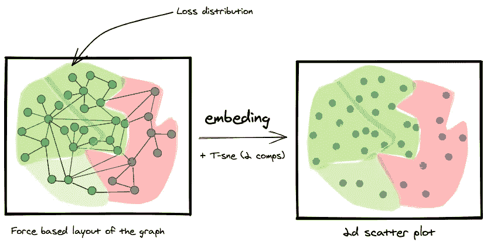

# 关于检验和可视化真实图形学习问题的思考

> 原文：<https://medium.com/nerd-for-tech/reflections-on-inspecting-and-visualizing-real-life-graph-learning-problems-d49868fef08e?source=collection_archive---------14----------------------->

**免责声明**:本文及即将发布的只是反思，总结个人观点，需要大家评论更新。此外，我们愿意启动一个开源项目，在图形学习的背景下处理大型网络的检查和可视化，这将直接基于这些文章的想法和您的贡献(评论，[DMs](https://twitter.com/anas_aito)……)。

# 图形学习问题:概述和背景

最近几个月，我对图形学习问题和 **GNNs(图形神经网络)**产生了兴趣。我喜欢本地消息传递的想法和包含图结构的潜在表示的构造。此外，还有许多简化图形模型创建部分的库，如 **DGL** 或 **PyTorch-geometric** 。

# 然而，图表很难可视化，因此很难检查

然而，我对图形神经网络应用程序的研究表明，现实生活中的问题建立在大型图形(社交网络、知识图、关系数据库)之上，在这种情况下，很难使用简单的可视化库(如 **Networkx** 或 **Pyviz** 或更高级的库(如 Gephy)来可视化它们(洞图)(因为图形变得复杂了)。此外，用户应该将他们的数据重新定位到另一个平台进行可视化和检查，并在看到一些结果之前做一些手工工作，并开始调试他们的模型结果。因此，这使得研究人员很难快速迭代或快速识别问题。

# 我们至少可以问正确的问题吧？

弄清楚如何解决这些问题和复杂性迫使我们通过提出正确的问题和定位典型图形学习管道中的痛点来阐明问题

## 为什么大图很难可视化？

图不是欧几里得对象，因此我们需要所谓的布局方法来将它们投影到 2D 空间中，而不丢失我们图中的局部空间结构。这就是为什么有许多布局方法来帮助我们，例如，基于力的方法将图形边缘视为弹簧系统。还有其他求解器，比如基于树的方法，但在我看来，基于力的方法在处理小世界网络时提供了一个简洁的可视化。

当处理大型图形时，可视化变得复杂起来，这不是因为布局方法不能渲染图形，而是因为渲染了太多的边，图形看起来很乱。有关大型图形可视化问题和解决方案的更多信息，请查看本文**。**

****

**大图示例【来自 lastfm 互动[图](http://sixdegrees.hu/last.fm/interactive_map.html)，CC BY-NC-SA 2.5 HU】**

**将一个图形作为一个整体来可视化，不会让研究人员或从业者轻易调试。因为除非我们放大，否则我们无法获得局部趋势，不要忘记保持图形交互的计算复杂性。**

## **一个 GL(几何学习)从业者想从图形可视化中得到什么？**

**图形学习管道看起来几乎与传统的深度学习管道相同。首先，选择您的模型，输入您的数据，然后查看随着时间推移损失值变化的一些指标，这有助于您以汇总的方式查看您的模型在新数据下的表现。然后，任何可疑的行为，如损失值停滞或大幅下跌，都可以通过一些更个性化的分析来进一步检查。**

**我想到的一个例子是在处理 MNIST ( [MNIST 手写数字数据库](http://yann.lecun.com/exdb/mnist/))分类时。你训练你的模型，通过历元图得到你的损失[见下图]，你可能看到例如在第一次迭代中的停滞，然后下降，你通过检查每一类的损失曲线进行更多的调查，你看到停滞仅在两类 **1** 和 **7** 中观察到。你的模型会被这两个类混淆吗？为了进行更多的研究，我们尝试对模型的 softmax 输出进行降维，然后在 2D 空间中可视化结果。**

****

**(左)历元上的损失值/每个类的历元上的损失值|(右)t- sne 降维后的 softmax 输出，[摘自 distilt . pub[文章](https://distill.pub/2020/grand-tour/)，CC BY 4.0]**

**是的，不幸的是，在未来的迭代中，我们两个类的模型 softmax 在分离之前是重叠的。请注意，在其他复杂的问题中，解决方案可以为这些有问题的类添加更多的标记数据，而这种情况是不可能的。**

**但是图形学习问题呢，这种技术和其他技术有用吗？是的，也许是，但问题是我们能做得更多吗？换句话说，如果我们把自己放在节点级别的学习环境中，节点特征不是我们空间中的一些独立的点，而是根据它们的链接得到一些空间关系，这些关系由我们的图结构来表示...因此，为什么不尝试在这种几何偏差的基础上改进传统深度学习问题中已经使用的检查技术呢？**

**所以让我们试着建立在这种偏见上。首先，我们得到了一些在训练时变化的损失值，但是我们也有图形结构，因此我们可以在每个时期在我们的图形中看到每个区域的误差分布。**

****

**[作者插图]**

**正如您所看到的，在查看图表结构的同时查看这个损失分布可能有助于您检查模型或数据本身的一些问题。例如，我们可能在我们的图中的特定社区内检测到错误集中(数据问题)，或者由我们的图中的一些[中心节点](https://en.wikipedia.org/wiki/Hub_(network_science)#:~:text=In%20network%20science%2C%20a%20hub,emerge%20in%20scale%2Dfree%20networks)引起的某种类型的偏差，其影响弱节点(模型问题)。这些只是例子，但你已经得到了主要的想法，这种可视化可能有助于检查。**

****但是，**获得这种类型的可视化需要对我们的图形进行完全渲染，以定位存在一些误差分布异常的空间部分。这可能很难，就像我们之前在大型图的情况下讨论的那样。**

*   ****解？****

**为了降低绘制我们的图形的复杂性，除了降维之外，我们可以使用某种保留局部结构的嵌入来查看 2D 平面中的嵌入(最好是像 deep walk 那样的无特征嵌入)。这样我们就可以保持我们之前的视觉化目标。在识别出具有异常的局部空间之后，专业人员可以选择该部分并可视化相关的子图，而没有计算复杂性。**

****

**[作者插图]**

# **结论**

**在这篇短文中，我试图思考与图形学习问题相关的图形可视化的状态，这些问题必须是**目标驱动的**，在某种意义上，我们从我们的目标开始，目标可以是损失函数、图形表达能力或其他示例，然后个性化检查和分析。但是在处理大型图形时，我们也需要谨慎，因为可视化孔结构是复杂的。因此，我们从简单的视图(在我们的例子中是嵌入视图)开始检测异常，然后研究相关的子图。**