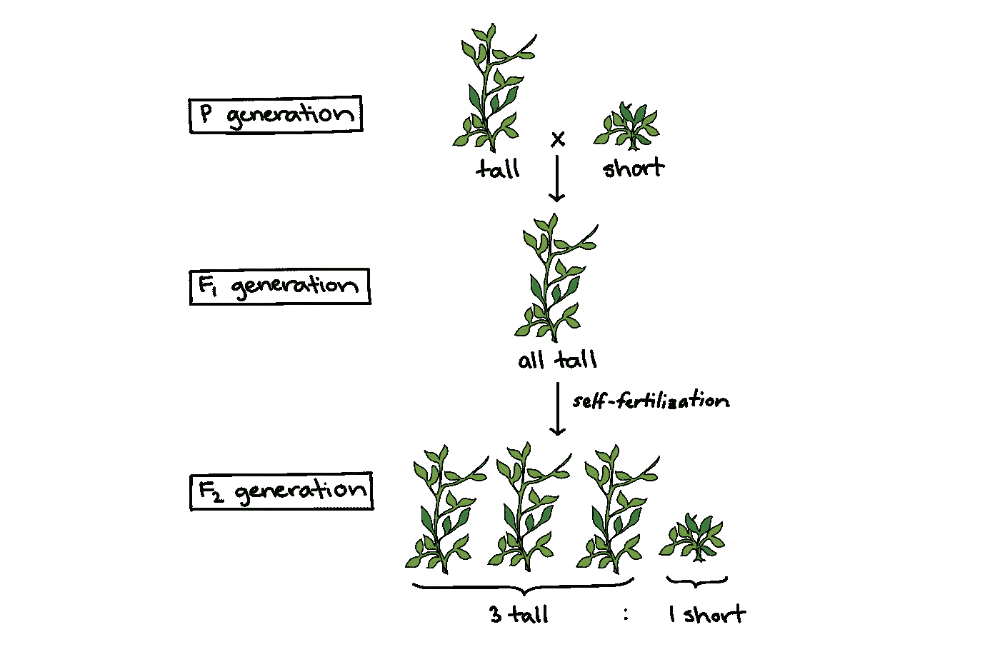
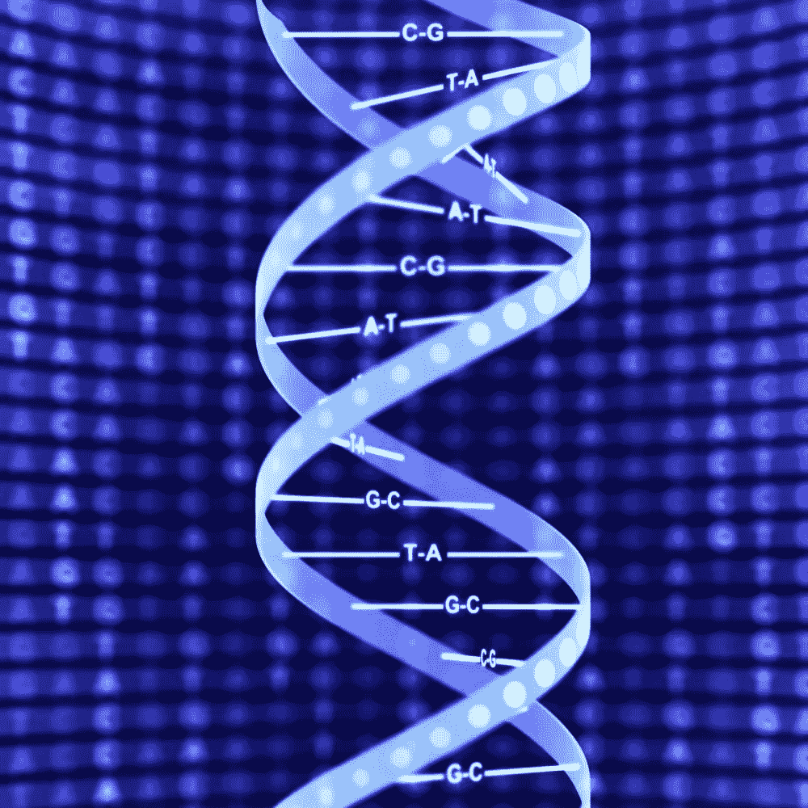

# 基因:生命的中心

> 原文：<https://medium.com/nerd-for-tech/regene-the-center-of-life-9e502ed0f93f?source=collection_archive---------27----------------------->

[国家癌症研究所](https://unsplash.com/@nci?utm_source=medium&utm_medium=referral)在 [Unsplash](https://unsplash.com?utm_source=medium&utm_medium=referral) 上拍摄的照片

你有没有想过我们的身体是如何工作的？如果我们想象地球上的每一种生物，就好像所有有机体的身体都自动执行所有的生命功能。以人类为例，只要我们活着，我们的心脏就永远不会停止跳动，我们的神经系统继续传递脉冲，我们的眼睛继续收集光线，我们的红细胞继续从肺部向组织运送氧气，我们所有的细胞、组织、器官和器官系统继续执行它们独特的功能。即使在被称为生物体最小单位的细胞中，也存在具有特定功能的细胞器。如果这些组成部分，由于任何原因，不执行其特定的功能，有机体将死亡或至少不能正常工作。身体怎么可能做到这一点？生物体的细胞如何发挥其特定功能，并与另一种细胞持续合作，以决定生物体的生命？细胞或器官有什么特定的规律可循吗？或者有没有具体的指令来做它们的具体功能？

如果我们仔细观察细胞内部，并把注意力集中在一个叫做细胞核的细胞器上，我们就能回答这个问题。在那个微小的空间里，基因完成了它们至关重要的工作。基因是遗传的基本物理和功能单位。基因由染色体内的 DNA ( *脱氧核糖核酸*序列组成。*智人*(人类)有 23 对染色体，里面有 3 万多个基因。含有 DNA 序列的基因携带特定的氨基酸编码，可以翻译成特定的蛋白质。这些特定的蛋白质将负责执行生物体生命所必需的所有机制。例如，在红细胞的生产中，携带血红蛋白编码的基因将被翻译成具有结合氧的能力的血红蛋白。因此，红细胞可以将氧气从肺部运送到组织中。这种特殊的蛋白质也可以调节收缩时的心肌。同样的机制发生在所有的身体细胞中，在分子水平上，成千上万的基因被翻译成蛋白质来执行它们的特定功能。

现在知道基因的结构是 DNA。然而，这种结构是最近才发现的，在发现 DNA 之前，人们对基因的功能研究得更多。基因的概念始于对遗传的思考。为了理解基因的历史，我们必须追溯到公元前 530 年左右，当时以三角理论而闻名的希腊哲学家萨摩斯的毕达哥拉斯阐述了他对遗传的看法。他创立了“精子主义”理论。在该理论中，男性精液在身体周围流动，以收集一个神秘实体的“权力下放单位”。这些实体存在于生物体的每一个特征中，如头发颜色、眼睛颜色、身高、眉毛形状、耳朵形状、鼻子形状等。由于来自母亲的营养，精液将在子宫内成熟为胎儿。

毕达哥拉斯的理论被另一位希腊哲学家亚里士多德用一个尖锐而清晰的论点反驳。亚里士多德说精子主义不能解释精子或男性精液是如何从男性身体中收集进化单位产生女性生殖器的。亚里士多德本人提出了他的理论，即要形成一个胎儿，需要父亲和母亲的共同捐赠。来自父亲一方的捐赠被亚里士多德称为“运动原理”，即精子提供了“代码”或“消息”或“信息”作为胎儿的设计，而来自母亲的捐赠，在当时被称为“女性精液”，为胎儿提供了物理原料。他的理论实际上导致了现代发展的基因携带信息理论，甚至德国生物物理学家马克斯·德尔吕克开玩笑说，亚里士多德应该因为发现基因而获得诺贝尔奖。过去发展的另一种遗传理论是*“预形成”*理论，即精子已经含有微型人(侏儒)，然后在子宫中成为胎儿。

对于过去的科学家来说，遗传之谜仍然是个谜。直到 1965 年 2 月 8 日，一位名叫格雷戈尔·约翰·门德尔的奥古斯丁修道士在布尔诺自然历史学会的会议上提交了他的论文*“Versucheüber Pflanzenhybriden”*(植物杂交实验)。他的论文是基于他多年来在修道院的小花园里对豌豆植物的实验。他以非凡的谨慎和耐心，培育并制造了数以千计的杂交植物。从杂交的结果中，孟德尔发现了一种遗传模式，并指出每个特征都由一个独立的“看不见的因素”携带，这个因素不能再分了。这种无形的因素存在于两个等位基因中，每个后代都从父母那里继承了一个等位基因。孟德尔甚至成功地分析了掩盖其他隐性特征的显性基因的特性。这些实验导致了两个概括，分离定律和独立分类定律，后来被称为孟德尔遗传定律。

现在被称为现代遗传学之父的孟德尔发现了基因的重要特征，然而，当时他并没有把他的发现称为基因。事实上，孟德尔的理论可以补充达尔文的进化论。查尔斯·达尔文很困惑，无法解决他的进化论中的一些问题。如何产生变异以及如何让有机体的特征代代相传的问题。达尔文提出了泛生学说，但仍然不能解决问题。孟德尔的理论可以解释这一切！然而，不幸的是，查尔斯·达尔文直到生命的最后一刻也没有读过孟德尔的论文。更不幸的是，仿佛被埋没在其他研究的进展之下，孟德尔的遗传理论在大约 40 年的时间里再也没有被提起过，直到 20 世纪 90 年代他的理论被重新发现。感谢威廉·贝特森热情地再版孟德尔的作品。在孟德尔的理论复活后，遗传似乎成了生物学和生物化学中的一个主角，1909 年，威廉·约翰森(Wilhelm Johannsen)率先使用“基因”一词来指代遗传的单位。

孟德尔的实验。图片来源:可汗学院

孟德尔理论被重新发现后，基因相关研究迅速发展。如前所述，基因的功能或特性首先比基因的物理形式更容易被广泛理解。这一直是个谜，直到 1953 年 4 月 25 日，詹姆斯·沃森和弗朗西斯·克里克发表了他关于 DNA 分子的发现。他们成功构建了由两条长多核苷酸链组成的 DNA 双螺旋模型。由于他们的发现，沃森和克里克与莫里斯·威尔金斯一起获得了 1962 年的诺贝尔奖。莫里斯·威尔金斯是用结晶学进行 DNA 分析的先驱。

双螺旋 DNA 分子由两条 DNA 链组成，它们相互扭曲成旋转的梯子形状，以氮碱基作为阶梯，由磷酸骨架和脱氧核糖支持。氮碱有两种，嘌呤和嘧啶。腺嘌呤(A)和鸟嘌呤(G)是嘌呤碱基的成员，而嘧啶碱基由胞嘧啶和胸腺嘧啶(T)组成。为了保持 DNA 分子的稳定性，嘌呤碱基必须与嘧啶碱基配对，A 与 T 配对，G 与 c 配对。碱基之间有氢键，碱基与脱氧核糖之间有共价键。双螺旋 DNA 结构每 34(3.4 纳米)完成一次旋转，两条链之间的距离约为 20(2 纳米)。基础氮步骤之间的距离为 3.4，因此每圈有 10 个基础氮步骤。

DNA 双螺旋模型。图片作者:[https://www.thoughtco.com/double-helix-373302](https://www.thoughtco.com/double-helix-373302)

DNA 结构的发现对于发现基因如何“调节”生物体的生命至关重要。最初被认为是物理的和功能性的遗传基因，被证明具有能够指导生命进程的特征和功能。基因复制允许遗传机制，基因重组使生物体的变异成为可能，基因调节允许蛋白质的翻译，包括构成生物体的结构蛋白和执行生物体的分子生理功能的功能蛋白。

DNA 是一种被动分子，需要一种中间分子才能变成蛋白质。正如生物学的中心教条所述，DNA 携带的含有信息的基因会通过一种叫做 RNA(核糖核酸)的中间分子翻译成蛋白质。由一系列核酸组成的基因携带特定的信息，形成多肽，然后成为特定的蛋白质。在生命的所有功能机制中，蛋白质都发挥着作用。蛋白质功能的特异性由其三维化学结构决定，而该结构由其组成氨基酸的线性序列决定。而氨基酸序列是由基因中氮碱基的顺序决定的。

基因是一个独特的代码，四个字母(A、T、G、C)的数字代码。这四个字母可以进行多种组合，四个字母的顺序决定了它们翻译成氨基酸的顺序。如果基因携带的代码是 1 个字母组合的代码，那么只会有 4 个氨基酸。如果组合由两个字母组成，那么最多有 16 个氨基酸。如果代码由 3 个字母的组合组成，那么最多有 64 个氨基酸，编码 20 个氨基酸加上一个启动和停止翻译过程的代码就足够了。翻译机制是一个复杂而漫长的过程，不足以用一篇文章来解释。本文概述了基因的发现和基因的重要功能。下一篇文章有望更详细地讨论与基因的重要功能相关的问题，回答现在可能开始出现在读者脑海中的与基因相关的问题。