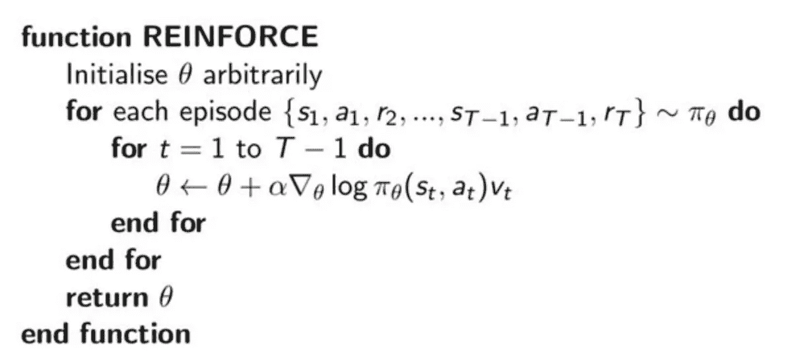
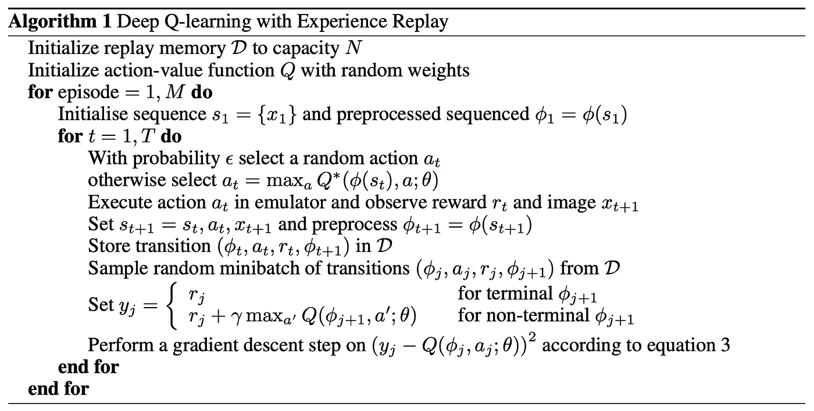
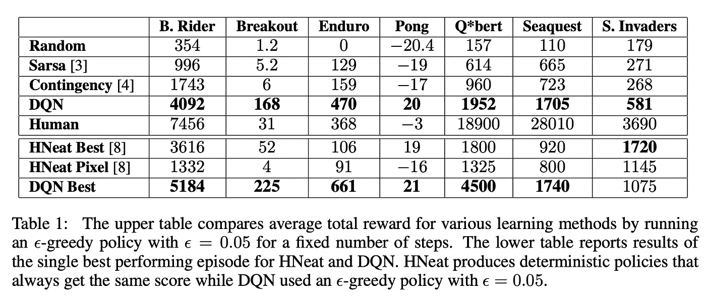
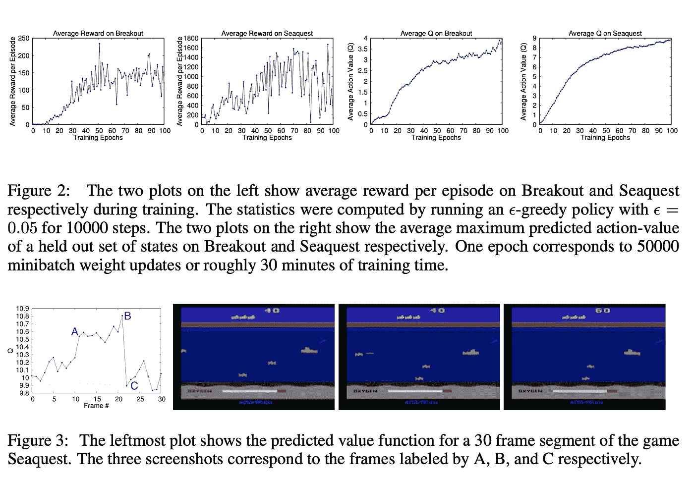
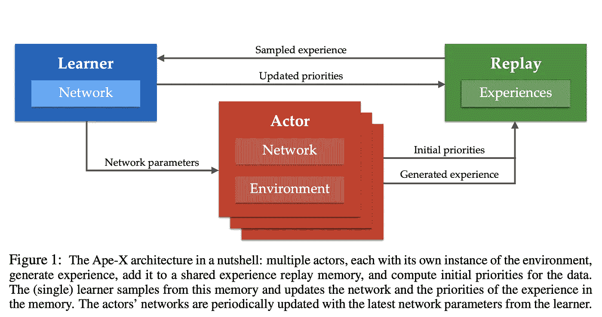
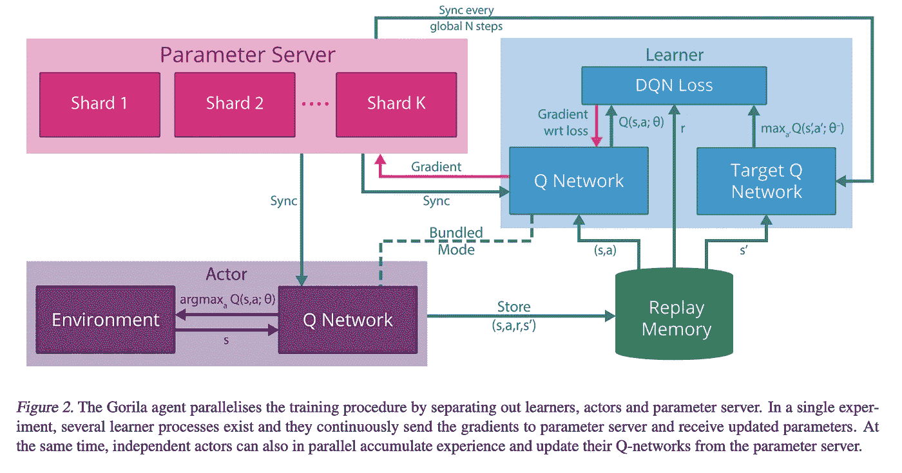
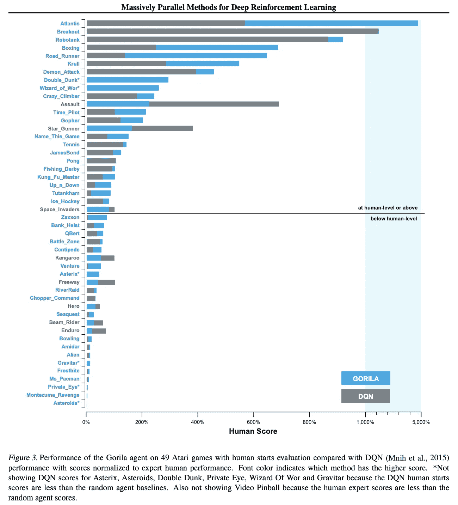
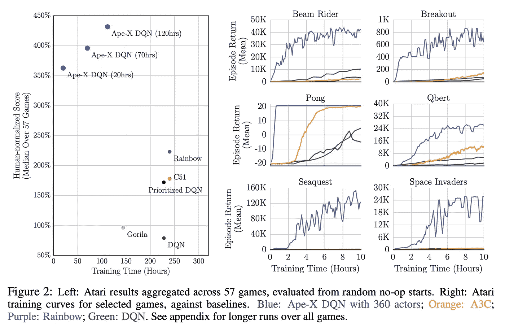

# 强化学习和深度学习系统

> 原文：<https://medium.com/nerd-for-tech/reinforcement-learning-and-deep-learning-6ff6f0393fb8?source=collection_archive---------9----------------------->

我们首先从对强化学习的基本理解开始，通过一些简单的算法，然后逐步将深度学习系统的组件融入到强化学习中。从马尔可夫决策过程、强化算法开始，我们转移到 DQN 的深度 Q 网络、GORILA 架构和 Ape-X 架构。然后，我们会看到这些算法的结果，并看到它们如何在使强化学习更好方面做出自己的贡献。

广义来说，机器学习分为三类。这些是监督学习、非监督学习和强化学习。这些不同形式的学习有不同的学习方式，因此在不同的任务中是有用的。监督学习使用具有标签(y)的数据(x ),并且学习者(f)的任务是找到一种将该数据分类到标签中的方法，使得 f(x) = y。在无监督学习中，没有标签，并且学习者在数据中找到相关性并形成聚类以理解数据，这可以进一步被不同的算法用于不同的目的。

强化学习有一种不同的学习方法，在某些方面，这似乎更自然，因为它与婴儿的学习方式非常相似。在强化学习中，有一个参与者和一个环境。在环境中，参与者可以处于不同的状态，并且在每个状态下它都可以执行一个动作。基于行动者在该状态下执行的动作，环境奖励行动者。强化学习的目的是学习哪些行为会带来最好的回报。

一个简单的算法是马尔可夫决策过程。它只是利用实验来获得每个行为的奖励，然后强化导致更好奖励的行为。下面是我的马尔可夫决策过程的实现，它是在没有图形用户界面的基于小迷宫的游戏上测试的。

看看另一种强化学习算法，比如 REINFORCE(如下所示的算法)，就能明白为什么这么叫强化学习了。我们初始化策略的随机权重。策略可以被认为是一种功能，在给定导致当前状态的一系列状态和动作对的情况下，该功能将给出关于采取哪个动作的信息，以便获得最佳回报。这个想法是找到最大化回报的政策。该算法的工作方式是，参与者根据政策执行一个动作，并根据当前和预期的未来回报给予奖励。如果预期的回报是好的，则在策略中导致该动作的权重被加强，从而它会更频繁地推荐该动作。经过多次迭代后，导致最佳回报的行动得到加强，策略得到改进以最大化最佳回报。还有其他算法，如演员-评论家，它涉及惩罚和奖励的概念，当演员的行为可能导致负面奖励。

强化算法

让我们看一个例子。有一个模拟环境叫 cartpole。该环境包含一辆带有杆子(演员)的小车，该小车位于水平无摩擦路径上。演员每走一步(左或右)都会得到一份奖励。但是手推车还必须在垂直位置平衡电杆，使得当手推车移动时，电杆不应该从垂直位置移动超过 15 度。如果杆子移动超过 15 度，游戏就结束了。对于我们的实验，我们可以确定模拟的最大允许时间。例如，如果每走一步给 1 点奖励，演员可以在一秒钟内移动 100 步，那么如果最大时间设置为 5 秒，最大可能奖励是 500。演员必须学会以这样一种方式移动，即杆子是平衡的(而且，手推车不能离开框架)。

我们将上述算法应用于人工智能健身房模拟的 cartpole 环境中，我们看到它学会了像钟摆一样移动以平衡杆子，同时连续移动以在不到 200 个周期内获得 500 的最高分。下面是我们的算法实现和不同时期的一个视频。

现在，如果这看起来工作得很好，为什么我们在强化学习中需要深度学习？答案可以在 Mnih 等人的论文《用深度强化学习玩雅达利》中找到。艾尔。，其中使用强化学习来学习使用相同模型(算法相同)的不同 Atari 游戏。通常的强化学习算法通过找到导致最佳回报的状态、动作对的序列来工作，但是当我们的环境变得复杂时，会有无限多的这样的序列，常规模型最终会利用大量内存，并且仍然可能不会收敛到最大回报。我们需要找到不同的方法来解决这个问题。

在深入深入强化学习之前，让我们讨论一个重要的概念，探索与利用，这是强化学习的一个组成部分。探索指的是演员在不同的状态下尝试不同的动作，而不是特意去选择最佳的动作。过多的探索导致不收敛，因此模型没有学习到选择最佳行动所需的有用参数。剥削指的是行为者总是选择目前已知能获得最佳回报的行为，而不去尝试其他可能带来更好回报的行为。对于任何强化学习模型，我们都希望找到探索和利用的正确平衡，以找到可能的最佳回报。

回到深度强化学习，主要思想是将 Atari 游戏屏幕的像素输入到神经网络中，该网络学习将帮助我们找到最佳策略的参数。想法是训练模型来学习 Q 函数而不是政策，其中 Q 函数是在给定状态、动作和政策的情况下，给我们对未来回报的估计的函数。将 Q-学习与神经网络结合使用被称为深度 Q 网络(简称 DQN ),它使 Q-学习变得更好。

Q 值通过以下等式计算，其中 Q*代表最佳 Q 值。(s，a)是计算 Q 值的状态动作对。r 是在状态' s '采取行动' a '的奖励。Gamma 是一个超参数，它决定了未来预期回报在总预期回报中所占的权重(因为对于初始 Q 函数，未来回报的预期可能不是非常准确)。“s”和“a”是下一个状态以及下一个状态中的可能动作。

损失的概念是使用来自经验重放的先前 Q 值和用当前参数获得的当前 Q 值的预期 Q 值的平方差。因此，有趣的是，在强化学习中，训练是在测试数据上进行的，或者换句话说，没有拥有不同训练和测试数据的概念。数据是由演员对其环境的体验产生的，并且基于这些体验，Q 值被学习。学习 Q 值的损失函数如下所示。

正如前面所讨论的，探索和利用是强化学习不可或缺的一部分，我们需要一种技术来很好地平衡它。这是通过使用 epsilon-greedy 技术来完成的，epsilon-greedy 技术是一个简单的概念，在每集的每一步，都有一个选择，即选择随机行动(探索)还是迄今为止找到的最佳行动(开发)。这种选择是以ε的概率做出的，该概率可以被安排成在一些情节之后变得更小。这样，学习者将最初尝试探索更多，因为最初学习者是没有经验的，并且根据学习者的最佳行动可能在于局部最大奖励而不是全局最大奖励。后来，当学习者获得更多的经验时，就有更多的信心，学习者会选择导致全局最大回报的行动，因此学习者可以开始开发。

DQN 算法中的另一个重要概念是经验重放。体验重放的一般概念是将体验存储在固定大小的存储器中。体验回放是一种存储(s，a，r，s’)的方式，这是一次体验的当前状态、动作、奖励和下一个状态的信息。所有实验的信息都存储在重放存储器‘D’中。这导致了大量经验的重用，从而使算法的数据效率更高。这也有助于推广该模型，因为我们不再依赖于状态和动作的序列，而是我们有一个 i.i.d .(独立和同分布)数据，这导致了推广学习。因此，使用经验重放使 DQN 数据更有效和更通用，因为数据中最小化的相关性导致更新中减少的方差。

这是深度 Q 学习的算法，带有经验回放。

基于经验回放算法的深度 Q 学习

以下是深度 Q-learning 相比 Q-learning 的一些优势。

1.  由于每个经验都存储在重放存储器“D”中，我们从“D”中随机选择一个经验来获得 y，然后为训练丢失，每个经验都可以潜在地用于许多权重更新。与传统的 Q-learning 相比，这使得它的数据效率更高。
2.  如果我们通过增量经验直接学习，我们所拥有的数据是高度相关的，因此，就预测随机行为的随机实验步骤中随机状态下的 Q 值而言，学习不够健壮，不足以提供真实值。当我们从 DQN 的‘D’中取随机 Q 值时，输入被随机化并且相关性被最小化，导致更新中方差的减少。
3.  使用带有非策略的经验重放使得行为分布通过它的许多先前状态达到平均，这平滑了学习并且避免了参数的振荡和发散。因此，这优于基于策略的 Q 学习，因为随后当前参数将确定参数将被训练的下一个数据样本。

下面是这篇论文的结果。艾尔。)显示了当使用相同的超级参数为不同的 Atari 游戏训练时，该算法有多成功。可以看出，DQN 胜过所有以前的算法和人类玩家(在许多情况下)。然而，也可以看出，对于需要长序列策略的游戏，性能比人类玩家低得多。这个问题仍然没有得到解决，在这个领域还有很多未来的研究范围。

来自 Mnih et 的“用深度强化学习玩雅达利”的结果。艾尔。

有趣的是，DQN 是一种无模型的强化学习算法，这意味着它可以应用于任何环境。有两种强化学习算法，一种是无模型的，不知道算法的任何信息，另一种是基于模型的，参与者有一些关于环境的信息。DQN 试验的雅达利游戏是无模型的。基于模型的一个例子是，演员知道为了获得更多的奖励，演员需要在游戏中摧毁敌人的船只。下面是无模型 DQN 在玩雅达利游戏时如何预测 Q 值，以及在不同游戏中平均奖励如何随着训练次数的增加而增加。

具有历元和帧的 q 值可视化

关于体验重演的一个有趣观察是，并不是所有的体验都同等重要。有些经历应该有更高的优先级。理解优先体验的一个简单例子是一个游戏，在这个游戏中，你在执行一个对达到终极状态不重要的秘密任务时获得奖励点数。这种奖励可能在很少的经历中出现，但如果点数是对设置的奖励，它就具有重要的意义。从 DeepMind (Horgan 等人)的“分布式优先体验重放”论文中，我们有一个优先体验重放的概念，正如其名称所暗示的那样。分布式优先学习的架构，也称为 Ape-X 算法，如下所示。我们可以看到演员在重放记忆中产生经验和存储。学习者使用这些经验来学习哪些经验更重要，并在重放记忆中更新这些优先级。

Ape-X 架构

还有一篇 DeepMind 的论文(Nair et。艾尔。)上的“深度强化学习的大规模并行方法”，其中讨论了学习并行发生的深度强化。这种架构被称为 GORILA(通用强化学习架构)。可以看出，多个行动者具有他们自己的实例环境，其中产生体验并将其存储在本地重放存储器中，该本地重放存储器被合并在全局重放存储器中。参数由 DQN 学习器学习，该学习器在分布式同步环境下更新分片参数服务器中的参数。然后，行动者在 Q 网络中使用这些参数用于以后的体验，然后，通过多个行动者和学习者在分片参数服务器上并行训练模型。

哥里拉建筑

架构 GORILA 和 Ape-X 有一些相似之处，如下所示。

1.  这两种架构都是具有多个参与者的深度强化学习架构。
2.  在这两种体系结构中，每个参与者都有自己的环境实例。
3.  在这两种体系结构中，观测数据都存储在重放存储器中。

GORILA 架构为每个参与者提供了一个本地重放存储器，同时还提供了一个全局统一的重放存储器。每个经验/数据被统一采样。

Ape-X 架构只有一个共享的集中式体验回放内存。对经验/数据进行优先排序，以便更频繁地使用最有用的数据。

在测试的 49 款游戏中，超过一半的游戏显示分布式架构的表现优于人类专家。同样清楚的是，哥里拉在大多数比赛中的表现都优于普通的 DQN。下面是哥里拉和 DCN 建筑与人类水平的比较结果。

GORILA 建筑的结果

下面是来自“分布式优先体验重放”论文的结果，该论文显示 Ape-X 架构在 57 个 Atari 游戏的聚合上大大优于 GORILA。与其他算法相比，Ape-X 不仅给出了几乎四倍的中值分数，而且它的训练时间也是最少的，如下图(左)所示。在右边，我们可以看到不同雅达利游戏的平均剧集奖励。虽然每种算法的性能因游戏不同而不同，但仍然可以看出 Ape-X DQN 优于其他算法。特别是在 Seaquest 和 Space Invaders 中，其他算法的分数接近于零，但 Ape-X DQN 显示出有希望的分数。

显示 Ape-X 体系结构与其他体系结构比较的结果

在这篇博客中，我们探索了强化学习以及深度学习如何在扩展其有用性方面发挥重要作用，随后是分布式系统和优先体验重放如何进一步发展它。虽然这些算法如何在不同的环境中成功地工作是有趣的，但它在一些具有长序列复杂策略的环境中工作得不好，在这些环境中，与迄今为止讨论的任何算法相比，人类玩家具有高得多的分数。可以得出这样的结论，在强化学习领域还有很多需要研究的地方。还有很多其他的算法在这篇博客中没有提到，所有这些算法都有自己有趣的好处，在某些情况下很有用。

感谢阅读博客。请随时在评论中发表任何反馈或问题。

参考资料:

1.  [联结主义强化学习的简单统计梯度跟踪算法——罗纳德·j·威廉姆斯](https://link.springer.com/article/10.1007/BF00992696)
2.  [用深度强化学习玩雅达利——{弗拉德，科雷，大卫，亚历克斯.格雷夫斯，约安尼斯，达安，马丁.里德米勒} @ deepmind.com](https://arxiv.org/pdf/1312.5602.pdf)
3.  [深度强化学习的大规模并行方法——{阿伦斯奈尔，PRAV，布莱克韦尔斯，CAGDASALCICEK，RORYF，ADEMARIA，DARTHVEDA，MUSTAFASUL，CBEATTIE，SVP，莱格，VMNIH，KORAYK，DAVIDSILVER @GOOGLE。伦敦 Google deep mind](https://arxiv.org/pdf/1507.04296.pdf)
4.  [分布式优先体验回放——丹·霍根·deep mind 约翰·全·deep mind 大卫·布登·deep mind 加布里埃尔·巴斯-马龙·deep mind 马特奥·海塞尔·deep mind 哈多·范·哈瑟尔·deep mind hado@google.com·大卫·西尔·deep mind davidsilver@google.com](https://arxiv.org/pdf/1803.00933.pdf)