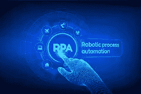

# RPA:机器人不会取代人类

> 原文：<https://medium.com/nerd-for-tech/relevance-of-rpa-5500019dd4?source=collection_archive---------14----------------------->

来自 Google 的 RPA 图像

## 许多人都有这种恐惧症，认为机器人的发明和不断整合到各种(现代)企业的 IT 系统中会让人类变得无能，同时增加失业。

同时，机器人技术被用于通过**机器人流程自动化(RPA** )来提高工作环境中的效率和生产率，从而使人类能够专注于优先任务，更快、更高效地工作。

集成自动化机器人来处理重复性任务可以削减 60%的工作量，使员工能够更加专注于重要的任务

# 什么是机器人过程自动化(RPA)？

机器人过程自动化是一种软件技术，它克隆人类活动来执行基本的和重复的任务。RPA 是一种计算机软件机器人，可处理通常由人工执行的繁琐、重复和手动任务，例如，在多个位置重新输入数据、发送回执消息、确认电子邮件等。

RPA 的基本概念类似于一家制造公司创建了一个特殊的机器人来处理其制造操作的特定部分，这可能会消耗更多的人力和时间来完成，只是在这个场景中，没有物理机器人。

不管员工有多优秀，自动化机器人效率更高，可以比 3 个员工更快地完成多项任务。

# 谁使用 RPA

考虑到 RPA 给现代企业带来的好处，自动化技术是现代企业生存的不可否认的秘诀。

RPA 是满足所有行业客户不断增长的需求和期望的桥梁。首先，RPA 的效率和运营成本是公认的。这些因素，再加上企业提高服务质量的需求增加，使得 RPA 成为商业领域的一块炙手可热的蛋糕。

下面是利用 RPA 改善运营的 3 个常见行业。

# 1.客户服务

在此之前，客户服务的特点是现场代理人响应客户的投诉和要求。当其他呼叫者排队等候时，客户服务代理将花费过多的时间一次处理一个特定的请求。

RPA 机器人与客户服务系统(如 [IVRs 和可视 IVRs](http://: https://www.visual-ivr.com/what-is-visual-ivr/) )的集成为客户通过自助服务独立满足其意图创造了可能性，同时客户支持代理专注于更琐碎的任务。

[客户服务自动化机器人](https://servisbot.com/customer-service/)被编程为执行某些请求或投诉，如果它超出了预定的行动过程，那么这种行动可以由人类执行。

# 2.财务与会计

财务和会计操作的本质是乏味、耗时且容易出错，但对一个组织的日常职能却至关重要。想象发票处理等任务和财务会计中的其他相关[任务依赖于手动处理。](http://: https://www.accaglobal.com/pk/en/qualifications/why-acca/competency-framework/job-profiles/corporate-and-business-accounting/finance-accountant.html)

我们以发票处理为例。当由人类手动操作时，该功能可能会浪费时间。自动化机器人可以接收、读取、记录和传播相关数据到它需要去的地方。

此外，与手动处理相比，自动化数据输入和处理等所有其他职责可以促进向客户提供信息。

# 3.人力资源(招聘和入职员工)

为某个工作岗位聘用合适的候选人涉及一系列重复的基于规则的任务，这些任务可能需要数周才能完成，从选择候选人到筛选，再到聘用合格的申请人。

一个[自动化机器人](https://electroneek.com/blog/business-insights/robotic-process-automation-in-hr-bots-put-people-first/)可以更快、更准确、更公正地为申请人寻找资源并筛选候选人的简历。

当人力资源团队雇用员工时，RPA 机器人会向选定的候选人发出邀请。

此外，向不合格的候选人发送(拒绝)邮件可以在各个招聘阶段的选择过程完成后立即完成。

## 总之:

*   机器人流程自动化是一项不断发展的技术，可以帮助(企业)组织以低廉的成本提供高价值的服务。
*   尽管自动化的普及催生了 RPA 技术集成将取代人类工作空间的想法。
*   就像所有其他技术创新一样，世界见证了——自动化是为了让人类工作得更快更聪明。

**这里要带走的最重要的事实是，与人工处理任务相比，RPA 保证了良好的周转。**