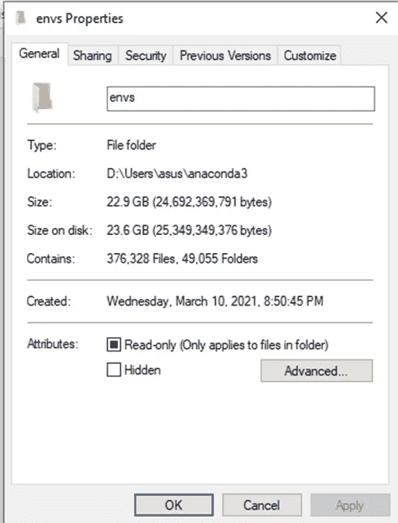
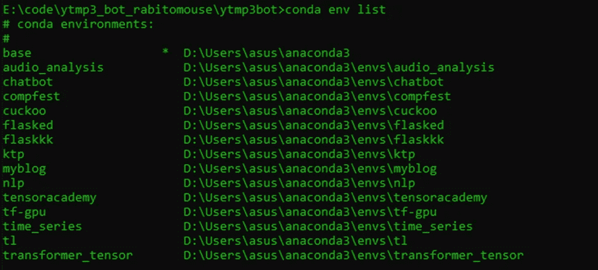

# 移除并优化您的 Conda 环境

> 原文：<https://medium.com/nerd-for-tech/remove-and-optimizing-your-conda-environment-319c92dbccbd?source=collection_archive---------1----------------------->


Neal E. Johnson 在 [Unsplash](https://unsplash.com/s/photos/sweep?utm_source=unsplash&utm_medium=referral&utm_content=creditCopyText) 拍摄的照片

> 吃太多不好~我的经验

这个故事基于我使用蟒蛇的经历。我在学习深度学习的时候，日常生活中使用 TensorFlow 库。但是由于我是初级开发人员，我讨厌在运行从互联网上获得的代码时遇到问题。所以我用康达环境。

Conda environment 对我的 Python 工作帮助很大，因为它构建了一个专注于我们所做的事情的隔离环境。几个月后，我意识到创造太多的 Conda 环境不是一个好主意。为什么？？？因为它需要大量的内存空间。



我所有环境的内存空间

当我找到记忆满的主要原因时，我很惊讶。当然，我创造了太多的新环境，而不是解决问题。在上图中，它占用了我构建的大约 23.6 GB 的内存。这是我的环境列表



我的环境

肮脏的权利？我从这里删除了一些东西，从而有了整理环境的动力。删除 Conda 环境很容易。但是，因为一开始没看懂，所以有点迷茫。所以我写了这篇文章，告诉你如何移除不再使用的 Conda 环境，同时也给你一些优化环境的建议。

# 删除 Conda 环境

要删除 Conda 环境，您只需要一个以下格式的命令行。

```
Conda env remove -n {env_name}
```

将`env_name`更换为不带支架的环境。就这么简单。下面是删除不再使用的“ktp”环境的示例。


正在删除 ktp 环境

您可以使用此命令重新检查环境

```
conda env list
```

看来‘KTP’环境已经不存在了。恭喜你，你已经做到了。

# 优化您的 Conda 环境

使用康达几个月后，以下是我推荐给你的

1.  创建一个支持 Python 2 的环境。也许这是可选的，但有时互联网上的源代码仍然使用旧版本的 Python。除非您想在系统中手动安装 Python 2，否则可以使用 Conda 快速运行代码。
2.  专注于你想要的。深度学习项目应该有几个环境，比如 **NLP、时间序列、计算机视觉**等。您不需要安装所有的库，但是它们会保护您不会出现问题，因为每个库都有一些不同的需求。
3.  说到 TensorFlow 库和 CUDA，要小心花费存储空间。它占用了大量内存空间。千万不要把这个张量流只放在一个环境里。回到我的第二个技巧，它可能会导致错误，花费更多的时间和资源。
4.  去掉不必要的东西。在日语中，有些文化是你应该实现的；被称为“极简主义”。通过成为极简主义者，你可以更专注于你所做的事情。所以几次之后，你不用你的环境，去掉它而不内疚。(我这才意识到，我有太多已经没用的环境。所以我也会把它去掉)

# 结论

嗯，就这些。在这个故事中，我分享了如何删除和优化您的 Conda 环境和使用 Conda 的技巧。我希望你得到了信息，并喜欢这篇文章。谢谢