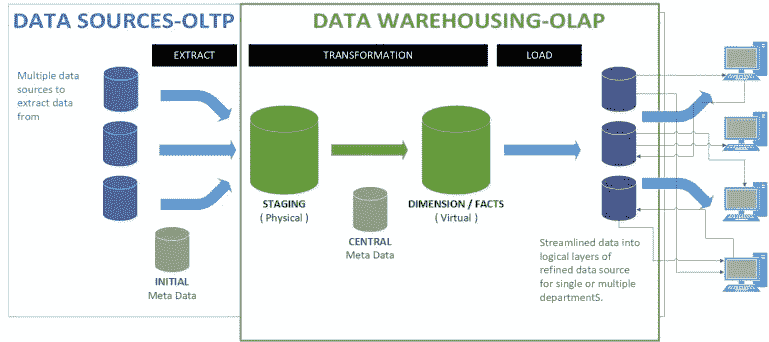

# 从 ETL 中移除转换

> 原文：<https://medium.com/nerd-for-tech/removing-transformation-from-etl-40f0e65b5512?source=collection_archive---------11----------------------->

如果我们从 ETL(或 ELT)中移除转换会怎么样？

我一直在考虑将转换从 ETL 中移除。我们知道近几十年来存储价格越来越便宜。由于数字化，公司的数据量也在增加。这意味着拥有大量数据是可以接受的，因为存储成本更低。但是，如果数据不干净，它就没有价值，清洗(转换)的需求总是存在的。这使得数据工程变得更加复杂，并出现在不同的领域。

图一。长期硬盘成本(来源:mkomo.com)

虽然存储便宜，但改造成本仍然昂贵。连接、聚集和过滤是 ETL 中最昂贵的部分之一。我们可以在亚马逊 S3 以每月 23 美元的价格存储 1 TB 的数据，而处理这些数据每月要花费 10，000 多美元。这是因为要转换数据，我们需要强大的引擎。

现在有什么选择呢？

在我看来，只有一个可能的解决方案:合并 OLTP 和 OLAP 数据库。这已经被[的一些研究员](https://link.springer.com/chapter/10.1007%2F978-3-642-14559-9_11)和[的企业公司如 SAP 所推广。](https://blogs.saphana.com/2017/10/18/combining-oltp-olap-real-time-data-streaming-realize-promise-iot/)这背后的想法是在一个地方创建一个写优化(OLTP)和读优化(OLAP)的数据库。这将消除提取和加载的需要，那么转换呢？

图二。ETL 中的 OLTP 和 OLAP([来源](https://bitalksbi.com/oltp-vs-olap-database-vs-data-warehouse)

我们总是看到数据所有者(通常是产品或财务团队)以满足他们需求的方式开发解决方案(这是有意义的，因为他们想解决自己的问题:D)，然后数据团队需要重建数据，使其满足业务需求(报告，人工智能)。举个例子:财务上说 A 列是客户，而在管理报告中我们称之为用户。因此，数据团队和数据所有者需要在这一标准化上保持一致。另一件要考虑的事情是，OLTP 和 OLAP 中的数据建模方式略有不同。在 OLAP，我们看到许多 [SCD 类型 2](https://en.wikipedia.org/wiki/Slowly_changing_dimension) ，而在 OLTP 中，它主要是 SCD 类型 1。所以设计数据模型将会非常困难。这种架构也类似于单一的应用程序，会降低开发速度，使业务应用程序和数据应用程序紧密耦合。

因此，总之，在我看来，从根本上来说，很难消除 ETL 的转换需求，除非我们在 OLTP 和 OLAP 架构设计(新金博尔:D)方面取得突破，并愿意优先考虑数据和业务应用程序的耦合。