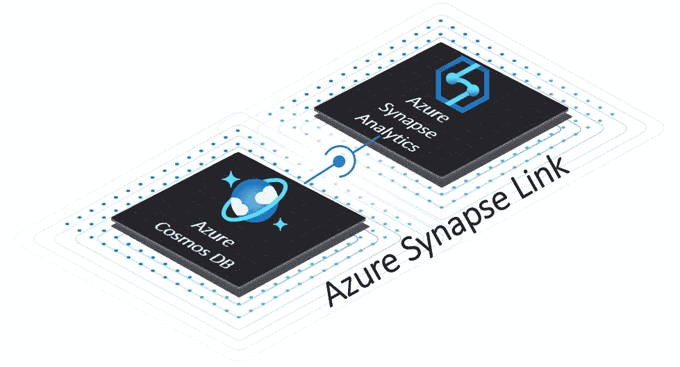
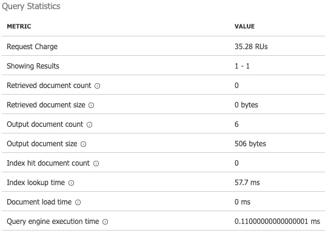
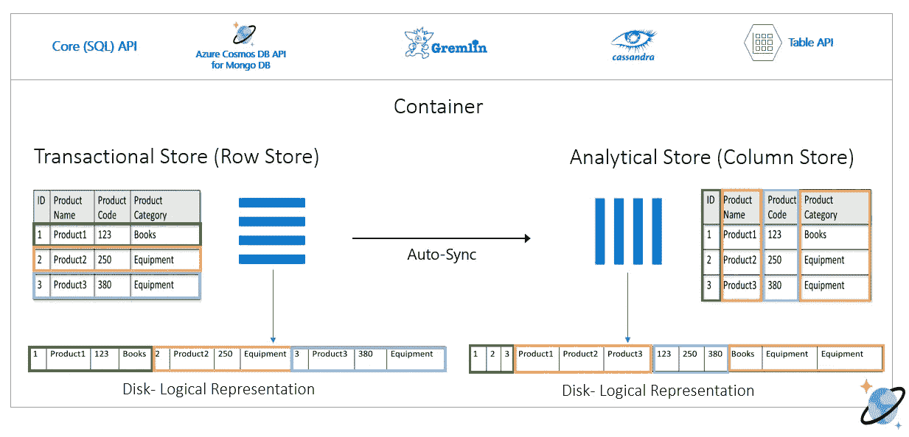

# 使用 Azure Cosmos、分析服务和 Synapse Link 报告 Gov.Notify

> 原文：<https://medium.com/nerd-for-tech/reporting-on-gov-notify-with-azure-cosmos-analytics-services-and-synapse-link-26603f5d1bf7?source=collection_archive---------18----------------------->

本文试图讲述我们如何在 Covid 疫苗的国家预订服务中进行 Gov.Notify 报告，以及我们现在如何扩展该方法。

对服务使用情况的报告，如国家预订服务，实际上引领了我们向 MI 提供服务执行情况的方式。PowerBI 在 NHS Digital 中大量使用，我们的分析师 Michelle 在引入分散数据源(如 Splunk、Adobe Analytics 和 nightly extracts)方面做了出色的工作，提供了许多显示该服务所有 KPI 和统计数据的仪表板。不幸的是，由于一些摘录的性质，它们不是自动的，所以当米歇尔周末不在时，数据也不在。关于 Notify 的报告就是一个很好的例子。这些信息可以在 Gov.Notify 仪表板中找到，但不能在我们的报告中找到。此外，预订服务中发送通知信息的部分不是由 NHS Digital 的开发团队开发的，所以我没有完全的控制权。此外，如果消息由于类型错误而无法发送，我们对此也无能为力。幸运是，Notify 提供了一个回调 API！我开始建议我可以提供一个实时仪表板，我有一个计划！

## 最初的解决方案

通知回调 API 提供了一个很好的选项，可以将报告数据返回到服务中，而不需要知道已经发送了什么。你可以在 REST 文档中找到关于 API 的更多细节[https://docs . notifications . service . gov . uk/REST-API . html # callbacks](https://docs.notifications.service.gov.uk/rest-api.html#callbacks)

这使我能够收集关于已发送内容的所有详细信息，并在我们自己的解决方案中重新创建控制面板。最初，虽然有一个缺陷，因为我没有发送数据，所有我能告诉的是短信或电子邮件是否发送成功，我不能告诉消息是什么。我联系了 Notify 的团队，询问是否可以将模板 ID 添加到回调 API 中，他们同意将其添加到他们的 backlog 中。大约一个月后，有人联系我，告诉我它现在和模板版本一起在 API 中。我现在有了一些有意义的报道所需的一切。

数据收集的解决方案非常简单，一个 Azure 函数将数据写入 cosmos db——就是这样！我需要一种能够快速接收数据的方法。我真的很喜欢你开发 Azure 功能的速度和无服务器的扩展方式。我们已经在预订服务的其他地方使用了 Cosmos，这似乎是一个更好的机会。此外还有毫秒级响应时间、低延迟以及与功能的轻松集成。SQL 的一个痛苦教训是确保我们的连接得到正确的管理。有了函数和宇宙，这是为你做的。通过在函数中定义方法，可以向 Cosmos 添加一个输出绑定，就这样。另一个非常好的事情是对于 GET 请求，您可以在绑定中指定查询，所以当函数运行时，数据已经在那里等着您使用了！关于 Azure 函数绑定的更多信息在文档中:[https://docs . Microsoft . com/en-us/Azure/Azure-functions/functions-add-output-binding-cosmos-d b-vs-code？pivots = programming-language-cs harp # add-an-output-binding](https://docs.microsoft.com/en-us/azure/azure-functions/functions-add-output-binding-cosmos-db-vs-code?pivots=programming-language-csharp#add-an-output-binding)

现在我有了数据，我很快就收集起来了。1000 万张唱片来得相当快——我们现在有 4300 万张。在 NHS 网站上获得这么多的原始数据有点不寻常，所以这是一个非常有趣的问题。在收集数据的早期，我以为我的新玩具 Cosmos 会让我做各种各样的查询，并且总能在几毫秒内返回答案。我们在早期对测量解决方案另一部分的 RU 进行了一些研究，得到了大约 2 RU。我们当前拥有的行的查询统计如下:

从 Cosmos 查询 4100 万行的统计数据

当我有大约 1m 行数据时，我编写了一个带有 group by 子句的典型 SQL 查询。Cosmos 基于请求单位来衡量查询，当我达到 41k 时，我开始有点担心。如果我将 PowerBI 连接到这上面并运行这样的查询，那么我不仅会杀死 Cosmos，还会杀死 PowerBI。

## 解决方案第 2 部分:Azure Analysis Services

我的理想是对我们的通知使用提供实时报告，但这并不像我希望的那样。我开始稍微改变我的描述，提供简单的实时数据查询，但是如果你想要完整的分析，那就太冒险了，而且不是实时的。数据传入的速度很快，运行包括写入 Cosmos 在内的功能需要 10 毫秒，这太棒了，现在把数据传出去成了问题。在这一点上，放弃这个想法回到 SQL 是很诱人的，但是我决定使用 Cosmos！

搜索微软文档看起来好像我找到了解决方案——“使用 Azure Cosmos DB 和 Power BI 创建一个实时仪表板”。太好了，这正是我想做的。

 [## 使用 Azure Cosmos DB、Azure Analysis Services 和 Power BI 创建实时仪表板

### 适用于:SQL API 本文描述了在 Power BI 中使用…

docs.microsoft.com](https://docs.microsoft.com/en-us/azure/cosmos-db/create-real-time-weather-dashboard-powerbi) 

当涉及到 ETL 时，我想尽可能地避免开发。将数据放入 Cosmos 后，我不需要另一个数据库来进行分析。分析服务开始发挥作用。我轻松地定义了模型并部署了它。然后我连接了 PowerBI。一切都进行得很顺利，直到我发布了仪表板，没有人可以访问这些数据。你可能会说许可，我也是，但这并没有解决问题。

NHS Digital 在每个人都登录的特定 AD 租户中运行 PowerBI。国家预订服务是在不同的租户中运行的。事实证明，您不能在 PowerBI 的不同租户中运行 Analysis Services。然而，Analysis services 并不关心 Cosmos 在哪里，所以在租户中快速请求一个新的订阅，并移动我再次运行的 Analysis Services。分析服务也承担了所有的数据重担，PowerBI 将会腾飞！

Analysis services 允许您定义分区，并且只更新特定的分区。所以在创建了历史分区之后，我现在有了一个每月分区。然而，这意味着有人需要记住创建分区，并在分区更改时更新每天早上运行的逻辑应用程序。也许我们可以自动化这一点，但时间并不总是仁慈的。将摘录运行到分析服务中的一个后果是它给 Cosmos 带来了沉重的负担。它每天早上运行。下图用红色显示了这一负载。我第一次看到这个的时候，我不知道它会红多久。我开始看到一些 429 的人爬进来。我做了什么？增加供应吞吐量缓解了这一问题，并阻止了 429，但这不是我们的想法。该解决方案旨在节约成本，提高性能。一天不止一次运行这个更新感觉像是一个风险。我的实时仪表板仍然不是实时的！

宇宙 RU 消费

## 解决方案第 3 部分:Azure Synapse

在我选择 Analysis Services 之前，我也研究过 Azure Synapse。这是微软的一个新的解决方案，我以前并没有太关注它。

> **Azure Synapse** Analytics 是一项无限的分析服务，它将数据集成、企业数据仓库和大数据分析结合在一起。… **Azure Synapse** 将这些世界与统一的体验结合在一起，以摄取、探索、准备、管理和提供数据，满足即时的 BI 和机器学习需求。

我看过一个视频，看起来我不得不创建一个 ETL 来将 Cosmos 中的数据加载到 Synapse 中，这不是我想要做的。我不想进入 Apache Spark，这意味着简单。快速入门都谈到了加载数据。所以分析服务是正确的选择。

但过了一会儿，我又回到了 Synapse，特别是 Synapse Link。有很多关于这方面的文档，只是找到正确的部分！当您在 Cosmos 中创建一个容器时，有一个选项可以同时创建分析存储。在创建容器后，无法完成此操作。这将创建一个与操作存储区隔离的数据列存储区。数据在它们之间自动同步，通常延迟 2 分钟，但最长可达 5 分钟。我终于得到了我承诺过的接近实时的仪表板。

宇宙突触链接

我创建了 Synapse 实例，并找到了一个与我想做的事情相匹配的教程。无服务器 SQL 就在那里，完全受管理，让我坚持我的无服务器目标。我在 Synapse 中创建了与宇宙的链接，然后爆炸了。我可以查询我的宇宙数据并链接到 PowerBI。

 [## Power BI 和无服务器 SQL 池，通过 Synapse Link 分析 Azure Cosmos DB 数据

### 适用于:SQL API Azure Cosmos DB API for MongoDB 在这篇文章中，您将学习如何构建一个无服务器的 SQL 池…

docs.microsoft.com](https://docs.microsoft.com/en-us/azure/cosmos-db/synapse-link-power-bi) 

一切看起来都很好，或者是。我的数据集中只有 30k 行，一个返回前 100 行的简单查询需要大约 5s。在 NHS Digital，我们很幸运能够接触到微软的解决方案架构师，所以我打电话给我的老联系人，他帮我联系了数据专家之一 Steve。我向他详细介绍了我所做的每一件事，而且都非常准确。史蒂夫解释了列存储的工作方式，它可能会慢一点，但随着数据的增长会保持一致。唷！

## 不过还有最后一个问题

当将数据放入 PowerBI 并运行直接查询时，一切都很好，除非您转换数据。一般来说是可以的，但是某些转换不能作为直接查询来完成。在这些情况下，唯一的选择是将数据复制到 PowerBI 中。这个的最小刷新时间是每 30 分钟一次！

编辑 5 月 23 日——自从写作以来，我意识到转换可以在 Synapse 的视图中完成，所以现在我有了我的实时仪表板！

## 结论

现在，我已经在我们在过去几个 sprints 中创建的所有容器上启用了 Synapse，因为我知道我需要对它们进行报告。PowerBI 已连接上，Michelle 正在尽可能地创建“近”实时仪表盘！

Synapse Link 提供了一种在 Cosmos 中获取数据的好方法，但是你需要在设计的早期就考虑到这一点。将 41m 的行从一个容器迁移到另一个容器需要一点时间！