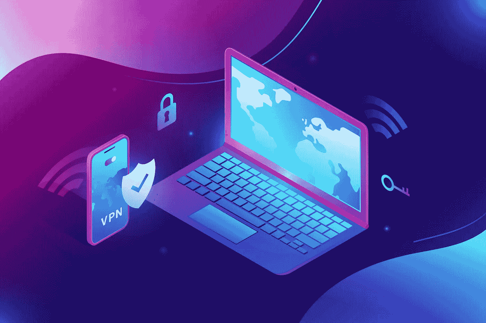

# 负责任的披露保持卡巴斯基的信任 VPN 仍然值得信赖

> 原文：<https://medium.com/nerd-for-tech/responsible-disclosure-keeps-kasperskys-trusted-vpn-still-trustworthy-6f56c81c2234?source=collection_archive---------1----------------------->

人类制造的东西没有一样是完美的。即使我们创造出来保护和修复不完美的东西也不是完美的。我们都知道——否则为什么制定法律的过程会被讽刺地称为“香肠工厂”?

技术和运行大部分技术的软件也是如此。它给我们带来了几代人之前几乎无法想象的奢侈和便利，但人类的失误让我们不得不应对当时也无法想象的风险。

谁会想到一个使用笔记本电脑的青少年罪犯仅仅通过知道如何利用软件缺陷就可以清空你的银行账户，而不需要枪支和逃跑用的汽车？谁会想到一个民族国家的黑客可以从世界的另一端搞垮一个能源网或颠覆一个食品供应链，同样只是利用计算机按键的软件漏洞。

或者，正如上周所展示的那样，通过本应保证系统安全的软件中的漏洞，获得对整个系统或组织环境的控制？

幸运的是，该漏洞在任何犯罪黑客利用它之前就被发现并修复了——更多信息请见下文。

但是像这样的漏洞和它们带来的风险已经催生了一个完整的软件安全产业，[价值约 2200 亿美元，](https://www.marketsandmarkets.com/Market-Reports/cyber-security-market-505.html)旨在试图减轻这些风险，首先是通过在软件产品开发期间防止缺陷，或者在缺陷没有被防止时修复它们。

这些努力包括在软件开发过程中对软件进行“安全性建设”，在编写“T2”代码的过程中用自动化工具测试软件的漏洞。当[运行的时候](https://www.synopsys.com/software-integrity/application-security-testing-services/dynamic-analysis-dast.html?cmp=pr-sig&utm_medium=referral)；当它准备好与互联网上的客户或用户进行交互时；然后[就在它把](https://www.synopsys.com/software-integrity/application-security-testing-services/penetration-testing.html?cmp=pr-sig&utm_medium=referral)作为一个应用程序、一个网站上的页面、一个网络或任何数量的其他东西启动之前。

**软件就是软件**

但是，即使是用来保护其他软件的软件——所谓的安全软件——也可能存在漏洞。毕竟，软件就是软件，没有一个是完美的。最近的一个例子是由总部设在莫斯科、由英国一家控股公司运营的跨国网络安全公司卡巴斯基制造的虚拟专用网络(VPN)。

Synopsys 网络安全研究中心(CyRC)的研究员 Zeeshan Shaikh 在[卡巴斯基用于微软 Windows 的 VPN 安全连接](https://usa.kaspersky.com/vpn-secure-connection)中发现了一个“权限提升”漏洞，该漏洞可能允许攻击者将其身份从“普通”用户提升为拥有高级系统权限的用户——在 Windows 中，这是一个名为 system 的帐户。

根据上周四发布的 CyRC 公告“在应用程序的支持工具部分，普通用户可以使用‘删除服务数据和报告’来删除特权文件夹。”有了这种能力，攻击者就可以获得更高的权限。

Synopsys CyRC 全球研究主管乔纳森·努森(Jonathan Knudsen)表示，拥有系统权限的攻击者可以“对受损系统做任何他们想做的事情”。

这正是 VPN 想要阻止的。VPN 软件应该通过多种方式来保护你或你的组织——屏蔽你的设备的互联网协议地址，加密你的数据，并通过安全网络将其路由到远处的服务器，通常在其他国家。

目标是隐藏在线身份，允许用户安全匿名地浏览互联网。

但是，VPN 中的一个严重漏洞可能会使 VPN 变得更糟，因为它允许作为 VPN“常规”用户的攻击者提升对整个系统的访问权限。虽然没有可信的 VPN 供应商希望其产品将客户置于风险之中，但没有法律要求它必须完美。

这证实了软件安全专家的口头禅:软件风险既是商业风险也是个人风险。

“虚拟专用网需要客户的高度信任，”Knudsen 说。“我们希望可以依靠我们的 VPN 来保护我们的信息隐私，就像我们对医生或律师一样。但是，尽管医生和律师受到法律要求的约束，却没有针对 VPN 的规则。

**测试，然后再测试一些**

We Hack Purple Academy 的创始人兼首席执行官 Tanya Janca 表示，这一发现说明了对安全软件进行更高水平测试的必要性。

“安全软件的测试需要有所不同，因为它服务于潜在的风险，或者试图防止，”她说。“这是威胁建模可以发现的事情，然后—在理想世界中—您可以测试您的威胁模型。”

谢赫在三月份发现的漏洞现在被[常见漏洞和披露](https://cve.mitre.org/)数据库识别为 CVE-2022–27535。CyRC 的研究人员在通用漏洞评分系统(CVSS)的 10 分制中给它的严重性评级为 7.8，这使它处于高风险类别，但低于“严重”，从 9.0 开始。CVSS 是联邦国家标准与技术研究所[国家漏洞数据库](https://nvd.nist.gov/vuln-metrics/cvss)的一部分。

好消息是，根据 Knudsen 的说法，没有证据表明该漏洞在卡巴斯基为其创建补丁之前就被利用了。所以这一个可能属于“没有伤害，没有犯规”的范畴

当然，既然漏洞是公开的，用户将不得不应用更新来保持他们的 VPN 安全。该更新版本为 21.6 或更高版本。

**好消息**

另一个好消息是，在很大程度上，这是一个漏洞“负责任的披露”应该如何工作的例子。一名研究人员或道德黑客(在本例中为 Shaikh)发现了一个漏洞，而不是立即将其公之于众，而是私下通知产品的所有者或供应商，以便有时间修复它，希望在恶意黑客发现它之前。

这个案子的时间线并不完美。Synopsys CyRC 在 3 月 9 日通知卡巴斯基该漏洞，卡巴斯基在 3 月 28 日确认了该漏洞，然后在 5 月 31 日告诉 CyRC 已经发布了修复程序。但是又过了将近两个月，直到 7 月 29 日，谢赫才得以验证这一修正。

“来自卡巴斯基的通信是不稳定的，”努森说。“最终，他们拒绝告诉我们修复了该漏洞的版本，我们的研究人员不得不下载并测试最新版本。”

这将从通知供应商到公开披露的标准 90 天时间延长到了 142 天。Knudsen 说，CyRC 可能不会总是对供应商缺乏沟通这么有耐心。

“我们的政策是 90 天，但我们没有强制执行。我们计划在未来收紧政策，”他说。

此外，卡巴斯基对这一发现提出质疑，认为谢赫发现的缺陷只会允许攻击者删除文件，而不会获得更高的管理权限。但 CyRC 团队表示，谢赫已经证明，该漏洞将允许攻击者“在一个组织的环境中横向移动”

无论这个漏洞有多严重，底线是它应该是什么:卡巴斯基在其网站上说“受到数百万客户的信任和喜爱”的临时漏洞 VPN 可以继续受到信任和喜爱——只要它是最新的。