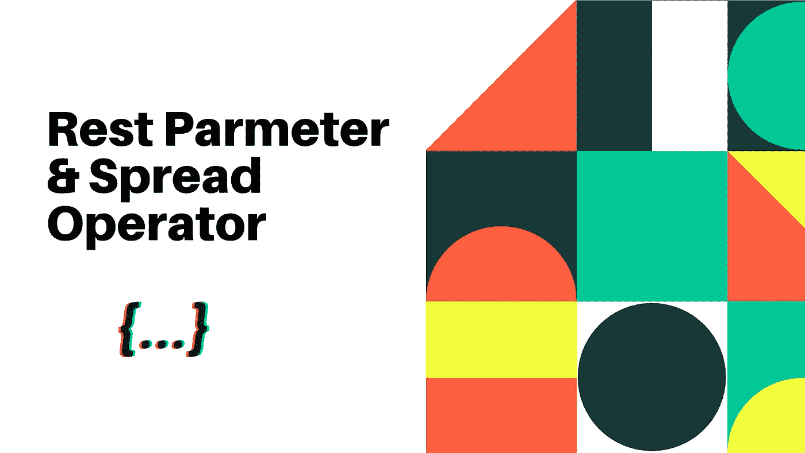

# 剩余参数和扩散算子

> 原文：<https://medium.com/nerd-for-tech/rest-parameter-and-spread-operator-67f0ff3e308b?source=collection_archive---------8----------------------->

ES6 语法糖“…”中的一个三点



我们都知道 JavaScript 的 ES6 更新，它带来了一些很棒的语法糖，作为更好、更容易编写代码的更新，或者帮助我们创建更灵活的功能。其中之一是三点符号“…”，我们可以以两种不同的方式使用它，一种是作为静止参数，另一种是作为扩展运算符。那么它们是什么，当对两个不同的单词使用相同的符号时，它们有什么不同？

# **休息参数**

rest 语法收集了许多元素，并将它们转换成单个元素。让我们举一个例子，我们做一个这样的函数(如下所示)

```
function add(a, b) {
  return a + b;
}console.log(add(1, 2, 3, 4, 5)); //returns 3
```

上面的函数将返回“3”作为 log 中的输出，这是因为在 JavaScript 中，我们可以传递任意数量的输入或参数，就像我们在“add(1，2，3，4，5)”中传递的一样。在这种情况下，只考虑前两个。为了克服这一点，我们使用了 rest 参数。使用 rest 参数，我们可以收集任意数量的参数或输入，并对它们执行我们想要的任何操作。下面是一个例子

```
function add(...args) {
  let sum = 0;
  for(var i = 0; i< args.length; i++){
     sum=sum+args[i];
  }
  return sum;
}console.log(add(1));        //returns 1
console.log(add(1,2));      //returns 3 
console.log(add(1,2,3));    //returns 6
```

注意:一个函数定义只能有一个“…”rest 参数& rest 参数必须在最后一个参数上。这是因为它将所有剩余/多余的参数收集到一个数组中。

```
xyz(...arg1, arg2, arg3)       // Wrong Way xyz(arg1, ...arg2, arg3)       // Wrong Wayxyz(...arg1, ...arg2, arg3)    // Wrong Wayxyz(arg1, ...arg2, ...arg3)    //Wrong Wayxyz(...arg1, ...arg2, ...arg3) //Wrong Way
```

以上几乎都是声明 rest 参数的错误方式。以下是正确的方法

```
xyz(...arg1)              // Right Wayxyz(arg1, ...arg2)        // Right Wayxyz(arg1, arg2, ...arg3)  // Right Way
```

# 传播算子

Spread 语法将数组“扩展”成它的元素，而 rest 语法收集多个元素并将它们“压缩”成一个元素。

> 根据[MDN Web Docs](https://developer.mozilla.org/en-US/docs/Web/JavaScript/Reference/Operators/Spread_syntax)Spread 运算符的定义有点像这样:
> Spread 语法(…)允许在预期零个或多个参数(对于函数调用)或元素(对于数组文字)的地方扩展可迭代对象，或者在预期零个或多个键值对(对于对象文字)的地方扩展对象表达式。

让我们看一些场景，如何以及在哪里使用 spread 运算符:

**向现有数组添加数组元素**

```
var arr = ["A", "B", "C"];
var newArr = ["D", ...arr];console.log(newArr); //output will be ["D", "A", "B", "C"]
```

newArr 的值将`["D", "A", "B", "C"]`。与 rest 参数不同，我们可以使用 spread 操作符作为第一个参数。

```
var newArr = [...arr, "D"];console.log(newArr); //output will be ["A", "B", "C", "D"]
```

因此，如果我们最后想要添加元素，你可以看到，我们可以在 spread 运算符中完成。上述情况下的输出将是`["A", "B", "C", "D"]`。

**复制数组**

我们可以使用 spread 操作符来复制数组。

```
var arr1 = [1, 2, 3, 4, 5];
var arr2 = [...arr];
```

通过这样做，`arr1`可以很容易地复制到`arr2`。

**将数组元素作为单独的参数传递给函数**

如果我们有一个数组，我们必须把整个数组传递给函数，我们可以这样做

```
function sum(x, y, z) {
  return x + y + z;
}const numbers = [1, 2, 3];console.log(sum(...numbers));  // expected output: 6
```

这里的`sum`函数调用类似于`sum(1, 2, 3)`。**注意:** Iterable 也在 spread 运算符中起作用。所以如果我们有一个如下所示的字符串

```
const str = "Hello!";console.log([...str]); //expected output ["H", "e", "l", "l", "o", "!"]
```

我们可以看到这种情况下的输出。

我想这篇文章可能会让这个概念更清晰一些。想要更简单的解释，你可以看看斯蒂芬妮的[这幅](https://twitter.com/stephaniecodes/status/1029453269242990594)插图。她做了很好的解释，如果你喜欢她的作品，请关注她的作品。

如果你喜欢这篇文章，请在 Twitter 或 LinkedIn 上关注我。