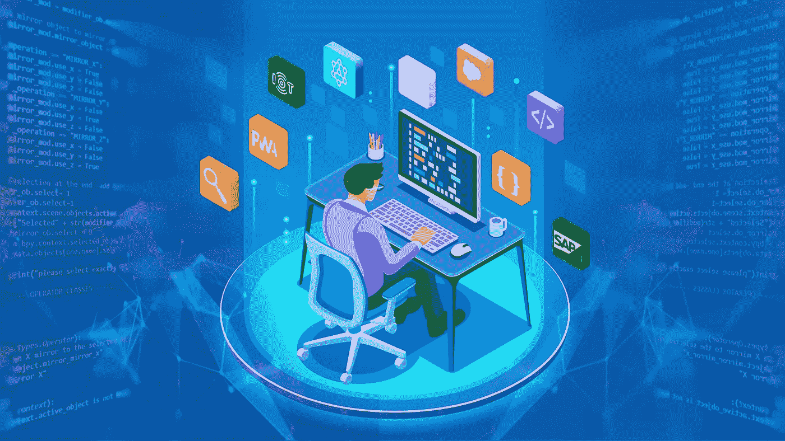
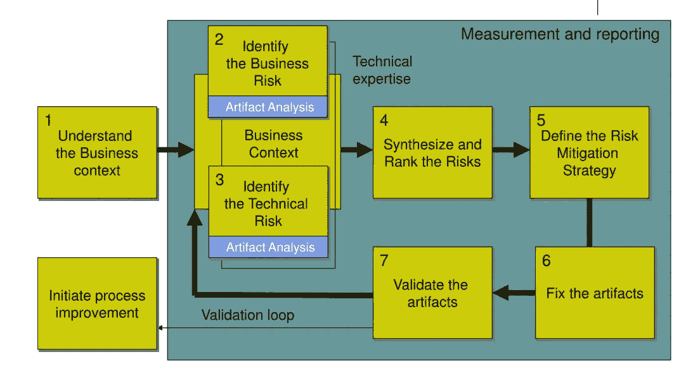

# RMF —活动的五个阶段|构建安全软件

> 原文：<https://medium.com/nerd-for-tech/rmf-the-five-stages-of-activity-building-secure-software-a62d70017d14?source=collection_archive---------1----------------------->

图像[来源](https://www.flexsin.com/blog/custom-software-development-trends-and-methodologies/)

> 像这样的 RMF 的目的是允许一致的和可重复的专家驱动的风险管理方法。

基本思想很简单:识别、分级、跟踪和理解软件安全风险，因为它会随着时间的推移而变化。

图片[来源](https://image3.slideserve.com/5617603/ara-within-rmf-l.jpg)

**5 基本活动:**
1。了解业务背景
2。识别业务技术风险
3。综合并优先考虑风险，产生一个排序集
4。定义风险缓解策略
5。执行所需的修复并验证它们是否正确

**阶段 1:业务背景**
风险是不可避免的，是软件开发的必要部分。风险规避和技术权衡深受商业动机的影响。在这个阶段，你应该做以下事情。分析师提取并描述业务目标
2。优先级
3。了解什么样的软件风险需要关注

**经营目标:**
1。增加收入
2。满足服务水平协议
3。降低开发成本
4。投资回报(ROI)

**衡量和报告风险**
RMF 的成功使用取决于持续一致地识别和存储随时间变化的风险信息。在 RMF 执行的所有阶段都应维护一份风险总清单，并不断进行重新审查。

阶段 2:识别业务和技术风险业务风险帮助定义和影响提取、度量和减轻软件风险的技术方法的使用。风险威胁一个或多个业务目标。识别风险有助于阐明和量化它们将如何影响我们的目标，这一点很重要。

让风险管理在任何业务中发挥作用的关键在于以一种有意义的方式将技术风险与业务环境联系起来。RMF 这一阶段的核心是发现和描述技术风险并通过业务风险将它们映射到业务目标的能力。

**业务风险影响:**
1。直接经济损失
2。对品牌或声誉的损害
3。违反客户协议
4。承担法律诉讼等责任
5。增加的成本，如开发成本

**阶段 3:综合并优先考虑风险**
建立业务目标、业务风险和技术数据之间的关系。风险的优先化直接导致价值的创造。在这个阶段，必须回答“谁在乎”这个问题。此阶段创建所有风险及其解决方案的适当权重的输出列表。这个过程的一部分可以随着时间的推移而自动化。

**像这样的问题:**
“考虑到当前的风险形势，我们首先应该做什么？”
“资源的最佳分配是什么，尤其是在风险缓解活动方面？”

**第 4 阶段:定义风险缓解策略**
在这一阶段，是时候创建一个一致的策略来经济高效地缓解风险了。技术问题很容易发现，但从技术角度来看，找出如何修复它们往往更加困难。在处理缓解策略时，考虑成本、实施时间、成功的可能性、完整性以及对整个风险主体的影响是很重要的。保持所有缓解活动与企业的目标和能力一致是很重要的。该流程需要有身份验证技术，可用于证明风险已得到适当缓解。

**阶段 5:执行修复并验证**
根据阶段 4 中定义的策略执行风险缓解。此阶段的进展应根据风险缓解策略的完整性来衡量。这个阶段的中心关注点是验证软件工件和过程不再承担不可接受的风险。这个阶段应该定义并保留一个可重复的、可测量的、可验证的确认过程，该过程可以不时地运行以持续地验证工件质量。

来源:

[风险管理框架(RMF) | CISA](https://www.cisa.gov/uscert/bsi/articles/best-practices/risk-management/risk-management-framework-%28rmf%29)