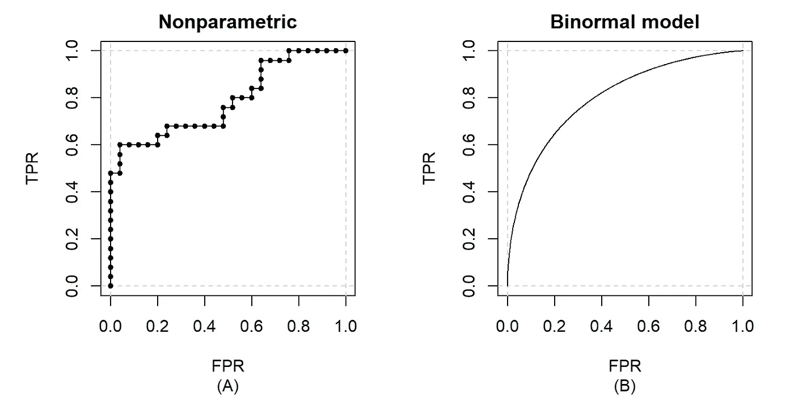
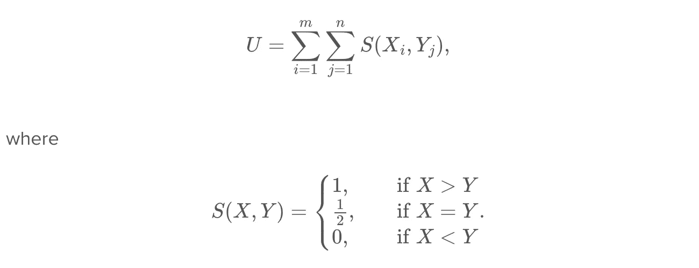
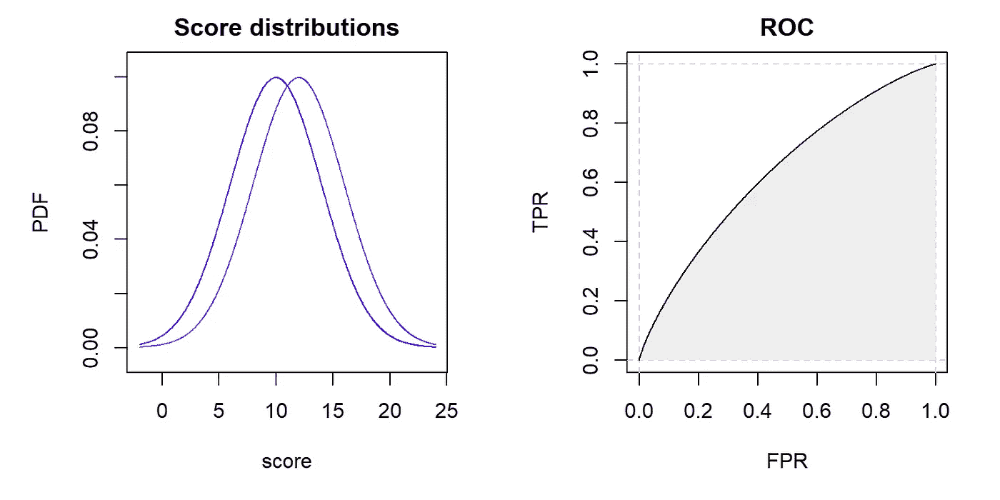
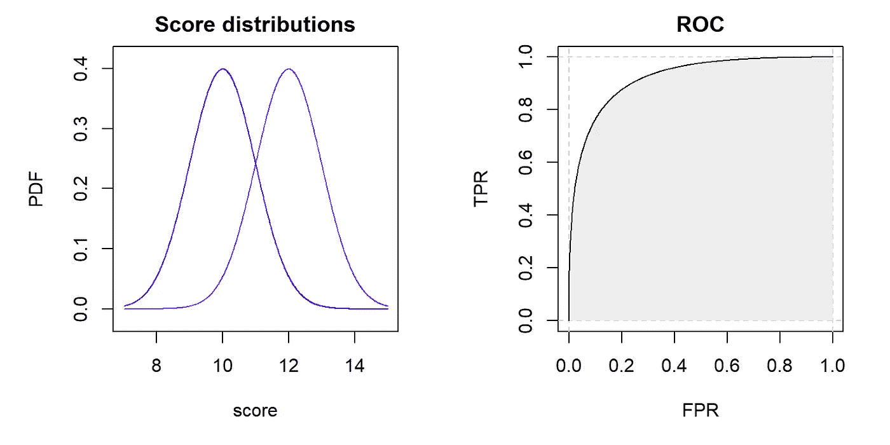
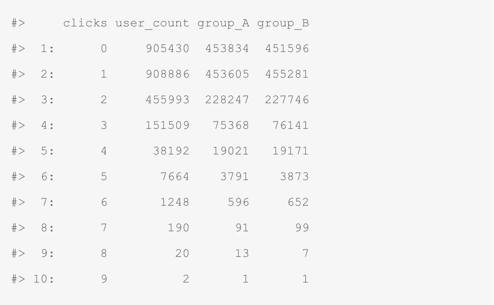
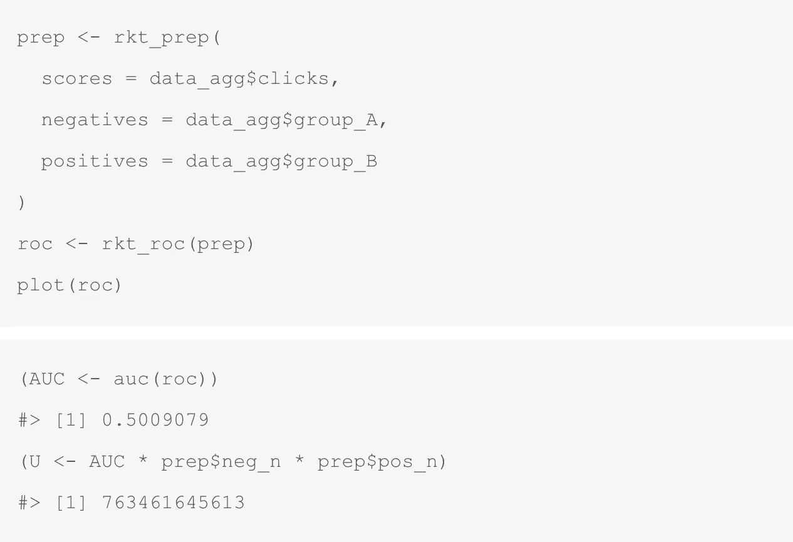
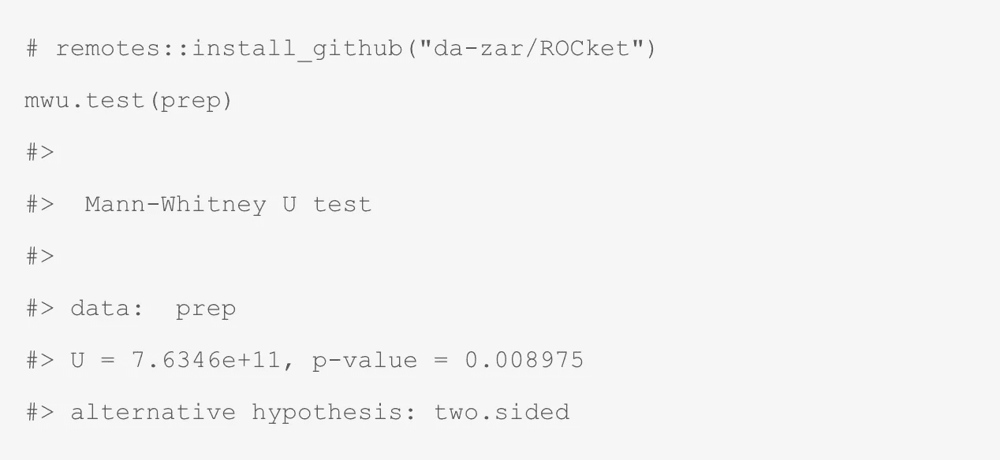

# A/B 测试的 ROC 曲线？

> 原文：<https://medium.com/nerd-for-tech/roc-curves-for-a-b-tests-b53e5e5c0e2d?source=collection_archive---------16----------------------->

这个问题可能有点离谱；然而，我想分享我对这个话题的想法。这是在阅读了统计数据(来自 Mann-Whitney \(U\)测试)和经验 ROC 曲线估计的 AUC 之间的联系后想到的(如果您没有听说过这种关系，请不要担心，我稍后会解释)。前者经常用于评估 A/B 测试，后者用于总结分类程序的性能。这篇博文既不是关于 A/B 测试，也不是分类程序本身。我假设您已经熟悉这些概念，如果不熟悉，您可能想先阅读这些主题，然后继续阅读本文。

尽管 A/B 测试和分类问题本质上不同，但它们也有一些共同点。在这两种情况下，我们面对的是两个在所选特性方面应该不同的群体。现在看来，我们甚至使用等价的统计来分析它们，统计量和 AUC。那么区别是什么，为什么我们不使用 ROC 曲线进行 A/B 测试呢？这是有原因的！

答案对你来说可能是显而易见的，但如果不是，你应该看看这篇博文。你永远不知道在下一次求职面试中会有什么棘手的问题等着你😉

但是首先，让我们简单回忆一下 ROC 曲线的定义和它们的一些性质。

受试者工作特征(ROC)曲线是二元分类器所有可能阈值的真阳性率(TPR)和假阳性率(FPR)之间关系的图形表示。它们用于评估分类器的区分能力，并对一组分类器进行相互比较。通常，ROC 曲线是通过基于验证数据集的预测分数绘制所有(FPR，TPR)点来构建的。之后，应用线性插值将这些点连接成一条曲线(见图 [1](https://www.bonial.com/tech-blog/roc-curves-for-a-b-tests/#figure-1) A)。这可以被看作是一种描述性的统计方法，只对手头的数据进行汇总。另一方面，如果我们假设数据是来自总体的样本，我们可以应用统计推断方法来估计真实的潜在 ROC 曲线(见图 [1](https://www.bonial.com/tech-blog/roc-curves-for-a-b-tests/#figure-1)
B)。文献中描述了许多不同的方法和模型；小范围的概述见[德泽亚·贝尔穆德斯，贡萨尔维斯，奥利维拉& Subtil (2014)](https://www.ine.pt/revstat/pdf/rs140101.pdf) 。

通常的做法是使用汇总指标来比较 ROC 曲线(曲线估计值)。可能最广泛使用的是曲线下面积(AUC)。让我们假设由我们的分类过程分配给阳性和阴性实体的分数分别是两个连续随机变量\(X\)和\(Y\)的实现。可以看出，理论 AUC 等于\(P(X>Y)\，即随机选择的阳性实体的分数将高于随机选择的阴性实体的分数的概率。这应该清楚为什么 AUC 接近 1 对于分类器是理想的。

# ROC 曲线与 U 统计有什么共同之处？

一旦你仔细研究了 U 统计量的定义，这就变得很明显了:

# 这是否意味着我们可以使用 ROC 曲线进行 A/B 测试评估？

不完全是。我们可以为一个假想的分类器计算 ROC 曲线，该分类器试图根据选定的 KPI 将用户分配到 A 组或 B 组，但是它对我们来说信息不多。这是因为我们在分析 A/B 测试和分析分类过程时强调了不同的东西。在 A/B 测试中，我们的主要目标是评估 A 组和 B 组之间的差异是否具有统计学意义，即使差异很小；他们可以变得多小，但仍然与业务相关，这是一个不同的问题。当分析分类器的性能时，我们检查差异是否大到足以提供辨别能力。

当用 A/B 测试来测试你的网页上的一个新特性时，你可能不期望用户的行为会发生如此剧烈的变化，以至于你可以仅仅根据他的行为来准确地预测一个随机用户属于哪一组，A 还是 B。来自组 A 和 B 的测量的 KPI(为每个用户计算的分数)的两个概率密度函数(PDF)将彼此相当“接近”。因此，估计的 ROC 曲线的 AUC 将接近 0.5(见图 [2](https://www.bonial.com/tech-blog/roc-curves-for-a-b-tests/#figure-2) )。为了获得更高的 AUC 值，pdf 需要进一步“远离”彼此
(见图 [3](https://www.bonial.com/tech-blog/roc-curves-for-a-b-tests/#figure-3) )，这在 A/B 测试中不太可能发生。

# 我们还能如何利用 AUC 和 U 统计量之间的关系？

Mann-Whitney \(U\)检验的一个缺点是它的计算复杂性。对于其他测试，计算样本均值和方差可能就足够了，这可以在 DB 上使用 performant SQL 函数直接完成。这个测试不是这样的。用 Mann-Whitney \(U\)检验比较两个大样本可能会很有挑战性。但幸运的是，在某些情况下，你可以使用一个技巧。例如，每当 A/B 测试中感兴趣的度量是简单的计数(比如每个用户的点击次数)时，就有可能有效地减少数据量，同时保留所有需要的信息。对每个测量值的出现次数进行计数就足够了(例如，100 个用户点击了 1 次，200 个用户点击了 2 次，等等。这足以计算\(U\)统计量。不幸的是，普通统计软件中的标准函数需要原始样本来执行 Mann-Whitney(U)检验。所以你必须自己计算…或者你可以利用[火箭](https://CRAN.R-project.org/package=ROCket)包。它提供了一组用于 ROC 曲线估计和 AUC 计算的函数，可以处理聚集数据。感谢方程 [(1)](https://www.bonial.com/tech-blog/roc-curves-for-a-b-tests/#equation-1) ，我们也可以用它来计算\(U\)统计量。

假设您有一个如下形式的数据集:

您可以从中创建 ROC 曲线，但最重要的是，您可以计算 AUC 和\(U\)统计数据:

现在可以使用[正态近似值](https://en.wikipedia.org/wiki/Mann%E2%80%93Whitney_U_test#Normal_approximation_and_tie_correction)导出 p 值。你可以自己写必要的代码，但不需要。在 [GitHub](https://github.com/da-zar/ROCket) 上可用的 ROCket 开发版本已经包含了一个`mwu.test`功能:

我希望这篇文章能帮助你把这些点联系起来，现在很清楚为什么 ROC 曲线被用于分类器，而不是用于 A/B 测试。ROC 和 AUC 很好地服务于描述性统计的目的，这对于一些用例是足够的。然而，在 A/B 测试中，我们需要一些更复杂的东西，即统计推断，来执行正确的推理。

很好地理解不同的统计方法以及它们之间的关系是无价的。在有些情况下，对问题的不同看法会带来意想不到的好处。

最后我想分享的是这篇博文:[统计测试从业者指南](/@vktech/practitioners-guide-to-statistical-tests-ed2d580ef04f)。这不仅是为你的 A/B 测试选择正确的统计测试的很好的指南，而且它还通过例子显示了如何在统计测试的功效估计中结合 ROC 曲线。

目前就这些。我希望你喜欢阅读，并找到有用的东西！

**作者:**丹尼尔·耶戈，Bonial 的数据科学家。