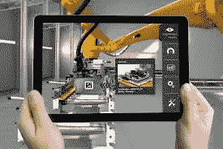
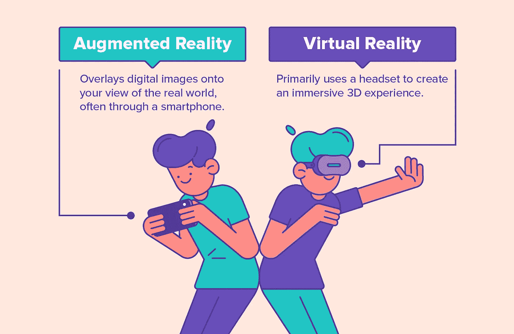

# 增强现实在工业 4.0 中的作用

> 原文：<https://medium.com/nerd-for-tech/role-of-augmented-reality-in-industry-4-0-1f31cbb25592?source=collection_archive---------3----------------------->

# 增强现实

现实世界中存在的物质被计算机生成的感知信息增强的共享知识被称为增强现实(AR)。[消费者获得了增强现实中额外的](https://www.technologiesinindustry4.com/)计算机生成的信息，这些信息提高了他们对现实的洞察力。它是由伊凡·苏泽兰在 1968 年发明的。

它实现了三种基本类型:

1.  真实世界和虚拟世界的混合
2.  实时互动
3.  虚拟和真实物体的正确三维注册。

增强现实的主要价值是数字世界的组成部分融入个人对现实世界的感知的方式。这不可能仅仅显示数据。[只有增加身临其境的感觉](https://www.technologiesinindustry4.com/)才有可能，这些感觉看起来像是一个地点的自然组成部分。AR 中邻接环境的部分是真正“真实的”,并且是虚拟对象对真实环境的公正添加。

# AR 中使用的技术

1.  衍射波导
2.  反射波导

## 硬件组件

*   处理器
*   **显示器**(佩戴在人体上的监视器、光学投影系统、触摸设备和显示系统)。
*   **HMD** (头戴显示器)是戴在额头上的显示设备。它可能会给用户提供移动和合作参与的增强现实。
*   **HUD** (平视显示器)是一种清晰的显示器，无需客户将视线从他们通常的视角移开即可显示数据。
*   **VRD** (虚拟视网膜显示器)直接掠过观众眼睛的视网膜。
*   传感器和输入设备
*   眼镜/智能眼镜/眼罩和隐形眼镜
*   投影仪、输入设备、计算机、跟踪和网络。

# 应用程序

增强现实有许多应用方式，从娱乐和游戏到医疗、教育和商业。以下是增强现实的杰出应用实例。

## 考古研究

AR 的主要应用是在考古学的研究工作中。它允许考古学家在现存建筑后清晰地描绘出可能的遗址形状。遗迹、景观和建筑的虚拟副本已经用于考古 AR 应用中。

## 建筑项目

增强现实为建筑作品的可视化提供了帮助。在实体建筑建造之前，建筑物的虚拟图片可能会覆盖到真实生活中的物品的局部视图上。

## 城市发展设计与规划

[AR 系统](https://www.technologiesinindustry4.com/)正被用作在建筑环境中进行设计和规划的合作工具。它经常用于创建增强现实建筑；地图和数据馈送设计选项经常在现场发布，似乎比 2D 地图和 3d 模型等旧式桌面设备更接近现实。

## 教育

AR 在教育中的应用，对于学生的实时图形和环境有很大的帮助。增强现实技术有利于初学者参与世界范围内的真实搜索，以及计算机生成的对象。学生可以更真实地贡献信息并与信息混合。由于增强现实，学生更容易在三维空间中可视化身体的不同系统。

## 工业企业

增强现实正致力于用数字指令替代纸质手册。它使机器的维护井井有条，因为它让操作员直接访问机器的维护历史。数字指令[可以增加操作员的安全性。通过向操作者提供关于机器状态和安全目的的额外信息，可以增强操作者在高负载工业机器附近工作时的安全感。](https://www.technologiesinindustry4.com/)

## 贸易和商业

AR 被用来混合印刷和视频营销。印刷营销材料通常设计有确定的“激活”图像。旧式的纯印刷出版物正在使用增强现实来分配相反类型的媒体。它可以增加产品预览，让顾客不用打开包装就能看到里面是什么。增强现实在从目录中或通过摊位选择产品时也非常有用。它对在线广告越来越有用。此外，像 Houzz、IKEA 和 Wayfair 这样的家具店也在使用 AR 技术。商家的竞价应用程序让顾客在购买任何东西之前就能在家里看到他们的产品。

# 增强现实的好处

使用 AR 有几个好处，可以马上发展我们的业务。

*   **AR 继续向顾客展示商店**:像宜家家具这样的公司是一种独特的体验，能够在我们的家中放置一件虚拟家具，并看看如果它真的在那里会是什么样子。
*   **AR 辅助沉浸式现实的独家机会。:**一些商业模式，如 WallaMe，正在以一种让人们进入地球寻找增强现实体验的方式吸引人们，这与几年前《口袋妖怪 GO》的方式非常相似。
*   AR 为孩子们带来了全新水平的协作体验。:欧洲杂货和普通零售品牌 Tesco 与迪士尼合作，将在 Tesco 商店销售的迪士尼[冷冻品牌产品提升到一个全新的水平，使父母和他们的孩子能够探索冷冻品牌贴纸书，并让他们的孩子与他们最喜欢的冷冻人物自拍。](https://www.technologiesinindustry4.com/)
*   **AR 为汽车建议安全技术:**捷豹的虚拟挡风玻璃使用平视显示技术，以及软件增强的效果，向驾驶员显示实时数据，这些数据能够与透过汽车挡风玻璃可以看到的物理事物进行交互。
*   **AR 让员工训练无风险:**美国陆军正在使用 HoloLens 技术进行训练。位于德国斯图加特的梅赛德斯-奔驰全球培训中心通过 HoloLens 对汽车内部进行视觉检查，使用 AR 提供的透明度来查看原本隐藏的细节。

# 通过增强现实改善工业 4.0 运营

**可获得的利益**

*   大约告别了车间里成堆的纸张
*   规范整个行业的事件
*   更熟练地训练地面工人
*   节省时间和降低成本

通常，移动设备具有更多与主流台式机或笔记本电脑相关的演示限制。因此，为移动 A.R .准备 3D 模型需要特定程度的优化。[为最终用户制作增强现实内容意味着处理大量潜在的设备](https://www.technologiesinindustry4.com/)。

当前的 3D 建模软件允许用户进行确定的操作，这将创建更适合增强现实的模型。Trimble SketchUp、Autodesk 3ds Max、Autodesk Maya、Blender 和类似软件都是实现特定级别的 3D 模型优化的相关选项。

# 如何准备增强现实的 3D 模型？

用户可以对 3D 模型进行许多优化，以使其在实时增强现实应用中做得更好。一般来说，对三个干预领域采取行动来促进适当的优化水平就足够了。

## 复杂性

这是动态的，在我们的参考 3D 建模软件中对我们的项目进行专业建模。我们所说的效率是指保持多边形的数量尽可能少，避免对用户永远不会看到和欣赏的部分进行建模。如果我们指望各种在线 3D 存储库中的一个，请确认该模型是否针对实时进行了优化。

## 口感

优化的另一个部分涉及纹理的管理方式。尝试只使用一个纹理并烘焙纹理，以增强图形渲染，例如，万一我们想在模型上显示环境遮挡或静态阴影。同样指定一个典型的材质(环境光，漫反射，高光颜色，最终指定一个高光/高光能量值。

## 出口

一旦模型准备好了，就在二进制文件中导出它。FBX 文件格式。它将包括纹理和动画，如果有的话。几乎所有的 3D 建模软件都提供了在 FBX 格式内导出的选择。

欲了解更多详情，请访问:[https://www . technologiesinindustry 4 . com/2020/11/what-is-the-role-of-augmented-reality-in-industry-4-0 . html](https://www.technologiesinindustry4.com/2020/11/what-is-the-role-of-augmented-reality-in-industry-4-0.html)