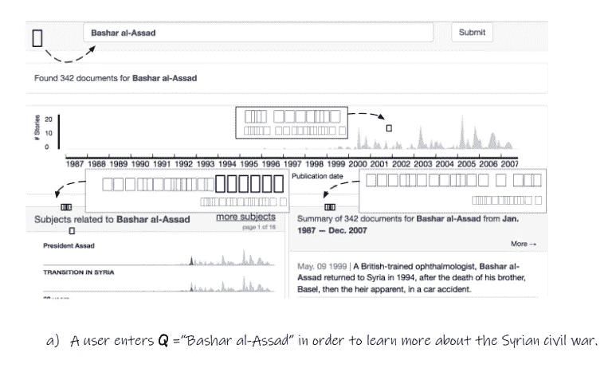

# 新秀:探索新闻档案的独特方法

> 原文：<https://medium.com/nerd-for-tech/rookie-a-unique-approach-for-exploring-news-archives-abf5b71b9700?source=collection_archive---------12----------------------->

新闻档案提供了丰富的历史记录。但是，如果读者或记者想通过传统的搜索引擎了解一个新的话题，他们必须输入一个查询，并开始一篇篇阅读或浏览旧文章，慢慢拼凑出一个错综复杂的网络，由人、组织、事件、地点、话题、概念和社会力量组成“新闻”。我们提出菜鸟，开始是试图为记者建立一个有用的工具。使用菜鸟，用户的查询会生成一个交互式时间表，一个重要相关主题的列表，以及匹配文章的摘要-所有这些都显示为一个交互式链接视图的集合。用户点击并拖动时间轴来选择特定的日期范围，以交互速度自动重新生成摘要和主题列表。累积效应:随着时间的推移，用户可以流畅地调查复杂的新闻故事。定量用户测试表明，该系统如何帮助用户更好地理解文档中的复杂主题，并以比传统界面快 37%的速度完成历史意义构建任务。对学生记者的定性研究也验证了这种方法。我们与记者和编辑协商，经过 18 个月的反复设计和开发，建立了菜鸟的最终版本。由于该系统旨在帮助现实世界的记者，从设计过程中出现的软件与类似的学术成果有很大不同。具体来说，菜鸟被迫应对当前自然语言处理技术在速度、准确性和可解释性方面的限制。我们认为理解和设计这些限制对于在新闻应用中成功使用 NLP 是至关重要的；据我们所知，这是一个在两个交叉领域的先前工作中没有探索过的主题。

它是如何工作的？

在任何给定时间，新秀的状态由用户选择状态定义，三元组(Q，F，T)其中:

1.  q 是自由文本查询字符串(如“Bashar al-Assad”)
2.  f 是相关的主题字符串(如“30 年”)或为空
3.  t 是时间跨度(如 2000 年 3 月至 2000 年 9 月)；默认情况下，这被设置为语料库中的一段出版日期。

用户首先通过使用 web 浏览器在搜索查询栏中输入查询 Q 来与菜鸟进行交互。例如，在下图中，一个试图了解叙利亚内战根源的用户输入了 Q =“Bashar al-Assad”。作为回应，菜鸟呈现了交互式时间序列可视化，显示了语料库中匹配文档的频率、匹配文档中的主题列表(称为 subjects-sum)以及这些文档的文本摘要(称为 sentence-sum)。1 在本例中，语料库是 1987 年至 2007 年间包含字符串“Syria”的《纽约时报世界新闻》文章的集合。本研究中的所有国别实例都是同一《纽约时报》最不发达国家语料库的子集。在输入 Q 之后，用户可能会注意到“巴沙尔·阿萨德”主要是从 1999 年开始被提及的。为了进行调查，他们可能会将时间序列滑块调整到 2000 年 3 月至 2000 年 9 月巴沙尔·阿萨德早期提及率的峰值。当用户将 T 调整为 2000 年 3 月至 2000 年 9 月时，句子总和与主题总和会发生变化，以反映图(c)下方的新时间跨度。subjects-sum 现在显示像“叙利亚的过渡”这样的主题，2 格式来自 NYT 部分标题样式。“阿萨德总统”、“长子”、“30 年”这三个对 t 期间的 Q 很重要(巴沙尔阿萨德的父亲统治了 30 年)。

在这一点上，用户可以通过调查相关主题来进一步探索，F =“阿萨德总统”——点击以进行选择。现在试图总结 2000 年 3 月至 2000 年 9 月期间 Q=“巴沙尔·阿萨德”和 F =“阿萨德总统”之间的关系。例如，sentence-sum 现在显示句子:“巴沙尔·阿萨德 1965 年 9 月 11 日出生于大马士革，在阿萨德总统五个孩子中排行老三。”如果用户想在上下文中理解这个句子，他们可以单击“句子”——这将在模式对话框中打开底层文档。在整个界面中，f 和 Q 被指定为红色和蓝色，允许用户快速浏览信息。粗体 Q 和 F 提供了额外的清晰度，并有助于确保菜鸟仍然适用于色盲用户。这个例子展示了菜鸟的可视化和摘要技术如何协同工作，以提供基础语料库的链接视图。链接视图(也称为多个协调视图)界面是结构化信息的常用工具:每个视图以不同的维度显示相同的选定数据(例如，当用户选择一个街区时，城市的地理地图还显示住房成本的直方图)。在菜鸟的例子中，链接视图显示不同级别的分辨率。时间序列可视化提供了查询响应文档的时间视图，subjects-sum 显示了文档中重要主题的中级词汇视图，而 sentence-sum 显示了部分底层文档的低级文本视图。文档本身，通过点击摘录的句子，提供了最详细的缩放级别。因此，菜鸟支持普遍建议的可视化途径:“首先概述，缩放和过滤，按需提供细节”(Shneiderman1996)。请注意，我们使用术语摘要来表示选择短文本或短文本序列来表示正文。根据这个定义，subjects-sum 和 sentence-sum 都是摘要的一种形式，因为它们都提供了语料库的文本表示——尽管是在两个不同的分辨率级别，短语和句子。